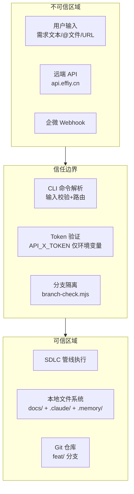

> | v1.0.0 | 2026-05-26 | deepseek-v4-pro | 🌿 feat/rui | 📎 [CLAUDE.md](../../../CLAUDE.md) |

> **导航**: [← YrY-测试设计](./YrY-测试设计.md)

> **来源引用**: 由 `/rui doc --from-code rui` 触发，security agent 基于技术评审 §7 安全设计独立审计。证据 Level B + 规约路径。独立审计标记：本审计由 security agent 独立执行，不依赖 coder 自评。

[§0 基线溯源](#sec0-baseline) · [§1 资产识别](#sec1-assets) · [§2 STRIDE 威胁建模](#sec2-stride) · [§3 信任边界](#sec3-trust) · [§4 缓解措施](#sec4-mitigation) · [§5 合规检查](#sec5-compliance)

---

### 主要价值

- 🎯 STRIDE 六类威胁全覆盖 — Spoofing/Tampering/Repudiation/InfoDisclosure/DoS/Elevation
- 🔒 信任边界清晰 — CLI 入口→命令路由→管线执行→文件系统→远端 API 逐段分析
- ⚡ 独立审计 — security agent 独立执行，不依赖 coder 自评，确保审计客观性
- 📊 合规 6 项全查 — 认证/密钥/输入校验/分支隔离/交付安全/审计独立

---

## §0 基线溯源

| 基线来源 | 本文档章节 | 映射关系 |
|---------|-----------|---------|
| 技术评审 §7 安全设计 | §2 STRIDE | 安全面→威胁建模 |
| 技术评审 §5 分支隔离机制 | §3 信任边界 | 分支隔离→信任边界 |
| 技术评审 §6 交付三步 | §3 信任边界 | 交付三步→API 信任边界 |
| 故事任务 §6 风险 1–9 | §2 STRIDE | 风险→威胁映射 |
| CLAUDE.md 项目不可妥协底线 | §5 合规检查 | 底线→合规项 |

---

## §1 资产识别

| 资产 | 类型 | 敏感级别 | 存储位置 |
|------|------|---------|---------|
| API_X_TOKEN | 认证凭据 | 高 | 仅环境变量 |
| 项目源码 | 知识产权 | 中 | git 仓库 |
| 故事文档 | 项目知识 | 中 | docs/故事任务面板/ |
| .claude/ 配置 | 项目配置 | 中 | .claude/ |
| rui-state.json | 管线状态 | 低 | .memory/ |
| execution-memory.jsonl | 执行记忆 | 低 | .memory/ |
| 企微 webhook URL | 通知端点 | 高 | 环境变量/内置配置 |

---

## §2 STRIDE 威胁建模

### S — Spoofing (身份伪造)

| 威胁 | 影响资产 | 可能性 | 影响 | 缓解措施 |
|------|---------|--------|------|---------|
| 伪造 API_X_TOKEN 调用远端 API | API_X_TOKEN | L | H | Token 仅从环境变量读取，不落盘；远端 API 验证 token 有效性 |
| 伪造 git commit 作者身份 | 项目源码 | L | M | git commit 需本地 git config 配置 |

### T — Tampering (数据篡改)

| 威胁 | 影响资产 | 可能性 | 影响 | 缓解措施 |
|------|---------|--------|------|---------|
| 恶意修改 story 文档内容 | 故事文档 | M | M | 分支隔离门禁 + code review；文档通过 rui-import 同步远端 |
| 篡改管线状态(rui-state.json) | 管线状态 | L | M | rui-state.json 由管线自动管理，手动修改会被下一轮覆盖 |
| 在 main 分支上直接修改源码/文档 | 项目源码/文档 | M | H | branch-check.mjs 强制验证，非 feat/<name> 阻断 Edit/Write |

### R — Repudiation (否认)

| 威胁 | 影响资产 | 可能性 | 影响 | 缓解措施 |
|------|---------|--------|------|---------|
| 管线操作无审计日志 | 全部 | M | M | execution-memory.jsonl 追加记录每次执行；git log 记录所有变更 |
| 通知发送无记录 | 通知日志 | L | L | rui-bot 通过 API 写入通知日志到数据库 |

### I — Information Disclosure (信息泄露)

| 威胁 | 影响资产 | 可能性 | 影响 | 缓解措施 |
|------|---------|--------|------|---------|
| API_X_TOKEN 写入源码或配置文件 | API_X_TOKEN | M | H | 铁律禁止；P0 检查清单扫描；git history 清除+轮换 |
| webhook URL 泄露 | 企微 webhook URL | M | H | 环境变量注入，禁止写入文档或提交仓库 |
| 企微通知消息含敏感信息 | 项目信息 | L | L | 消息格式规约：纯文本、emoji:值、≤2000 字、错误日志仅前 20 行 |
| 执行记忆含敏感数据 | 执行记忆 | L | M | execution-memory.jsonl 不记录 token/webhook URL 值 |

### D — Denial of Service (拒绝服务)

| 威胁 | 影响资产 | 可能性 | 影响 | 缓解措施 |
|------|---------|--------|------|---------|
| 大量文档同步请求超载远端 API | 远端 API | L | M | rui-import 并发上限 4；HTTP 超时 30s |
| yry 死循环耗尽计算资源 | 系统资源 | M | M | 连续 3 轮无效自动终止；同一改进项失败 ≥2 次 skip |
| Gate B 无限重试验证 | 系统资源 | L | L | Gate B >2 轮阻断 gate-b-limit |

### E — Elevation of Privilege (权限提升)

| 威胁 | 影响资产 | 可能性 | 影响 | 缓解措施 |
|------|---------|--------|------|---------|
| 绕过分支隔离门禁直接写入 main | 项目源码/文档 | M | H | branch-check.mjs 在每次 Edit/Write 前验证；唯一例外 init 仅写项目基线 |
| 绕过 Gate A 直接进入编码 | 代码质量 | M | H | Gate A 强制检查测试设计存在性；跳过即阻断 skip-gate-a |
| rui-import 覆盖远端任意文件 | 远端文档 | L | M | 远端路径 = 项目根相对路径，一一对应，无跳段无前置 |

---

## §3 信任边界

| 边界 | 方向 | 控制措施 |
|------|------|---------|
| 用户输入 → 管线 | 入站 | 需求解析校验；@文件路径校验；URL 抓取结果校验 |
| 远端 API ← → 管线 | 双向 | API_X_TOKEN 认证；HTTPS 传输；超时+重试 |
| 管线 → 文件系统 | 出站 | branch-check.mjs 分支验证；仅写 docs/故事任务面板/ + .memory/ |
| 管线 → 企微 | 出站 | webhook URL 环境变量注入；消息格式规约约束 |
| 管线 → Git | 出站 | 仅操作 feat/<name> 分支；禁止 force push to main |

---

## §4 缓解措施

| 威胁类别 | 威胁 | 缓解措施 | 优先级 | 验证方式 |
|---------|------|---------|--------|---------|
| Tampering | main 分支上直接修改 | branch-check.mjs 强制门禁 | P0 | `node skills/rui/branch-check.mjs --story=x --mode=write` |
| InfoDisclosure | Token 落盘 | 仅环境变量读取；P0 检查清单扫描 | P0 | `grep -r "API_X_TOKEN" --include="*.md" --include="*.json"` |
| InfoDisclosure | Webhook URL 泄露 | 环境变量注入；禁止写入文档 | P0 | `grep -r "webhook" --include="*.md"` |
| EoP | 绕过 Gate A | Gate A 阶段强制检查测试设计存在性 | P0 | code 管线 Gate A 日志 |
| EoP | 绕过分支隔离创建 feat 分支 | branch-check.mjs 验证分支来源 | P1 | git log main..HEAD |
| DoS | yry 死循环 | 连续 3 轮无效终止；同项失败 ≥2 次 skip | P1 | yry 循环计数器 |

---

## §5 合规检查

| # | 合规项 | 来源 | 状态 | 证据 |
|---|--------|------|------|------|
| 1 | 认证不可绕过 — auth/token/session 无绕过路径 | CLAUDE.md 底线 | ✅ | API_X_TOKEN 仅环境变量，branch-check.mjs 强制验证 |
| 2 | 密钥不落盘 — Token/密钥/凭据禁止出现在源码或配置 | CLAUDE.md 底线 | ✅ | API_X_TOKEN 仅 `process.env`；webhook URL 环境变量注入 |
| 3 | 输入必校验 — 用户输入经过验证/转义 | CLAUDE.md 底线 | ✅ | 需求解析校验(no-parse 阻断)；@文件路径校验 |
| 4 | 规约完整性 — 每 skill 有完整 SKILL.md | CLAUDE.md 底线 | ✅ | 6 skills 各有完整 SKILL.md |
| 5 | 自托管一致性 — plugin.json 版本与实际一致 | CLAUDE.md 底线 | ✅ | version --up 同步更新 plugin.json + CLAUDE.md + README.md |
| 6 | 禁止魔法数字 — 数字字面量赋予语义化常量名 | CLAUDE.md 底线 | ✅ | 阻断标识/并发上限/超时/重试次数均有常量名 |

---

> **变更记录**
> | 日期 | 变更 | 触发 | 证据 |
> |------|------|------|------|
> | 2026-05-26 | 初始生成，security 独立审计 | /rui doc --from-code rui | skills/rui/SKILL.md §安全 + CLAUDE.md 底线 |
