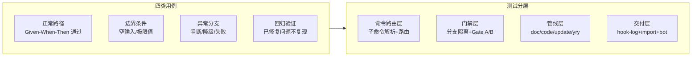

> | v1.0.0 | 2026-05-26 | deepseek-v4-pro | 🌿 feat/rui | 📎 [CLAUDE.md](../../../CLAUDE.md) |

> **导航**: [← YrY-技术评审](./YrY-技术评审.md) · [YrY-安全审计 →](./YrY-安全审计.md)

> **来源引用**: 由 `/rui doc --from-code rui` 触发，基于故事任务 §5 AC + 使用场景 + 技术评审 §3 管线状态机生成。证据 Level B + 规约路径。

[§0 基线溯源](#sec0-baseline) · [§1 测试策略](#sec1-strategy) · [§2 测试范围](#sec2-scope) · [§3 测试用例](#sec3-cases) · [§4 Gate A 交接信号](#sec4-gate-a) · [§5 测试环境](#sec5-env)

---

### 主要价值

- 🎯 AC 全覆盖 — 每条 AC 至少 1 个测试用例，覆盖正常/边界/异常/回归四类
- 🔒 Gate A 交接信号完整 — P0 用例 ID + 验证命令明确，确保测试先行门禁可执行
- ⚡ 逐模块验证对齐 — 测试用例按 Story 分组，每个 Story 对应独立验证模块
- 📊 环境需求明确 — 列出测试运行所需的环境变量和前置条件

---

## §0 基线溯源

| 基线来源 | 本文档章节 | 映射关系 |
|---------|-----------|---------|
| 故事任务 §5 AC1 | §3.1 用例 1–2 | init 验收 |
| 故事任务 §5 AC2 | §3.2 用例 3–4 | doc 文档基线验收 |
| 故事任务 §5 AC3 | §3.3 用例 5–7 | code 代码实现验收 |
| 故事任务 §5 AC4 | §3.4 用例 8–9 | 分支隔离门禁验收 |
| 故事任务 §5 AC5 | §3.4 用例 10 | Gate A 阻断验收 |
| 故事任务 §5 AC6 | §3.3 用例 11 | Gate B 限轮验收 |
| 故事任务 §5 AC7 | §3.5 用例 12 | yry 终止条件验收 |
| 故事任务 §5 AC8 | §3.6 用例 13 | 交付三步验收 |
| 使用场景 场景 1–6 | §3.1–§3.6 | 用户操作流覆盖 |

---

## §1 测试策略

---

## §2 测试范围

| 模块 | 测试重点 | 用例数 | 门禁 |
|------|---------|--------|------|
| init | 项目初始化六步管线+5 项 verify | 3 | Gate A |
| doc | 需求解析→故事拆分→5 文档生成+P0 校验 | 4 | Gate A |
| code | 分支隔离→Gate A→逐模块→Gate B→自改进→交付 | 5 | Gate B |
| update | T1/T2/T3 裁剪判定+级联刷新 | 3 | Gate A |
| yry | 扫描→诊断→实现→验证→版本升级→循环终止 | 4 | Gate B |
| version | 版本判定→文件更新→commit→merge→push→tag | 2 | Gate B |
| 分支隔离 | branch-check.mjs 验证 | 3 | Gate A |
| 交付三步 | hook-log→rui-import→rui-bot 按序执行 | 2 | Gate B |

---

## §3 测试用例

### §3.1 init 模块

| # | 类型 | Given | When | Then | 关联 AC |
|---|------|-------|------|------|---------|
| 1 | 正常 | 项目目录无 CLAUDE.md | 执行 `/rui init` | CLAUDE.md 含 rui:project-start 标记，README.md 含领域语言段，故事任务面板目录存在，bot 配置存在 | AC1 |
| 2 | 边界 | 已有 CLAUDE.md(含 rui:project-start 标记段) | 再次执行 `/rui init` | rui 标记段全量刷新，段外用户自定义内容保留 | AC1 |
| 3 | 异常 | verify 5 项中任一项失败 | 执行 `/rui init` | 终止执行，输出具体未通过项，不写入不完整文件 | AC1 |

### §3.2 doc 模块

| # | 类型 | Given | When | Then | 关联 AC |
|---|------|-------|------|------|---------|
| 4 | 正常 | 用户提供清晰的自然语言需求 | 执行 `/rui doc <需求>` | pm 拆分故事→5 文档按序生成→全部 P0 检查通过 | AC2 |
| 5 | 边界 | 需求描述模糊(不确定项 > 2) | 执行 `/rui doc <需求>` | pm 阻断 `no-parse`，提示用户补充信息，不生成空文档 | AC2 |
| 6 | 边界 | 目标目录 `docs/故事任务面板/<name>/` 已存在 | 执行 `/rui doc --from-code <name>` | 拒绝覆盖，引导使用 `/rui update` | AC2 |
| 7 | 异常 | 源码不可读或关键路径缺失 | 执行 `/rui doc --from-code <需求>` | 阻断 `no-source`，提示用户先梳理源码 | AC2 |

### §3.3 code 模块

| # | 类型 | Given | When | Then | 关联 AC |
|---|------|-------|------|------|---------|
| 8 | 正常 | 文档基线完整，feat/<name> 分支 | 执行 `/rui code <name>` | Gate A 通过→逐模块实现→Gate B 通过→自改进→交付三步 | AC3 |
| 9 | 边界 | 模块 P0 审查未清零 | 尝试进入下一模块 | 阻断，停留在当前模块直到 P0 清零 | AC3 |
| 10 | 边界 | Gate B 第 3 轮验证 | 执行验证 | 阻断 `gate-b-limit`，禁止交付 | AC6 |
| 11 | 异常 | 文档基线不完整(缺测试设计) | 执行 `/rui code <name>` | Gate A 阻断 `skip-gate-a` | AC5 |

### §3.4 分支隔离模块

| # | 类型 | Given | When | Then | 关联 AC |
|---|------|-------|------|------|---------|
| 12 | 正常 | 当前分支为 `feat/<name>` | 管线执行 Edit/Write | branch-check.mjs exit 0，操作继续 | AC4 |
| 13 | 异常 | 当前分支为 `main` | 管线尝试写入文档或源码 | branch-check.mjs exit ≠ 0，阻断 `no-branch-isolation`，提示创建 feat/<name> | AC4 |
| 14 | 边界 | feat/<name> 分支已存在 | 尝试从 main 创建同名分支 | 检测冲突，提示用户处理已有分支 | AC4 |

### §3.5 yry 模块

| # | 类型 | Given | When | Then | 关联 AC |
|---|------|-------|------|------|---------|
| 15 | 正常 | 存在 D0-D7 诊断发现的改进项 | 执行 `/rui yry` | 选取最优改进项→自主实现→验证→版本升级→继续循环 | AC7 |
| 16 | 边界 | 所有诊断通过，无改进空间 | 执行 `/rui yry` | 输出健康声明，终止循环 | AC7 |
| 17 | 边界 | 连续 3 轮无实质性变更 | 执行 `/rui yry` 循环 | 自动终止，输出闭环摘要 | AC7 |
| 18 | 异常 | 同一改进项失败 ≥2 次 | yry 重试该改进项 | skip + 记录，不再重试 | AC7 |

### §3.6 交付三步模块

| # | 类型 | Given | When | Then | 关联 AC |
|---|------|-------|------|------|---------|
| 19 | 正常 | 管线完成，API_X_TOKEN 存在 | 触发交付三步 | hook-log→rui-import sync.mjs→rui-bot 按序执行，全部成功 | AC8 |
| 20 | 降级 | 管线完成，API_X_TOKEN 缺失 | 触发交付三步 | hook-log 执行，rui-import 静默跳过，rui-bot 静默跳过，不阻断管线 | AC8 |

---

## §4 Gate A 交接信号

| P0 用例 ID | 验证命令 | 预期结果 | 阻断条件 |
|-----------|---------|---------|---------|
| 1 | `/rui init` (在测试项目目录) | CLAUDE.md + README.md 生成 | verify 失败 |
| 4 | `/rui doc <测试需求>` | 5 文档生成 + P0 检查通过 | doc-p0 阻断 |
| 8 | `/rui code <name>` | Gate A 通过后进入逐模块实现 | skip-gate-a 阻断 |
| 12 | `node skills/rui/branch-check.mjs --story=<name> --mode=write` | exit 0 | exit ≠ 0 |

---

## §5 测试环境

| 需求 | 说明 |
|------|------|
| git 仓库 | 已初始化的 git 仓库，有 main 分支 |
| Node.js | 运行 branch-check.mjs / import-doc.mjs / sync.mjs |
| API_X_TOKEN | 可选(缺失时降级 no-token) |
| 文件系统 | 可读写项目目录 |
| Agent | pm/coder/tester/security/self-improve agent 可用 |

---

> **变更记录**
> | 日期 | 变更 | 触发 | 证据 |
> |------|------|------|------|
> | 2026-05-26 | 初始生成 | /rui doc --from-code rui | 故事任务 §5 AC + 使用场景 §2 |
