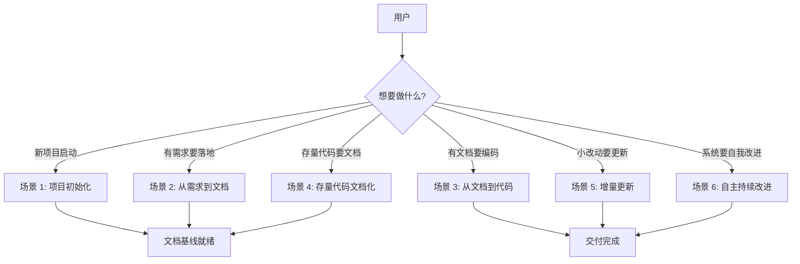
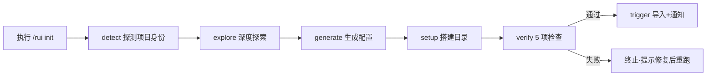
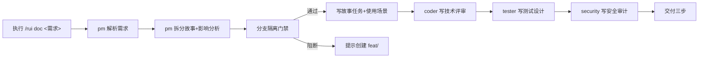
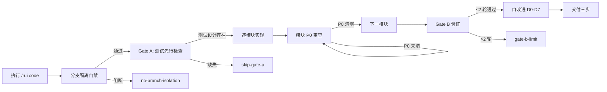
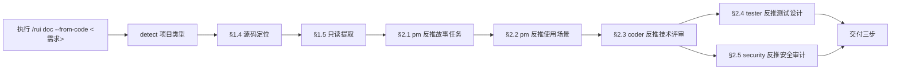
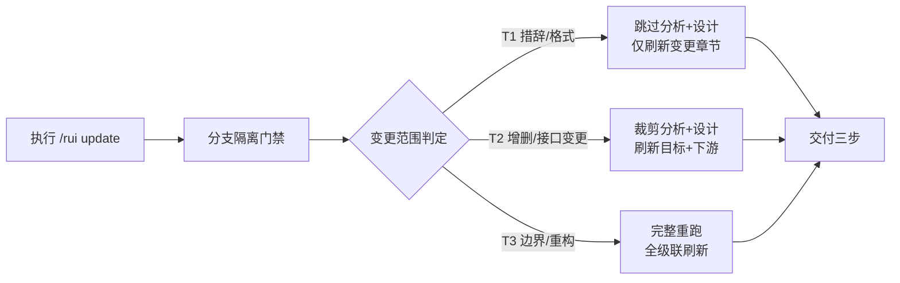
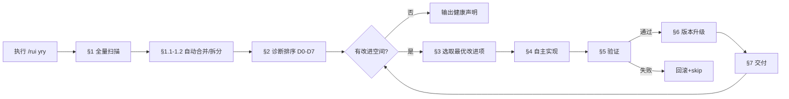

> | v1.0.0 | 2026-05-26 | deepseek-v4-pro | 🌿 feat/rui | 📎 [CLAUDE.md](../../../CLAUDE.md) |

> **导航**: [← 故事任务](./故事任务.md) · [技术评审 →](./技术评审.md)

> **来源引用**: 由 `/rui doc --from-code rui` 触发，从 `skills/rui/SKILL.md` 反推用户交互场景。证据 Level B + SKILL.md 命令面定义。

[§1 场景全景](#sec1-overview) · [§2 场景详述](#sec2-detail) · [§3 场景覆盖矩阵](#sec3-matrix) · [§4 评审清单](#sec4-checklist)

---

### 主要价值

- 🎯 覆盖 rui 全命令面的用户交互 — init/doc/code/update/yry/version 六大核心场景
- 🔒 每场景含正常路径 + 空状态 + 错误恢复，确保异常分支可追溯
- ⚡ 使用场景对齐故事任务 FP# 和 AC#，形成可验证的用户空间基线
- 📊 语言边界纯净 — 禁止技术术语、组件名、API 端点、文件路径

---

## §1 场景全景

---

## §2 场景详述

### 场景 1: 项目初始化

| 角色 | 触发条件 | 核心目标 |
|------|---------|---------|
| 项目负责人 | 新项目启动或需要刷新项目基线 | 建立 CLAUDE.md、README.md、故事任务面板目录和 bot 配置 |

| # | 步骤 | 输入 | 系统响应 | 异常分支 |
|---|------|------|---------|---------|
| 1 | 执行初始化命令 | `/rui init` | 开始六步初始化管线 | 非 git 仓库时提示先初始化 git |
| 2 | 探测项目身份 | 项目目录结构+文件 | 判定项目类型(frontend/backend/fullstack/meta) | 无法判定时标记 unknown |
| 3 | 深度探索 | 核心源码 | 提取架构模式、代码规范、安全面 | 源码不可读时使用默认配置 |
| 4 | 生成配置 | profile+探索发现 | 写入 CLAUDE.md(含 rui:project-start 标记)+README.md | 文件已存在时 rui 标记段全量覆盖 |
| 5 | 验证 | 5 项就绪检查 | 全部通过→触发；任一失败→终止 | 失败时输出具体未通过项 |

---

### 场景 2: 从需求到文档基线

| 角色 | 触发条件 | 核心目标 |
|------|---------|---------|
| 需求提出者/开发者 | 有自然语言需求需要结构化文档化 | 生成完整的故事文档基线(5 文档) |

| # | 步骤 | 输入 | 系统响应 | 异常分支 |
|---|------|------|---------|---------|
| 1 | 提交需求 | 自然语言文本/@文件/URL | pm 建立事实基线后解析需求 | 需求模糊无法解析→阻断 no-parse |
| 2 | 拆分故事 | 解析结果 | 输出故事列表(含优先级+依赖+范围) | 不确定项 > 2→不推进 |
| 3 | 分支检查 | 故事名称 | 验证当前分支为 feat/<name> | 非 feat 分支→提示从 main 创建 |
| 4 | 生成文档 | 故事需求+源码(只读) | 5 文档按序生成，每文档 P0 校验 | P0 未通过→自修复 ≤2 轮→阻断 doc-p0 |

---

### 场景 3: 从文档到代码实现

| 角色 | 触发条件 | 核心目标 |
|------|---------|---------|
| 开发者 | 文档基线完整，准备编码实现 | 逐模块实现并通过验证，产出实施/测试/自改进报告 |

| # | 步骤 | 输入 | 系统响应 | 异常分支 |
|---|------|------|---------|---------|
| 1 | 验证分支 | `git branch --show-current` | 通过/阻断 | 非 feat/<name>→阻断 |
| 2 | Gate A | 测试设计文档 | 存在→进入实现；缺失→阻断 | 阻断后需先生成测试设计 |
| 3 | 逐模块实现 | 技术评审+测试设计 | 逐模块编码+P0 审查 | P0 未清零→不得进入下一模块 |
| 4 | Gate B | 实现代码+测试 | 验证 ≤2 轮→通过；>2 轮→阻断 | 阻断后需人工介入 |

---

### 场景 4: 存量代码文档化

| 角色 | 触发条件 | 核心目标 |
|------|---------|---------|
| 开发者 | 有存量代码但缺文档基线 | 从源码反推生成完整 5 文档基线 |

| # | 步骤 | 输入 | 系统响应 | 异常分支 |
|---|------|------|---------|---------|
| 1 | 源码定位 | 需求关键字 | 按项目类型搜索匹配源文件 | 无匹配→阻断 no-source |
| 2 | 只读提取 | 源文件清单 | 提取结构/接口/依赖/状态/安全信号 | 关键路径缺失→标待补充 |
| 3 | 反推生成 | 代码事实集 | 5 文档按序生成，证据 Level B | 无法确定项→标 Level C 待补充 |

---

### 场景 5: 增量更新

| 角色 | 触发条件 | 核心目标 |
|------|---------|---------|
| 项目维护者 | 故事已有文档基线，需要小范围修改 | 按变更范围自动裁剪管线，避免全量重跑 |

| # | 步骤 | 输入 | 系统响应 | 异常分支 |
|---|------|------|---------|---------|
| 1 | 范围判定 | 变更上下文 | 自动判定 T1/T2/T3 | 无法判定→默认 T3 全量 |
| 2 | T1 执行 | 措辞修正内容 | 仅刷新指定章节 | — |
| 3 | T2 执行 | 接口变更内容 | 裁剪分析+设计，级联刷新下游 | 下游文档缺失→先生成 |
| 4 | T3 执行 | 架构变更内容 | 完整重跑 doc+code 管线 | — |

---

### 场景 6: 自主持续改进

| 角色 | 触发条件 | 核心目标 |
|------|---------|---------|
| 系统本身 | 需要全局健康检查与自主改进 | 扫描→诊断→实现→验证→版本升级，循环至无改进空间 |

| # | 步骤 | 输入 | 系统响应 | 异常分支 |
|---|------|------|---------|---------|
| 1 | 全量扫描 | 所有故事 rui-state.json+execution-memory.jsonl | 检测可合并重复故事+需拆分大故事 | 无改进空间→输出健康声明 |
| 2 | 诊断排序 | 扫描结果 | D0-D7 模式匹配→按优先级排序 | 所有诊断通过→终止 |
| 3 | 自主实现 | 最优改进项 | 执行 /rui update 或 /rui code | 失败 ≥2 次→skip+记录 |
| 4 | 版本升级 | 变更类型 | 自动 bump MAJOR/MINOR/PATCH | 无实质变更→不 bump |

---

## §3 场景覆盖矩阵

| 场景 | FP# | AC# | 技术评审 | 测试设计 | 覆盖状态 |
|------|-----|------|---------|---------|---------|
| 场景 1: 项目初始化 | FP1 | AC1 | §2 架构 | §3 用例 | 待生成 |
| 场景 2: 需求到文档 | FP2, FP3 | AC2 | §3 API | §3 用例 | 待生成 |
| 场景 3: 代码实现 | FP4–FP7, FP9 | AC3–AC6 | §4 组件 | §3 用例 | 待生成 |
| 场景 4: 存量文档化 | FP12 | AC2 | §3 API | §3 用例 | 待生成 |
| 场景 5: 增量更新 | FP10 | — | §5 状态 | §3 用例 | 待生成 |
| 场景 6: 自改进 | FP8 | AC7 | §6 交互 | §3 用例 | 待生成 |

---

## §4 评审清单

| # | 检查项 | 状态 |
|---|--------|------|
| 1 | 场景 ≥ 2 个 | ✅ 6 场景 |
| 2 | 每场景有 mermaid flowchart | ✅ |
| 3 | FP# 全覆盖(FP1–FP12) | ✅ |
| 4 | 异常分支明确 | ✅ 每场景含异常分支列 |
| 5 | 无技术术语(API端点/组件名/文件路径) | ✅ |
| 6 | 每场景含空状态与错误恢复 | ✅ |
| 7 | 覆盖矩阵下游文档齐全 | ✅ |

---

> **变更记录**
> | 日期 | 变更 | 触发 | 证据 |
> |------|------|------|------|
> | 2026-05-26 | 初始生成 | /rui doc --from-code rui | skills/rui/SKILL.md 命令面 |
