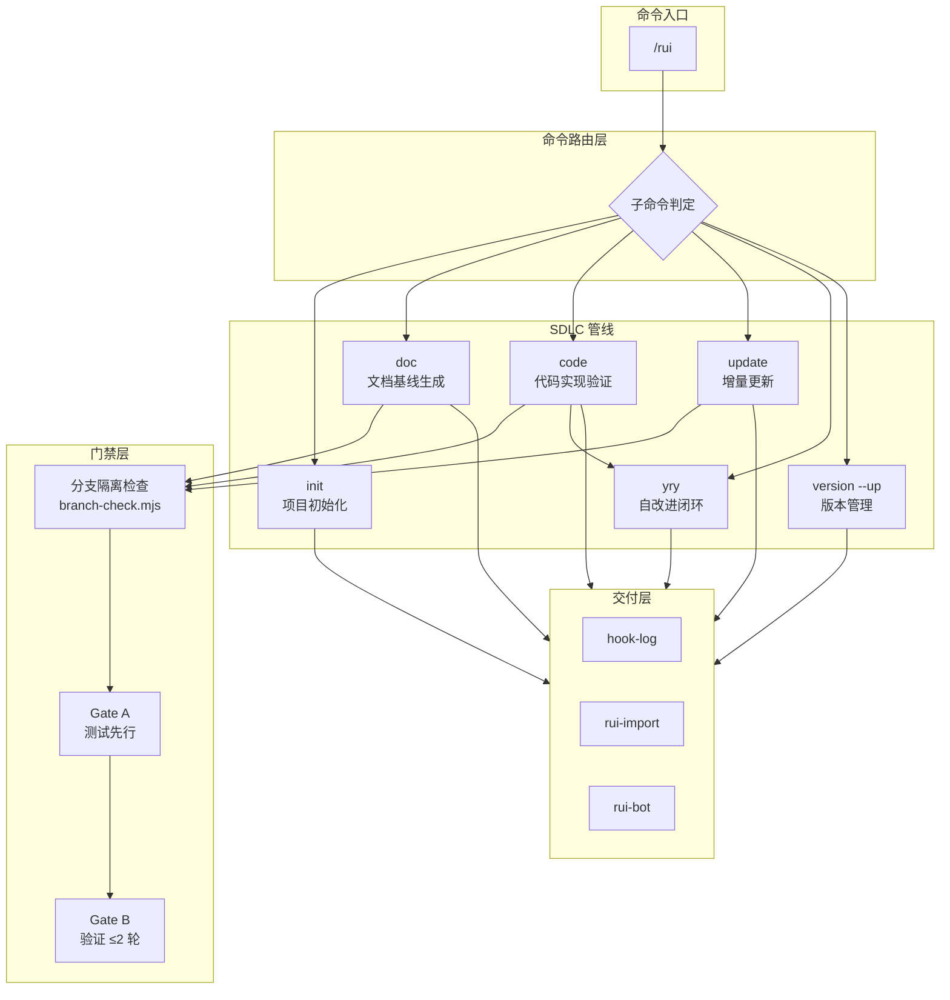
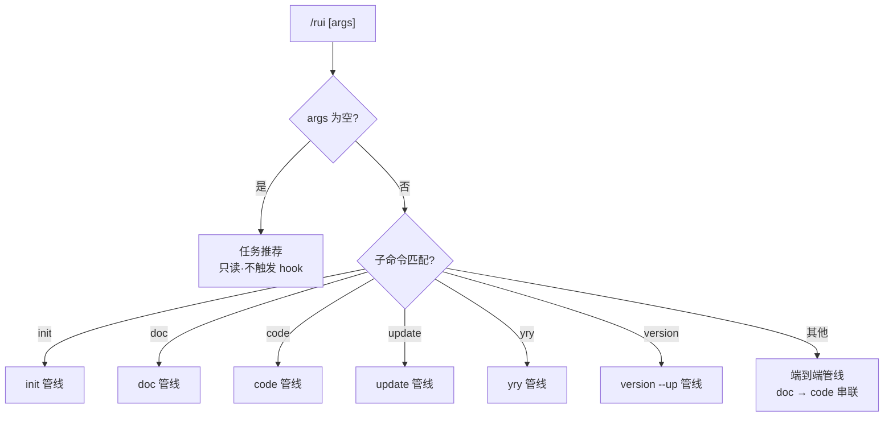
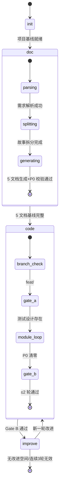
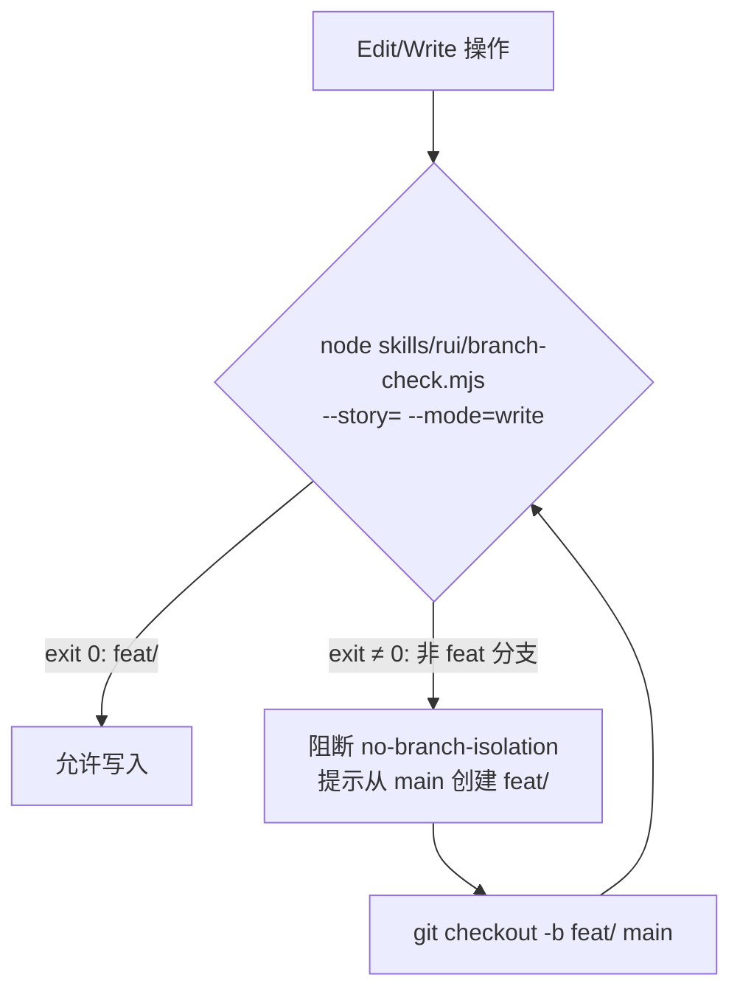
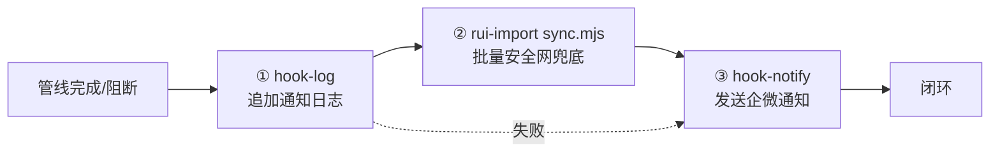
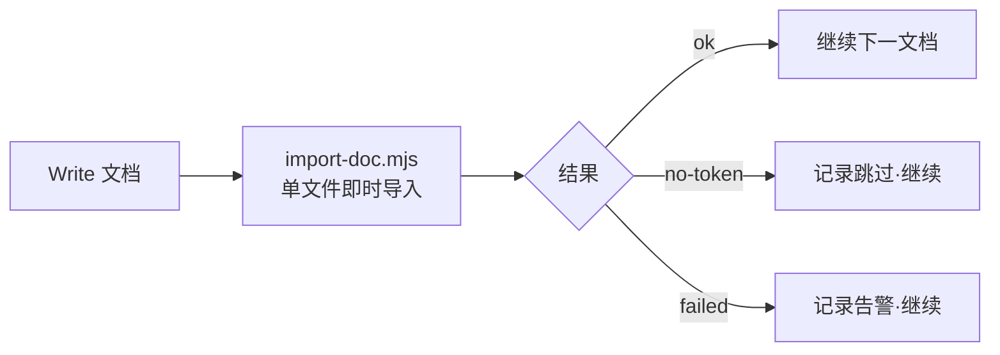

> | v1.0.0 | 2026-05-26 | deepseek-v4-pro | 🌿 feat/rui | 📎 [CLAUDE.md](../../../CLAUDE.md) |

> **导航**: [← 使用场景](./使用场景.md) · [测试设计 →](./测试设计.md) · [安全审计 →](./安全审计.md)

> **来源引用**: 由 `/rui doc --from-code rui` 触发，从 `skills/rui/SKILL.md` + `skills/rui/formulas.md` 反推技术方案。证据 Level A + 规约路径。

[§0 基线溯源](#sec0-baseline) · [§1 架构设计](#sec1-arch) · [§2 命令面设计](#sec2-cmd) · [§3 管线状态机](#sec3-pipeline) · [§4 文档生成引擎](#sec4-doc) · [§5 分支隔离机制](#sec5-branch) · [§6 交付三步](#sec6-delivery) · [§7 安全设计](#sec7-security)

---

### 主要价值

- 🎯 全管线编排架构 — 命令路由→阶段状态机→Agent 协作→文档生成→代码验证→交付收口
- 🔒 分支隔离强制 — branch-check.mjs 验证门禁 + rui-state.json 状态追踪
- ⚡ 公式驱动文档生成 — formulas.md 定义 10 文档结构，F.story.* 公式确保一致性
- 📊 阻断标识体系 — 9 种阻断标识覆盖全管线，blocked=true + block_reason 精准定位

---

## §0 基线溯源

| 基线来源 | 本文档章节 | 映射关系 |
|---------|-----------|---------|
| 故事任务 §1 Story 1 | §1 架构设计 | init 六步管线→系统架构 |
| 故事任务 §1 Story 2 | §4 文档生成引擎 | doc 管线→公式驱动生成 |
| 故事任务 §1 Story 3 | §3 管线状态机 | code 管线→状态转换 |
| 故事任务 §1 Story 4 | §2 命令面设计 | update+yry→命令路由 |
| 故事任务 §2 FP4 | §5 分支隔离机制 | 分支隔离门禁→技术实现 |
| 故事任务 §2 FP9 | §6 交付三步 | 交付三步→集成方案 |

---

## §1 架构设计

### 效果示意

### 项目类型: meta (自托管编排系统)

---

## §2 命令面设计

### 命令族全景

| 命令 | 类型 | 管线阶段 | 产出 |
|------|------|---------|------|
| `/rui` | 只读 | — | 任务推荐(6 层评分排序) |
| `/rui init` | 写入 | init | CLAUDE.md + README.md + 故事任务面板目录 |
| `/rui doc <需求>` | 写入 | doc | 5 文档基线 |
| `/rui doc --from-code <需求>` | 写入 | doc | 5 文档基线(从源码反推) |
| `/rui doc --from-local <name>` | 写入 | doc | 缺失文档补全 |
| `/rui code <name>` | 写入 | code | 实施报告+测试报告+自改进复盘 |
| `/rui code --from-doc <name>` | 写入 | code | 3 报告补全(只读不覆盖) |
| `/rui <需求>` | 写入 | doc→code | 端到端全管线 |
| `/rui update <name> [ctx]` | 写入 | update | T1/T2/T3 裁剪更新 |
| `/rui yry` | 写入 | improve | 自改进闭环+版本升级 |
| `/rui version --up` | 写入 | version | 版本号升级+git commit+tag |

### 命令路由

---

## §3 管线状态机

### rui-state.json 状态模型

### 阻断状态

| 阻断标识 | 阶段 | 含义 | 恢复方式 |
|---------|------|------|---------|
| `no-parse` | doc | 需求无法解析 | 补充需求信息后重跑 |
| `no-source` | doc | P0 章节缺上游来源 | 补充源码或标注待补充 |
| `chain-broken` | doc | 影响链未闭合 | 补全影响分析 |
| `doc-p0` | doc | 文档 P0 不通过 | ≤2 轮自修复 |
| `no-doc-isolation` | doc | 非 feat 分支写文档 | 切换到 feat/<name> |
| `no-branch-isolation` | code | branch-check.mjs 失败 | 切换到 feat/<name> |
| `skip-gate-a` | code | Gate A 未通过 | 先生成测试设计 |
| `code-p0` | code | 代码 P0 无法修复 | 人工介入 |
| `gate-b-limit` | code | Gate B >2 轮 | 人工介入 |

---

## §4 文档生成引擎

### 公式驱动架构

```mermaid
flowchart LR
    subgraph 公式层["formulas.md"]
        F_meta["F.meta 版本头"]
        F_toc["F.toc 标题链接"]
        F_nav["F.nav 导航块"]
        F_evidence["F.evidence 证据等级"]
        F_trace["F.trace 回溯链"]
        F_value["F.value 主要价值"]
        F_task["F.story.task"]
        F_scenarios["F.story.scenarios"]
        F_tech["F.story.technical-review"]
        F_test["F.story.test-design"]
        F_sec["F.story.security-audit"]
    end

    subgraph Agent["Agent 执行层"]
        PM["pm<br/>故事任务+使用场景"]
        CODER["coder<br/>技术评审"]
        TESTER["tester<br/>测试设计"]
        SEC["security<br/>安全审计"]
    end

    公式层 --> Agent
```

### 双基线模型

| 基线 | 文档 | 空间 | 语言约束 | 溯源目标 |
|------|------|------|---------|---------|
| 问题空间 | 故事任务.md | WHAT & WHY | 禁止代码路径/API/组件名/技术栈名 | — |
| 用户空间 | 使用场景.md | WHO & HOW | 禁止技术术语/组件名/API端点/文件路径 | 故事任务 |

### P0 检查清单

| # | 检查项 | 适用文档 |
|---|--------|---------|
| 1 | `### 主要价值` 存在且 ≥4 条 emoji 前缀行 | 全部 |
| 2 | F.meta 无 `{...}` 占位符 | 全部 |
| 3 | 回溯链完整(来源引用+变更记录) | 全部 |
| 4 | 故事任务+使用场景通过语言边界扫描 | 故事任务, 使用场景 |
| 5 | 技术评审含效果示意 mermaid 图+基线溯源表 | 技术评审 |
| 6 | 测试设计 Gate A 交接信号完整 | 测试设计 |
| 7 | 安全审计 STRIDE 六类全覆盖+独立审计标记 | 安全审计 |

---

## §5 分支隔离机制

| 约束 | 规则 |
|------|------|
| doc 写文档 | 必须在 `feat/<name>` 分支 |
| code 改源码 | 必须在 `feat/<name>` 分支 |
| update 增删文件 | 必须在 `feat/<name>` 分支 |
| init | 唯一例外，在 main 上执行 |
| 分支来源 | 必须从 main 拉出 |

---

## §6 交付三步

| # | 步骤 | 规约出处 | 降级 |
|---|------|---------|------|
| 1 | hook-log | rui-bot SKILL.md §hook-log | — |
| 2 | rui-import sync.mjs | rui-import SKILL.md §hook触发器 | API_X_TOKEN 缺失→静默跳过 |
| 3 | hook-notify | rui-bot SKILL.md §hook-notify | 网络失败→告警不阻断 |

### 逐文件即时导入

---

## §7 安全设计

| 安全面 | 设计决策 | 关联风险 |
|--------|---------|---------|
| 认证 | API_X_TOKEN 仅从环境变量读取，禁止写入源码/配置 | 密钥泄露 |
| 分支隔离 | 任何写操作前 branch-check.mjs 验证，禁止在 main 上修改 | 未验证代码污染 main |
| 输入校验 | 需求文本/@文件/URL 均经过解析校验 | 注入攻击 |
| 只读约束 | doc/code --from-doc 全程只读源码 | 意外修改 |
| 独立审计 | security agent 独立执行安全审计，不依赖 coder 自评 | 安全审查不独立 |

---

> **变更记录**
> | 日期 | 变更 | 触发 | 证据 |
> |------|------|------|------|
> | 2026-05-26 | 初始生成 | /rui doc --from-code rui | skills/rui/SKILL.md |
