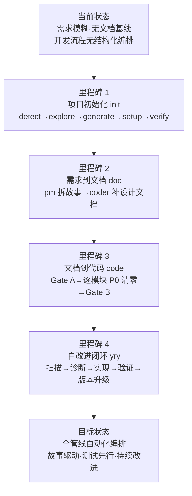

> | v1.0.0 | 2026-05-26 | deepseek-v4-pro | 🌿 feat/rui | 📎 [CLAUDE.md](../../../CLAUDE.md) |

> **导航**: [YrY-使用场景 →](./YrY-使用场景.md)

> **来源引用**: 由 `/rui doc --from-code rui` 触发，从 `skills/rui/SKILL.md` + `skills/rui/formulas.md` 基线反推。证据 Level A + SKILL.md 路径。

[§1 Story](#sec1-story) · [§2 Requirements](#sec2-requirements) · [§3 成功标准](#sec3-success) · [§4 范围边界](#sec4-scope) · [§5 AC](#sec5-ac) · [§6 风险与假设](#sec6-risks) · [§7 跨文档索引](#sec7-index)

---

### §0 基线声明

> **问题空间基线 (Problem Space Baseline)**: 本文档定义"做什么(WHAT)"和"为什么(WHY)"。所有后续文档的设计、实现、验证、改进决策均必须可追溯至本文档的具体章节。

---

### 需求概述

YrY 是故事驱动的 SDLC 编排系统。rui 技能是核心编排器，提供从需求到交付的完整管线：项目初始化 → 需求拆分为故事 → 文档基线生成 → 测试先行 → 逐模块实现 → 验证 → 自改进 → 交付。支持端到端执行、存量代码文档化、增量更新和自主持续改进闭环。

### 效果示意

### 主要价值

- 🎯 统一 SDLC 编排入口 — 从需求到交付一条命令贯穿，覆盖 init/doc/code/update/yry/version 全生命周期
- 🔒 分支隔离强制门禁 — 任何写操作前验证 `feat/<name>` 分支，禁止在 main 上改文档或源码
- ⚡ 测试先行不可绕过 — Gate A 阻断实现、Gate B >2 轮阻断交付，P0 不清零不进下一模块
- 📊 自改进闭环 — yry 全自主扫描诊断实现验证，语义化版本管理，持续改进至无改进空间
- 🔀 双基线模型 — 故事任务(问题空间) + 使用场景(用户空间) 为所有下游文档的强制溯源目标

---

## §1 Story

### Story 1: 项目初始化与基线建立

| 字段 | 内容 |
|------|------|
| 作为 | 项目负责人 |
| 我想要 | 通过一条命令为新项目或已有项目建立完整的 rui 运行基线 |
| 以便 | 项目具备 CLAUDE.md、README.md、故事任务面板目录和 bot 配置，可立即进入 SDLC 管线 |
| 优先级 | P0 |
| 范围边界 | 仅生成项目级配置文件（CLAUDE.md/README.md）和目录结构，不涉及业务源码 |
| 依赖 | 项目目录可读写，git 仓库已初始化 |

#### 范围外

- 不生成业务故事文档（那是 doc 阶段的职责）
- 不修改业务源码
- 不创建 git 分支（init 在 main 上执行，是唯一例外）

#### §1.1 User Operations

| # | 操作 | 触发条件 | 操作步骤 | 预期结果 |
|---|------|---------|---------|---------|
| 1 | 初始化新项目 | 执行 `/rui init` | detect 探测项目身份→explore 深度探索→generate 生成 CLAUDE.md+README.md→setup 创建目录+bot 配置→verify 5 项检查 | CLAUDE.md 含 rui:project-start 标记，README.md 含领域语言段 |
| 2 | 重新初始化已有项目 | 再次执行 `/rui init` | 全量重生 rui 标记段内容，段外保留 | rui 标记段刷新，用户自定义内容保留 |

---

### Story 2: 需求到文档基线

| 字段 | 内容 |
|------|------|
| 作为 | 需求提出者/开发者 |
| 我想要 | 将自然语言需求或存量代码转化为结构化的故事文档基线 |
| 以便 | 每个故事有独立目录、完整文档基线（故事任务+使用场景+技术评审+测试设计+安全审计），可直接进入实现阶段 |
| 优先级 | P0 |
| 范围边界 | 只读源码，写入 `docs/故事任务面板/<name>/` 下的 5 份基线文档 |
| 依赖 | pm/coder/tester/security agent 可用，源码可访问 |

#### 范围外

- 不修改源码（源码变更是 code 阶段的职责）
- 不生成实施报告/测试报告/自改进复盘（属于 code 阶段产出）

#### §1.1 User Operations

| # | 操作 | 触发条件 | 操作步骤 | 预期结果 |
|---|------|---------|---------|---------|
| 1 | 从需求生成文档基线 | `/rui doc <需求>` | pm 拆需求→分支隔离检查→pm 写故事任务+使用场景→coder 写技术评审→tester 写测试设计→security 写安全审计→逐文件导入远端→交付三步 | `docs/故事任务面板/<name>/` 下 5 文档齐全 |
| 2 | 从源码反推文档 | `/rui doc --from-code <需求>` | detect 项目类型→源码定位→只读提取→pm 反推故事任务+使用场景→coder 反推技术评审→tester 反推测试设计→security 反推安全审计 | 5 文档基线，证据 Level B + 源码路径 |
| 3 | 从本地文档补全 | `/rui doc --from-local <name>` | 扫描已有文档→识别缺失→按依赖链生成缺失文档 | 缺失文档补齐，已有文档不改一字 |
| 4 | 端到端执行 | `/rui <需求>` | doc 管线→code 管线自动串联 | 从需求直接到交付 |

---

### Story 3: 代码实现与验证

| 字段 | 内容 |
|------|------|
| 作为 | 开发者 |
| 我想要 | 基于文档基线逐模块实现代码并通过验证门禁 |
| 以便 | 代码实现有完整文档依循，测试先行确保质量，P0 问题逐模块清零 |
| 优先级 | P0 |
| 范围边界 | 源码修改仅限 `feat/<name>` 分支，产出实施报告+测试报告+自改进复盘 |
| 依赖 | 文档基线完整（5 文档），git 仓库可操作 |

#### 范围外

- 不绕过 Gate A 直接编码
- 不修改基线文档（那是 doc/update 的职责）

#### §1.1 User Operations

| # | 操作 | 触发条件 | 操作步骤 | 预期结果 |
|---|------|---------|---------|---------|
| 1 | 实现故事代码 | `/rui code <name>` | 分支隔离门禁→Gate A 测试先行→逐模块实现(P0 清零)→Gate B 验证(≤2 轮)→自改进→交付 | 实施报告+测试报告+自改进复盘齐全 |
| 2 | 从文档反推实现 | `/rui code --from-doc <name>` | 只读源码→补全缺失报告(实施/测试/自改进复盘)→不覆盖已有 | 3 份报告补齐 |

---

### Story 4: 增量更新与自改进

| 字段 | 内容 |
|------|------|
| 作为 | 项目维护者 |
| 我想要 | 对小范围变更执行裁剪后的增量更新，对全局健康执行自主改进 |
| 以便 | T1 措辞修正不重跑全管线，T3 架构变更自动级联刷新；系统持续自诊断自改进 |
| 优先级 | P0 |
| 范围边界 | update 按 T1/T2/T3 裁剪管线；yry 全自主扫描诊断实现验证升级 |
| 依赖 | 已有故事文档基线存在 |

#### 范围外

- update 不跳过分支隔离门禁
- yry 不替代手动 `/rui doc` 或 `/rui code`

#### §1.1 User Operations

| # | 操作 | 触发条件 | 操作步骤 | 预期结果 |
|---|------|---------|---------|---------|
| 1 | T1 措辞修正 | `/rui update <name> <ctx>` | 跳过分析+设计，仅刷新变更章节 | 指定章节更新，下游不变 |
| 2 | T2 接口变更 | `/rui update <name> <ctx>` | 裁剪分析+设计，刷新目标+下游 | 目标文档+受影响的上下游更新 |
| 3 | T3 架构重构 | `/rui update <name> <ctx>` | 完整重跑全管线，全级联刷新 | 所有关联文档更新 |
| 4 | 自主改进 | `/rui yry` | 全量扫描→诊断排序(D0-D7)→选取最优→自主实现→验证→版本升级→循环 | 每个闭环 bump 版本号，直至无改进空间 |

---

### §2 Requirements

#### 功能点

| FP# | 描述 | 输入 | 输出 | 错误行为 | 优先级 |
|-----|------|------|------|---------|--------|
| FP1 | 项目初始化 — detect→explore→generate→setup→verify→trigger | 项目目录 | CLAUDE.md + README.md + 故事任务面板目录 + bot 配置 | 任一 verify 项失败终止 | P0 |
| FP2 | 需求解析与故事拆分 — pm 将需求拆为故事列表 | 需求文本/文件/URL | 故事列表(含优先级、依赖、范围) | 无法解析阻断 `no-parse` | P0 |
| FP3 | 文档基线生成 — 5 文档按序产出 | 故事需求 + 源码 | 故事任务+使用场景+技术评审+测试设计+安全审计 | P0 检查未通过阻断 `doc-p0` | P0 |
| FP4 | 分支隔离门禁 — 写入前验证 `feat/<name>` | 故事名称 | 通过/阻断 | 非 feat 分支阻断 `no-branch-isolation` | P0 |
| FP5 | Gate A 测试先行 — 实现前验证测试设计存在 | 测试设计文档 | 通过/阻断 | 缺失阻断 `skip-gate-a` | P0 |
| FP6 | 逐模块 P0 清零 — 每模块审查后 P0 清零再前进 | 模块代码 | P0 清零记录 | P0 未清进入下一模块阻断 | P0 |
| FP7 | Gate B 验证 — 实现后验证 ≤2 轮 | 实现代码+测试 | 通过/阻断 | >2 轮阻断 `gate-b-limit` | P0 |
| FP8 | 自改进闭环 — D0-D7 诊断→实现→验证→版本升级→循环 | 全部故事+执行记忆 | 改进后的文档/代码+版本升级 | 连续 3 轮无效终止 | P1 |
| FP9 | 交付三步 — hook-log→rui-import→rui-bot 按序触发 | 管线完成/阻断信号 | 日志+同步+通知 | 网络失败告警不阻断 | P0 |
| FP10 | 增量更新裁剪 — T1/T2/T3 自动判定变更范围 | 变更上下文 | 裁剪后的管线执行 | 范围误判导致过度/不足更新 | P1 |
| FP11 | 版本管理 — 自主判定版本号→更新文件→commit→merge→push→tag | 当前版本+变更内容 | 新版本号+git commit+tag | 版本降级或跳跃阻断 | P1 |
| FP12 | 存量代码文档化 — 从源码反推完整文档基线 | 源码目录 | 5 文档基线(证据 Level B) | 源码不可读阻断 `no-source` | P1 |

#### 业务规则

| R# | 描述 | 校验方式 | 证据级别 |
|----|------|---------|---------|
| R1 | 逐故事串行 — 多故事按拆分顺序处理，互不交叉 | 逐故事产出时间戳检查 | B |
| R2 | 源码唯一入口 — 只能走 `/rui code` 改源码 | git diff 检查变更来源 | B |
| R3 | 测试先行 — Gate A 阻断实现，Gate B ≤2 轮 | 检查阶段顺序和时间戳 | A |
| R4 | 分支隔离强制 — 任何 Edit/Write 前验证 `feat/<name>` | `node skills/rui/branch-check.mjs` | A |
| R5 | 文档公式驱动 — 所有文档由 formulas.md 规约 | P0 检查清单逐项校验 | B |
| R6 | 表达优先 — 文档内容图→结构化文本→表 | 每文档至少 1 个 mermaid 图 | B |
| R7 | 交付强制 — 三步按序触发不可跳序 | delivery_pipeline 标记检查 | A |
| R8 | 知识沉淀 — 写入 execution-memory.jsonl + rui-state.json | 文件存在性+字段完整性 | B |

#### 数据约束

| 约束 | 类型 | 范围/格式 | 来源 |
|------|------|----------|------|
| 故事名称 | string | `^[a-z0-9]+(-[a-z0-9]+)*$` (kebab-case) | 命名规范约定 |
| 分支名 | string | `feat/<name>` | 分支隔离约束 |
| 文档集 | 10 文档固定集 | 故事任务/使用场景/技术评审/测试设计/安全审计/实施报告/测试报告/自改进复盘 | formulas.md |
| 故事优先级 | enum | P0 / P1 / P2 | pm 影响分析 |
| 项目类型 | enum | frontend / backend / fullstack / meta / unknown | init detect 判定 |
| 版本号 | string | `MAJOR.MINOR.PATCH` 语义化版本 | version --up 判定 |
| 阻断标识 | enum | no-parse/no-source/chain-broken/doc-p0/no-branch-isolation/skip-gate-a/code-p0/gate-b-limit | rui SKILL.md |

---

### §3 成功标准

| SC# | 描述 | 度量方式 | 目标值 | 优先级 | 关联 FP# |
|-----|------|---------|--------|--------|---------|
| SC1 | 用户可用一条命令从需求到交付 | `/rui <需求>` 执行到全部文档+代码产出 | 全管线完成 | P0 | FP2–FP9 |
| SC2 | 项目初始化后即可进入 SDLC 管线 | verify 5 项检查全部通过 | 5/5 通过 | P0 | FP1 |
| SC3 | 文档基线通过全部 P0 检查 | P0 检查清单逐项校验 | 全部通过 | P0 | FP3 |
| SC4 | 代码变更仅在隔离分支进行 | `git branch --show-current` | 100% 匹配 `feat/<name>` | P0 | FP4 |
| SC5 | 测试先行的门禁不可绕过 | Gate A 阶段检查测试设计存在性 | 100% 阻断无测试设计的实现 | P0 | FP5 |
| SC6 | 交付通知在每次管线完成时发送 | rui-bot 消息日志 | 100% 触发率 | P0 | FP9 |
| SC7 | 自改进闭环可持续运行至无改进空间 | yry 循环轮数 | 连续 3 轮无实质变更自动终止 | P1 | FP8 |

---

### §4 范围边界

#### 范围内

| # | 条目 | 关联 FP# | 边界说明 |
|---|------|---------|---------|
| 1 | 项目初始化 | FP1 | detect→explore→generate→setup→verify→trigger 六步 |
| 2 | 需求到文档基线 | FP2, FP3 | doc / doc --from-code / doc --from-local 三条路径 |
| 3 | 代码实现与验证 | FP4–FP7, FP9 | code / code --from-doc 两条路径 |
| 4 | 端到端执行 | FP2–FP9 | doc + code 自动串联 |
| 5 | 增量更新 | FP10 | T1/T2/T3 自动裁剪 |
| 6 | 自改进闭环 | FP8 | yry 全自主循环 |
| 7 | 版本管理 | FP11 | version --up 全自主 |
| 8 | 任务推荐 | — | `/rui` 只读推荐，6 层评分排序 |

#### 范围外

| # | 条目 | 排除原因 | 替代方案 |
|---|------|---------|---------|
| 1 | .claude/ 配置管理 | 属于 rui-claude 职责范围 | 使用 `/rui-claude sync` |
| 2 | 故事面板查询与管理 | 属于 rui-story 职责范围 | 使用 `/rui-story` |
| 3 | 文档远端同步 | 属于 rui-import 职责范围 | 管线末端自动触发 |
| 4 | 企微通知发送 | 属于 rui-bot 职责范围 | 管线末端自动触发 |
| 5 | 技术趋势查询 | 属于 rui-trends 职责范围 | 使用 `/rui-trends` |
| 6 | 手动 git 分支创建/合并 | 由管线自动管理 | branch-check.mjs 验证 |

---

### §5 AC

| AC# | Given | When | Then | 门禁 |
|-----|-------|------|------|------|
| AC1 | 项目目录无 CLAUDE.md | 用户执行 `/rui init` | 生成 CLAUDE.md(含 rui:project-start 标记)+README.md(含领域语言段)+故事任务面板目录+bot 配置 | Gate A |
| AC2 | 用户提供清晰需求 | 用户执行 `/rui doc <需求>` | pm 拆分故事→coder 补齐 5 文档基线，全部通过 P0 检查 | Gate A |
| AC3 | 文档基线完整 | 用户执行 `/rui code <name>` | Gate A 通过→逐模块实现→Gate B 通过→自改进→交付三步完整 | Gate B |
| AC4 | 当前分支非 `feat/<name>` | 管线尝试写入文档或源码 | 阻断并提示用户创建 `feat/<name>` 从 main 拉出 | Gate A |
| AC5 | 测试设计文档不存在 | 管线进入 Gate A | 阻断 `skip-gate-a`，禁止进入实现 | Gate A |
| AC6 | Gate B 验证超过 2 轮 | 管线检查验证轮次 | 阻断 `gate-b-limit`，禁止交付 | Gate B |
| AC7 | 无改进空间或连续 3 轮无效 | yry 循环检查终止条件 | 输出闭环摘要，停止循环 | Gate B |
| AC8 | 管线完成或阻断 | 末端触发交付三步 | hook-log→rui-import→rui-bot 按序执行 | Gate B |

---

### §6 风险与假设

| # | 风险/假设 | 类型 | 可能性 | 影响 | 缓解/验证策略 | 关联 FP# |
|---|----------|------|--------|------|-------------|---------|
| 1 | 需求描述过于模糊导致 pm 无法拆分 | 风险 | H | H | pm 烧烤纪律：不确定 > 2 项不推进，阻断 `no-parse` | FP2 |
| 2 | P0 检查项缺来源导致文档基线不完整 | 风险 | M | H | 每个断言必须有来源引用或证据路径；不可达来源标 C 级 | FP3 |
| 3 | 分支名冲突（feat/<name> 已存在） | 风险 | M | M | 检测冲突时提示用户处理已有分支 | FP4 |
| 4 | Gate A 被跳过直接进入编码 | 风险 | M | H | branch-check.mjs + Gate A 阶段强制检查测试设计存在性 | FP5 |
| 5 | yry 死循环 — 同一改进项反复失败 | 风险 | M | M | 同一改进项失败 ≥2 次 skip+记录；连续 3 轮无效终止 | FP8 |
| 6 | 自改进导致内容退化而非改进 | 风险 | L | H | 每轮变更需通过 Gate B 验证；失败回滚 | FP8 |
| 7 | pm 能正确理解需求并拆分为合理粒度的故事 | 假设 | — | — | pm agent 规约约束拆分行为；结果可通过故事任务文档验证 | FP2 |
| 8 | 源码结构反映实际架构使 coder 能准确提取技术方案 | 假设 | — | — | 源码不可读或结构混乱时阻断 | FP3 |
| 9 | API_X_TOKEN 环境变量已配置使交付三步可执行 | 假设 | — | — | 缺失时降级 `no-token`，不阻断管线 | FP9 |

---

### §7 跨文档索引

| 本文档章节 | 下游文档 | 状态 |
|-----------|---------|------|
| §1 Story 1–4 | 使用场景 | 待生成 |
| §2 FP1–FP12 | 技术评审 | 待生成 |
| §5 AC1–AC8 | 测试设计 | 待生成 |
| §6 风险 1–9 | 安全审计 | 待生成 |

---

> **变更记录**
> | 日期 | 变更 | 触发 | 证据 |
> |------|------|------|------|
> | 2026-05-26 | 初始生成 | /rui doc --from-code rui | skills/rui/SKILL.md |
