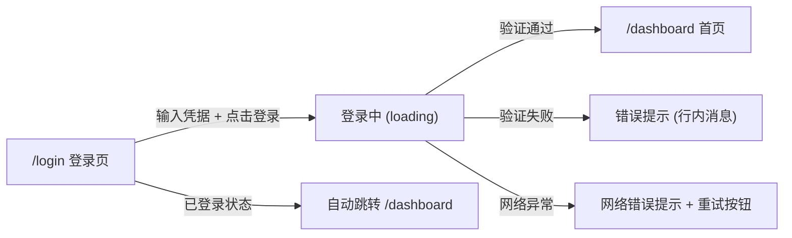
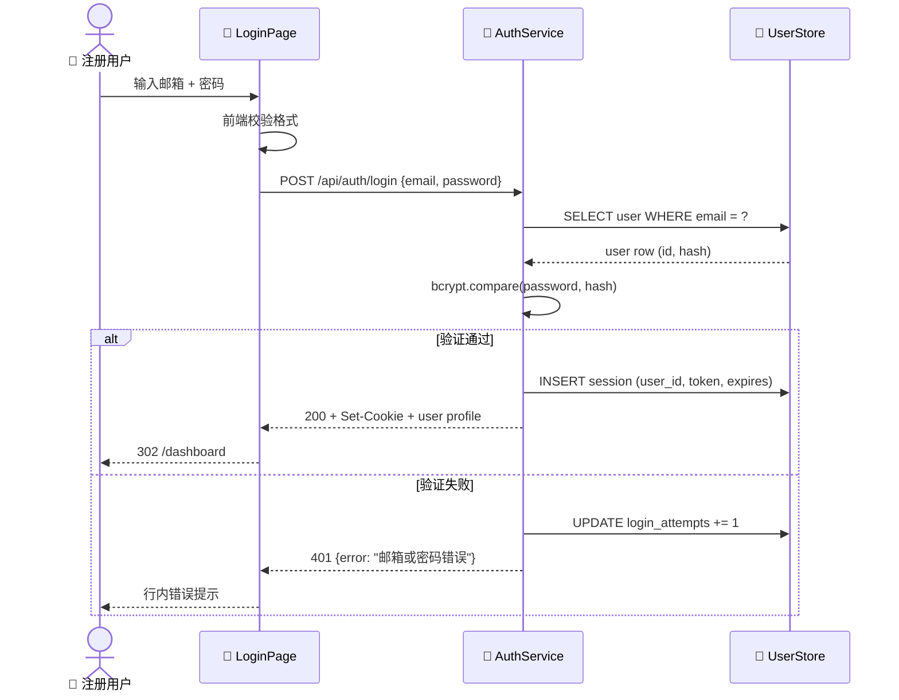
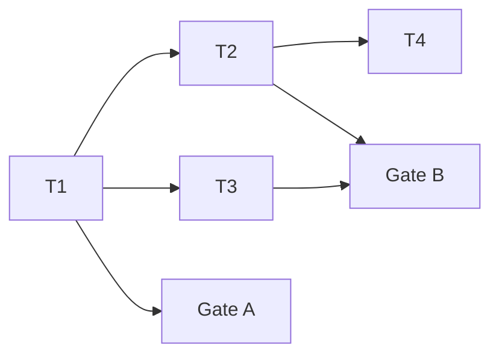
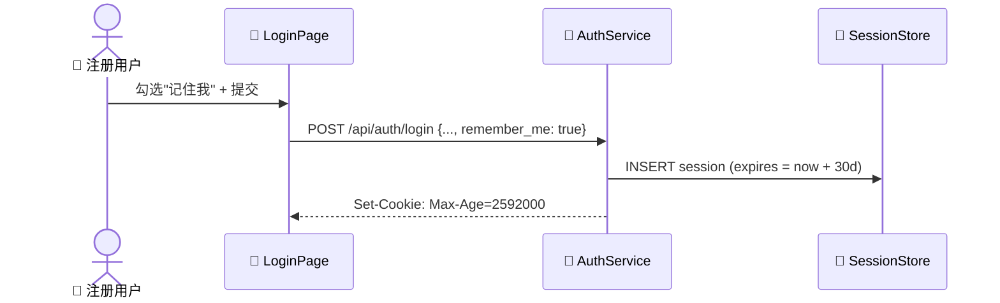

# 用户认证

> **第一原则**: 内容能被人类理解和记忆，文档内说明依赖。

> | v0.1.0 | 2026-05-08 | deepseek-v4-pro | Claude Code | 🌿 feat/user-login | ⏱️ 需求澄清阶段 | 📎 [CLAUDE.md](../../CLAUDE.md) · [design-system.md](../../shared/architecture.md) |

> **证据标准**: A=已验证(附路径) · B=可推导(附规则) · C=未验证(标注 `> 待补充`) · D=禁止(视为幻觉)

> ⚠ 本目录为 `/rui init` 自动生成的最佳实践样例。所有内容为虚构示例，用于展示故事板的完整结构和各章节的填写规范。

---

## Story 1: 用户密码登录

### §1 Story（pm 定义）

| 字段 | 详情 |
|-------|--------|
| 作为 | 注册用户 |
| 我想要 | 使用邮箱和密码登录系统 |
| 以便 | 安全访问我的个人数据和受保护的功能 |
| 优先级 | 🔴 P0 |
| 范围边界 | 仅密码登录方式，不包含短信验证码、OAuth、生物识别等其他登录方式 |
| 依赖 | — |
| 子项目 | auth |

**范围外**: 注册流程、密码找回、多因素认证、社交账号登录、登录设备管理

---

### §1.1 User Operations（tester 描述）

| # | 操作 | 触发条件 | 操作步骤 | 预期结果 |
|---|-----------|---------|-------------|-----------------|
| U1 | 输入凭据登录 | 用户在 `/login` 页面 | 1. 输入邮箱 → 2. 输入密码 → 3. 点击"登录"按钮 | 跳转到用户首页，显示欢迎信息 |
| U2 | 凭据错误处理 | 输入错误的邮箱或密码后提交 | 1. 输入错误凭据 → 2. 点击"登录" | 显示行内错误提示"邮箱或密码错误"，不清空输入框 |

> tester 从 AC 推导用户可见的操作路径，每个故事至少描述一条主操作流。

#### UI 交互流程（涉及 UI 改造时填写）

**视图状态**:

| 视图 | 正常 | 加载 | 空 | 错误 | 禁用 |
|------|------|------|----|------|------|
| 登录页 | 邮箱输入框 + 密码输入框 + 登录按钮 | 登录按钮显示 spinner，输入框禁用 | — | 行内错误文案 + 输入框红色边框 | 登录按钮置灰（邮箱或密码为空时） |
| 首页 | 欢迎信息 + 用户内容 | 骨架屏 | — | — | — |

**交互追踪**（关联 §1.1 User Operations）:

| U# | 入口 | 动作 | 系统响应 | 出口 |
|----|------|------|---------|------|
| U1 | 登录页 | 填入邮箱密码 → 点击登录 | POST /api/auth/login → 302 → 首页 | 首页 |
| U2 | 登录页 | 填入错误凭据 → 点击登录 | POST /api/auth/login → 401 → 错误提示 | 登录页（含错误提示） |

---

### §2 Requirements（pm 描述）

#### 功能点

| FP# | 描述 | 输入 | 输出 | 错误行为 | 优先级 |
|-----|-------------|-------|--------|---------------|----------|
| FP1 | 用户凭据验证 | 邮箱(字符串) + 密码(字符串, ≥8字符) | 会话令牌 + 用户信息 | 凭据不匹配返回 401 + "邮箱或密码错误" | 🔴 |
| FP2 | 密码安全传输 | 明文密码 + HTTPS 通道 | bcrypt hash 比对 | TLS 不可用时拒绝请求 | 🔴 |
| FP3 | 登录失败计数 | 邮箱 + 失败时间戳 | 连续失败次数 | 5 次连续失败后锁定 15 分钟，提示"账户暂时锁定，请 15 分钟后重试" | 🔴 |
| FP4 | 会话创建 | 验证通过的 user_id | HttpOnly Secure SameSite=Strict 的 session cookie | 服务端 session 创建失败返回 500 | 🔴 |
| FP5 | 已有会话处理 | 带有效 session cookie 访问 /login | 302 跳转到 /dashboard | session 过期时静默清除，显示登录页 | 🟡 |

#### 业务规则

| 规则# | 描述 | 校验方式 | 证据级别 |
|-------|-------------|-------------|----------|
| R1 | 邮箱格式符合 RFC 5322 | 前端 + 后端双重校验 | A |
| R2 | 密码最小长度 8 字符，至少含 1 字母 + 1 数字 | 前端实时校验 + 后端拦截 | A |
| R3 | 连续失败 5 次锁定账户 15 分钟 | 后端计数 + 时间窗口 | B |

#### 数据约束

| 约束 | 类型 | 范围/格式 | 来源 |
|------------|------|-------------|--------|
| email | string | RFC 5322, max 254 字符 | AC1 / R1 |
| password | string | 8–128 字符, ≥1 字母 + ≥1 数字 | AC2 / R2 |
| session_token | string | 256-bit random, base64url 编码 | FP4 |
| login_attempts | int | 0–5, 窗口重置后归零 | R3 |

---

### §3 Design（coder + security 描述）

#### 技术设计（coder 描述）

| 模块 | 文件 | 职责 | 变更类型 |
|--------|------|---------------|-------------|
| LoginPage | `src/pages/LoginPage.tsx` | 登录表单 UI、前端校验、错误展示 | 新增 |
| AuthService | `src/services/auth.service.ts` | 登录 API 调用、token 管理 | 新增 |
| AuthController | `src/server/controllers/auth.controller.ts` | POST /api/auth/login 路由处理 | 新增 |
| SessionStore | `src/server/stores/session.store.ts` | Session CRUD、过期清理 | 新增 |
| RateLimiter | `src/server/middleware/rate-limiter.ts` | 登录频率限制（复用现有中间件） | 复用 |

**数据流**:

| 流程 | 来源 | 目标 | 数据 | 转换 |
|------|------|----|------|-----------|
| F1 | LoginPage | AuthController | `{email, password}` | JSON body → 服务端校验 → bcrypt 比对 |
| F2 | AuthController | SessionStore | `{user_id, token, expires_at}` | 生成随机 token → 持久化 session |
| F3 | AuthController | LoginPage | `{user, session}` | 服务端数据 → JSON response + Set-Cookie header |

#### 安全约束（security 注入，涉及安全面时填写）

| # | 威胁 | 信任边界 | 缓解措施 | 优先级 |
|---|--------|---------------|-----------|----------|
| 1 | 密码明文传输被窃听 | 用户浏览器 ↔ 服务端 | 强制 HTTPS，HSTS header | P0 |
| 2 | 暴力破解攻击 | 用户输入 → 服务端 | 连续失败 5 次锁定 15 分钟 + 递增延迟 | P0 |
| 3 | 会话固定攻击 | 匿名 → 已认证 | 登录成功后重新生成 session ID | P0 |

---

### §4 Tasks（pm + coder + security + reporter 拆解）

| ID | 描述 | 工作量 | 依赖 | 交付物 | Agent | 门禁 |
|----|-------------|--------|---------|-------------|-------|------|
| T1 | 故事拆解 + 任务协调 + 最终验收 | S | — | 故事任务.md（本文件） | pm | — |
| T2 | 实现 AuthController + SessionStore（后端） | M | T1 | `auth.controller.ts`, `session.store.ts` | coder | — |
| T3 | 实现 LoginPage + AuthService（前端） | M | T1 | `LoginPage.tsx`, `auth.service.ts` | coder | — |
| T4 | 安全审查：输入消毒 + 密码策略 + 会话管理 | S | T2 | 审查记录（注入 §3 安全约束） | security | — |
| T5 | 测试方案 + 原型（Gate A） | M | T1 | 测试用例评审.md | tester | Gate A |
| T6 | 冒烟验证 + 回归测试（Gate B） | M | T2, T3 | 测试用例报告.md | tester | Gate B |
| T7 | 过程记录 + 执行记忆回写 | S | — | execution-memory.jsonl | reporter | — |

**任务依赖图**:

---

### §5 Acceptance Criteria（tester 定义）

| AC# | 验收条件（可度量） | 测试方法 | 预期结果 | 门禁 |
|-----|------------------------|-------------|-----------------|------|
| AC1 | 有效凭据登录成功，返回 session cookie 且 HttpOnly Secure SameSite=Strict | `curl -X POST /api/auth/login -d '{"email":"test@example.com","password":"Pass1234"}' -v` | 200, Set-Cookie 包含上述三个属性 | Gate A |
| AC2 | 错误凭据返回 401 + 标准错误消息，不泄露用户是否存在 | `curl -X POST /api/auth/login -d '{"email":"no@example.com","password":"wrong"}' -v` | 401, body 仅含 "邮箱或密码错误"，不区分邮箱不存在 vs 密码错误 | Gate A |
| AC3 | 连续 5 次失败后第 6 次请求返回 429，锁定 15 分钟 | 循环发送 6 次错误密码请求 | 前 5 次 401，第 6 次 429 + "账户暂时锁定" | Gate B |
| AC4 | 登录成功后访问 /login 自动跳转到 /dashboard | 浏览器访问 /login（携带有效 session cookie） | 302 跳转到 /dashboard | Gate B |
| AC5 | 空邮箱或空密码提交时前端阻止，不发送请求 | 清空邮箱点击登录 → 清空密码点击登录 | 登录按钮禁用状态 + 内联校验消息 | Gate B |

---

## Story 2: 记住登录状态

### §1 Story（pm 定义）

| 字段 | 详情 |
|-------|--------|
| 作为 | 注册用户 |
| 我想要 | 在关闭浏览器后保持登录状态 |
| 以便 | 不需要每次都重新输入凭据 |
| 优先级 | 🟡 P1 |
| 范围边界 | 仅"记住我"复选框 + 持久化 session，不包含设备管理、登出其他设备 |
| 依赖 | [Story 1: 用户密码登录](#story-1-用户密码登录) |
| 子项目 | auth |

**范围外**: 登录设备列表管理、异地登录提醒、信任设备白名单

---

### §1.1 User Operations（tester 描述）

| # | 操作 | 触发条件 | 操作步骤 | 预期结果 |
|---|-----------|---------|-------------|-----------------|
| U1 | 勾选"记住我"登录 | 在登录页勾选记住我后提交 | 1. 输入凭据 → 2. 勾选"记住我" → 3. 点击登录 | 关闭浏览器后重新打开，直接进入已登录状态 |
| U2 | 不勾选正常登录 | 登录页不勾选记住我 | 1. 输入凭据 → 2. 不勾选 → 3. 点击登录 | 关闭浏览器后 session 失效，需重新登录 |

> 非 UI 重改故事（复用 Story 1 的 LoginPage），省略 UI 交互流程和交互追踪。

---

### §2 Requirements（pm 描述）

#### 功能点

| FP# | 描述 | 输入 | 输出 | 错误行为 | 优先级 |
|-----|-------------|-------|--------|---------------|----------|
| FP1 | "记住我"选项 | 底部复选框，默认不勾选 | 勾选后 session 有效期延长至 30 天 | — | 🟡 |
| FP2 | 持久化 session 恢复 | 持久化 session cookie | 自动登录，刷新用户信息 | cookie 被篡改时拒绝并清除 | 🟡 |
| FP3 | 主动登出 | 用户点击"退出登录" | 清除服务端 session + 客户端 cookie | — | 🟡 |

#### 业务规则

| 规则# | 描述 | 校验方式 | 证据级别 |
|-------|-------------|-------------|----------|
| R1 | 持久化 session 最大有效期 30 天 | 后端 expires_at 字段校验 | A |
| R2 | 登出同时清除服务端和客户端状态 | 后端 DELETE session + 前端清除 cookie | A |

---

### §3 Design（coder 描述）

| 模块 | 文件 | 职责 | 变更类型 |
|--------|------|---------------|-------------|
| LoginPage | `src/pages/LoginPage.tsx` | 添加"记住我"复选框 | 修改 |
| AuthService | `src/services/auth.service.ts` | 透传 remember_me 参数 | 修改 |
| AuthController | `src/server/controllers/auth.controller.ts` | 根据 remember_me 设置 session TTL | 修改 |
| SessionStore | `src/server/stores/session.store.ts` | 同时支持短期和长期 session | 修改 |

> 不涉及新的安全面，省略安全约束节。

---

### §4 Tasks（pm + coder + tester 拆解）

| ID | 描述 | 工作量 | 依赖 | 交付物 | Agent | 门禁 |
|----|-------------|--------|---------|-------------|-------|------|
| T1 | 协调 Story 2 任务 + 验收 | S | Story 1 完成 | — | pm | — |
| T2 | 后端 session TTL 支持 + 登出端点 | S | T1 | 修改后的 controller + store | coder | — |
| T3 | 前端复选框 + 登出按钮 | S | T1 | 修改后的 LoginPage | coder | — |
| T4 | 测试方案 + 冒烟验证 | S | T2, T3 | 测试用例报告.md | tester | Gate B |

---

### §5 Acceptance Criteria（tester 定义）

| AC# | 验收条件（可度量） | 测试方法 | 预期结果 | 门禁 |
|-----|------------------------|-------------|-----------------|------|
| AC1 | 勾选记住我后 session cookie Max-Age=2592000 | `curl -X POST /api/auth/login -d '{"email":"test@example.com","password":"Pass1234","remember_me":true}' -v` | Set-Cookie 包含 Max-Age=2592000 | Gate B |
| AC2 | 不勾选时 session cookie 无 Max-Age（浏览器会话级别） | `curl -X POST /api/auth/login -d '{"email":"test@example.com","password":"Pass1234","remember_me":false}' -v` | Set-Cookie 不含 Max-Age 属性 | Gate B |

---

## 后记

### 报告统计

| 指标 | 数值 |
|--------|-------|
| Stories | 2 |
| 安全相关 Stories | 1 |
| Gate A 项 | 2 |
| Gate B 项 | 5 |
| 证据级别 | A:8 · B:2 · C:0 |

### 后续故事

- 作为用户，我想要使用短信验证码登录，以便在没有网络密码管理器时也能安全访问。→ [sms-login](./sms-login.md#story-1)
- 作为管理员，我想要查看用户登录失败日志，以便及时发现暴力破解攻击。→ [admin-audit-log](./admin-audit-log.md#story-1)
- 作为用户，我想要在检测到异地登录时收到通知，以便及时保护我的账户。→ [geo-anomaly-detection](./geo-anomaly-detection.md#story-1)

### .claude 改进清单

> 本故事执行过程中发现的 `.claude` 目录改进点，用于驱动自改进管线。每次 rui 完成后 pm 汇总，写入 `docs/.improvement/proposals.jsonl`。

| # | 优先级 | 改进动作 | 原因 | 状态 |
|---|----------|------|-----------|--------|
| 1 | P1 | 创建 `skills/auth/` 认证领域技能，复用 bcrypt 审查模板 | 认证模块在多个项目中重复实现，缺少统一的安全审查清单 | pending |
| 2 | P2 | 在 `agents/tester.md` 补充 cookie 属性验证的测试方法 | 当前 tester 规则未覆盖 HTTP cookie 安全属性的验证方法 | pending |

### 系统架构演进任务

> 跨子项目架构变更登记，确保全局一致性。由 pm 在架构设计阶段识别，策展时确认。

| # | 优先级 | 架构变更 | 原因 | 状态 |
|---|----------|------|-----------|--------|
| 1 | P1 | 抽取 RateLimiter 为独立中间件包 | 登录限流和 API 限流共享相同逻辑，当前散落在各模块中 | pending |
| 2 | P2 | 统一 Session 管理为 `session-service` 微服务 | 随用户量增长，session 管理将与认证逻辑解耦有利于独立伸缩 | pending |

### 后期规划与改进

本故事板演示了 rui 故事任务模板的完整填写规范。在实际项目中：

- **符合行业实践**: 密码安全传输（bcrypt + HTTPS）、登录限流、会话安全标记（HttpOnly, Secure, SameSite）均为 OWASP 推荐做法。可进一步参考 [OWASP ASVS V2.1](https://owasp.org/www-project-application-security-verification-standard/) 认证验证标准。
- **避免过度依赖复杂方法论**: 认证流程本身是成熟模式，不需要引入 OAuth 2.0 或 OpenID Connect 等增加复杂度的标准，除非业务确实需要社交登录或单点登录。
- **持续演进**: 随用户规模增长，可考虑引入设备指纹（新建故事）、异地登录检测（新建故事）、无密码登录（WebAuthn，评估后决策）。
- **标准化方向**: 若多个子项目需要认证，应将 auth 模块提取为共享包或独立服务，制定跨项目的认证契约。

> ⚠ 以上内容为样例演示，实际项目中 pm 应根据真实需求和约束填写。
