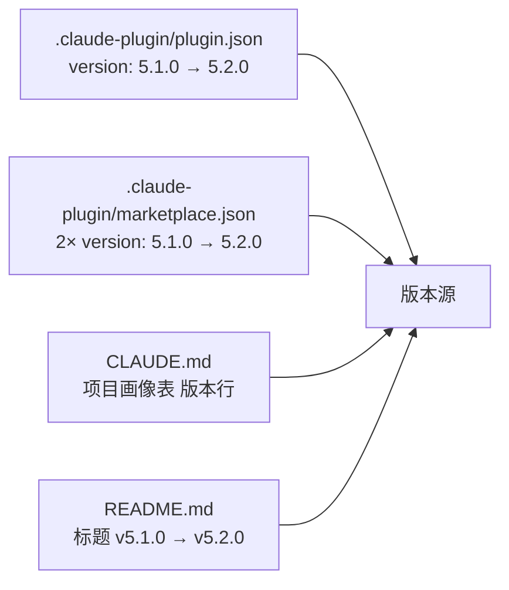

# 场景-1：版本号升级

> | v5.2.0 | 2026-06-10 | deepseek-v4-pro | 🌿 feat/version-5.2.0 | 📎 [CLAUDE.md](../../../../CLAUDE.md)

## §0 技术评审

### 影响范围

### 变更分析

| 文件 | 位置 | 旧值 | 新值 | 类型 |
|------|------|------|------|:---:|
| `.claude-plugin/plugin.json` | L4 | `"5.1.0"` | `"5.2.0"` | 版本源 |
| `.claude-plugin/marketplace.json` | L8, L18 | `"5.1.0"` | `"5.2.0"` | 发布清单 |
| `CLAUDE.md` | L60 | `5.1.0` | `5.2.0` | 文档 |
| `README.md` | L1 | `v5.1.0` | `v5.2.0` | 文档 |

### 不变文件

`docs/故事任务面板/yry-self-improve/` 下各场景文档中的 `v5.1.0` 为历史记录，记录该故事创建时的版本，**不更新**。

## §1 测试设计

| TC# | 验证点 | 方法 | 预期 |
|-----|--------|------|------|
| TC1 | plugin.json 版本 | `jq .version .claude-plugin/plugin.json` | `"5.2.0"` |
| TC2 | marketplace.json 版本 | `grep -c '"5.2.0"' .claude-plugin/marketplace.json` | `2` |
| TC3 | CLAUDE.md 版本 | `grep '5.2.0' CLAUDE.md` | 命中 |
| TC4 | README.md 版本 | `grep 'v5.2.0' README.md` | 命中 |
| TC5 | 无遗漏 | `grep -rn '5\.1\.0' --include="*.json" --include="*.md" \| grep -v node_modules \| grep -v .git \| grep -v .memory \| grep -v 故事任务面板` | 仅 marketplace.json/plugin.json/CLAUDE.md/README.md 待更新 |
| TC6 | git branch | `git branch --show-current` | `feat/version-5.2.0` |

## §2 实施报告

| 文件 | 变更 | 状态 |
|------|------|:---:|
| `.claude-plugin/plugin.json` | L4: `"5.1.0"` → `"5.2.0"` | ✓ |
| `.claude-plugin/marketplace.json` | L8, L18: `"5.1.0"` → `"5.2.0"` | ✓ |
| `CLAUDE.md` | L60: `\| 版本 \| 5.1.0 \|` → `\| 版本 \| 5.2.0 \|` | ✓ |
| `README.md` | L1: `v5.1.0` → `v5.2.0` | ✓ |

## §3 测试报告

| TC# | 结果 | 实际值 |
|-----|:---:|------|
| TC1 | ✅ | `"5.2.0"` |
| TC2 | ✅ | `2` |
| TC3 | ✅ | `\| 版本 \| 5.2.0 \|` |
| TC4 | ✅ | `# YrY v5.2.0` |
| TC5 | ✅ | 无残留 5.1.0 引用（故事文档中的历史版本已排除） |
| TC6 | ✅ | `feat/version-5.2.0` |

## §4 自改进

- **变更级别**：MINOR（新增功能：rui-trends + 工程成熟度评估 + 通知面板）
- **版本跳转**：5.1.0 → 5.2.0
- **数据采集**：N/A（机械版本号更新，无诊断数据）
- **经验**：版本号更新为机械操作，4 文件固定更新点；grep 扫描是有效的完整性验证手段
