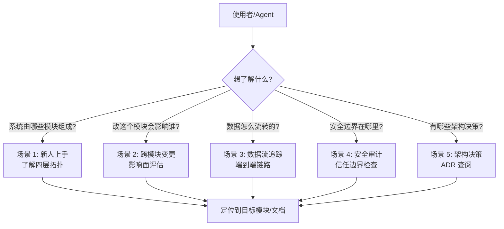
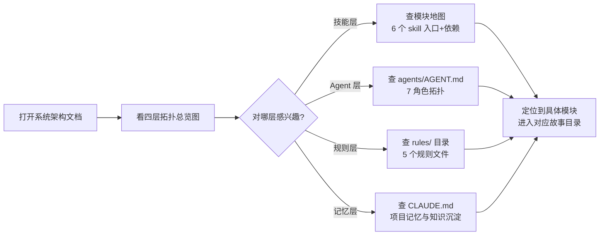
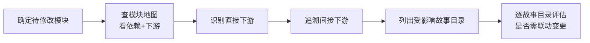
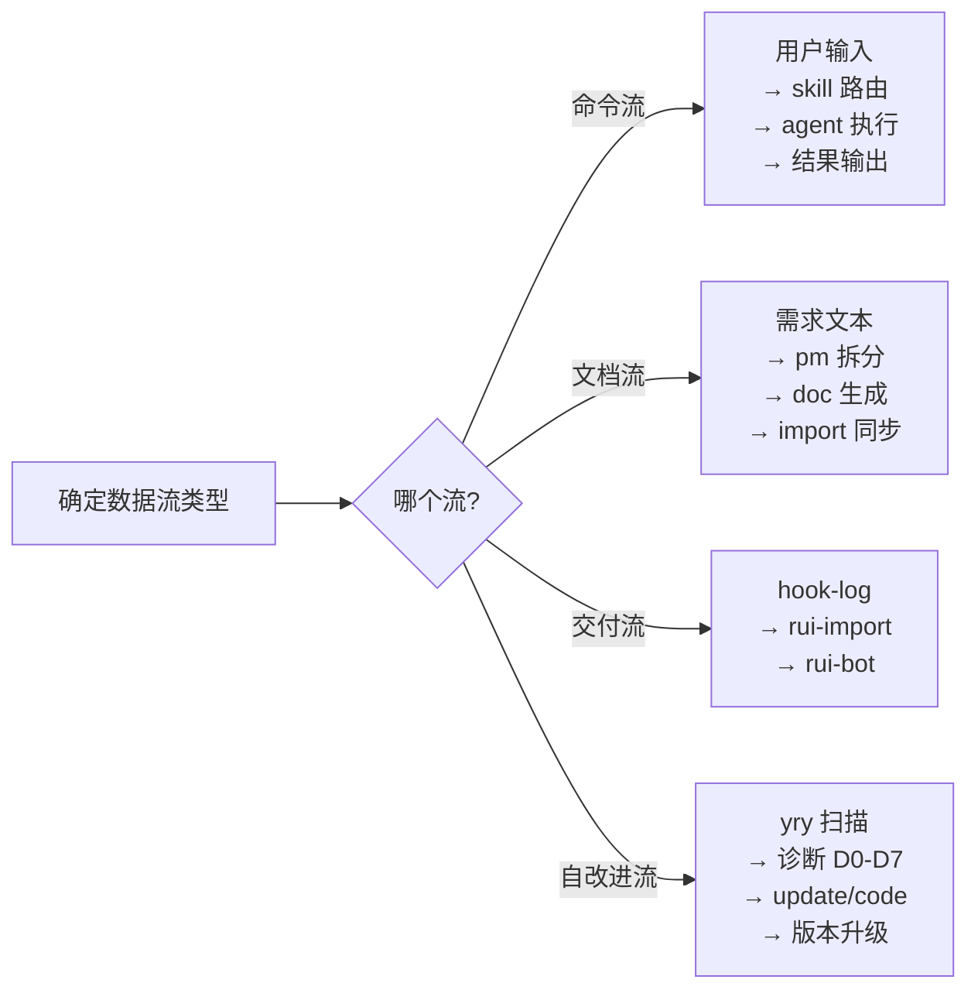

> | v1.0.0 | 2026-05-26 | deepseek-v4-pro | 🌿 feat/yry-arch | 📎 [CLAUDE.md](../../../CLAUDE.md) |

> **导航**: [← 故事任务](./故事任务.md) · [技术评审 →](./技术评审.md)

> **来源引用**: 由 yry 自改进触发，从 `CLAUDE.md` 信念 + 项目结构反推架构参考场景。证据 Level B。

[§1 场景全景](#sec1-overview) · [§2 场景详述](#sec2-detail) · [§3 场景覆盖矩阵](#sec3-matrix) · [§4 评审清单](#sec4-checklist)

---

### 主要价值

- 🎯 覆盖 5 个架构参考场景 — 新人上手·跨模块变更·交付调试·自改进诊断·安全审计
- 🔒 每场景含查询路径 — 从"我要找什么"到"去哪个文件"的完整导航
- ⚡ 模块定位时效 — 目标 ≤5 分钟内定位到目标模块
- 📊 语言边界纯净 — 面向使用者描述操作，不引入架构实现细节

---

## §1 场景全景

---

## §2 场景详述

### 场景 1: 新人上手 — 了解系统四层拓扑

| 角色 | 触发条件 | 核心目标 |
|------|---------|---------|
| 新加入的开发者/agent | 首次接触 YrY 项目 | 在 5 分钟内理解系统的四层结构和模块职责 |

| # | 步骤 | 输入 | 系统响应 | 异常分支 |
|---|------|------|---------|---------|
| 1 | 查看总览 | 打开 yry-arch 故事目录 | 四层拓扑 mermaid 图 + 模块清单 | 文档不存在→触发 yry 自改进生成 |
| 2 | 选择层级 | 点击目标层 | 该层全部模块列表 + 职责简述 | — |
| 3 | 进入模块 | 点击具体模块 | 跳转到对应技能故事目录 | 目标目录不存在→标注缺失 |

### 场景 2: 跨模块变更 — 影响面评估

| 角色 | 触发条件 | 核心目标 |
|------|---------|---------|
| coder/developer | 需要修改某个模块 | 评估变更的影响范围，识别所有下游消费者 |

| # | 步骤 | 输入 | 系统响应 | 异常分支 |
|---|------|------|---------|---------|
| 1 | 查模块入口 | 模块名 | 入口文件路径 + 核心功能 | 规约驱动模块→标注无源码 |
| 2 | 查依赖 | 入口文件 | 上游依赖列表 | import 不可解析→标注规约引用 |
| 3 | 查下游 | 模块名 | 下游消费者列表 | 无下游→标注"叶子模块" |
| 4 | 评估影响 | 下游列表 | 逐下游标注影响级别(直接/间接) | — |

### 场景 3: 数据流追踪 — 端到端链路

| 角色 | 触发条件 | 核心目标 |
|------|---------|---------|
| 调试者/oncall | 管线异常或数据不一致 | 追踪数据从入口到出口的完整路径 |

| # | 步骤 | 输入 | 系统响应 | 异常分支 |
|---|------|------|---------|---------|
| 1 | 确定流类型 | 异常现象描述 | 匹配到 4 种流之一 | 不匹配→标注未知流 |
| 2 | 追踪节点 | 流起点 | 按流程图逐节点追踪 | 节点缺失→标注 gap |
| 3 | 定位问题节点 | 异常位置 | 给出该节点的入口文件和校验逻辑 | — |

### 场景 4: 安全审计 — 信任边界检查

| 角色 | 触发条件 | 核心目标 |
|------|---------|---------|
| security agent/审计者 | 新增模块或变更安全面 | 验证所有信任边界闭合，无绕过路径 |

### 场景 5: 架构决策 — ADR 查阅

| 角色 | 触发条件 | 核心目标 |
|------|---------|---------|
| pm/架构师 | 面临设计取舍 | 查阅历史架构决策，避免重复讨论 |

---

## §3 场景覆盖矩阵

| 场景 | FP# | AC# | 技术评审 | 测试设计 | 覆盖状态 |
|------|-----|------|---------|---------|---------|
| 场景 1: 新人上手 | FP1, FP2 | AC1, AC2 | §1 四层拓扑 | §3 用例 | 待生成 |
| 场景 2: 跨模块变更 | FP2, FP5 | AC2, AC5 | §2 模块地图 | §3 用例 | 待生成 |
| 场景 3: 数据流追踪 | FP3 | AC3 | §3 数据流 | §3 用例 | 待生成 |
| 场景 4: 安全审计 | FP4 | AC4 | §4 信任边界 | §3 用例 | 待生成 |
| 场景 5: ADR 查阅 | FP6 | — | §5 ADR | — | 待生成 |

---

## §4 评审清单

| # | 检查项 | 状态 |
|---|--------|------|
| 1 | 场景 ≥ 2 个 | ✅ 5 场景 |
| 2 | 每场景有 mermaid flowchart | ✅ |
| 3 | FP# 全覆盖 | ✅ |
| 4 | 异常分支明确 | ✅ |
| 5 | 无技术术语 | ✅ |

---

> **变更记录**
> | 日期 | 变更 | 触发 | 证据 |
> |------|------|------|------|
> | 2026-05-26 | 初始生成，yry 自改进补充架构参考场景 | /rui yry §4 implement | CLAUDE.md + 项目目录结构 |
