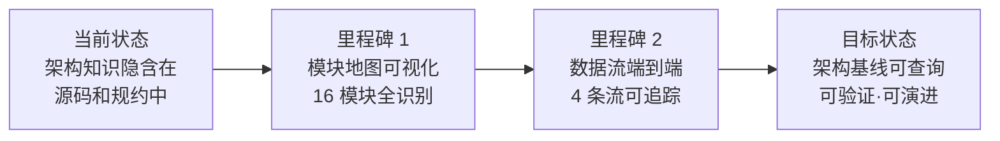
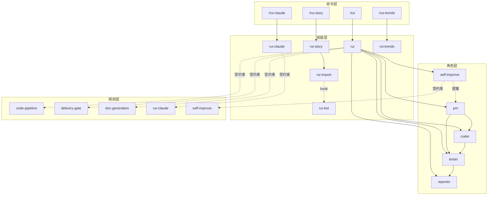
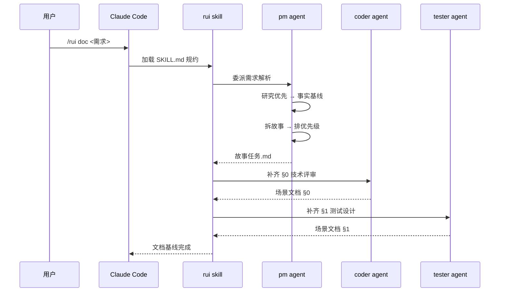
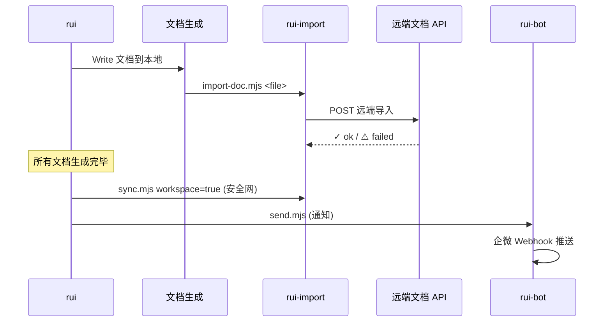
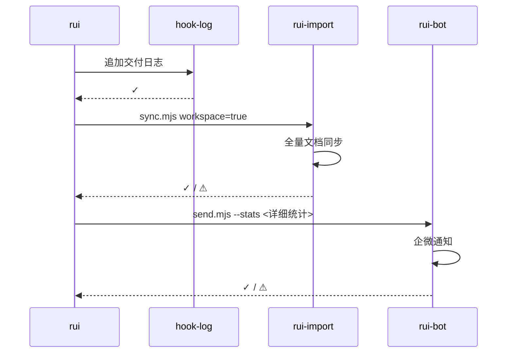
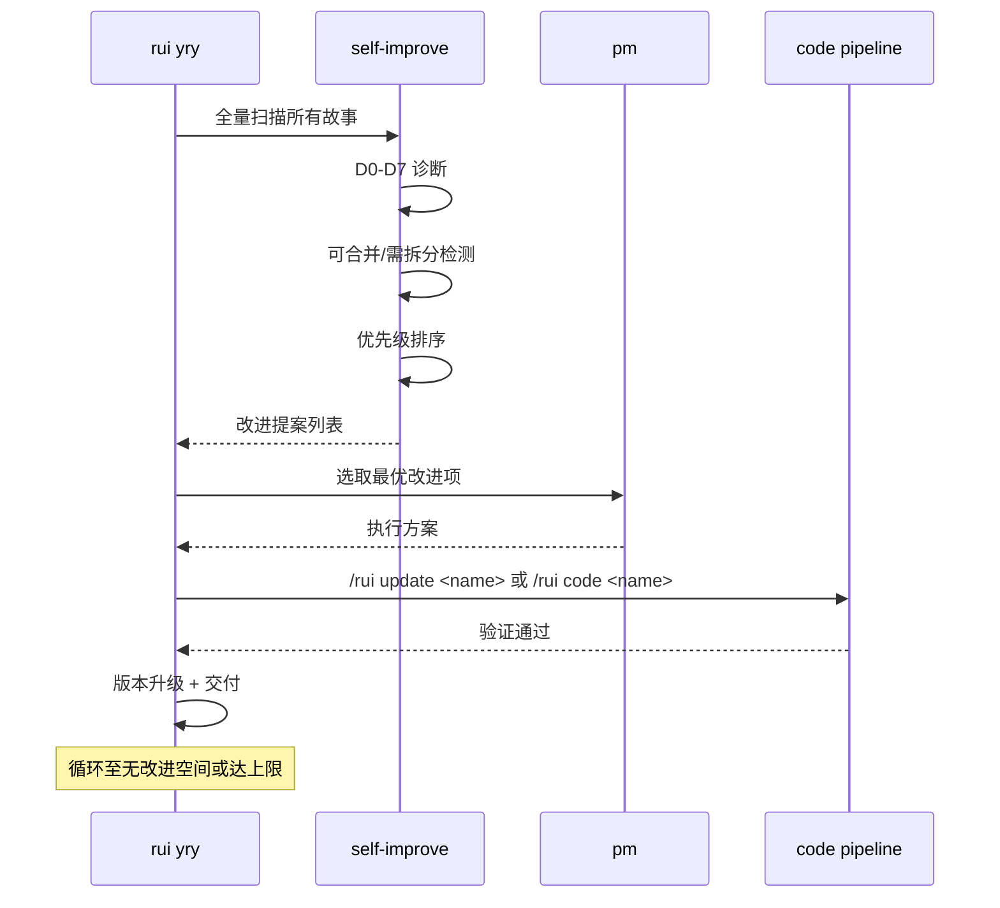
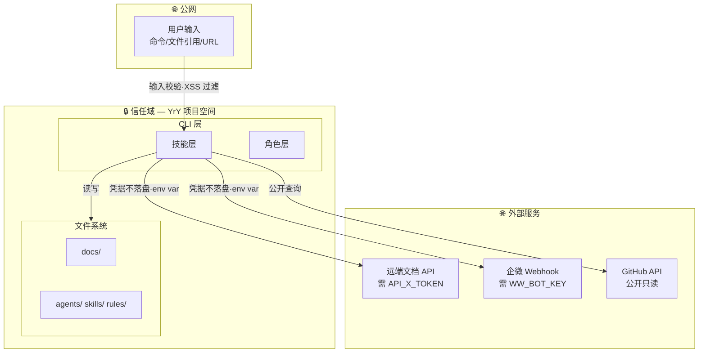

# 场景-1-module-architecture

> | v1.0.0 | 2026-05-30 | coder + tester | 🌿 main | 📎 [故事任务](./故事任务.md) |
> **导航**: [§0 技术评审](#s0-技术评审) · [§1 测试设计](#s1-测试设计)

---

## §0 技术评审

### 效果示意



### 模块地图

#### 技能层（6 技能）

| 技能 | 入口 | 核心依赖 | 下游消费者 |
|------|------|---------|-----------|
| rui | SKILL.md (skills/rui/SKILL.md) | pm, coder, tester, reporter, self-improve | 用户命令 /rui |
| rui-story | rui-story.mjs, status.mjs | rui-import (sync API) | 用户命令 /rui-story |
| rui-claude | SKILL.md | .claude/ 文件 | 用户命令 /rui-claude |
| rui-import | sync.mjs, help.mjs | 远端文档 API, API_X_TOKEN | rui (hook), rui-story |
| rui-bot | send.mjs | 企微 Webhook, WW_BOT_KEY | rui (hook) |
| rui-trends | SKILL.md | GitHub API, OSS Insight | 用户命令 /rui-trends |

#### 角色层（5 Agent）

| Agent | 契约文件 | 上游调用者 | 下游依赖 |
|-------|---------|-----------|---------|
| pm | agents/pm.md | rui (doc/code/yry) | coder, tester |
| coder | agents/coder.md | pm, rui (code) | tester |
| tester | agents/tester.md | pm, coder | reporter |
| reporter | agents/reporter.md | rui (交付阶段) | — |
| self-improve | agents/self-improve.md | rui (yry/自改进) | pm |

#### 规则层（5 Rule）

| 规则 | 文件 | 作用域 | 核心约束 |
|------|------|--------|---------|
| code-pipeline | rules/code-pipeline.md | `**/*.{js,ts,...}` | 分支隔离 · Gate A/B · P0 清零 |
| delivery-gate | rules/delivery-gate.md | `docs/故事任务面板/**/*.md` | 交付三步 hook |
| doc-generation | rules/doc-generation.md | `docs/**/*.md` | 表达优先 · 场景文档模型 |
| rui-claude | rules/rui-claude.md | `.claude/**` | .claude/ 配置管理 |
| self-improve | rules/self-improve.md | 全部 | D0-D7 诊断 · E1-E4 评估 |

### 四层拓扑模型



### 四条数据流

#### 1. 命令流（/rui → skill → agent）



#### 2. doc 流（文档生成 → 导入 → 通知）



#### 3. 交付流（三步 hook）



#### 4. 自改进流（yry 闭环）



### 信任边界



| 边界 | 防御措施 | 验证方式 |
|------|---------|---------|
| 用户输入 → 技能层 | 输入校验，XSS 过滤 | grep 输入处理点 |
| 技能层 → 远端 API | API_X_TOKEN 环境变量，不落盘 | grep API_X_TOKEN |
| 技能层 → 企微 | WW_BOT_KEY 环境变量，不落盘 | grep WW_BOT_KEY |
| 技能层 → 文件系统 | 分支隔离，feat/<name> 强制 | branch-check.mjs |

### ADR（架构决策记录）

| ADR# | 决策 | 背景 | 后果 |
|------|------|------|------|
| ADR-1 | 故事驱动 SDLC | 传统 issue/PR 流程缺乏结构化故事→文档→代码闭环 | 所有变更走 /rui 管线，学习成本换取可追溯性 |
| ADR-2 | 双图层知识图谱 | 纯文件目录难以表达跨故事关系 | stories-deps.json + knowledge-graph.json 支撑图遍历 |
| ADR-3 | Agent 分工（pm/coder/tester/reporter/si） | 单模型难以覆盖决策+实现+质量+记录全流程 | 五角色协作，各守门禁 |
| ADR-4 | 分支隔离强制 | 多人协作需要隔离变更 | feat/<name> 分支 + branch-check.mjs |
| ADR-5 | 表达优先（图→文→表） | 文本文档信息密度低，难以快速理解架构 | Mermaid 图优先，表结构化数据，文补充说明 |
| ADR-6 | 研究优先开发 | 模型容易基于假设而非事实做决策 | 任何分析前先 Read/Grep/Glob 建立事实基线 |

### 依赖矩阵

| ↓依赖 \ 被依赖→ | rui | rui-story | rui-claude | rui-import | rui-bot | rui-trends | pm | coder | tester | reporter | si |
|-----------------|-----|-----------|------------|------------|---------|------------|----|-------|--------|----------|----|
| rui | — | | | H | H | | I | I | I | I | I |
| rui-story | | — | | I | | | | | | | |
| rui-claude | | | — | | | | | | | | |
| rui-import | | | | — | | | | | | | |
| rui-bot | | | | | — | | | | | | |
| rui-trends | | | | | | — | | | | | |
| pm | I | | | | | | — | I | I | | |
| coder | | | | | | | | — | | | |
| tester | | | | | | | | | — | I | |
| reporter | | | | | | | | | | — | |
| si | | | | | | | I | | | | — |

> I = import/reference, H = hook invocation. 仅标注直接依赖。

### 新人上手路径

| 步骤 | 内容 | 预计时间 |
|------|------|---------|
| 1 | 读 [CLAUDE.md](../../../CLAUDE.md) 基础信念 + 铁律 | 5 min |
| 2 | 读 [README.md](../../../README.md) 系统全景 + 领域语言 | 10 min |
| 3 | 看本场景文档的四层拓扑模型 + 四条数据流 | 10 min |
| 4 | 读关键 Agent 契约（pm → coder → tester） | 15 min |
| 5 | 跑 `/rui` 看任务推荐输出 | 2 min |
| **总计** | | **~42 min** |

---

## §1 测试设计

### 测试策略

架构验证不涉及运行时测试，采用**静态分析**方式验证文档与源码的一致性。

| 测试类别 | 方法 | 工具 |
|---------|------|------|
| 模块存在性 | 逐文件路径验证 | `find` / `ls` |
| 依赖完整性 | import 链可解析 | `grep` + 手动验证 |
| 信任边界 | 密钥相关模式扫描 | `grep` |
| 文档覆盖 | 规约文件存在性 | `find` |

### AC

| AC# | Given | When | Then | 门禁 |
|-----|-------|------|------|------|
| AC1 | 架构文档声明 6 个 skill | 验证 `skills/*/SKILL.md` | 6 个目录均含 SKILL.md | Gate A |
| AC2 | 架构文档声明 5 个 agent | 验证 `agents/*.md` | 5 个 agent 文件均存在 | Gate A |
| AC3 | 架构文档声明 5 个 rule | 验证 `rules/*.md` | 5 个 rule 文件均存在 | Gate A |
| AC4 | 模块地图入口路径 | 逐路径 ls | 全部路径可解析 | Gate A |
| AC5 | 密钥不落盘 | grep -r "API_X_TOKEN\|WW_BOT_KEY" --include="*.{js,mjs,json,md}" | 仅环境变量读取点，无硬编码 | Gate A |
| AC6 | 信任边界图中边界数 | 计数安全边界 | ≥ 3 条边界 | Gate A |

### 测试用例

#### TC1: 模块清单完整性

```bash
# 验证 6 个 skill 目录均存在 SKILL.md
for d in rui rui-story rui-claude rui-import rui-bot rui-trends; do
  test -f "skills/$d/SKILL.md" && echo "✓ $d" || echo "✗ $d MISSING"
done

# 验证 5 个 agent 文件
for f in AGENT pm coder tester reporter self-improve; do
  test -f "agents/${f}.md" && echo "✓ agent/$f" || echo "✗ agent/$f MISSING"
done

# 验证 5 个 rule 文件
for f in code-pipeline delivery-gate doc-generation rui-claude self-improve; do
  test -f "rules/${f}.md" && echo "✓ rule/$f" || echo "✗ rule/$f MISSING"
done
```

#### TC2: 密钥安全扫描

```bash
# 确认无硬编码密钥
grep -rn "API_X_TOKEN\s*=" --include="*.{js,mjs,json}" . && echo "✗ HARDCODED TOKEN FOUND" || echo "✓ No hardcoded token"
grep -rn "WW_BOT_KEY\s*=" --include="*.{js,mjs,json}" . && echo "✗ HARDCODED BOT KEY FOUND" || echo "✓ No hardcoded bot key"
```

#### TC3: 依赖引用可解析

```bash
# 验证 SKILL.md 中引用的规则路径可解析
grep -roh 'rules/[a-z-]*\.md' skills/ agents/ | sort -u | while read p; do
  test -f "$p" && echo "✓ $p" || echo "✗ $p BROKEN"
done
```

#### TC4: 故事目录结构完整性

```bash
# 验证故事面板目录存在
test -d "docs/故事任务面板" && echo "✓ 故事面板目录存在" || echo "✗ 故事面板目录缺失"
test -d "docs/故事任务面板/yry-arch" && echo "✓ yry-arch 存在" || echo "✗ yry-arch 缺失"
test -d "docs/故事任务面板/yry-self-test" && echo "✓ yry-self-test 存在" || echo "✗ yry-self-test 缺失"
```

---

> **回溯链**：[故事任务](./故事任务.md) · [CLAUDE.md](../../../CLAUDE.md) · [AGENT.md](../../../agents/AGENT.md)

### 变更记录

| 日期 | 版本 | 变更内容 |
|------|------|---------|
| 2026-05-30 | 1.0.0 | init 初始化，架构基线场景文档 |
