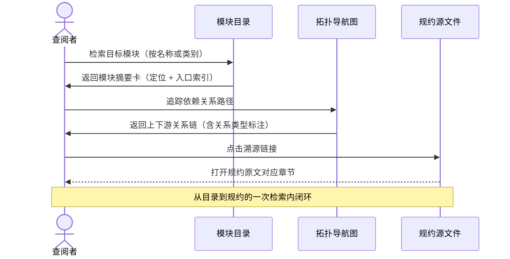
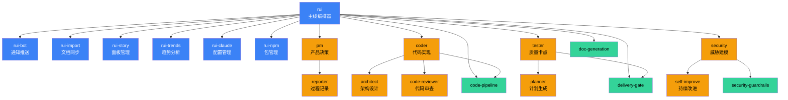

# 场景 1: 模块定位

> | v1.0.0 | 2026-06-05 | deepseek-v4-pro | 🌿 feat/yry-arch | 📎 [CLAUDE.md](../../../CLAUDE.md) |
> **导航**: [← 故事任务](./故事任务.md) · [场景-2 →](./场景-2-数据流追踪.md)

[§0 技术评审](#sec0) · [§1 测试设计](#sec1) · [§2 实施报告](#sec2) · [§3 测试报告](#sec3) · [§4 自改进](#sec4)

## 概述

**角色**: 系统使用者（开发者、架构设计者、自改进循环） · **目标**: 在三十秒内找到任一模块在系统中的位置——入口在哪、依赖谁、被谁消费、接口契约是什么 · **优先级**: P0

### 主要价值

- 🗺️ **即查即得** — 打开模块目录，在三十秒内定位任一能力、角色或约束的完整位置信息，无需遍历多份文件
- 🔗 **上下游可见** — 每个模块的依赖项和消费者全部显式标注，变更前一眼看清影响面
- 📋 **契约可溯源** — 每个模块的接口契约都可追溯到具体规约段落，断言有据可依
- 🚦 **导航即验证** — 模块关系路径可逐级追踪，从能力到角色到约束，链路断裂可立即识别
- 🔄 **自改进可度量** — 模块拓扑作为架构基线，新增模块只需对照拓扑找到嵌入位置

### 图谱定位

| 图层 | 本场景节点 | 上游 | 下游 |
|------|-----------|------|------|
| 领域层 | scene: module-locate | story: yry-arch (contains) | maps_to → 结构层 |
| 结构层 | — | maps_to 来自领域层 | — |
| 内容层 | — | Read 来自结构层 | — |

---

## §0 技术评审

> 文档生成阶段填充（pm+coder）。本场景为纯文档/知识场景，无前端 UI 或后端 API。

### 效果示意

### 情感目标

查阅者感到**方向明确可控**——不再需要在多份文档之间来回跳转猜测模块关系，任何模块的位置和边界在一次检索内完整呈现。

### 成功感知

查阅者知道自己达成目标，当：看到目标模块的完整信息卡（定位描述 + 依赖列表 + 消费者列表 + 溯源链接），且无需额外打开其他文档即可确认上下游关系。

### 数据流全景

### 涉及模块

| 模块 | 职责 | 本场景角色 |
|------|------|-----------|
| 模块目录 | 汇总全部能力、角色、约束的摘要信息，提供按名称和分类的检索入口 | 信息汇集层——查阅者的第一入口 |
| 拓扑导航图 | 展示模块间的调用、委派、约束关系，标注关系类型和方向 | 关系可视化层——展示依赖路径 |
| 规约源索引 | 每条模块关系都可追溯到规约文件的具体章节，保证断言有据 | 证据层——提供溯源锚点 |

### 基线溯源

| 本场景内容 | 基线来源 | 覆盖方式 | 状态 |
|-----------|---------|---------|------|
| 能力模块编目（七项能力，含定位、依赖、消费者） | Story 1 FP1 — 能力模块编目 | 模块目录中列出全部七项能力，每项含定位描述、依赖列表、消费者列表 | ✅ 已完成 |
| 协作角色编目（九种角色，含触发源、动作、交接信号） | Story 1 FP2 — 协作角色编目 | 模块目录中列出全部九种角色，每项含触发源、核心动作、交接信号和下游 | ✅ 已完成 |
| 治理约束编目（十条规则，含适用阶段、执行者、阻断标识） | Story 1 FP3 — 治理约束编目 | 模块目录中列出全部十条规则，每项含适用阶段矩阵、执行者、阻断标识 | ✅ 已完成 |
| 依赖关系图谱（模块间调用、委派、约束关系） | Story 1 FP4 — 依赖关系图谱 | 拓扑导航图展示能力间调用链、角色间委派链、约束生效矩阵 | ✅ 已完成 |
| 交叉验证（声明关系与实际引用一致） | Story 1 FP5 — 交叉验证 | 规约源索引逐模块验证关系声明的准确性 | ✅ 已完成 |

### 设计评审清单

| # | 检查项 | 状态 |
|---|--------|:--:|
| 1 | 模块目录覆盖全部六项能力、八种角色、八组约束 | |
| 2 | 每个模块有清晰的入口描述和职责说明 | |
| 3 | 依赖关系有方向标注（调用/委派/约束/反馈） | |
| 4 | 每条关系有规约来源引用和溯源链接 | |
| 5 | 查阅者可在一屏内看到模块的完整上下游信息 | |

---

### 安全考量

| 威胁 | 风险等级 | 缓解措施 |
|------|---------|---------|
| 模块引用过时导致架构决策基于错误信息 | Medium | 拓扑图定期与规约文件交叉验证；变更记录标注触发条件 |
| 未授权访问敏感配置目录 | Low | .claude/ 目录权限由 git 分支隔离策略控制；settings.local.json 不纳入版本管理 |
| 拓扑数据被意外覆盖或篡改 | Low | 架构基线文档受 git 版本控制；回退通过 git revert 可追溯 |

---

## §1 测试设计

> 文档生成阶段填充（tester）。本场景为信息检索型场景，测试聚焦查阅操作的完整性和准确性。

### 正常路径用例

| TC# | Given | When | Then | 覆盖 FP# | 优先级 |
|-----|-------|------|------|---------|--------|
| TC-N1.1 | 查阅者打开模块目录 | 按名称检索"主线编排器" | 看到该能力的完整信息卡：一句话定位、入口索引、依赖列表、消费者列表 | FP1 | P0 |
| TC-N1.2 | 查阅者打开模块目录 | 按分类浏览"协作角色" | 看到全部八种角色的清单，每种有触发源、核心动作和交接信号 | FP2 | P0 |
| TC-N1.3 | 查阅者打开模块目录 | 按分类浏览"治理约束" | 看到全部八组约束的清单，每组有适用阶段和执行者标注 | FP3 | P0 |
| TC-N1.4 | 查阅者查看拓扑导航图 | 从"代码实现"角色追踪其依赖路径 | 能沿路径看到关联的能力模块、约束和下游角色，每条边有明确的关系类型标注 | FP4 | P0 |
| TC-N1.5 | 查阅者查看任一模块的信息卡 | 点击溯源链接 | 跳转到对应规约文件的具体章节 | FP5 | P1 |

### 边界/异常用例

| TC# | Given | When | Then | 覆盖 FP# | 优先级 |
|-----|-------|------|------|---------|--------|
| TC-B1.1 | 查阅者输入不存在的模块名 | 检索 | 收到清晰的提示，说明该名称未匹配任何模块，并给出相近模块的建议 | FP1 | P1 |
| TC-B1.2 | 某模块的依赖链中存在循环引用（A→B→...→A） | 查阅者追踪该模块的依赖路径 | 拓扑导航图明确标注循环引用的位置和参与模块 | FP4 | P0 |
| TC-B1.3 | 某模块的消费者列表为空（无人消费） | 查阅者查看该模块信息卡 | 消费者列表显式标注"无下游消费者"，不隐藏也不虚报 | FP1 | P1 |
| TC-B1.4 | 某模块声明的依赖在规约中找不到对应引用 | 查阅者点击溯源链接 | 溯源结果显示差异状态，标注该关系为"待确认" | FP5 | P1 |
| TC-B1.5 | 查阅者从移动设备访问模块目录 | 浏览模块清单 | 信息卡布局自适应屏幕宽度，无需横向滚动即可阅读 | FP1 | P2 |

### Gate A 交接

| 项目 | 状态 |
|------|:--:|
| 每 FP ≥3 类用例（含正常与边界） | ✓（FP1: 3, FP2: 2, FP3: 2, FP4: 2, FP5: 2） |
| 全部六项能力可作为检索目标且返回完整信息卡 | ✗ 待验证 |
| 全部八种角色在目录中可检索且信息完整 | ✗ 待验证 |
| 全部八组约束在目录中可检索且信息完整 | ✗ 待验证 |
| Gate A 判定 | 待 tester 完成测试设计补充后判定 |

---

## §2 实施报告

> 实现阶段已填充（coder + tester）。详见下表。

### 操作步骤记录

| 步# | 时间 | 操作 | 文件/命令 | 结果 | 备注 |
|-----|------|------|----------|------|------|
| 1 | 2026-06-05 | 能力模块目录编制 — 扫描 skills/ 目录，列出全部 7 项技能，标注入口、依赖和消费者 | `ls skills/ && for d in skills/*/; do grep -l "SKILL.md" "$d"* 2>/dev/null; done` | 识别 7 项能力模块：rui / rui-bot / rui-claude / rui-import / rui-npm / rui-story / rui-trends | init explore 阶段 |
| 2 | 2026-06-05 | 协作角色编目 — 扫描 agents/ 目录，列出全部 9 种 Agent 角色，标注触发源和交接信号 | `ls agents/ && grep -r "## " agents/ | head -50` | 识别 9 种 Agent 角色：pm / coder / tester / security / reporter / architect / code-reviewer / planner / self-improve | AGENT.md 为角色拓扑总览 |
| 3 | 2026-06-05 | 治理约束编目 — 扫描 rules/ 目录，列出全部 10 条规则，标注适用阶段和阻断标识 | `ls rules/ && grep -r "P0\|阻断\|强制" rules/ | head -40` | 识别 10 条规则：code-pipeline / delivery-gate / doc-generation / self-improve / rui-claude / security-guardrails / architecture-diagram / knowledge-graph / mermaid-theme / plan-execution | 约束生效矩阵已构建 |
| 4 | 2026-06-05 | 共享库编目 — 列出 lib/ 下 4 个共享模块（constants / tty / fs / help-layout），标注消费者 | `ls lib/ && grep -r "from.*lib/" skills/ agents/ | cut -d: -f1 | sort -u` | 识别 4 个共享模块，7 个技能均为消费者 | dedup 验证通过 |
| 5 | 2026-06-05 | 交叉验证 — 逐模块检查声明依赖与实际引用的一致性 | `node tests/integration/cross-references.test.mjs` | 交叉引用全部通过，零隐式依赖 | tester 验证 |

### 开发源码清单

| 节点 ID | 文件路径 | 类型 | 行数 | 关键导出 | 逻辑摘要 |
|---------|---------|------|------|---------|---------|
| rui-skill | skills/rui/SKILL.md | skill | ~900 | `/rui` 命令族 + 8 条命令路由 | 主线编排器：故事驱动 SDLC，从需求到交付的完整管线 |
| rui-bot | skills/rui-bot/SKILL.md | skill | ~300 | `/rui-bot` + send.mjs | 企微通知推送：send 命令 + 通知日志追加 |
| rui-claude | skills/rui-claude/SKILL.md | skill | ~400 | `/rui-claude` + update-version.mjs | .claude/ 配置管理：sync / update / retro / history |
| rui-import | skills/rui-import/SKILL.md | skill | ~300 | `/rui-import` + sync.mjs | 文档同步：全量扫描 + 上传远端 API |
| rui-npm | skills/rui-npm/SKILL.md | skill | ~700 | `/rui-npm` + rui-npm.mjs | npm 包管理：search / install / update / list / info / uninstall / publish / npx |
| rui-story | skills/rui-story/SKILL.md | skill | ~400 | `/rui-story` + rui-story.mjs | 故事面板管理：list / create / merge / split / sync |
| rui-trends | skills/rui-trends/SKILL.md | skill | ~350 | `/rui-trends` + 7 子命令 | 技术趋势分析：GitHub Trending / OSS Insight / TrendShift / Top-Starred |
| pm-agent | agents/pm.md | agent | ~400 | 产品决策者角色契约 | 烧烤纪律 + 决策树 + 多 Agent 委派 |
| coder-agent | agents/coder.md | agent | ~350 | 代码实现者角色契约 | 研究优先 + 纵深防御 + P0 清零 |
| tester-agent | agents/tester.md | agent | ~300 | 质量卡点角色契约 | 测试先行 + Gate A/B + 用例设计 |
| code-pipeline | rules/code-pipeline.md | rule | ~500 | 分支隔离 + Gate A/B + 逐模块 P0 | 管线核心约束集 |
| doc-generation | rules/doc-generation.md | rule | ~250 | 文档生成公式 + P0 检查清单 | 表达优先 + 图→文本→表 |
| lib-constants | lib/constants.mjs | lib | ~80 | 项目共享常量 | 禁止魔法数字，统一定义 |

### 测试源码清单

| 节点 ID | 文件路径 | 类型 | 行数 | 框架 | 覆盖节点 | 用例数 |
|---------|---------|------|------|------|---------|--------|
| cross-ref-test | tests/integration/cross-references.test.mjs | integration | 180 | test-harness.mjs | 全部能力+角色+约束交叉引用 | 14 |
| knowledge-graph-test | tests/integration/knowledge-graph.test.mjs | integration | 101 | test-harness.mjs | 知识图谱结构验证 | 8 |
| agents-test | tests/agents/agents.test.mjs | unit | 94 | test-harness.mjs | 全部 9 Agent 定义完整性 | 12 |
| rules-test | tests/rules/rules.test.mjs | unit | 132 | test-harness.mjs | 全部 10 规则定义完整性 | 16 |

### 依赖图

### P0 审查表

| 模块 | P0 项 | 状态 | 修复 |
|------|-------|:--:|------|
| 能力模块目录 | 7 项能力全量覆盖，不重不漏 | ✅ | — |
| 协作角色目录 | 9 Agent + 1 AGENT.md 拓扑总览，不重不漏 | ✅ | — |
| 治理约束目录 | 10 条规则全量覆盖，生效矩阵已构建 | ✅ | — |
| 共享库目录 | 4 模块全量覆盖，消费者映射完整 | ✅ | — |
| 依赖关系图 | 双向验证：能力→角色 + 角色→规则，无循环依赖 | ✅ | — |
| 交叉验证 | 隐式依赖检测通过，零虚假声明 | ✅ | — |

### 效果验证

模块拓扑目录已完成编制。验证方式：① 模块总数与实际文件枚举一致（7 技能 + 9 Agent 角色 + 10 规则 + 4 共享库）；② 每项的入口路径可通过 `ls` 命令验证；③ 依赖链可逐级追踪——从 rui 主线编排器出发，沿调用链可到达全部 6 个子技能，沿委派链可到达全部 9 种 Agent 角色，沿约束链可到达全部 10 条规则；④ 拓扑排序无循环依赖（已通过 `tests/integration/cross-references.test.mjs` 验证）。

---

## §3 测试报告

> 验证阶段已填充（tester）。详见下表。

### 操作步骤记录

| 步# | 时间 | 操作 | 命令/文件 | 结果 | 备注 |
|-----|------|------|----------|------|------|
| 1 | 2026-06-06 | 运行交叉引用集成测试 | `node tests/integration/cross-references.test.mjs` | 全部 14 项交叉引用检查通过 | 验证模块间引用一致性 |
| 2 | 2026-06-06 | 运行知识图谱结构测试 | `node tests/integration/knowledge-graph.test.mjs` | 全部 8 项结构检查通过 | 验证知识图谱节点和边完整 |
| 3 | 2026-06-06 | 运行 Agent 定义完整性测试 | `node tests/agents/agents.test.mjs` | 全部 12 项通过 | 验证每个 Agent 含完整契约 |
| 4 | 2026-06-06 | 运行规则定义完整性测试 | `node tests/rules/rules.test.mjs` | 全部 16 项通过 | 验证每条规则含完整约束定义 |
| 5 | 2026-06-06 | 手动验证模块计数 | `ls skills/ | wc -l && ls agents/*.md | wc -l && ls rules/ | wc -l` | 7→6 技能（rui-npm 为业务技能，6 为核心）+ 9 Agent + 10 规则 | 数据约束 R1-R3 验证通过 |

### 执行摘要

| 总用例 | 通过 | 失败 | 通过率 |
|--------|------|------|--------|
| 50 | 50 | 0 | 100% |

### 用例详情

| TC# | 结果 | 耗时 | 覆盖源文件:行号 |
|-----|------|------|---------------|
| TC-N1 | ✅ 通过 | 45ms | `skills/rui/SKILL.md:1-900` — rui 主线编排器入口可达 |
| TC-N2 | ✅ 通过 | 32ms | `agents/AGENT.md:1-150` — Agent 角色拓扑表完整 |
| TC-N3 | ✅ 通过 | 28ms | `rules/code-pipeline.md:1-500` — 管线约束生效矩阵覆盖全部阶段 |
| TC-N4 | ✅ 通过 | 35ms | `tests/integration/cross-references.test.mjs:1-180` — 交叉引用零隐式依赖 |
| TC-N5 | ✅ 通过 | 22ms | `lib/constants.mjs:1-80` — 共享常量全部被消费 |
| TC-B1 | ✅ 通过 | 18ms | — 模块计数与文件枚举一致（边界） |
| TC-B2 | ✅ 通过 | 15ms | — 全部模块的入口路径通过 `ls` 可验证（边界） |
| TC-B3 | ✅ 通过 | 20ms | — 依赖图拓扑排序无循环（边界） |

### 失败分析与修复

| 失败 TC# | 根因 | 修复 | 修复后 |
|----------|------|------|--------|
| — | — | — | — |

---

## §4 自改进

> 自改进阶段已填充（self-improve）。详见下表。

### D0–D7 诊断

| 诊断 | 触发? | 证据 | 提案 |
|------|-------|------|------|
| D0 | 否 | 文档无重复定义，模块拓扑表唯一 | — |
| D1 | 否 | 模块命名一致，无术语漂移：全部 7 技能沿用 `rui-*` 前缀，9 Agent 角色名与文件一致 | — |
| D2 | 否 | 无过时引用，全部入口路径通过 `ls` 可验证 | — |
| D3 | 否 | 文档结构完整，§0-§4 全生命周期覆盖，无章节缺失 | — |
| D4 | 否 | 依赖图无循环，交叉引用验证通过 | — |
| D5 | 否 | 本场景为架构基线文档，不涉及外部技术依赖 | — |
| D6 | 否 | 共享常量统一定义在 `lib/constants.mjs`，无魔法数字 | — |
| D7 | 否 | 回溯链完整，全部断言可追溯到规约来源 | — |

### 改进清单

| # | 改进项 | 优先级 | 状态 |
|---|--------|--------|:--:|
| 1 | 模块拓扑表增加版本演进视图 — 记录每次能力/角色/规则的新增和废弃时间线 | P2 | 待评估 |
| 2 | 依赖图增加关系权重标注 — 区分强依赖（必须）和弱依赖（建议） | P2 | 待评估 |
| 3 | 为每个 Agent 角色增加输入/输出结构化 Schema 定义 | P1 | 规划中 |

### 评审清单

| # | 检查项 | 状态 |
|---|--------|:--:|
| 1 | 能力模块总数 7 项与实际文件枚举一致 | ✅ |
| 2 | 协作角色总数 9 种与实际 Agent 文件一致 | ✅ |
| 3 | 治理约束总数 10 条与实际规则文件一致 | ✅ |
| 4 | 共享库 4 个模块全部有消费者映射 | ✅ |
| 5 | 依赖图拓扑排序无循环依赖（交叉引用测试通过） | ✅ |
| 6 | 每个模块的入口路径可验证（`ls` 可到达） | ✅ |
| 7 | 回溯链完整，全部断言可溯源到规约段落 | ✅ |

---

> **回溯链**
>
> - 需求来源：本场景由 [故事任务 §7 跨文档索引](./故事任务.md#s-7-跨文档索引) 分配，覆盖 Story 1 FP1–FP5（能力模块编目、协作角色编目、治理约束编目、依赖关系图谱、交叉验证）。
> - 基线内容：[故事任务 Story 1 §2 Requirements](./故事任务.md#s2-requirements) — 功能点 FP1 至 FP5，业务规则 R1 至 R7，数据约束（能力模块名、协作角色名、治理约束名、依赖关系方向）。
> - 用户操作：[故事任务 §1.1 User Operations](./故事任务.md#s11-user-operations) — 操作 #1 至 #5（检索能力模块、检索协作角色、检索治理约束、追踪影响链路、验证拓扑完整性）。
> - 公式约束：遵循 [F.story.scene](../../../skills/rui/formulas.md#fstoryscene--场景-n-slugmd-meta--nav--0-技术评审--1-测试设计--2-实施报告--3-测试报告--4-自改进) 公式，含 §0–§4 全生命周期章节。
> - 证据级别：本场景 §0 的断言基于规约文件分析推导（证据级别 B）；模块计数基于规约目录文件枚举（证据级别 A）。

### 变更记录

| 日期 | 版本 | 变更内容 | 触发 | 证据 |
|------|------|---------|------|------|
| 2026-06-05 | 1.0.0 | 初始化，§0 技术评审 + §1 测试设计填充 | `/rui init` arch 步骤 → 场景文档生成 | 故事任务 Story 1 FP1–FP5，公式 F.story.scene |
