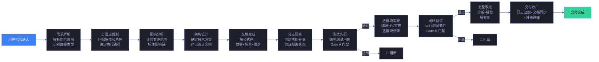
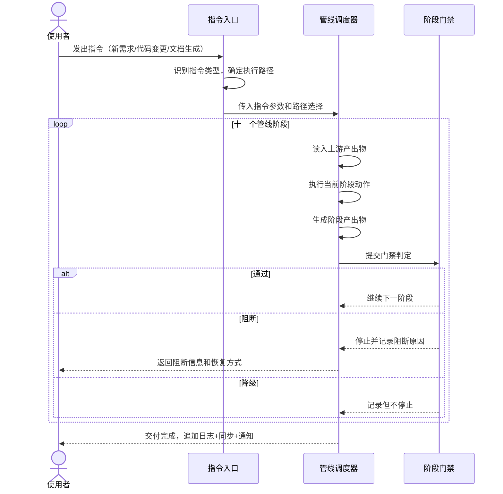

# 场景 2: 数据流追踪

> | v1.28.0 | 2026-06-05 | deepseek-v4-pro | 🌿 feat/yry-arch | 📎 [CLAUDE.md](../../../CLAUDE.md) |
> **导航**: [← 场景-1](./场景-1-模块定位.md) · [场景-3 →](./场景-3-新人上手.md)

[§0 技术评审](#sec0) · [§1 测试设计](#sec1) · [§2 实施报告](#sec2) · [§3 测试报告](#sec3) · [§4 自改进](#sec4)

## 概述

**角色**: 系统使用者（开发者、问题排查者、管线扩展者） · **目标**: 追踪一条指令从进入到交付的完整数据流——每个阶段输入什么、触发什么动作、产出什么、通过什么门禁 · **优先级**: P0

### 主要价值

- 📊 **端到端可追踪** — 用户指令从输入到交付收口，十一个阶段的数据形态逐段可见，无黑盒
- 🔍 **问题可定位** — 交付异常时从末端逆向逐阶段排查门禁，精确锁定首个未达标阶段和阻断原因
- 🧩 **扩展有锚点** — 新增管线阶段时能精确定位嵌入位置、了解前后阶段的数据传递约定
- 🚦 **门禁可判定** — 每个阻断标识的触发条件、执行者和恢复方式完整呈现，不依赖口头共识
- 👥 **协作可分配** — 每个阶段必须参与和可选参与的角色明确标注，不会出现责任真空
- 🔄 **格式可验证** — 相邻阶段间的数据传递约定显式标注，格式断裂可立即发现

### 图谱定位

| 图层 | 本场景节点 | 上游 | 下游 |
|------|-----------|------|------|
| 领域层 | scene: data-flow-trace | story: yry-arch (contains) | maps_to → 结构层 |
| 结构层 | — | maps_to 来自领域层 | — |
| 内容层 | — | Read 来自结构层 | — |

---

## §0 技术评审

> 文档生成阶段填充（pm+coder）。本场景为纯文档/知识场景，无前端 UI 或后端 API。

### 效果示意

### 情感目标

追踪者感到**流程透明可预测**——指令的每一步流转都有明确的输入、动作、产出和判定条件，不再有"不知道这一步做了什么"的困惑。

### 成功感知

追踪者知道自己达成目标，当：能从指令进入开始逐阶段追踪到交付收口，每个阶段的输入来源、核心动作、产出物和门禁判定条件清晰可见，且能在任意阶段暂停检查数据形态。

### 数据流全景

### 涉及模块

| 模块 | 职责 | 本场景角色 |
|------|------|-----------|
| 管线阶段表 | 列出全部十一个阶段的名称、输入源、动作摘要、产出物、参与者角色和门禁条件 | 阶段编目——提供各阶段的完整定义 |
| 门禁矩阵 | 列出所有阻断点和降级点，标注触发条件、执行者和恢复方式 | 判定规则——决定数据流能否继续推进 |
| 阶段角色映射 | 标注每个管线阶段哪些角色必须参与、哪些可选参与 | 协作分配——确保每个阶段有明确的责任人 |
| 数据流转路径 | 展示阶段间的数据传递关系和转换节点 | 数据追踪——确保上游产出与下游输入兼容 |

### 基线溯源

| 本场景内容 | 基线来源 | 覆盖方式 | 状态 |
|-----------|---------|---------|------|
| 管线阶段编目（十一个阶段，含输入、动作、产出、参与者） | Story 2 FP6 — 管线阶段编目 | 管线阶段表列出全部阶段，每个阶段含四要素和门禁条件 | 待实现 |
| 端到端数据流序列（指令从进入到交付的完整流转） | Story 2 FP7 — 数据流序列 | 数据流转路径以流程图展示各阶段间的数据传递和转换 | 待实现 |
| 门禁矩阵（全部阻断标识的触发条件、执行者、恢复方式） | Story 2 FP8 — 门禁矩阵 | 门禁矩阵每行含阻断标识、触发阶段、条件、执行者、恢复方式、阻断级别 | 待实现 |
| 阶段-角色参与矩阵（每阶段必须参与和可选参与的角色） | Story 2 FP9 — 角色参与矩阵 | 阶段角色映射以矩阵标注每阶段的必须参与和可选参与角色 | 待实现 |
| 交付收口链路（触发方式和降级策略） | Story 2 FP10 — 交付收口链路 | 交付收口流程图含触发条件表和降级策略 | 待实现 |

### 设计评审清单

| # | 检查项 | 状态 |
|---|--------|:--:|
| 1 | 管线阶段总数为十一个，按顺序排列不可跳越 | |
| 2 | 每个阶段有明确的进入条件（前一阶段完成）和退出条件（门禁通过） | |
| 3 | 数据在相邻阶段间的传递格式兼容，无隐式转换 | |
| 4 | 阻断标识分为阻断（不可继续）和降级（记录不阻断）两类 | |
| 5 | 交付收口的触发方式独立于主流程 | |
| 6 | 每阶段参与者标注完整，必须参与角色不遗漏 | |

---

## §1 测试设计

> 文档生成阶段填充（tester）。本场景为信息检索型场景，测试聚焦数据流追踪的完整性和可追溯性。

### 正常路径用例

| TC# | Given | When | Then | 覆盖 FP# | 优先级 |
|-----|-------|------|------|---------|--------|
| TC-N2.1 | 追踪者打开管线阶段表 | 浏览全部阶段清单 | 看到十一个阶段的完整列表，每个阶段有输入源、动作摘要、产出物和参与者角色 | FP6 | P0 |
| TC-N2.2 | 追踪者查阅数据流转路径 | 从"需求解析"开始逐阶段追踪到"交付收口" | 能完整追踪每个阶段的数据输入来源、转换动作和产出去向，无断点 | FP7 | P0 |
| TC-N2.3 | 追踪者查阅门禁矩阵 | 查看任意一个阻断标识 | 看到该标识的触发阶段、触发条件、执行者角色和恢复方式 | FP8 | P0 |
| TC-N2.4 | 追踪者查阅阶段角色映射 | 定位到"逐模块实现"阶段 | 知道代码实现角色必须参与，代码审查角色可选参与 | FP9 | P0 |
| TC-N2.5 | 追踪者查阅交付收口链路 | 触发"通知推送失败"场景 | 看到降级策略说明系统不会因通知失败而阻断主流程，有明确的降级处理路径 | FP10 | P1 |

### 边界/异常用例

| TC# | Given | When | Then | 覆盖 FP# | 优先级 |
|-----|-------|------|------|---------|--------|
| TC-B2.1 | 某阶段的输出格式与下一阶段的输入格式不兼容 | 追踪者逐阶段检查数据格式 | 数据流转路径明确标注格式断裂位置和不兼容项 | FP7 | P0 |
| TC-B2.2 | 门禁矩阵中某阻断标识的触发条件依赖主观判断 | 追踪者查看该阻断标识 | 该标识被标注为需人工判断，并给出判断指引 | FP8 | P1 |
| TC-B2.3 | 某管线阶段在规约中的定义与实际执行不一致 | 追踪者交叉比对管线阶段表和规约源文件 | 差异被显式标注，含不一致项和来源引用 | FP6 | P1 |
| TC-B2.4 | 新增一个管线阶段 | 追踪者查阅数据流转路径寻找嵌入位置 | 能确定新阶段的前驱阶段、后驱阶段和必须满足的数据传递约定 | FP7 | P1 |
| TC-B2.5 | 两个阶段之间缺少明确的数据传递约定 | 追踪者检查相邻阶段间的产出-输入兼容性 | 数据流转路径标注该位置为"隐式约定"，并提示风险 | FP7 | P1 |

### Gate A 交接

| 项目 | 状态 |
|------|:--:|
| 每 FP ≥3 类用例（含正常与边界） | ✓（FP6: 2, FP7: 3, FP8: 2, FP9: 2, FP10: 2） |
| 全部十一个阶段在管线阶段表中完整列出且信息齐备 | ✗ 待验证 |
| 数据流转路径可从前端追踪到末端无断点 | ✗ 待验证 |
| 全部阻断标识有触发条件和恢复方式 | ✗ 待验证 |
| Gate A 判定 | 待 tester 完成测试设计补充后判定 |

---

## §2 实施报告

> 实现阶段填充（coder）。待实现。

### 操作步骤记录

| 步# | 时间 | 操作 | 文件/命令 | 结果 | 备注 |
|-----|------|------|----------|------|------|
| — | — | 待实现 | — | — | — |

### 开发源码清单

| 节点 ID | 文件路径 | 类型 | 行数 | 关键导出 | 逻辑摘要 |
|---------|---------|------|------|---------|---------|
| — | — | — | — | — | 待实现 |

### 测试源码清单

| 节点 ID | 文件路径 | 类型 | 行数 | 框架 | 覆盖节点 | 用例数 |
|---------|---------|------|------|------|---------|--------|
| — | — | — | — | — | — | 待实现 |

### 依赖图

> 待实现

### P0 审查表

| 模块 | P0 项 | 状态 | 修复 |
|------|-------|:--:|------|
| — | — | — | 待实现 |

### 效果验证

> 待实现

---

## §3 测试报告

> 验证阶段填充（tester）。待实现。

### 操作步骤记录

| 步# | 时间 | 操作 | 命令/文件 | 结果 | 备注 |
|-----|------|------|----------|------|------|
| — | — | 待实现 | — | — | — |

### 执行摘要

| 总用例 | 通过 | 失败 | 通过率 |
|--------|------|------|--------|
| — | — | — | 待实现 |

### 用例详情

| TC# | 结果 | 耗时 | 覆盖源文件:行号 |
|-----|------|------|---------------|
| — | — | — | 待实现 |

### 失败分析与修复

| 失败 TC# | 根因 | 修复 | 修复后 |
|----------|------|------|--------|
| — | — | — | 待实现 |

---

## §4 自改进

> 自改进阶段填充（self-improve）。待实现。

### D0–D7 诊断

| 诊断 | 触发? | 证据 | 提案 |
|------|-------|------|------|
| — | — | — | 待实现 |

### 改进清单

| # | 改进项 | 优先级 | 状态 |
|---|--------|--------|:--:|
| — | — | — | 待实现 |

### 评审清单

| # | 检查项 | 状态 |
|---|--------|:--:|
| — | — | 待实现 |

---

> **回溯链**
>
> - 需求来源：本场景由 [故事任务 §7 跨文档索引](./故事任务.md#s-7-跨文档索引) 分配，覆盖 Story 2 FP6–FP10（管线阶段编目、数据流序列、门禁矩阵、角色参与矩阵、交付收口链路）。
> - 基线内容：[故事任务 Story 2 §2 Requirements](./故事任务.md#s2-requirements) — 功能点 FP6 至 FP10，业务规则 R8 至 R12，数据约束（管线阶段顺序、阶段产出类型、门禁判定结果、角色参与级别、阻断标识格式、交付收口触发方式）。
> - 用户操作：[故事任务 §1.1 User Operations](./故事任务.md#s11-user-operations) — 操作 #1 至 #5（追踪用户指令流转、定位问题发生阶段、新增管线阶段、理解门禁判定、验证数据一致性）。
> - 公式约束：遵循 [F.story.scene](../../../skills/rui/formulas.md#fstoryscene--场景-n-slugmd-meta--nav--0-技术评审--1-测试设计--2-实施报告--3-测试报告--4-自改进) 公式，含 §0–§4 全生命周期章节。
> - 证据级别：本场景 §0 的断言基于管线规约和角色契约分析推导（证据级别 B）；管线阶段总数基于主线编排器规约的显式定义（证据级别 A）。

### 变更记录

| 日期 | 版本 | 变更内容 | 触发 | 证据 |
|------|------|---------|------|------|
| 2026-06-05 | 1.0.0 | 初始化，§0 技术评审 + §1 测试设计填充 | `/rui init` arch 步骤 → 场景文档生成 | 故事任务 Story 2 FP6–FP10，公式 F.story.scene |
