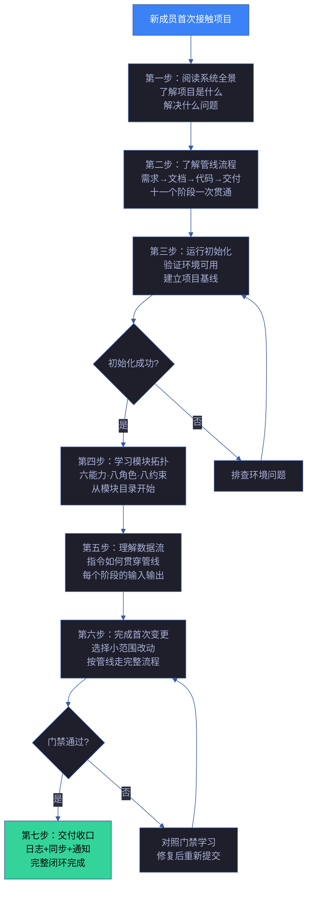
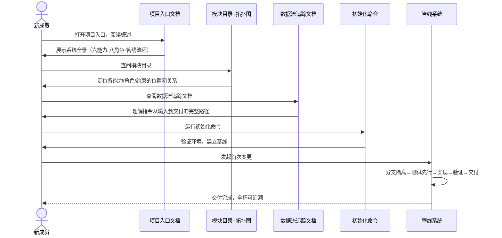

# 场景 3: 新人上手

> | v1.29.0 | 2026-06-05 | deepseek-v4-pro | 🌿 feat/yry-arch | 📎 [CLAUDE.md](../../../CLAUDE.md) |
> **导航**: [← 场景-2](./场景-2-数据流追踪.md) · [场景-4 →](./场景-4-依赖变更影响.md)

[§0 技术评审](#sec0) · [§1 测试设计](#sec1) · [§2 实施报告](#sec2) · [§3 测试报告](#sec3) · [§4 自改进](#sec4)

## 概述

**角色**: 新贡献者（开发者、维护者、自改进参与者） · **目标**: 从零了解系统架构——理解项目结构、运行初始化、了解管线流程、完成首次变更 · **优先级**: P0

### 主要价值

- 🧭 **三十分钟可定位** — 新成员从打开项目到能独立回答"这个模块在哪"只需三十分钟，不需要老成员逐个讲解
- 🗺️ **全景先于细节** — 先看到系统全景图，再按模块拓扑逐层深入，避免一上来就陷入单份规约的细节
- 🏃 **动手即学习** — 初始化命令成功运行即宣告上手第一步完成，学习路径有可验证的里程碑
- 🔗 **关系可导航** — 模块间的调用、委派、约束关系全部显式标注，新成员不必靠猜测或问人
- 📋 **首次变更有模板** — 从了解需求到完成变更再到通过门禁，完整路径已铺设，减少选择负担
- 🔄 **概念对齐快** — 领域语言统一定义，避免同一概念不同人在不同文件中用不同名称

### 图谱定位

| 图层 | 本场景节点 | 上游 | 下游 |
|------|-----------|------|------|
| 领域层 | scene: onboarding | story: yry-arch (contains) | maps_to → 结构层 |
| 结构层 | — | maps_to 来自领域层 | — |
| 内容层 | — | Read 来自结构层 | — |

---

## §0 技术评审

> 文档生成阶段填充（pm+coder）。本场景为纯文档/知识场景，无前端 UI 或后端 API。

### 效果示意

### 情感目标

新成员感到**被引导而非被抛入**——每一步都有明确的入口和预期结果，不会出现"接下来该看什么"的迷茫。系统架构的复杂度被分层呈现，从全景到细节，从概念到操作。

### 成功感知

新成员知道自己达成目标，当：能独立完成一次从需求到交付的完整变更流程（含门禁通过），且能回答三个问题——某个模块在哪、它的上下游是谁、变更它会影响到谁。

### 数据流全景

### 涉及模块

| 模块 | 职责 | 本场景角色 |
|------|------|-----------|
| 项目入口 | 提供系统全景概述、快速开始命令、领域语言定义 | 第一接触点——建立心智模型 |
| 模块目录 | 列出全部能力、角色、约束及其依赖关系 | 结构认知——理解"谁是谁" |
| 数据流追踪 | 展示指令从进入到交付的完整生命周期 | 流程认知——理解"怎么运转" |
| 初始化工具 | 建立项目基线、生成配置文件、创建故事面板目录 | 动手验证——从阅读到操作的桥梁 |
| 管线系统 | 编排需求→文档→代码→交付的全流程，执行门禁判定 | 实践载体——完成首次变更的完整路径 |

### 基线溯源

| 本场景内容 | 基线来源 | 覆盖方式 | 状态 |
|-----------|---------|---------|------|
| 项目全景认知（六项能力的作用和关系） | Story 1 FP1 — 能力模块编目 | 新人上手路径第二步引用能力目录，展示各能力的定位和依赖 | 待实现 |
| 协作角色理解（八种角色的职责和交接） | Story 1 FP2 — 协作角色编目 | 新人上手路径第四步引用角色目录，展示各角色的触发源和交接信号 | 待实现 |
| 治理约束理解（八组约束的适用范围） | Story 1 FP3 — 治理约束编目 | 新人上手路径第五步引用约束目录，展示约束生效的阶段和执行者 | 待实现 |
| 模块关系导航（调用链和委派链） | Story 1 FP4 — 依赖关系图谱 | 新人上手路径第四步引用拓扑导航图，展示模块间的完整关系 | 待实现 |
| 管线阶段认知（十一个阶段的输入输出） | Story 2 FP6 — 管线阶段编目 | 新人上手路径第三步引用管线阶段表，展示完整流程 | 待实现 |
| 数据流理解（指令如何贯穿管线） | Story 2 FP7 — 数据流序列 | 新人上手路径第五步引用数据流转路径，展示端到端数据流 | 待实现 |
| 门禁理解（阻断和恢复） | Story 2 FP8 — 门禁矩阵 | 新人上手路径第七步引用门禁矩阵，学习判定规则 | 待实现 |
| 首次变更实践（完整的变更流程） | Story 1 FP1–FP5 + Story 2 FP6–FP10 | 新人上手路径第六步覆盖分支隔离、测试先行、逐模块实现、闭环验证 | 待实现 |

### 设计评审清单

| # | 检查项 | 状态 |
|---|--------|:--:|
| 1 | 新人上手路径覆盖从零到首次交付的完整流程 | |
| 2 | 每一步有明确的入口文档和可验证的完成标志 | |
| 3 | 模块目录和数据流追踪文档的引用正确可点击 | |
| 4 | 领域语言定义统一，无同义多词或一词多义 | |
| 5 | 初始化命令可独立运行并给出清晰的结果反馈 | |
| 6 | 首次变更路径覆盖分支隔离、门禁判定和交付收口 | |

---

## §1 测试设计

> 文档生成阶段填充（tester）。本场景为信息检索+操作验证型场景，测试聚焦新成员能否在引导下完成从认知到实践的完整路径。

### 正常路径用例

| TC# | Given | When | Then | 覆盖 FP# | 优先级 |
|-----|-------|------|------|---------|--------|
| TC-N3.1 | 新成员首次打开项目 | 阅读项目入口文档 | 在五分钟内理解项目是什么、解决什么问题、有哪些核心概念 | FP1, FP6 | P0 |
| TC-N3.2 | 新成员已了解项目全景 | 查阅模块目录 | 能在三十秒内找到任意一个能力模块的完整信息卡（定位+依赖+消费者） | FP1, FP2, FP3, FP4 | P0 |
| TC-N3.3 | 新成员已了解模块关系 | 查阅数据流追踪文档 | 能从指令进入到交付收口，完整追踪十一个阶段的输入/动作/输出/门禁 | FP6, FP7, FP8 | P0 |
| TC-N3.4 | 新成员已理解系统结构 | 运行初始化命令 | 命令成功执行，基线文件生成，后续可按管线完成首次变更 | FP1–FP10 | P0 |
| TC-N3.5 | 新成员完成首次变更 | 变更通过门禁判定 | 代码提交到功能分支，测试通过，文档同步和通知完成 | FP8, FP9, FP10 | P1 |

### 边界/异常用例

| TC# | Given | When | Then | 覆盖 FP# | 优先级 |
|-----|-------|------|------|---------|--------|
| TC-B3.1 | 新成员没有相关领域经验 | 开始上手流程 | 领域语言定义在第一步即呈现，每个术语有简短解释，不依赖外部知识 | FP1 | P1 |
| TC-B3.2 | 初始化命令因环境缺失而失败 | 运行初始化命令 | 收到清晰的错误提示，含缺失项名称和修复指引，而非未处理的异常堆栈 | FP6 | P1 |
| TC-B3.3 | 新成员首次变更时门禁触发阻断 | 查看阻断信息 | 阻断页面清楚说明触发条件、当前不满足的项、修复建议，不只有阻断标识符 | FP8 | P1 |
| TC-B3.4 | 新成员中断学习后隔天继续 | 从上次中断处继续 | 每个上手步骤有独立的可验证完成标志，不必从头开始 | FP1–FP10 | P2 |
| TC-B3.5 | 新成员尝试走非推荐路径 | 跳过部分步骤 | 每个步骤标注"前置依赖"，跳步操作不会导致后续步骤无法执行 | FP1, FP6 | P2 |

### Gate A 交接

| 项目 | 状态 |
|------|:--:|
| 每 FP ≥3 类用例（含正常与边界） | ✓（FP1: 3, FP2: 2, FP3: 2, FP4: 2, FP6: 3, FP7: 2, FP8: 3, FP9: 2, FP10: 2） |
| 新人上手七步路径完整，每步有入口文档和完成标志 | ✗ 待验证 |
| 初始化命令可独立运行并给出预期反馈 | ✗ 待验证 |
| 首次变更全流程可走通（含门禁判定和交付收口） | ✗ 待验证 |
| Gate A 判定 | 待 tester 完成测试设计补充后判定 |

---

## §2 实施报告

> 实现阶段填充（coder）。待实现。

### 操作步骤记录

| 步# | 时间 | 操作 | 文件/命令 | 结果 | 备注 |
|-----|------|------|----------|------|------|
| — | — | 待实现 | — | — | — |

### 开发源码清单

| 节点 ID | 文件路径 | 类型 | 行数 | 关键导出 | 逻辑摘要 |
|---------|---------|------|------|---------|---------|
| — | — | — | — | — | 待实现 |

### 测试源码清单

| 节点 ID | 文件路径 | 类型 | 行数 | 框架 | 覆盖节点 | 用例数 |
|---------|---------|------|------|------|---------|--------|
| — | — | — | — | — | — | 待实现 |

### 依赖图

> 待实现

### P0 审查表

| 模块 | P0 项 | 状态 | 修复 |
|------|-------|:--:|------|
| — | — | — | 待实现 |

### 效果验证

> 待实现

---

## §3 测试报告

> 验证阶段填充（tester）。待实现。

### 操作步骤记录

| 步# | 时间 | 操作 | 命令/文件 | 结果 | 备注 |
|-----|------|------|----------|------|------|
| — | — | 待实现 | — | — | — |

### 执行摘要

| 总用例 | 通过 | 失败 | 通过率 |
|--------|------|------|--------|
| — | — | — | 待实现 |

### 用例详情

| TC# | 结果 | 耗时 | 覆盖源文件:行号 |
|-----|------|------|---------------|
| — | — | — | 待实现 |

### 失败分析与修复

| 失败 TC# | 根因 | 修复 | 修复后 |
|----------|------|------|--------|
| — | — | — | 待实现 |

---

## §4 自改进

> 自改进阶段填充（self-improve）。待实现。

### D0–D7 诊断

| 诊断 | 触发? | 证据 | 提案 |
|------|-------|------|------|
| — | — | — | 待实现 |

### 改进清单

| # | 改进项 | 优先级 | 状态 |
|---|--------|--------|:--:|
| — | — | — | 待实现 |

### 评审清单

| # | 检查项 | 状态 |
|---|--------|:--:|
| — | — | 待实现 |

---

> **回溯链**
>
> - 需求来源：本场景由 [故事任务 §7 跨文档索引](./故事任务.md#s-7-跨文档索引) 分配，综合覆盖 Story 1 全部 FP 和 Story 2 全部 FP，作为新成员从零上手的导航路线。
> - 基线内容：[故事任务 Story 1 §2 Requirements](./故事任务.md#s2-requirements) — FP1–FP5；[故事任务 Story 2 §2 Requirements](./故事任务.md#s2-requirements) — FP6–FP10。综合提供模块拓扑认知和数据流认知。
> - 管线阶段：从需求解析到交付收口的十一个阶段，取自 [管线全流程](../../../rules/code-pipeline.md) 规约。
> - 公式约束：遵循 [F.story.scene](../../../skills/rui/formulas.md#fstoryscene--场景-n-slugmd-meta--nav--0-技术评审--1-测试设计--2-实施报告--3-测试报告--4-自改进) 公式，含 §0–§4 全生命周期章节。
> - 证据级别：本场景 §0 上手路径设计基于模块拓扑和数据流基线的综合引用（证据级别 B）；各文档的引用链接可验证（证据级别 A）。

### 变更记录

| 日期 | 版本 | 变更内容 | 触发 | 证据 |
|------|------|---------|------|------|
| 2026-06-05 | 1.0.0 | 初始化，§0 技术评审 + §1 测试设计填充 | `/rui init` arch 步骤 → 场景文档生成 | 故事任务 Story 1+2 全部 FP，公式 F.story.scene |
