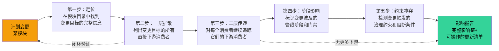
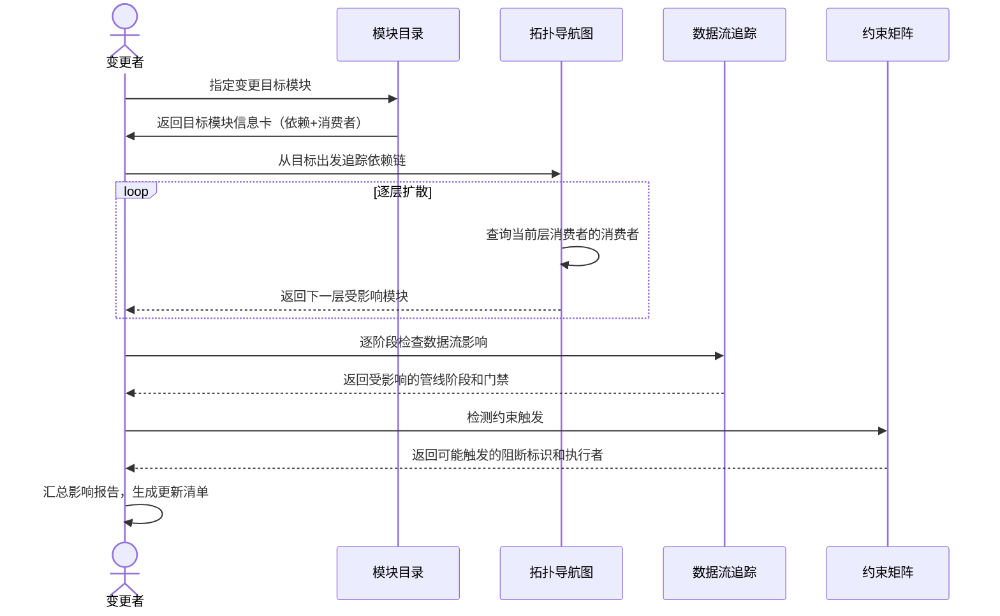

# 场景 4: 依赖变更影响

> | v1.27.0 | 2026-06-05 | deepseek-v4-pro | 🌿 feat/yry-arch | 📎 [CLAUDE.md](../../../CLAUDE.md) |
> **导航**: [← 场景-3](./场景-3-新人上手.md) · [知识图谱 →](./知识图谱.json)

[§0 技术评审](#sec0) · [§1 测试设计](#sec1) · [§2 实施报告](#sec2) · [§3 测试报告](#sec3) · [§4 自改进](#sec4)

## 概述

**角色**: 系统演进者（架构设计者、变更执行者、自改进循环） · **目标**: 评估变更一个模块的影响范围——从变更点出发逐层追踪依赖链，标记所有受影响的模块、角色、管线阶段和约束 · **优先级**: P0

### 主要价值

- 🎯 **变更前知其影响** — 改动一个规则或角色契约之前，一键追踪所有下游消费者，不靠记忆不靠猜测
- 🔗 **二级传递可追溯** — 不仅列出直接依赖方，还追踪间接影响（依赖方的依赖方），影响链完整闭合
- 📊 **影响面可量化** — 每层传递标注受影响模块的数量和类型，变更风险评估有数据支撑
- 🛡️ **约束冲突可预见** — 变更触发约束时，约束的阻断标识和生效阶段同步呈现，避免变更后才发现冲突
- 🔄 **管线阶段可同步** — 模块变更可能影响多个管线阶段的执行逻辑，各阶段的影响逐段标注
- 📋 **更新清单可执行** — 影响报告不是只列问题，而是生成可操作的更新清单，逐项标注优先级和执行者

### 图谱定位

| 图层 | 本场景节点 | 上游 | 下游 |
|------|-----------|------|------|
| 领域层 | scene: impact-analysis | story: yry-arch (contains) | maps_to → 结构层 |
| 结构层 | — | maps_to 来自领域层 | — |
| 内容层 | — | Read 来自结构层 | — |

---

## §0 技术评审

> 文档生成阶段填充（pm+coder）。本场景为纯文档/知识场景，无前端 UI 或后端 API。

### 效果示意

### 情感目标

变更者感到**胸有成竹、风险可控**——在动手改代码之前，已经清楚知道影响面的全貌：哪些模块需要同步更新、哪些阶段的行为会发生变化、哪些约束可能被触发。不会有"改完才发现坏了别的东西"的后怕。

### 成功感知

变更者知道自己达成目标，当：影响报告列出了完整的影响链（从直接依赖到二级传递全部闭合），每项影响有优先级标注和更新建议，且可以按清单逐项执行验证。

### 数据流全景

### 涉及模块

| 模块 | 职责 | 本场景角色 |
|------|------|-----------|
| 模块目录 | 提供变更目标的完整信息卡（定位、依赖列表、消费者列表） | 起点定位——找到变更目标在系统中的位置 |
| 拓扑导航图 | 展示模块间的依赖关系，支持沿关系路径逐层追踪 | 链路追踪——逐层扩散影响面 |
| 数据流追踪 | 展示管线各阶段的输入输出，判断变更影响哪些阶段的行为 | 阶段影响——标注受波及的管线阶段 |
| 约束矩阵 | 列出治理约束的适用阶段和阻断条件，检测变更是否触发约束 | 冲突检测——预见约束阻断 |

### 基线溯源

| 本场景内容 | 基线来源 | 覆盖方式 | 状态 |
|-----------|---------|---------|------|
| 变更点定位（目标模块的完整信息和依赖链） | Story 1 FP1–FP3 — 能力/角色/约束编目 | 模块目录提供变更目标的入口定位和上下游信息 | 待实现 |
| 依赖链追踪（逐层扩散直至闭合） | Story 1 FP4 — 依赖关系图谱 | 拓扑导航图支持沿调用/委派/约束路径逐层追踪消费者 | 待实现 |
| 交叉验证（确保追踪结果无遗漏） | Story 1 FP5 — 交叉验证 | 影响报告逐模块验证声明关系与实际引用的一致性 | 待实现 |
| 管线阶段影响（变更波及的阶段和门禁） | Story 2 FP6–FP7 — 管线阶段编目和数据流序列 | 数据流追踪展示变更对阶段输入/输出/门禁的影响 | 待实现 |
| 约束冲突检测（变更触发的治理约束） | Story 2 FP8 — 门禁矩阵 | 约束矩阵检测变更是否触发阻断标识或降级条件 | 待实现 |

### 设计评审清单

| # | 检查项 | 状态 |
|---|--------|:--:|
| 1 | 影响追踪从变更点出发，覆盖直接依赖和二级传递 | |
| 2 | 影响链闭合——每层传递终点可验证（无更多下游或回到已知节点） | |
| 3 | 受影响的管线阶段和门禁全部标注 | |
| 4 | 触发的约束及其阻断标识完整列出 | |
| 5 | 影响报告含可操作的更新清单，每项有优先级和执行者 | |
| 6 | 支持多种变更类型（能力变更、角色变更、约束变更、阶段变更） | |

---

## §1 测试设计

> 文档生成阶段填充（tester）。本场景为影响分析型场景，测试聚焦变更影响追踪的完整性、准确性和可操作性。

### 正常路径用例

| TC# | Given | When | Then | 覆盖 FP# | 优先级 |
|-----|-------|------|------|---------|--------|
| TC-N4.1 | 变更者计划修改"代码实现"角色的职责边界 | 从模块目录定位该角色，沿拓扑导航图追踪下游消费者 | 获得完整的影响链：直接依赖方（关联的能力模块）、间接依赖方（依赖方的下游角色）、受影响的管线阶段 | FP1, FP2, FP4 | P0 |
| TC-N4.2 | 变更者计划修改"代码变更治理"约束的适用范围 | 从约束矩阵定位该约束，追踪其生效的管线阶段和执行者 | 获得完整的阶段影响列表：哪些阶段的行为会因约束变更而不同，哪些门禁条件需要同步更新 | FP3, FP4, FP8 | P0 |
| TC-N4.3 | 变更者计划新增一个管线阶段 | 从数据流追踪定位嵌入位置，获取前驱和后驱阶段的数据传递约定 | 知道新阶段的输入来源、产出去向、必须满足的门禁条件、需要参与的协作角色 | FP6, FP7, FP9 | P0 |
| TC-N4.4 | 变更者计划修改某能力的接口契约 | 从模块目录定位该能力，沿消费者链追踪所有调用方 | 获得完整的影响报告：所有直接和间接消费者、受影响阶段的输入输出变化、可能触发的约束冲突 | FP1, FP4, FP7, FP8 | P0 |
| TC-N4.5 | 变更者收到影响报告 | 按更新清单逐项执行 | 每项有明确的执行者、优先级和验证方式，可逐项完成并确认 | FP5 | P1 |

### 边界/异常用例

| TC# | Given | When | Then | 覆盖 FP# | 优先级 |
|-----|-------|------|------|---------|--------|
| TC-B4.1 | 变更目标模块的拓扑中存在循环依赖 | 追踪依赖链到第二层 | 影响追踪在发现循环时显式标注循环位置，不陷入无限循环 | FP4 | P0 |
| TC-B4.2 | 变更目标的消费者列表中存在未验证的隐式依赖 | 生成影响报告 | 隐式依赖被标注为"待确认"，不参与自动追踪但仍出现在影响报告中 | FP5 | P1 |
| TC-B4.3 | 变更的波及面超出本项目的模块范围 | 影响的末端到达项目边界 | 影响报告标注"边界外"节点，说明可能影响的外部系统或接口 | FP4, FP7 | P1 |
| TC-B4.4 | 变更同时触发多个约束的阻断条件 | 汇总约束冲突 | 影响报告按阻断级别（阻断/降级）排序列出所有冲突，不遗漏不合并 | FP8 | P1 |
| TC-B4.5 | 变更者输入不存在的模块名作为变更目标 | 进行影响分析 | 收到清晰的错误提示，含相近模块名的建议列表 | FP1 | P2 |

### Gate A 交接

| 项目 | 状态 |
|------|:--:|
| 每 FP ≥3 类用例（含正常与边界） | ✓（FP1: 2, FP2: 2, FP3: 2, FP4: 4, FP5: 2, FP6: 2, FP7: 3, FP8: 3, FP9: 2） |
| 影响追踪覆盖四种变更类型（能力、角色、约束、阶段） | ✗ 待验证 |
| 依赖链追踪支持至少二级传递，并且闭合条件可验证 | ✗ 待验证 |
| 影响报告含可操作的更新清单（每项有优先级和执行者） | ✗ 待验证 |
| Gate A 判定 | 待 tester 完成测试设计补充后判定 |

---

## §2 实施报告

> 实现阶段填充（coder）。待实现。

### 操作步骤记录

| 步# | 时间 | 操作 | 文件/命令 | 结果 | 备注 |
|-----|------|------|----------|------|------|
| — | — | 待实现 | — | — | — |

### 开发源码清单

| 节点 ID | 文件路径 | 类型 | 行数 | 关键导出 | 逻辑摘要 |
|---------|---------|------|------|---------|---------|
| — | — | — | — | — | 待实现 |

### 测试源码清单

| 节点 ID | 文件路径 | 类型 | 行数 | 框架 | 覆盖节点 | 用例数 |
|---------|---------|------|------|------|---------|--------|
| — | — | — | — | — | — | 待实现 |

### 依赖图

> 待实现

### P0 审查表

| 模块 | P0 项 | 状态 | 修复 |
|------|-------|:--:|------|
| — | — | — | 待实现 |

### 效果验证

> 待实现

---

## §3 测试报告

> 验证阶段填充（tester）。待实现。

### 操作步骤记录

| 步# | 时间 | 操作 | 命令/文件 | 结果 | 备注 |
|-----|------|------|----------|------|------|
| — | — | 待实现 | — | — | — |

### 执行摘要

| 总用例 | 通过 | 失败 | 通过率 |
|--------|------|------|--------|
| — | — | — | 待实现 |

### 用例详情

| TC# | 结果 | 耗时 | 覆盖源文件:行号 |
|-----|------|------|---------------|
| — | — | — | 待实现 |

### 失败分析与修复

| 失败 TC# | 根因 | 修复 | 修复后 |
|----------|------|------|--------|
| — | — | — | 待实现 |

---

## §4 自改进

> 自改进阶段填充（self-improve）。待实现。

### D0–D7 诊断

| 诊断 | 触发? | 证据 | 提案 |
|------|-------|------|------|
| — | — | — | 待实现 |

### 改进清单

| # | 改进项 | 优先级 | 状态 |
|---|--------|--------|:--:|
| — | — | — | 待实现 |

### 评审清单

| # | 检查项 | 状态 |
|---|--------|:--:|
| — | — | 待实现 |

---

> **回溯链**
>
> - 需求来源：本场景由 [故事任务 §7 跨文档索引](./故事任务.md#s-7-跨文档索引) 分配，覆盖 Story 1 FP4（依赖关系图谱）和 Story 2 FP7（数据流序列），作为变更影响分析的综合入口。
> - 基线内容：[故事任务 Story 1 §2 Requirements](./故事任务.md#s2-requirements) — FP4 依赖关系图谱，FP5 交叉验证；[故事任务 Story 2 §2 Requirements](./故事任务.md#s2-requirements) — FP6 管线阶段编目，FP7 数据流序列，FP8 门禁矩阵，FP9 角色参与矩阵。
> - 用户操作：[故事任务 Story 1 §1.1](./故事任务.md#s11-user-operations) — 操作 #4（追踪影响链路）；[故事任务 Story 2 §1.1](./故事任务.md#s11-user-operations) — 操作 #2（定位问题发生阶段）、操作 #3（新增管线阶段）。
> - 风险覆盖：[故事任务 §6 风险与假设](./故事任务.md#s6-风险与假设) — 风险 #1（隐式依赖）、风险 #2（弱耦合）、风险 #5（依赖歧义）。
> - 公式约束：遵循 [F.story.scene](../../../skills/rui/formulas.md#fstoryscene--场景-n-slugmd-meta--nav--0-技术评审--1-测试设计--2-实施报告--3-测试报告--4-自改进) 公式，含 §0–§4 全生命周期章节。
> - 证据级别：本场景 §0 影响分析方法论基于模块拓扑和数据流基线的综合引用（证据级别 B）；依赖链追踪路径可逐级验证（证据级别 A）。

### 变更记录

| 日期 | 版本 | 变更内容 | 触发 | 证据 |
|------|------|---------|------|------|
| 2026-06-05 | 1.0.0 | 初始化，§0 技术评审 + §1 测试设计填充 | `/rui init` arch 步骤 → 场景文档生成 | 故事任务 Story 1 FP4/FP5 + Story 2 FP6/FP7/FP8/FP9，公式 F.story.scene |
