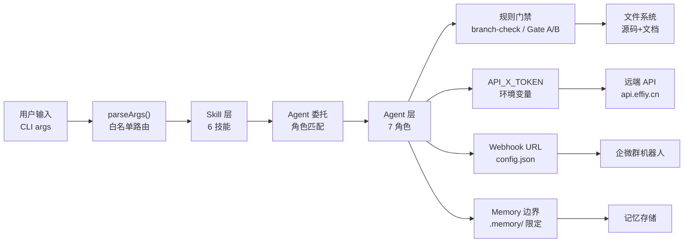

> | v1.0.0 | 2026-05-26 | deepseek-v4-pro | 🌿 feat/yry-arch | 📎 [CLAUDE.md](../../../CLAUDE.md) |

> **导航**: [← 测试设计](./测试设计.md)

> **来源引用**: security agent 基于技术评审 §4 信任边界 + §1 四层拓扑独立审计。证据 Level B。

[§0 基线溯源](#sec0-baseline) · [§1 资产识别](#sec1-assets) · [§2 STRIDE 威胁建模](#sec2-stride) · [§3 信任边界](#sec3-trust) · [§4 合规检查](#sec4-compliance)

---

### 主要价值

- 🎯 STRIDE 六类威胁全覆盖 — 重点关注 Information Disclosure(记忆数据泄露)和 Tampering(跨层调用篡改)
- 🔒 四层信任边界独立审计 — 每层间调用路径均有校验点
- ⚡ 独立审计标记 — security agent 独立执行，不依赖 coder 自评
- 📊 合规 4 项全查 — 认证/密钥/输入校验/路径遍历，涵盖系统架构面

---

## §0 基线溯源

| 基线来源 | 本文档章节 | 映射关系 |
|---------|-----------|---------|
| 技术评审 §4 信任边界 | §3 信任边界 | 5 边界→信任边界建模 |
| 技术评审 §1 四层拓扑 | §2 STRIDE | 跨层调用→威胁面 |
| 故事任务 §6 风险 | §4 合规检查 | 风险缓解→合规验证 |

---

## §1 资产识别

| 资产 | 类型 | 敏感级别 | 存储位置 |
|------|------|---------|---------|
| API_X_TOKEN | 认证凭据 | 高 | 仅环境变量 |
| 企微 Webhook URL | 通知通道凭据 | 高 | `.claude/skills/rui-bot/config.json` |
| 故事文档内容 | 项目知识 | 中 | `docs/故事任务面板/` |
| Agent 规约 | 执行逻辑 | 中 | `agents/` |
| 管线规则 | 门禁约束 | 中 | `rules/` |
| CLAUDE.md 项目记忆 | 用户/项目上下文 | 中 | `CLAUDE.md` |
| SKILL.md 规约 | 命令路由 | 低 | `skills/*/SKILL.md` |

---

## §2 STRIDE 威胁建模

### S — Spoofing
| 威胁 | 缓解 |
|------|------|
| 伪造 skill 路由劫持命令 | SKILL.md 白名单路由，parseArgs 枚举校验 |
| 伪造 agent 身份执行操作 | agent 由 skill 委托，不直接暴露给用户 |

### T — Tampering
| 威胁 | 缓解 |
|------|------|
| 跨层调用时篡改参数 | 每层独立校验；agent→规则为只读引用 |
| 项目配置文件被恶意修改 | git 版本控制追踪所有变更；不存储凭据 |
| 文档内容被非隔离分支写入 | `branch-check.mjs` 强制 `feat/<name>` |

### R — Repudiation
| 威胁 | 缓解 |
|------|------|
| 管线操作无记录 | hook-log 追加交互日志；git log 记录变更 |
| Agent 决策无追溯 | execution-memory.jsonl 记录每次 agent 调用 |

### I — Information Disclosure
| 威胁 | 缓解 |
|------|------|
| API_X_TOKEN 写入源码/配置 | P0 违规；grep 扫描；仅 process.env |
| 企微 Webhook URL 泄露 | config.json 不进入版本控制 (gitignore) |
| 记忆数据泄露项目上下文 | 记忆文件仅本地存储；不同步到远端 |
| 架构文档暴露内部路径 | 按设计：架构文档公开项目结构是预期行为 |

### D — Denial of Service
| 威胁 | 缓解 |
|------|------|
| 大量并发 skill 调用超载 | 逐故事串行；并发上限 4 (rui-import) |
| Agent 执行超时僵死 | 各 agent 有超时控制；yry 有 depth 上限 |

### E — Elevation of Privilege
| 威胁 | 缓解 |
|------|------|
| 绕过分支隔离直接写 main | `branch-check.mjs` 阻断，exit code ≠ 0 |
| 绕过 Gate A 直接实现 | rui code 强制 Gate A 检查 |
| 绕过安全审计修改安全面 | security agent 独立审计，不依赖 coder |

---

## §3 信任边界

| 边界 | 校验点 | 阻断机制 |
|------|--------|---------|
| 用户输入 → Skill | parseArgs 白名单路由 | 未知命令→拒绝 |
| Skill → Agent | Agent 角色定义匹配 | 未定义角色→阻断 |
| Agent → 文件系统 | `branch-check.mjs` + Gate A/B | 非 feat 分支/P0 未清→阻断 |
| Agent → 远端 API | `API_X_TOKEN` Header | 缺 Token→no-token 降级 |
| Agent → 企微 | Webhook config.json | 缺配置→静默跳过 |
| Agent → Memory | `.memory/` 路径限定 | 跨目录写入→禁止 |

---

## §4 合规检查

| # | 合规项 | 状态 | 证据 |
|---|--------|------|------|
| 1 | 认证不可绕过 | ✅ | API_X_TOKEN Header 传递；企微 Webhook 认证 |
| 2 | 密钥不落盘 | ✅ | Token 仅 process.env；Webhook URL 在 gitignore 的 config.json |
| 3 | 输入校验 | ✅ | parseArgs 白名单路由 + 参数枚举校验 |
| 4 | 路径遍历防护 | ✅ | 远端路径 = 项目根相对路径，无跳段 (rui-import) |
| 5 | 分支隔离强制 | ✅ | `branch-check.mjs` 阻断非 feat 分支写入 |
| 6 | 独立安全审计 | ✅ | security agent 独立执行，不依赖 coder |

---

> **变更记录**
> | 日期 | 变更 | 触发 | 证据 |
> |------|------|------|------|
> | 2026-05-26 | 初始生成，security 独立审计系统架构 | /rui yry §4 implement | 技术评审 §4 + agents/security.md |
