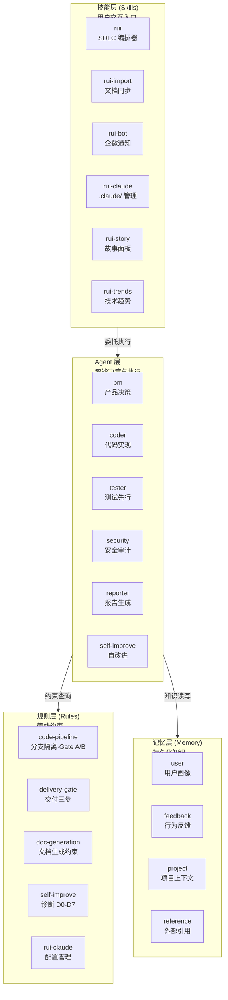
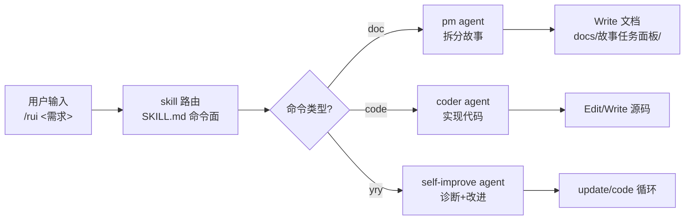
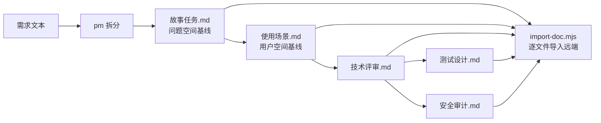
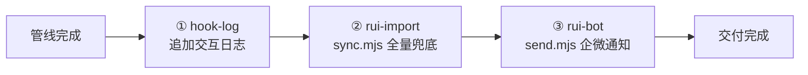
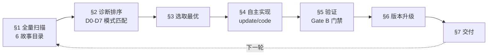
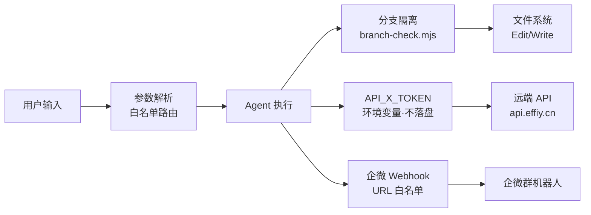

> | v1.0.0 | 2026-05-26 | deepseek-v4-pro | 🌿 feat/yry-arch | 📎 [CLAUDE.md](../../../CLAUDE.md) |

> **导航**: [← 使用场景](./使用场景.md) · [测试设计 →](./测试设计.md) · [安全审计 →](./安全审计.md)

> **来源引用**: 由 yry 自改进触发，从 `CLAUDE.md` + 6 SKILL.md + agents/ + rules/ 反推系统架构。证据 Level A。

[§0 基线溯源](#sec0-baseline) · [§1 四层拓扑](#sec1-topology) · [§2 模块地图](#sec2-module-map) · [§3 数据流](#sec3-dataflow) · [§4 信任边界](#sec4-trust) · [§5 架构决策](#sec5-adr) · [§6 依赖矩阵](#sec6-deps)

---

### 主要价值

- 🎯 四层拓扑总览 — 技能层·agent 层·规则层·记忆层，每层独立可替换
- 🔒 模块地图精确到文件 — 每个模块的入口文件、核心依赖、下游消费者
- ⚡ 四大数据流全景 — 命令流·文档流·交付流·自改进流，均有 mermaid 图
- 📊 架构决策可追溯 — 关键 ADR 索引，避免重复讨论已决策问题

---

<a id="sec0-baseline"></a>

## §0 基线溯源

| 基线来源 | 本文档章节 | 映射关系 |
|---------|-----------|---------|
| 故事任务 §1 Story 1 | §1 四层拓扑 | 系统架构→拓扑模型 |
| 故事任务 §1 Story 2 | §2 模块地图 | 模块地图→文件级索引 |
| 故事任务 §2 FP3 | §3 数据流 | 数据流→4 张 flowchart |
| 故事任务 §2 FP4 | §4 信任边界 | 信任边界→5 边界建模 |

---

<a id="sec1-topology"></a>

## §1 四层拓扑

### 效果示意



### 层间调用矩阵

| 调用者 ↓ / 被调用者 → | skills | agents | rules | memory |
|------------------------|:------:|:------:|:-----:|:------:|
| skills (6) | 路由委托 | 执行委托 | 约束引用 | — |
| agents (7) | — | 协作通信 | 门禁检查 | 读写 |
| rules (5) | — | — | 交叉引用 | — |
| memory (4 types) | — | — | — | — |

---

<a id="sec2-module-map"></a>

## §2 模块地图

### 2.1 技能层

| 技能 | 入口文件 | 核心依赖 | 下游消费者 |
|------|---------|---------|-----------|
| rui | `skills/rui/SKILL.md` | formulas.md, coder.md, agents/*, rules/* | 所有 /rui 命令 → agent 委托 |
| rui-import | `skills/rui-import/sync.mjs` | API_X_TOKEN (env), api.effiy.cn | rui 交付三步, rui-claude sync |
| rui-bot | `skills/rui-bot/send.mjs` | config.json, 企微 webhook | rui 交付三步 |
| rui-claude | `skills/rui-claude/SKILL.md` | rui-import (文档同步) | /rui-claude 命令 |
| rui-story | `skills/rui-story/SKILL.md` | rui-import (远端查询), api.effiy.cn | /rui-story 命令, rui 任务推荐 |
| rui-trends | `skills/rui-trends/SKILL.md` | WebFetch (agent 原生) | self-improve D5/D0/D3/D6 |

### 2.2 Agent 层

| Agent | 规约文件 | 触发上下文 | 输出 |
|-------|---------|-----------|------|
| pm | `agents/pm.md` | /rui doc, /rui init | 故事拆分, 影响分析, 优先级排序 |
| coder | `agents/coder.md` | /rui code, /rui doc (补齐设计文档) | 代码实现, 技术评审, 实施报告 |
| tester | `agents/tester.md` | Gate A, Gate B | 测试设计, 测试报告, 门禁判定 |
| security | `agents/security.md` | /rui doc (安全审计) | 独立安全审计报告 |
| reporter | `agents/reporter.md` | 交付阶段 | 过程报告, 知识沉淀 |
| self-improve | `agents/self-improve.md` | /rui yry | 诊断→实现→验证→版本升级 |

### 2.3 规则层

| 规则文件 | 约束范围 | 核心门禁 |
|---------|---------|---------|
| `rules/code-pipeline.md` | 分支隔离, Gate A/B, 逐模块 P0 清零 | `branch-check.mjs` |
| `rules/delivery-gate.md` | hook-log → rui-import → rui-bot | 三步强制按序 |
| `rules/doc-generation.md` | 表达优先, P0 检查清单, 公式引用 | F.meta, F.toc, F.nav |
| `rules/self-improve.md` | D0-D7 诊断, E1-E4 评估, 经验技能化 | 无改进空间终止 |
| `rules/rui-claude.md` | .claude/ 配置操作边界 | 仅操作 .claude/ 目录 |

### 2.4 目录结构全览

```
YrY/
├── CLAUDE.md              ← 项目画像 + 铁律 + 约束
├── README.md              ← 系统视图 + 领域语言
├── skills/                ← 6 个用户交互技能
│   ├── rui/               ← SDLC 编排器 (核心)
│   ├── rui-import/        ← 文档同步到远端
│   ├── rui-bot/           ← 企微通知
│   ├── rui-claude/        ← .claude/ 配置管理
│   ├── rui-story/         ← 故事面板管理
│   └── rui-trends/        ← 技术趋势分析
├── agents/                ← 7 个智能 Agent 规约
├── rules/                 ← 5 个管线约束规则
├── docs/故事任务面板/      ← 故事文档基线
│   ├── rui/               ← SDLC 编排器故事
│   ├── rui-import/        ← 文档同步故事
│   ├── rui-bot/           ← 企微通知故事
│   ├── rui-claude/        ← 配置管理故事
│   ├── rui-story/         ← 故事面板故事
│   ├── rui-trends/        ← 技术趋势故事
│   └── yry-arch/          ← 系统架构 (本文档)
├── .claude/               ← Claude Code 配置
│   ├── skills/            ← 技能实例
│   └── plugins/           ← 插件缓存
```

---

<a id="sec3-dataflow"></a>

## §3 数据流

### 3.1 命令流 — CLI 到 Agent 执行



### 3.2 文档流 — 需求到文档基线



### 3.3 交付流 — 末端三步



### 3.4 自改进流 — yry 闭环



---

<a id="sec4-trust"></a>

## §4 信任边界



| 边界 | 校验点 | 违规后果 |
|------|--------|---------|
| 用户输入 → Agent | parseArgs 白名单路由 | 阻断 `no-parse` |
| Agent → 文件系统 | `branch-check.mjs` 验证 `feat/<name>` | 阻断 `no-branch-isolation` |
| Agent → 远端 API | `API_X_TOKEN` Header 传递，禁止落盘 | P0 违规 |
| Agent → 企微 | webhook URL 仅配置文件，禁止硬编码 | P0 违规 |
| Agent → 文档产出 | 仅写 `docs/故事任务面板/`，禁止跨目录 | 污染隔离 |

---

<a id="sec5-adr"></a>

## §5 架构决策记录

| # | ADR | 决策 | 日期 | 依据 |
|---|-----|------|------|------|
| ADR1 | 逐故事串行 | 多故事按优先级顺序处理，互不交叉 | 2026-05 | 防止交叉影响，保证文档一致性 |
| ADR2 | 分支隔离强制 | 任何 Edit/Write 前必须 `feat/<name>` | 2026-05 | 防止未验证变更污染 main |
| ADR3 | 测试先行 | Gate A 阻断实现，Gate B ≤2 轮 | 2026-05 | 验现实优先于信模型 |
| ADR4 | 表达优先 | 文档内容 图 → 结构化文本 → 表 | 2026-05 | 惜注意，信息密度最大化 |
| ADR5 | 独立安全审计 | security agent 独立执行，不依赖 coder | 2026-05 | 防止自评盲区 |
| ADR6 | 双基线模型 | 故事任务(WHAT+WHY) + 使用场景(WHO+HOW) | 2026-05 | 问题空间与方案空间分离 |
| ADR7 | 自托管一致性 | plugin.json 版本 = 实际 skill/agent/rule 内容 | 2026-05 | 退化对策 L2：重生机制 |

---

<a id="sec6-deps"></a>

## §6 依赖矩阵

| 模块 | 依赖 | 被依赖 |
|------|------|--------|
| rui | agents/*, rules/*, formulas.md | 所有用户命令 |
| rui-import | api.effiy.cn, API_X_TOKEN | rui (交付), rui-claude (sync) |
| rui-bot | 企微 webhook, config.json | rui (交付) |
| rui-claude | rui-import | /rui-claude 命令 |
| rui-story | rui-import, api.effiy.cn | /rui-story 命令, rui (推荐) |
| rui-trends | WebFetch | self-improve (D5/D0/D3/D6) |
| pm | agents/AGENT.md | rui (doc) |
| coder | agents/AGENT.md, rules/code-pipeline.md | rui (code, doc) |
| tester | rules/code-pipeline.md | rui (Gate A/B) |
| security | agents/AGENT.md | rui (安全审计) |
| self-improve | rules/self-improve.md, rui-trends | rui (yry) |

---

> **变更记录**
> | 日期 | 变更 | 触发 | 证据 |
> |------|------|------|------|
> | 2026-05-26 | 初始生成，yry 自改进补充系统技术架构 | /rui yry §4 implement | CLAUDE.md + 6 SKILL.md + 7 agent + 5 rule |
