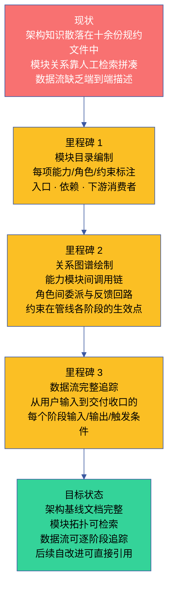

# 故事任务

> | v1.0.0 | 2026-06-05 | deepseek-v4-pro | 🌿 main | 📎 [CLAUDE.md](../../../CLAUDE.md) |

## version_history

```json
[{"version":"1.0.0","date":"2026-06-05","trigger":"/rui doc --from-code","change":"初始架构基线生成：6技能+9Agent+10规则，4场景覆盖模块定位/数据流/新人上手/依赖变更"}]
```

[§1 Story](#s-1-story) · [§7 跨文档索引](#s-7-跨文档索引) · [§R 关联故事](#s-r-关联故事) · [图谱定位](#图谱定位)

## 图谱定位

| 图层 | 本故事节点 | 上游 | 下游 |
|------|-----------|------|------|
| 领域层 | story: yry-arch | YrY 架构基线体系 (part_of) | contains → 四个场景 |
| 结构层 | 两 Stories · 四场景 · 六项核心产出 | 领域层 maps_to | 内容层 |
| 内容层 | 场景文档 · 审查报告 · 架构图 · 知识图谱 · 测试面板 · 计划清单 | 结构层 maps_to | — |

本故事在 YrY 技能拓扑中的位置：
- **上游依赖**：YrY 系统规约（CLAUDE.md · README.md · rules/ · agents/ · skills/）
- **下游消费者**：yry-self-test（提供模块拓扑和验证对象）
- **同级故事**：yry-self-test · rui-npm

## 概述

本项目是一个故事驱动的软件交付编排系统，用自身管线管理自身演进。系统由六项能力模块、八种协作角色、八组治理约束构成，它们协同完成从需求到交付的完整生命周期。

当前架构的知识分散在数十份规约文件中——能力规约定义各自的执行逻辑，角色契约定义各自的职责边界，治理约束定义各阶段的规则。但缺少一份统一的架构参照，使得新加入的维护者和未来的自改进循环需要反复检索多份文件才能理解模块间的调用链路、角色间的委派关系、数据在各阶段的流转形态。

本故事的目标是补齐这份缺失的架构参照。通过两份并行的分析——模块拓扑和数据流——构建系统自我认知的基线文档，让后续的故事规划、影响分析和架构决策都有唯一的事实参照。

### 效果示意



### 主要价值

- 🗺️ **架构地形可导航** — 无论新成员还是自改进循环，都能在三十秒内找到任一模块在系统中的位置、上下游关系和职责边界
- 🔗 **依赖链路透明化** — 能力之间的调用链、角色之间的委派链、约束在各阶段的生效点，全部显式标注，影响分析有据可依
- 📊 **数据流可追踪** — 用户指令从进入系统到交付收口，每个阶段的输入、输出、触发条件和门禁判定，形成完整的流转地图
- 🔍 **交叉引用可回源** — 每个架构断言都可追溯到具体的规约来源，变更时能快速定位受影响的文档
- 🛡️ **边界冲突显式化** — 能力模块间共享的约定、角色间重叠的职责、约束间交叉的判断，不再靠口头共识或代码惯例
- ♻️ **自改进可度量** — 架构基线建立后，后续的自改进循环可以对比基线判断是否有架构漂移、是否有知识缺口

---

<a id="s-1-story"></a>
## §1 Story

### Story 1: 模块地图与拓扑

作为 系统演进者，我想要 一张完整的模块地图——列出所有能力项、协作角色和治理约束，以及它们之间的上下游关系，以便 在规划变更时能快速判断影响范围，在新增能力时能找到正确的嵌入位置。

优先级 **P0**。范围边界：覆盖本项目的全部六项能力模块、八种协作角色和八组治理约束，绘制它们之间的调用、委派和约束关系图。不涉及其他项目或外部系统的模块。

#### §1.1 User Operations

| # | 操作 | 触发条件 | 操作步骤 | 预期结果 |
|---|------|---------|---------|---------|
| 1 | 检索能力模块 | 用户需要了解某项能力的功能边界和依赖关系 | 查阅模块拓扑表 → 定位目标能力 → 查看该能力的入口位置、依赖项和下游消费者 | 获得该能力在系统中的完整位置信息 |
| 2 | 检索协作角色 | 用户需要了解某个角色的职责和交接信号 | 查阅角色拓扑表 → 定位目标角色 → 查看触发源、核心动作和下游依赖方 | 获得该角色的完整职责描述和交接契约 |
| 3 | 检索治理约束 | 用户需要了解某条约束在管线各阶段的生效点 | 查阅约束生效矩阵 → 定位目标约束 → 查看适用的阶段、执行者和违反阻断标识 | 获得该约束的完整适用范围和阻断条件 |
| 4 | 追踪影响链路 | 用户计划变更某项能力，需要评估影响面 | 从目标能力出发 → 沿下游消费者链逐层追踪 → 标记所有受影响的角色和约束 | 获得完整的影响传播链 |
| 5 | 验证拓扑完整性 | 新增能力或角色后，验证是否与现有拓扑正确集成 | 对照拓扑图检查新模块是否正确注册到依赖链 → 检查是否引入了循环依赖 | 确认集成无冲突 |

#### §2 Requirements

##### 功能点

| FP# | 描述 | 输入 | 输出 | 错误行为 | 优先级 |
|-----|------|------|------|---------|--------|
| FP1 | 能力模块编目 — 列出全部六项能力，标注每项的核心功能、入口位置、前置依赖和下游消费者 | 能力规约文件的集合 | 能力目录表，每项含：定位描述 · 入口索引 · 依赖列表 · 消费者列表 | 能力数量不符或入口不可达时阻断 | P0 |
| FP2 | 协作角色编目 — 列出全部八种角色，标注每种的触发源、核心动作、交接信号和下游接收方 | 角色契约文件的集合 | 角色目录表，每项含：一句话定位 · 触发源 · 核心动作 · 交接信号 · 下游 | 角色数量不符或触发源缺失时阻断 | P0 |
| FP3 | 治理约束编目 — 列出全部八组约束，标注每组约束的适用阶段、执行者、违反阻断标识 | 治理约束文件的集合 | 约束目录表，每项含：约束主题 · 适用阶段矩阵 · 执行者 · 阻断标识 | 约束数量不符或适用阶段缺失时阻断 | P0 |
| FP4 | 依赖关系图谱 — 绘制能力间调用链、角色间委派和反馈链、约束在管线各阶段的生效矩阵 | FP1–FP3 的产出 | 关系图谱：mermaid 拓扑图 + 依赖矩阵表 | 任一模块无法定位上下游时阻断 | P0 |
| FP5 | 交叉验证 — 验证能力目录中声称的消费者与实际规约中声明的调用关系一致 | FP1–FP4 的产出 | 一致性报告：逐模块标注验证状态 | 存在未声明的隐式依赖或虚假声明的消费者时标记为待确认 | P1 |

##### 业务规则

| R# | 描述 | 校验方式 | 证据级别 |
|----|------|---------|---------|
| R1 | 能力模块的总数必须为六项，不重不漏 | 统计能力目录条目数，与系统规约中的能力清单交叉校验 | A |
| R2 | 协作角色的总数必须为八种，不重不漏 | 统计角色目录条目数，与系统规约中的角色清单交叉校验 | A |
| R3 | 治理约束的总数必须为八组，不重不漏 | 统计约束目录条目数，与系统规约中的约束清单交叉校验 | A |
| R4 | 每项能力必须至少被一个角色所调用或关联 | 检查能力→角色的引用关系是否全覆盖 | B |
| R5 | 每个角色必须至少关联一项约束（或通过交接信号隐式关联） | 检查角色→约束的关联矩阵是否全覆盖 | B |
| R6 | 约束的生效阶段必须覆盖管线的全生命周期 | 检查约束生效矩阵的列覆盖是否覆盖所有管线阶段 | B |
| R7 | 依赖关系图中不得出现循环依赖（A→B→...→A） | 拓扑排序算法验证 | B |

##### 数据约束

| 约束 | 类型 | 范围/格式 | 来源 |
|------|------|----------|------|
| 能力模块名 | 枚举 | 六项已注册能力（主线编排器 · 面板管理器 · 配置管理器 · 文档同步器 · 通知推送器 · 趋势分析器） | 系统能力清单 |
| 协作角色名 | 枚举 | 八种已注册角色（决策中枢 · 架构设计 · 代码实现 · 代码审查 · 质量卡点 · 过程记录 · 威胁建模 · 持续改进） | 角色契约清单 |
| 治理约束名 | 枚举 | 八组已注册约束 | 治理约束清单 |
| 依赖关系方向 | 枚举 | 调用 · 委派 · 反馈 · 约束 · 通知 · 审查 | 关系语义约定 |
| 管线阶段 | 枚举 | 需求解析 · 自适应规划 · 影响分析 · 架构设计 · 文档生成 · 分支隔离 · 测试先行 · 逐模块实现 · 闭环验证 · 复盘改进 · 交付收口 | 系统管线定义 |
| 阻断标识 | 枚举 | 阻断（不可继续）· 降级（记录不阻断） | 系统阻断标识汇总 |

#### §3 成功标准

| SC# | 描述 | 度量方式 | 目标值 | 优先级 | 关联 FP# |
|-----|------|---------|--------|--------|---------|
| SC1 | 用户可以在三十秒内找到任一模块在系统中的位置和关系 | 随机抽查三个模块，计时从打开文档到找到完整上下游信息 | 全部在三十秒内完成 | P0 | FP1–FP4 |
| SC2 | 模块总数与系统实际清单一致 | 逐项比对能力目录、角色目录、约束目录与规约文件 | 完全一致，无遗漏无多余 | P0 | FP1–FP3 |
| SC3 | 依赖关系图中每一条边都有对应的规约来源佐证 | 追踪每条关系到规约中的具体段落 | 全部边可溯源 | P0 | FP4, FP5 |
| SC4 | 交叉验证未发现隐式依赖或虚假声明 | 运行一致性检查，统计未对齐项数量 | 零未对齐项 | P1 | FP5 |
| SC5 | 新成员阅读拓扑图后能正确回答变更某个功能会影响到哪些角色 | 给定三个变更场景，验证影响链判断与基线一致 | 全部正确 | P1 | FP4 |

#### §4 范围边界

##### 范围内

| # | 条目 | 关联 FP# | 边界说明 |
|---|------|---------|---------|
| 1 | 六项能力模块的完整编目 | FP1 | 每项含功能定位、入口索引、依赖项、消费者列表 |
| 2 | 八种协作角色的完整编目 | FP2 | 每项含触发源、核心动作、交接信号、下游接收方 |
| 3 | 八组治理约束的完整编目 | FP3 | 每项含适用阶段矩阵、执行者、阻断标识 |
| 4 | 能力间调用链路图谱 | FP4 | mermaid 拓扑图 + 依赖矩阵表 |
| 5 | 角色间委派与反馈链路图谱 | FP4 | 含四种协作模式的标注 |
| 6 | 约束在各管线阶段的生效矩阵 | FP4 | 含阻断标识的触发条件 |
| 7 | 交叉一致性验证 | FP5 | 逐模块验证声明与实际的一致性 |

##### 范围外

| # | 条目 | 排除原因 | 替代方案 |
|---|------|---------|---------|
| 1 | 各能力模块的详细实现逻辑 | 属于各能力规约自身的范畴 | 通过入口索引链接到对应的能力规约文件 |
| 2 | 各角色内部的执行流程细节 | 属于各角色契约自身的范畴 | 通过入口索引链接到对应的角色契约文件 |
| 3 | 数据在各阶段的具体转换规则 | 属于 Story 2（数据流与管线集成）的范畴 | 本 Story 仅关注模块边界与关系 |
| 4 | 外部系统的集成架构 | 本项目为自包含系统，不直接集成外部业务系统 | 通知推送器等对外接口在 FP1 中标注但不展开 |
| 5 | 模块性能或容量评估 | 架构基线关注结构而非运行时指标 | — |

#### §5 AC

| AC# | Given | When | Then | 门禁 |
|-----|-------|------|------|------|
| AC1 | 用户打开架构基线文档 | 查看能力模块目录 | 看到六项能力的完整清单，每项有定位描述、依赖和消费者 | Gate A |
| AC2 | 用户打开架构基线文档 | 查看协作角色目录 | 看到八种角色的完整清单，每项有触发源、核心动作和交接信号 | Gate A |
| AC3 | 用户打开架构基线文档 | 查看治理约束目录 | 看到八组约束的完整清单，每项有适用阶段和执行者 | Gate A |
| AC4 | 用户查阅依赖关系图 | 追踪任意一条关系路径 | 能从源模块追踪到目标模块，路径上的每个节点都有明确的关系类型标注 | Gate A |
| AC5 | 用户指定一项能力模块 | 查询该能力被哪些角色所调用 | 返回完整的消费者列表，不遗漏不虚假 | Gate A |
| AC6 | 新增一项能力模块后 | 用户参照拓扑图找到正确的嵌入位置 | 知道该能力的前置依赖和下游消费者，能正确注册到调用链中 | Gate B |
| AC7 | 用户计划变更某项角色的职责边界 | 通过影响链路追踪 | 获知所有可能受影响的依赖方和关联约束 | Gate B |

#### §6 风险与假设

| # | 风险/假设 | 类型 | 可能性 | 影响 | 缓解/验证策略 | 关联 FP# |
|---|----------|------|--------|------|-------------|---------|
| 1 | 规约文件中存在隐式依赖未在合同中显式声明 | 风险 | M | H | 交叉验证 FP5 逐模块比对声明与实际引用关系，发现的偏差标记为待确认 | FP4, FP5 |
| 2 | 模块间存在通过命名约定而非显式引用的弱耦合 | 风险 | M | M | 在依赖关系图中区分强依赖（显式引用）和弱耦合（命名约定），后者标注为可观察依赖 | FP4 |
| 3 | 未来新增能力或角色时拓扑图过期 | 风险 | H | M | 架构基线文档作为活文档：新增能力或角色时同步更新本故事；通过自改进循环定期校验 | FP1–FP4 |
| 4 | 角色间的横切约束关系过于复杂导致图谱不可读 | 风险 | L | M | 按协作模式分层展示：委派模式、流水模式、横切模式、审查模式分图呈现 | FP4 |
| 5 | 能力模块之间的消费关系存在歧义（如间接引用 vs 直接依赖） | 风险 | M | L | 在关系图谱中标注关系强度（直接/间接），避免将间接引用错误标注为直接依赖 | FP1, FP4 |
| 6 | 当前的六项能力清单准确反映了系统边界 | 假设 | — | — | 通过扫描规约目录和系统入口路径验证 | FP1 |
| 7 | 当前的八种角色清单准确反映了协作拓扑 | 假设 | — | — | 通过扫描角色契约目录验证 | FP2 |
| 8 | 当前的八组约束清单准确反映了治理范围 | 假设 | — | — | 通过扫描治理约束目录验证 | FP3 |

---

### Story 2: 数据流与管线集成

作为 系统演进者，我想要 一份完整的端到端数据流描述——从用户指令进入系统到交付收口的每个阶段，输入何物、触发何动作、产出何物、经何门禁，以便 在定位问题或新增功能时能精确知道数据在哪个阶段以何种形态存在。

优先级 **P0**。范围边界：覆盖管线的全部十一个阶段，从需求解析到交付收口。不涉及各阶段内部的具体实现细节（属于各角色执行层面的范畴）。

#### §1.1 User Operations

| # | 操作 | 触发条件 | 操作步骤 | 预期结果 |
|---|------|---------|---------|---------|
| 1 | 追踪用户指令流转 | 用户需要了解一条指令如何从输入变为交付 | 查阅管线流转图 → 逐阶段追踪输入/动作/输出 → 查看每个阶段的门禁判断 | 获得指令的完整生命周期轨迹 |
| 2 | 定位问题发生阶段 | 用户发现交付异常，需要定位是哪个阶段出了问题 | 从交付端逆向逐阶段排查 → 对比每阶段的门禁判定规则 → 定位首个未达标的阶段 | 精确锁定问题阶段的触发条件和阻断原因 |
| 3 | 新增管线阶段 | 用户需要了解在哪个环节嵌入新阶段 | 查阅管线阶段之间的数据传递约定 → 确定新阶段的输入来源和输出去向 → 确认不与现有门禁冲突 | 获得新阶段的正确嵌入位置和契约要求 |
| 4 | 理解门禁判定 | 用户需要了解某个阻断标识的具体触发条件 | 查阅门禁矩阵 → 找到目标阻断标识 → 查看触发条件、执行者和恢复方式 | 获得该阻断标识的完整判定和恢复流程 |
| 5 | 验证数据一致性 | 用户需要确认两个阶段之间的数据传递是否正确 | 从上游阶段产出的数据格式 → 对照下游阶段的输入要求 → 检查是否存在格式转换缺失 | 确认数据传递链闭合 |

#### §2 Requirements

##### 功能点

| FP# | 描述 | 输入 | 输出 | 错误行为 | 优先级 |
|-----|------|------|------|---------|--------|
| FP6 | 管线阶段编目 — 列出全部十一个管线阶段，标注每阶段的输入、核心动作、产出和参与者 | 管线规约文件集合 | 管线阶段表，每阶段含：阶段名 · 输入源 · 动作摘要 · 产出物 · 参与者角色 · 门禁条件 | 阶段数量不符或产出缺失时阻断 | P0 |
| FP7 | 数据流序列 — 绘制从用户指令进入到交付收口的完整数据流转路径 | FP6 的产出 | 数据流图：mermaid 流程图，展示各阶段间的数据传递关系和转换节点 | 任一阶段间数据传递路径不可追踪时阻断 | P0 |
| FP8 | 门禁矩阵 — 列出所有阻断点和降级点，标注触发条件、执行者、恢复方式 | 管线规约 + 治理约束 | 门禁矩阵表，每行含：阻断标识 · 触发阶段 · 条件 · 执行者 · 恢复方式 · 阻断级别 | 阻断标识缺失或触发条件模糊时阻断 | P0 |
| FP9 | 角色参与矩阵 — 标注每个管线阶段哪些角色必须参与、哪些可选参与 | FP6 的产出 + 角色契约 | 阶段-角色矩阵，标注必须参与和可选参与 | 必须参与角色遗漏时阻断 | P0 |
| FP10 | 交付收口链路 — 描述文档同步和通知推送的触发方式和数据流向 | 交付收口规约 | 交付收口流程图 + 触发条件表 + 降级策略 | 收口链路缺失或降级条件未标注时阻断 | P1 |

##### 业务规则

| R# | 描述 | 校验方式 | 证据级别 |
|----|------|---------|---------|
| R8 | 管线阶段总数为十一个，按顺序排列不可跳越 | 逐阶段检查进出条件是否覆盖全部阶段 | A |
| R9 | 每个阶段必须有明确的进入条件（前一阶段完成）和退出条件（门禁通过） | 逐阶段验证进出条件的存在性和可判定性 | B |
| R10 | 数据在相邻阶段间的传递格式必须兼容，无隐式转换 | 检查上游产出格式与下游输入格式的兼容性 | B |
| R11 | 阻断标识必须分为两类：阻断（不可继续）和降级（记录不阻断） | 遍历所有阻断标识验证分类正确性 | A |
| R12 | 交付收口的文档同步和通知推送必须独立于主流程触发 | 验证收口阶段的触发条件不依赖管线内其他阶段的中间状态 | B |

##### 数据约束

| 约束 | 类型 | 范围/格式 | 来源 |
|------|------|----------|------|
| 管线阶段顺序 | 有序列表 | 固定十一个阶段，前驱后继关系确定 | 系统管线规约 |
| 阶段产出类型 | 枚举 | 问题空间基线（意愿和边界）· 场景层文档（评审和报告）· 知识层（结构化知识）· 执行记录 | 文档生成约束 |
| 门禁判定结果 | 枚举 | 通过（继续下一阶段）· 阻断（停止并记录原因）· 降级（记录但不停止） | 治理约束 |
| 角色参与级别 | 枚举 | 必须参与 · 可选参与 | 角色拓扑规约 |
| 阻断标识格式 | 字符串 | kebab-case，不可重复 | 阻断标识汇总表 |
| 交付收口触发方式 | 枚举 | 手动触发 · 自动触发 | 交付收口规约 |

#### §3 成功标准

| SC# | 描述 | 度量方式 | 目标值 | 优先级 | 关联 FP# |
|-----|------|---------|--------|--------|---------|
| SC6 | 用户可以在六十秒内追踪一条指令的完整生命周期 | 给定一条典型指令，计时从查阅文档到完整理解每个阶段的输入/输出/门禁 | 六十秒内完成 | P0 | FP6, FP7 |
| SC7 | 每个管线阶段都有明确的参与者标注 | 逐阶段检查参与角色的标注完整性 | 全部十一个阶段完成标注 | P0 | FP6, FP9 |
| SC8 | 所有阻断标识都有触发条件和恢复方式 | 遍历门禁矩阵逐条验证 | 全部阻断标识完整 | P0 | FP8 |
| SC9 | 数据流图中相邻阶段间无数据格式断裂 | 逐条检查上游产出与下游输入的兼容性 | 零断裂 | P0 | FP7 |
| SC10 | 用户给定一个阻断标识，能在一个检索动作内找到其完整的判定和恢复流程 | 随机抽查三个阻断标识 | 全部在一次检索内完成 | P1 | FP8 |
| SC11 | 交付收口的触发链路和降级策略清晰可操作 | 对照收口规约验证描述完整性 | 链路全覆盖，降级条目齐备 | P1 | FP10 |

#### §4 范围边界

##### 范围内

| # | 条目 | 关联 FP# | 边界说明 |
|---|------|---------|---------|
| 1 | 十一个管线阶段的完整编目 | FP6 | 含阶段名、输入源、动作摘要、产出、参与者 |
| 2 | 端到端数据流序列图 | FP7 | 展示指令从进入到交付的完整流转 |
| 3 | 全部阻断标识的门禁矩阵 | FP8 | 含触发条件、执行者、恢复方式、阻断级别 |
| 4 | 阶段-角色参与矩阵 | FP9 | 标注每个阶段必须参与和可选参与的角色 |
| 5 | 交付收口触发链路和降级策略 | FP10 | 文档同步、通知推送的触发方式和故障处理 |
| 6 | 门禁判定规则与传递约定 | FP8 | 阶段间的进入退出条件 |

##### 范围外

| # | 条目 | 排除原因 | 替代方案 |
|---|------|---------|---------|
| 1 | 各阶段内部的具体执行逻辑 | 属于各能力规约和角色契约的范畴 | 通过入口索引链接到对应规约 |
| 2 | 模块间的静态拓扑关系 | 属于 Story 1（模块地图与拓扑）的范畴 | 通过导航链接到 Story 1 |
| 3 | 具体阻断标识的代码级实现细节 | 数据流关注阶段级逻辑而非实现细节 | 实现细节属于代码层面的范畴 |
| 4 | 外部系统的数据格式 | 本项目为自包含系统，外部接口仅涉及通知推送 | 通知推送的契约在能力规约中定义 |
| 5 | 历史数据的迁移或兼容 | 本故事聚焦当前管线设计 | — |

#### §5 AC

| AC# | Given | When | Then | 门禁 |
|-----|-------|------|------|------|
| AC8 | 用户打开数据流与管线集成章节 | 查看管线阶段表 | 看到全部十一个阶段的清单，每个阶段有输入、动作、产出和参与者 | Gate A |
| AC9 | 用户查阅数据流序列图 | 从用户指令进入开始逐阶段追踪 | 能完整追踪到交付收口，每个阶段的数据转换清晰可见 | Gate A |
| AC10 | 用户查阅门禁矩阵 | 查看某个阻断标识 | 看到该标识的触发阶段、触发条件、执行者和恢复方式 | Gate A |
| AC11 | 用户查阅阶段-角色参与矩阵 | 定位到任一管线阶段 | 知道哪些角色必须参与该阶段，哪些角色可选参与 | Gate A |
| AC12 | 用户需要定位交付异常 | 从交付端逆向逐阶段排查门禁 | 找到第一个未达标门禁的触发条件和阻断原因 | Gate B |
| AC13 | 系统新增一个管线阶段 | 用户查阅数据流找到正确嵌入位置 | 知道新阶段的前驱阶段、后驱阶段和必须满足的数据传递约定 | Gate B |
| AC14 | 交付收口的通知推送失败 | 用户查阅降级策略 | 知道系统不会因推送失败而阻断主流程，有明确的降级处理路径 | Gate B |

#### §6 风险与假设

| # | 风险/假设 | 类型 | 可能性 | 影响 | 缓解/验证策略 | 关联 FP# |
|---|----------|------|--------|------|-------------|---------|
| 7 | 管线阶段在规约中定义与实际执行不一致 | 风险 | M | H | 交叉比对管线规约、角色契约和能力规约中对同一阶段的描述，不一致处标记 | FP6, FP7 |
| 8 | 阶段间的数据传递存在未文档化的隐式约定 | 风险 | M | M | 验证每两相邻阶段间的数据转化规则是否在至少一份规约中有定义 | FP7 |
| 9 | 门禁矩阵中某些阻断条件的判定依赖主观判断 | 风险 | L | H | 将主观判定项标注为需人工判断，优先推动可编程化 | FP8 |
| 10 | 交付收口的降级策略在特定故障模式下覆盖不全 | 风险 | L | M | 列举已知的故障模式（网络不可达、凭据缺失、远端服务异常），逐验证降级策略的覆盖 | FP10 |
| 11 | 管线的阶段划分粒度在未来可能需要调整 | 风险 | M | L | 数据流描述按当前管线定义，未来调整时同步更新本基线 | FP6 |
| 12 | 所有阶段的进入退出条件在规约中都有明确定义 | 假设 | — | — | 遍历规约验证每个阶段的进出条件 | FP6, FP8 |
| 13 | 交付收口的手动触发方式不会在自动化演进中变为自动触发 | 假设 | — | — | 当前约定为手动触发，如未来变更则同步更新收口链路 | FP10 |

---

<a id="s-7-跨文档索引"></a>
## §7 跨文档索引

| 本文档章节 | 基线内容 | 下游文档编号 | 预期覆盖 | 状态 |
|-----------|---------|-------------|---------|------|
| Story 1 FP1–FP3 | 能力模块、协作角色、治理约束的编目 | 场景-1-模块定位.md | 任一模块在系统中的完整位置信息，含入口索引和依赖链 | ✓ 已覆盖 |
| Story 1 FP4 | 模块依赖关系图谱 | 场景-1-模块定位.md | mermaid 拓扑图 + 依赖矩阵表 | ✓ 已覆盖 |
| Story 1 FP5 | 交叉一致性验证 | 场景-1-模块定位.md | 逐模块验证声明与实际的一致性 | ✓ 已覆盖 |
| Story 2 FP6–FP7 | 管线阶段编目和数据流序列 | 场景-2-数据流追踪.md | 端到端数据流图 + 阶段输入/输出/门禁 | ✓ 已覆盖 |
| Story 2 FP8 | 门禁矩阵 | 场景-2-数据流追踪.md | 全部阻断标识的触发条件和恢复方式 | ✓ 已覆盖 |
| Story 2 FP9 | 阶段-角色参与矩阵 | 场景-2-数据流追踪.md | 每阶段的角色参与标注 | ✓ 已覆盖 |
| Story 1 + Story 2 全部 FP | 模块拓扑 + 数据流完整知识 | 场景-3-新人上手.md | 新成员可操作的导航路线，从零了解系统架构 | ✓ 已覆盖 |
| Story 1 FP4 + Story 2 FP7 | 模块关系和阶段流转的综合影响 | 场景-4-变更影响分析.md | 给定一个变更点，追踪其影响链（模块→角色→阶段→约束） | ✓ 已覆盖 |
| Story 1 全部 + Story 2 全部 | 架构全貌的结构化知识 | 知识图谱.json | domain/flow/step 节点 + 层次 + 边 | ✓ 已覆盖 |

---

<a id="s-r-关联故事"></a>
## §R 关联故事


| 关联故事 | 关系类型 | 说明 |
|---------|---------|------|
| `yry-self-test` | 数据供给 | 本故事定义的模块拓扑和数据流为自主测试方案提供验证对象——测试方案需要知道哪些模块需要自检、哪些阶段需要门禁校验。架构基线是测试方案的输入依赖。 |

---

> **回溯链**
>
> - 来源：本故事由 `/rui init` 管线的架构故事生成步骤触发，需求来源于系统自托管演进中对架构知识固化的内生要求。分析基线来源于 [CLAUDE.md](../../../CLAUDE.md)（项目约束与自约束）、[README.md](../../../README.md)（系统全景与领域语言）以及以下规约文件。
> - 能力规约：[主线编排器](../../../skills/rui/SKILL.md) · [面板管理器](../../../skills/rui-story/SKILL.md) · [配置管理器](../../../skills/rui-claude/SKILL.md) · [文档同步器](../../../skills/rui-import/SKILL.md) · [通知推送器](../../../skills/rui-bot/SKILL.md) · [趋势分析器](../../../skills/rui-trends/SKILL.md)
> - 角色契约：[角色拓扑与共用底线](../../../agents/AGENT.md)，以及八个专项角色契约（决策中枢 · 架构设计 · 代码实现 · 代码审查 · 质量卡点 · 过程记录 · 威胁建模 · 持续改进）
> - 治理约束：[代码变更治理](../../../rules/code-pipeline.md) · [交付收口](../../../rules/delivery-gate.md) · [文档生成](../../../rules/doc-generation.md) · [架构图规范](../../../rules/architecture-diagram.md) · [知识图谱规范](../../../rules/knowledge-graph.md) · [安全护栏](../../../rules/security-guardrails.md) · [自改进流程](../../../rules/self-improve.md) · [配置管理约束](../../../rules/rui-claude.md)
> - 文档公式：[公式规约](../../../skills/rui/formulas.md) — 定义故事文档的结构化产出规范
>
> **证据标注说明**：本 Story 文档的断言基于以上规约文件的分析推导（证据级别 B），证据可追溯到具体规约章节。能力总数、角色总数、约束总数的统计基于对应规约目录的文件枚举（证据级别 A）。管线阶段数量基于主线编排器规约中管线一览的显式定义（证据级别 A）。

### 变更记录

| 日期 | 版本 | 变更内容 | 触发 | 证据 |
|------|------|---------|------|------|
| 2026-06-05 | 1.0.0 | 初始化，从架构基线需求创建：Story 1 模块地图与拓扑 + Story 2 数据流与管线集成 | `/rui init` arch 步骤 | 24 份规约文件分析，commit `10b6f75` |

---

> **导航**: [场景-1-模块定位 →](./场景-1-模块定位/场景-1-模块定位.md)
