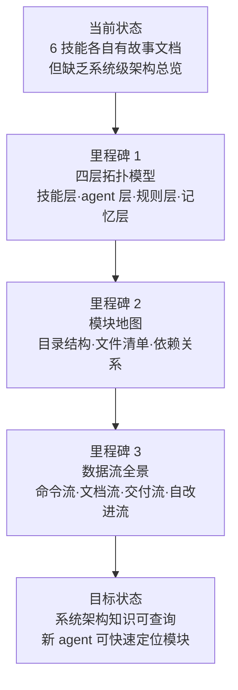

> | v1.0.0 | 2026-05-26 | deepseek-v4-pro | 🌿 feat/yry-arch | 📎 [CLAUDE.md](../../../CLAUDE.md) |

> **导航**: [YrY-使用场景 →](./YrY-使用场景.md)

> **来源引用**: 由 yry 自改进 §1 全量扫描触发，从 `CLAUDE.md` + 6 个 SKILL.md + agent/rule 规约反推系统架构基线。证据 Level A。

[§1 Story](#sec1-story) · [§2 Requirements](#sec2-requirements) · [§3 成功标准](#sec3-success) · [§4 范围边界](#sec4-scope) · [§5 AC](#sec5-ac) · [§6 风险与假设](#sec6-risks) · [§7 跨文档索引](#sec7-index)

---

### §0 基线声明

> **问题空间基线 (Problem Space Baseline)**: 本文档定义 YrY 系统架构的 WHAT 和 WHY。YrY 是故事驱动的 SDLC 编排系统，自身走自身管线管理自身演进。

---

### 需求概述

将 YrY 系统的模块组成、依赖关系、数据流向和信任边界作为结构化知识固化到故事文档中，使任何 agent 或开发者可通过故事面板查询系统全貌。补充项目技术架构全景图和模块地图，建立从"技能→agent→规则→记忆"四层拓扑的完整视图。

### 效果示意

### 主要价值

- 🎯 四层拓扑模型 — 技能层 (6 skills) · agent 层 (7 agents) · 规则层 (5 rules) · 记忆层 (4 types)，层层职责清晰
- 🔒 模块地图完整 — 每个模块的入口文件、依赖模块、下游消费者一一标注
- ⚡ 四大数据流 — 命令流 (CLI→管线) · 文档流 (需求→文档) · 交付流 (hook→import→bot) · 自改进流 (扫描→诊断→实现→验证)
- 📊 信任边界闭合 — 用户输入·分支隔离·文件系统·远端 API·通知通道 五个边界全部建模

---

## §1 Story

### Story 1: 系统架构知识固化

| 字段 | 内容 |
|------|------|
| 作为 | YrY 系统的使用者和维护者 |
| 我想要 | 有一份结构化的系统架构文档描述 YrY 的四层拓扑、模块地图和数据流 |
| 以便 | 新 agent 能快速理解系统全貌，跨模块变更能评估影响面 |
| 优先级 | P0 |
| 范围边界 | 描述现有架构，不涉及架构变更 |
| 依赖 | 6 个 SKILL.md + 7 个 agent 规约 + 5 个 rule 文件可读 |

### Story 2: 模块地图

| 字段 | 内容 |
|------|------|
| 作为 | 开发者/agent |
| 我想要 | 一张完整的模块地图，标注每个模块的入口、依赖和下游消费者 |
| 以便 | 修改任一模块时能快速评估影响范围 |
| 优先级 | P0 |
| 范围边界 | 仅描述模块间结构关系，不涉及模块内部实现细节 |
| 依赖 | 项目目录结构可遍历 |

---

### §2 Requirements

#### 功能点

| FP# | 描述 | 输入 | 输出 | 错误行为 | 优先级 |
|-----|------|------|------|---------|--------|
| FP1 | 四层拓扑建模 — 技能/agent/规则/记忆四层及层间关系 | 项目目录遍历 | 四层拓扑图 + 层间调用矩阵 | 目录不可遍历时降级为已知规约描述 | P0 |
| FP2 | 模块地图生成 — 每模块入口+依赖+下游 | 文件清单 + import/require 分析 | 模块依赖图 | 源码不可读时标注"规约驱动" | P0 |
| FP3 | 数据流建模 — 命令流/文档流/交付流/自改进流 | SKILL.md 管线描述 | 4 张 mermaid flowchart | 管线描述不完整时标注覆盖度 | P0 |
| FP4 | 信任边界建模 — 5 个信任边界的校验点 | security.md + 安全审计文档 | 信任边界图 | 边界描述缺失时标注待补充 | P0 |
| FP5 | 跨文档索引 — 架构文档与 6 个技能故事目录的链接 | 故事目录清单 | 交叉引用矩阵 | 链接断裂时标注 | P1 |
| FP6 | 架构决策记录 — 关键 ADR 的索引与摘要 | CLAUDE.md + agents/AGENT.md | ADR 清单 | — | P1 |

---

### §3 成功标准

| SC# | 描述 | 度量方式 | 目标值 | 优先级 | 关联 FP# |
|-----|------|---------|--------|--------|---------|
| SC1 | 系统架构总览图完整可查询 | 使用场景文档至少含 3 个架构参考场景 | 3+ 场景 | P0 | FP1, FP3 |
| SC2 | 模块地图覆盖全部 6 技能 + 7 agent + 5 rule | 按文件清单逐项核对 | 100% 覆盖 | P0 | FP2 |
| SC3 | 四大数据流均有 mermaid 图 | 计数 | 4 张图 | P0 | FP3 |
| SC4 | 新 agent 可通过架构文档在 5 分钟内定位到目标模块 | 使用场景验证 | ≤5 分钟 | P1 | FP5 |

---

### §4 范围边界

#### 范围内

| # | 条目 | 关联 FP# | 边界说明 |
|---|------|---------|---------|
| 1 | 四层拓扑建模 | FP1 | 技能/agent/规则/记忆四层及调用关系 |
| 2 | 模块地图 | FP2 | 每个模块的入口文件 + 依赖 + 下游消费者 |
| 3 | 四大数据流 | FP3 | 命令流·文档流·交付流·自改进流 |
| 4 | 信任边界 | FP4 | 用户输入·分支隔离·文件系统·远端API·通知通道 |

#### 范围外

| # | 条目 | 排除原因 | 替代方案 |
|---|------|---------|---------|
| 1 | 模块内部实现细节 | 属于各技能自身的故事文档 | 查看对应技能目录下的故事文档 |
| 2 | 架构变更提案 | 架构变更是独立的故事需求 | 走 `/rui` 管线提需求 |
| 3 | 性能基准数据 | 属于运行时监控 | rui-trends 技能覆盖 |

---

### §5 AC

| AC# | Given | When | Then | 门禁 |
|-----|-------|------|------|------|
| AC1 | 项目根目录可遍历 | 执行系统架构知识提取 | 生成四层拓扑模型：技能层 6 模块 + agent 层 7 角色 + 规则层 5 文件 + 记忆层 4 类型 | Gate A |
| AC2 | 6 个 SKILL.md 可读 | 提取模块地图 | 每模块标注入口文件、核心依赖、下游消费者 | Gate A |
| AC3 | 管线描述完整 | 建模数据流 | 4 张 mermaid 图：命令流·文档流·交付流·自改进流 | Gate A |
| AC4 | 安全审计文档可参考 | 建模信任边界 | 5 个信任边界 + 每边界校验点 | Gate A |
| AC5 | 架构文档基线完成 | 建立跨文档索引 | 架构文档 ↔ 6 个技能故事目录双向链接 | Gate A |

---

### §6 风险与假设

| # | 风险/假设 | 类型 | 可能性 | 影响 | 缓解/验证策略 | 关联 FP# |
|---|----------|------|--------|------|-------------|---------|
| 1 | 架构文档与实际代码偏离（渐进漂移） | 风险 | M | H | 架构文档标注证据等级；yry 自改进定期刷新 | FP1 |
| 2 | 模块依赖关系隐含在规约中无法静态分析 | 风险 | M | M | 标注"规约驱动"；以 SKILL.md 中的引用为准 | FP2 |
| 3 | 项目根目录结构可遍历 | 假设 | — | — | 目录不存在时阻断 | FP1, FP2 |
| 4 | 6 个 SKILL.md 提供了完整的模块功能描述 | 假设 | — | — | 不完整处以规约描述补充 | FP2 |

---

### §7 跨文档索引

| 本文档章节 | 下游文档 | 状态 |
|-----------|---------|------|
| §1 Story 1–2 | 使用场景 | 待生成 |
| §2 FP1–FP6 | 技术评审 | 待生成 |
| §5 AC1–AC5 | 测试设计 | 待生成 |
| §6 风险 1–4 | 安全审计 | 待生成 |

---

> **变更记录**
> | 日期 | 变更 | 触发 | 证据 |
> |------|------|------|------|
> | 2026-05-26 | 初始生成，yry 自改进补充系统架构基线 | /rui yry §4 implement | CLAUDE.md + 6 SKILL.md + agent/rule 规约 |
