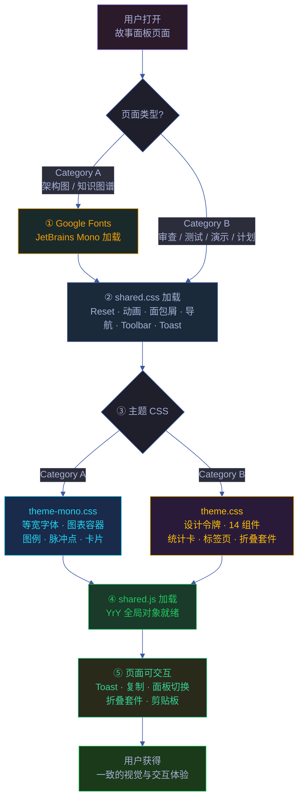
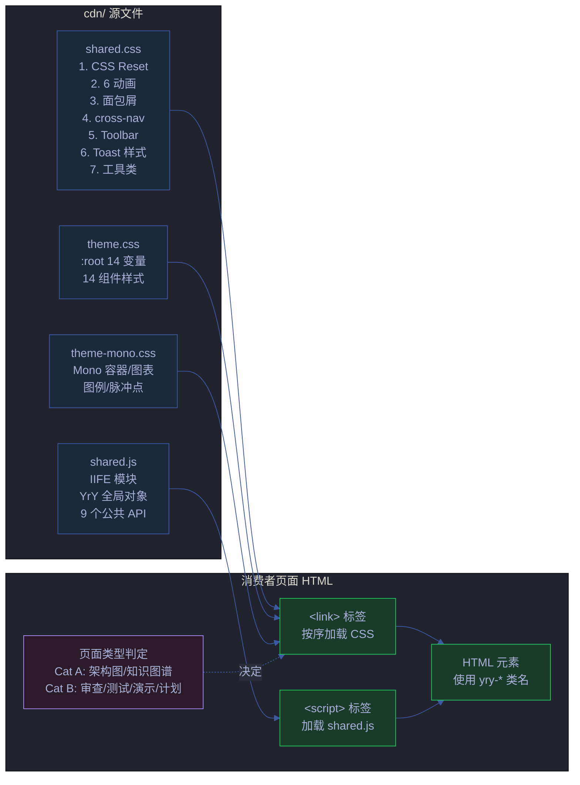
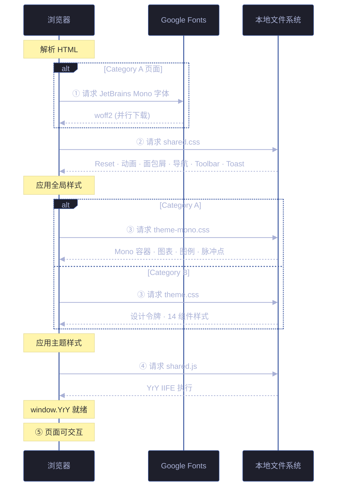

# 场景-1-cdn资源加载与页面渲染

> **所属故事**: yry-cdn
> **场景**: CDN 共享资源加载链路与页面渲染
> **覆盖 Story#**: Story 1



## 效果示意

> 用户打开任意故事面板 HTML 页面，CDN 资源按序加载，5 步完成从空白到可交互的转换。

| 状态 | 用户看到 | 关键事件 |
|------|---------|---------|
| 加载前 | 空白页面 | HTML 开始解析 |
| 步骤①② | 浏览器默认样式 | CSS Reset 就绪，字体开始下载 |
| 步骤③ | 主题色/背景色出现 | CSS 变量注入 :root，页面底色渲染 |
| 步骤④ | 静态样式完成 | 所有组件样式就绪 |
| 步骤⑤ | 可交互 | `YrY` 全局对象可用，事件监听绑定 |

## 主要价值

| # | 价值 | 说明 |
|---|------|------|
| 🔗 | **统一加载链** | 55 个页面共享同一套资源加载顺序，浏览器缓存使其在页面间瞬间可用 |
| 🎯 | **零配置渲染** | 页面只需声明类型（Cat A / Cat B），无需手动配置样式变量 |
| 🛡️ | **优雅降级** | Google Fonts 不可达时回退系统等宽字体，页面的核心信息传递不受影响 |
| 🔄 | **渐进增强** | shared.css 保证基础可用，主题 CSS 提供增强视觉，JS 提升交互 |

---

## §0 技术评审

### §0.1 架构概览



### §0.2 资源加载顺序



**加载顺序约束**:

| 顺序 | 文件 | 前置依赖 | 原因 |
|------|------|---------|------|
| ① | Google Fonts（仅 Cat A） | — | 字体在后续 CSS 中被引用，提前开始下载 |
| ② | shared.css | — | CSS Reset 必须先于所有样式应用 |
| ③ | theme.css 或 theme-mono.css | shared.css | 主题样式引用 shared.css 定义的动画 keyframes |
| ④ | shared.js | shared.css + 主题 CSS | JS 操作 `.yry-*` 类名，CSS 类名必须已定义 |

### §0.3 路径解析

所有消费者页面位于 `docs/故事任务面板/<name>/场景-N-<slug>/` 目录下，通过相对路径引用 CDN：

```text
docs/故事任务面板/<name>/场景-N-<slug>/index.html
                                   ├── ../../../../cdn/shared.css    ← 4 层上溯
                                   ├── ../../../../cdn/theme.css
                                   └── ../../../../cdn/shared.js
```

> 证据: `cdn/README.md:25` — `<link rel="stylesheet" href="../../../../cdn/shared.css">`

**约束**: 页面层级不得超过 4 层。若新增更深的页面嵌套，需要调整 `../` 层数或提供绝对路径。

### §0.4 浏览器兼容性

| 特性 | 依赖 | 不兼容浏览器 | 降级策略 |
|------|------|-------------|---------|
| CSS 变量 | CSS Custom Properties | IE 11 | 无降级 — 项目内部工具，不面向 IE |
| CSS Grid | Grid Layout | IE 10- | 统计卡片使用 flex 回退 |
| `navigator.clipboard` | Clipboard API | 非 HTTPS 环境 | `YrY.copyCmd` 内 catch 显示"复制失败" Toast |
| `el.closest()` | DOM Level 4 | IE | 折叠套件点击无响应（内部工具，可接受） |
| Google Fonts | 外部 CDN 可达性 | 防火墙/离线 | `font-family: monospace` 回退 |

### §0.5 性能考量

| 指标 | 现状 | 目标 |
|------|------|------|
| shared.css 大小 | ~5.9 KB（未压缩） | — 保持 <10 KB |
| shared.js 大小 | ~5.1 KB（未压缩） | — 保持 <10 KB |
| theme.css 大小 | ~11.3 KB | — 保持 <20 KB |
| theme-mono.css 大小 | ~6.1 KB | — 保持 <10 KB |
| 首次加载耗时 | 4 个文件 ~30 KB 总大小 | 本地文件系统 <10ms |
| 跨页面缓存 | 浏览器强缓存（本地文件） | 页面间 0 网络请求 |

### §0.6 安全考量

| # | 信号 | 风险 | 缓解 | 状态 |
|---|------|------|------|------|
| S1 | Google Fonts 外部请求 | 第三方跟踪用户浏览行为 | 仅加载字体 CSS，不加载 JS；隐私友好型字体服务 | ✅ 已受控 |
| S2 | YrY.clipboardWrite 写入剪贴板 | 恶意页面调用覆盖剪贴板 | 仅响应点击事件，非自动触发 | ✅ 已受控 |
| S3 | YrY.esc HTML 转义 | 用户输入在 Toast 中显示导致 XSS | textContent 赋值（非 innerHTML），浏览器自动转义 | ✅ 已受控 |
| S4 | 相对路径引用 | 路径遍历攻击 | 浏览器同源策略限制相对路径范围 | ✅ 平台防护 |

---

### 基线溯源

| 来源 | 行号 | 内容 |
|------|------|------|
| `cdn/shared.css` | 1–94 | CSS Reset、6 动画、面包屑、cross-nav、Toolbar、Toast、工具类 |
| `cdn/shared.js` | 1–101 | YrY IIFE，9 个公共 API |
| `cdn/theme.css` | 1–224 | :root 14 设计令牌、14 组件样式 |
| `cdn/theme-mono.css` | 1–108 | Mono 容器、图表容器、图例、脉冲点、卡片 |
| `cdn/README.md` | 1–117 | 页面分类、组件速查、JS API、迁移指南 |

---

## §1 测试设计

### §1.1 测试策略

| 层级 | 类型 | 工具 | 范围 |
|------|------|------|------|
| L1 静态检查 | CSS 语法 + JS lint | 浏览器 DevTools | 4 个文件无语法错误 |
| L2 视觉回归 | 页面截图对比 | 手动 / Playwright | Cat A/B 页面各 ≥3 个 |
| L3 交互测试 | 浏览器 console | 手动调用 YrY.* API | 9 个 API 全覆盖 |
| L4 兼容性 | 多浏览器 | Chrome / Firefox / Safari | 3 浏览器 |
| L5 资源加载 | 网络瀑布图 | DevTools Network 面板 | 4 文件按序加载无 404 |

### §1.2 测试用例

#### TC1 — Category B 页面加载验证

| 维度 | 内容 |
|------|------|
| 测试目标 | 验证 Category B 页面（审查/测试/演示/计划）正确加载 CDN 资源 |
| 前置条件 | 选择任意 Category B 审查页面（如 `docs/故事任务面板/yry-arch/场景-2-数据流追踪/审查.html`） |
| 步骤 | 1. 浏览器打开目标页面<br>2. DevTools Network 面板检查请求序列<br>3. Elements 面板检查 :root CSS 变量<br>4. 检查 `<script>` 标签已加载 shared.js |
| 期望 | ① Network 面板显示 shared.css → theme.css → shared.js 依次加载（均 200）<br>② :root 含 14 个 `--yry-*` CSS 变量<br>③ console 输入 `YrY.toast('test')` 显示 Toast |
| 失败时 | 404 → 检查相对路径 `../` 层级；变量缺失 → 检查 theme.css link 标签 |
| Gate A 交接 | `window.YrY !== undefined` && `getComputedStyle(document.body).getPropertyValue('--yry-bg') !== ''` |

#### TC2 — Category A 页面加载验证

| 维度 | 内容 |
|------|------|
| 测试目标 | 验证 Category A 页面（架构图/知识图谱）正确加载 Mono 主题 |
| 前置条件 | 选择任意 Category A 页面（如 `docs/故事任务面板/yry-arch/场景-1-模块定位/架构图.html`） |
| 步骤 | 1. 浏览器打开目标页面<br>2. 检查字体族<br>3. 检查背景色 |
| 期望 | ① `font-family` 为 `'JetBrains Mono', monospace`<br>② `background` 为 `#020617`（深蓝黑）<br>③ console 输入 `YrY` 返回对象 |
| 失败时 | 字体非 Mono → 检查 Google Fonts link 标签 |
| Gate A 交接 | `getComputedStyle(document.body).fontFamily.includes('JetBrains Mono')` |

#### TC3 — 加载顺序约束验证

| 维度 | 内容 |
|------|------|
| 测试目标 | 验证 CSS 加载顺序（shared.css 先于主题 CSS）被强制执行 |
| 前置条件 | 选择任意页面 |
| 步骤 | 1. DevTools Elements 面板检查 `<head>` 中 `<link>` 标签顺序<br>2. 交换 shared.css 和 theme.css 顺序<br>3. 检查动画是否仍正常工作 |
| 期望 | ① 正常顺序：shared.css 在 theme.css 之前<br>② 逆序时：页面仍渲染但动画 keyframes 可能未定义（CSS 层叠顺序非强依赖） |
| Gate A 交接 | 页面 `<head>` 中 shared.css `<link>` 的 DOM 位置在 theme.css `<link>` 之前 |

#### TC4 — Google Fonts 不可达降级

| 维度 | 内容 |
|------|------|
| 测试目标 | 验证 Google Fonts 不可达时字体回退 |
| 前置条件 | Category A 页面 |
| 步骤 | 1. 浏览器 DevTools → Network → 阻止 `fonts.googleapis.com` 域<br>2. 重新加载页面 |
| 期望 | ① 页面正常渲染（无白屏）<br>② 字体回退为系统等宽字体（monospace）<br>③ 内容可读，布局无错位 |
| Gate A 交接 | 阻止 Google Fonts 后页面可正常阅读 |

#### TC5 — shared.js 加载失败降级

| 维度 | 内容 |
|------|------|
| 测试目标 | 验证 shared.js 不可用时页面不崩溃 |
| 前置条件 | 任意页面 |
| 步骤 | 1. 临时重命名 `cdn/shared.js` → `cdn/shared.bak.js`<br>2. 加载页面<br>3. 点击折叠套件头部、复制按钮 |
| 期望 | ① 页面 HTML 和 CSS 正常渲染<br>② console 报错 `YrY is not defined`（可接受）<br>③ 依赖 JS 的交互（Toast/面板切换/折叠）不可用（可接受的降级） |
| Gate A 交接 | 页面 HTML 结构完整渲染，无 JS 运行时错误导致白屏 |

---

### §1.3 Gate A 交接信号

| # | 信号 | 验证命令 | 期望值 |
|---|------|---------|--------|
| G1 | YrY 全局对象存在 | 浏览器 console: `typeof YrY` | `"object"` |
| G2 | YrY API 数量 | 浏览器 console: `Object.keys(YrY).length` | 9 |
| G3 | CSS 变量注入 | 浏览器 console: `getComputedStyle(document.documentElement).getPropertyValue('--yry-accent').trim()` | `"#FFC107"`（Cat B 页面） |
| G4 | shared.css 已加载 | Network 面板 | shared.css 200 |
| G5 | 主题 CSS 已加载 | Network 面板 | theme.css 或 theme-mono.css 200 |

---

> **约束**: 只读源码 · 场景 §2–§4 由 code 阶段填充
> **末端触发**: rui-import + rui-bot 手动触发

## 回溯链

| 角色 | 来源 | 证据 |
|------|------|------|
| 源码 | `cdn/shared.css:1–94` | 全量 CSS 内容 |
| 源码 | `cdn/shared.js:1–101` | 全量 JS 内容 |
| 文档 | `cdn/README.md:5–13` | 文件清单与用途 |
| 文档 | `cdn/README.md:17–40` | Category A/B 加载顺序 |

### 变更记录

| 日期 | 版本 | 变更 | 触发 |
|------|------|------|------|
| 2026-06-07 | 1.0.0 | 初始生成 | `/rui doc --from-code cdn` |
