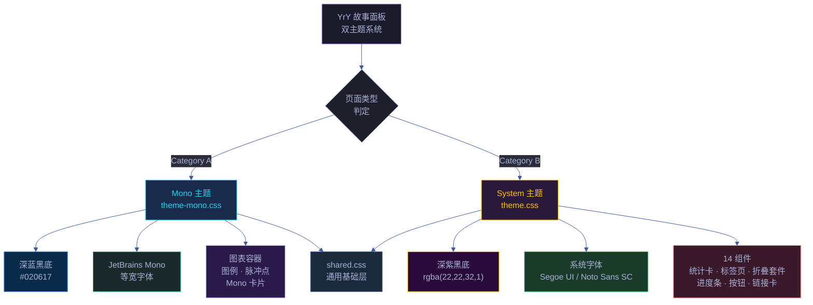
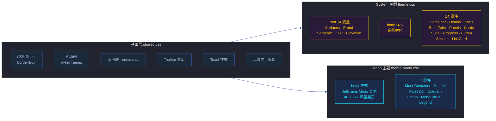

# 场景-2-双主题系统设计

> **所属故事**: yry-cdn
> **场景**: Category A（Mono）与 Category B（System）双主题设计
> **覆盖 Story#**: Story 2

## 效果示意

> 架构图页面（Cat A）和审查页面（Cat B）并排打开，呈现截然不同的视觉风格：前者是深蓝黑底的终端风格，后者是深紫黑底的应用界面风格。

| 维度 | Category A (Mono) | Category B (System) |
|------|-------------------|---------------------|
| 背景色 | `#020617` 深蓝黑 | `rgba(22,22,32,1)` 深紫黑 |
| 字体 | JetBrains Mono 等宽 | 系统 UI 字体（Segoe / Noto Sans SC） |
| 容器 | `.yry-mono-container` 1200px | `.yry-container` 1120px |
| 卡片 | `.yry-mono-card` 半透明+圆角 | `.yry-card` 渐变+阴影+悬停 |
| 统计区 | `.yry-mono-cards` Grid | `.yry-stats` > `.yry-stat` Flex |
| 图标语言 | 脉冲圆点 + 彩色标识点 | 语义色值（绿/红/黄/灰） |
| 页面类型 | 架构图 · 知识图谱 | 审查 · 测试面板 · 演示 · 计划清单 · plan |
| 外部依赖 | Google Fonts | 无 |
| CSS 文件 | theme-mono.css (6.1 KB) | theme.css (11.3 KB) |

## 主要价值

| # | 价值 | 说明 |
|---|------|------|
| 🎭 | **场合适配** | 架构图表用等宽字体获得技术文档的专业感，审查页面用系统字体获得舒适阅读感 |
| 🧬 | **命名空间隔离** | Mono 组件用 `.yry-mono-*` 前缀，System 组件用 `.yry-*` 前缀，互不冲突 |
| 📐 | **独立演化** | 两套主题可独立迭代，不担心修改会影响对方的页面 |
| 🎨 | **设计令牌统一** | System 主题通过 CSS 变量统一视觉语言，14 个组件的颜色全部通过 var() 引用 |

---

## §0 技术评审

### §0.1 主题架构

### §0.2 设计令牌对比

| 令牌分组 | System (theme.css) | Mono (theme-mono.css) |
|---------|--------------------|------------------------|
| 背景色 | `--yry-bg: rgba(22,22,32,1)` (深紫黑) | `body { background: #020617 }` (深蓝黑) |
| 卡片面 | `--yry-bg-card: linear-gradient(...)` (渐变) | `background: rgba(15,23,42,.5)` (半透明) |
| 品牌色 | `--yry-accent: #FFC107` (琥珀金) | 硬编码 `#22d3ee` (cyan) / `#fbbf24` (amber) |
| 语义色 | `--yry-pass/fail/warn` 绿/红/黄 | 硬编码 `#22c55e` / `#ef4444` / `#f59e0b` |
| 文字色 | `--yry-text/text2/text3` 三档 | `white` / `#94a3b8` / `#475569` 硬编码 |
| 圆角 | `--yry-radius: 12px` | `0.5rem` / `0.75rem` / `1rem` 硬编码 |
| 阴影 | `--yry-shadow / --yry-shadow-lg` | 无阴影（扁平设计） |

> 证据: `cdn/theme.css:11–39` — :root CSS 变量定义
> 证据: `cdn/theme-mono.css:13–19` — body 背景

### §0.3 设计决策

| 决策 | 选择 | 理由 |
|------|------|------|
| Mono 不使用 CSS 变量 | 硬编码颜色值 | Mono 主题是固定视觉方案，不需要跨组件复用 |
| System 使用 CSS 变量 | `:root` 14 变量 | 14 组件共享设计令牌，变量使颜色调整一次生效全局 |
| 双文件非单文件 | 两个独立 CSS 文件 | 按需加载，Cat B 页面不加载 Mono 样式（节省 ~6 KB） |
| shared.css 为共有基础 | 抽取交集 | Reset/动画/导航/Toolbar/Toast 两个主题都用到 |

### §0.4 响应式设计

| 断点 | System | Mono |
|------|--------|------|
| ≤ 768px | `.yry-container` padding → `24px 12px`，标题字号缩小，统计卡片 gap 缩小 | — |
| ≤ 640px | — | `body` padding → `1rem`，`.yry-mono-container` padding → `0` |

> 证据: `cdn/theme.css:217–223` — System 响应式
> 证据: `cdn/theme-mono.css:104–107` — Mono 响应式

### §0.5 动画体系

| 动画名称 | 定义位置 | 用途 | 使用方 |
|---------|---------|------|--------|
| `yry-fadeInUp` | shared.css | 面板内容淡入上浮 | System (.yry-panel, .yry-section) |
| `yry-fadeInDown` | shared.css | 标题/导航淡入下移 | System (.yry-header, .yry-stats, .yry-tabs, .yry-bar-wrap) |
| `yry-slideDown` | shared.css | 折叠套件展开 | System (.yry-suite-body) |
| `yry-pulse` | shared.css | Toast 脉冲光晕 | System (.yry-toast) |
| `yry-modalIn` | shared.css | 弹窗淡入缩放 | 预留 |
| `yry-stepIn` | shared.css | 步骤条滑入 | 预留 |
| `yry-pulse-mono` | theme-mono.css | 脉冲点呼吸 | Mono (.yry-pulse-dot) |

> 证据: `cdn/shared.css:15–20` — 6 个 @keyframes
> 证据: `cdn/theme-mono.css:41` — `@keyframes yry-pulse-mono`

### §0.6 安全考量

| # | 信号 | 风险 | 缓解 |
|---|------|------|------|
| S1 | CSS 变量通过 :root 注入 | 页面内联样式覆盖变量破坏视觉 | 变量定义在 CDN 主题文件，页面专属样式在 `<style>` 中后加载，有意覆盖为特性非缺陷 |
| S2 | Google Fonts 外部请求 | 隐私泄露（字体服务商跟踪） | 仅加载字体文件 CSS，不加载 JS；可替换为自托管字体 |

---

### 基线溯源

| 来源 | 行号 | 内容 |
|------|------|------|
| `cdn/theme.css` | 11–39 | :root 14 CSS 变量定义 |
| `cdn/theme.css` | 42–224 | 14 组件样式全量 |
| `cdn/theme-mono.css` | 13–19 | body 背景+字体 |
| `cdn/theme-mono.css` | 22–108 | Mono 组件全量 |
| `cdn/README.md` | 17–42 | Category A/B 页面分类与加载 |
| `cdn/README.md` | 46–65 | 组件速查表 |

---

## §1 测试设计

### §1.1 测试策略

| 层级 | 类型 | 工具 | 范围 |
|------|------|------|------|
| L1 视觉验证 | 截图对比 | 浏览器 | Cat A 页面 × 3，Cat B 页面 × 3 |
| L2 令牌验证 | CSS 变量取值 | DevTools | theme.css :root 14 变量 |
| L3 组件覆盖 | 组件存在性 | DOM 查询 | Cat B 14 组件，Cat A 7 组件 |
| L4 响应式 | 视口缩放 | DevTools | 768px / 640px 断点 |

### §1.2 测试用例

#### TC1 — System 主题设计令牌完整性

| 维度 | 内容 |
|------|------|
| 测试目标 | 验证 theme.css :root 中 14 个 CSS 变量全部定义 |
| 前置条件 | 任意 Category B 页面 |
| 步骤 | 1. DevTools → Elements → Styles → :root 2. 计数 `--yry-*` 变量 |
| 期望 | 14 个变量：bg×4 + accent×2 + pass/fail/warn/info/skip + text×3 + shadow×2 + radius + border |
| Gate A 交接 | `Array.from(document.styleSheets).flatMap(s => [...s.cssRules]).filter(r => r.selectorText === ':root').length > 0` |

#### TC2 — Mono 主题与 System 主题视觉差异

| 维度 | 内容 |
|------|------|
| 测试目标 | 验证两套主题产生可区分的视觉风格 |
| 前置条件 | 打开一个 Cat A 页面和一个 Cat B 页面 |
| 步骤 | 1. 截图 Cat A 页面 2. 截图 Cat B 页面 3. 对比：背景色/字体/卡片样式 |
| 期望 | ① Cat A 背景 `#020617`，等宽字体 ② Cat B 背景深紫黑，系统字体 ③ 两者视觉风格明显不同 |
| Gate A 交接 | 截图对比通过 |

#### TC3 — 组件互不污染

| 维度 | 内容 |
|------|------|
| 测试目标 | 验证 Cat A 页面不加载 System 组件，Cat B 页面不加载 Mono 组件 |
| 前置条件 | Cat A 页面 |
| 步骤 | 1. DevTools → Elements → Styles → Computed 2. 搜索 `.yry-container`（System 组件） 3. 在 Cat A 页面搜索 `.yry-mono-container`（Mono 组件） |
| 期望 | Cat A 页面：`.yry-container` 无样式（theme.css 未加载），`.yry-mono-container` 有样式 Cat B 页面：`.yry-mono-container` 无样式，`.yry-container` 有样式 |
| Gate A 交接 | 交叉验证通过 |

#### TC4 — 响应式断点

| 维度 | 内容 |
|------|------|
| 测试目标 | 验证 System 主题在 ≤768px 视口下的样式调整 |
| 前置条件 | Cat B 页面 |
| 步骤 | 1. DevTools → 切换视口 375px（手机） 2. 检查 `.yry-container` padding 3. 检查 `.yry-stat` 最小宽度 |
| 期望 | ① padding 减小为 `24px 12px` ② 统计卡片字号缩小 ③ 布局无溢出 |
| Gate A 交接 | 375px 视口下页面可读无横向滚动 |

---

### §1.3 Gate A 交接信号

| # | 信号 | 验证命令 | 期望值 |
|---|------|---------|--------|
| G1 | System CSS 变量 | `getComputedStyle(document.documentElement).getPropertyValue('--yry-accent')` | 非空字符串（Cat B 页面） |
| G2 | Mono 背景色 | `getComputedStyle(document.body).backgroundColor` | `rgb(2, 6, 23)` ± 1（Cat A 页面） |
| G3 | Mono 字体 | `getComputedStyle(document.body).fontFamily` | 含 `"JetBrains Mono"` |
| G4 | 动画存在 | `document.styleSheets` 含 `yry-fadeInUp` 定义 | true |
| G5 | 响应式生效 | 375px 视口 `.yry-container` padding | `24px 12px` |

---

> **约束**: 只读源码 · 场景 §2–§4 由 code 阶段填充
> **末端触发**: rui-import + rui-bot 手动触发

## 回溯链

| 角色 | 来源 | 证据 |
|------|------|------|
| 源码 | `cdn/theme.css:11–39` | :root 14 CSS 变量 |
| 源码 | `cdn/theme-mono.css:13–19` | body 样式 Mono |
| 文档 | `cdn/README.md:17–42` | Category A/B 加载说明 |

### 变更记录

| 日期 | 版本 | 变更 | 触发 |
|------|------|------|------|
| 2026-06-07 | 1.0.0 | 初始生成 | `/rui doc --from-code cdn` |
