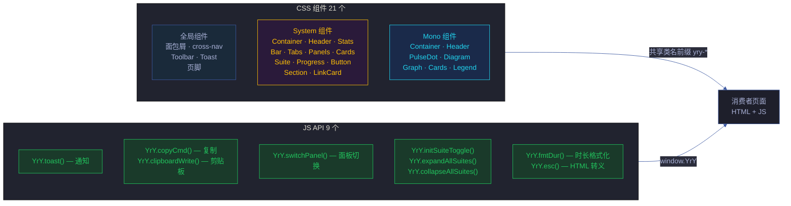
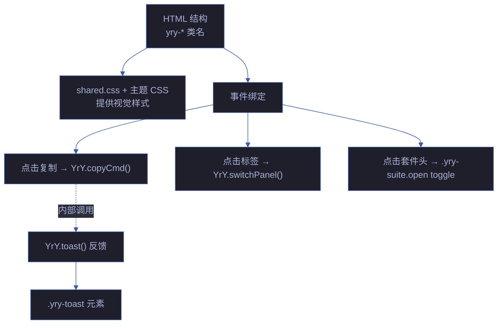

# 场景-3-组件库与JS工具API

> **所属故事**: yry-cdn
> **场景**: 可复用 UI 组件库与 JS 工具 API 使用
> **覆盖 Story#**: Story 3, Story 4



## 效果示意

> 开发者只需在 HTML 中使用 `yry-*` 类名和调用 `YrY.*` API，即可获得统一的组件外观和交互行为，无需编写任何 CSS 或 JS 逻辑。

| 需求 | 传统做法 | CDN 做法 |
|------|---------|---------|
| 显示统计卡片 | 手写 CSS Grid + 颜色 + 动效 (~30 行) | `<div class="yry-stats">` (~3 行 HTML) |
| 标签页切换 | 手写 JS 事件 + CSS 显隐逻辑 (~40 行) | `YrY.switchPanel('tabName')` (1 行 JS) |
| 可折叠区 | 手写点击事件 + CSS 过渡 (~25 行) | `.yry-suite` 结构 + `YrY.initSuiteToggle()` |
| 复制按钮 | 手写 clipboard API + 状态管理 (~20 行) | `YrY.copyCmd(btn, 'text')` (1 行 JS) |

## 主要价值

| # | 价值 | 说明 |
|---|------|------|
| 🧱 | **开发效率** | 21 个 CSS 组件 + 9 个 JS API 覆盖故事面板常见 UI 需求 |
| 🔧 | **零配置使用** | 引入 CDN 即用，无需初始化、无需传参（除必要参数外） |
| 📊 | **数据可视化** | 统计卡片/健康条/进度条提供统一的数据呈现方式 |
| 🔒 | **安全内置** | YrY.esc() 防 XSS，YrY.toast() 使用 textContent 非 innerHTML |

---

## §0 技术评审

### §0.1 组件全景

```mermaid
%%{init: {'theme': 'base', 'themeVariables': {
  'primaryColor': '#1e1f2b',
  'primaryTextColor': '#a9b1d6',
  'primaryBorderColor': '#3d59a1',
  'lineColor': '#3d59a1',
  'secondaryColor': '#2b2d3b',
  'tertiaryColor': '#21232f'
}}}%%
flowchart TD
    subgraph ALL["全页面通用（shared.css）"]
        BC["面包屑<br/>.yry-breadcrumb<br/>.yry-bc-sep / .yry-bc-current"]:::global
        CN["横向导航<br/>.yry-cross-nav<br/>.yry-cross-link / .yry-cross-sep"]:::global
        TB["导出工具栏<br/>.yry-toolbar<br/>.yry-toolbar-toggle / .yry-toolbar-actions"]:::global
        TOAST_CSS["Toast 样式<br/>.yry-toast<br/>position: fixed · z-index: 300"]:::global
        KBD["键盘提示<br/>.yry-kbd-hint"]:::global
        FT["页脚<br/>.yry-footer"]:::global
    end

    subgraph SYS_ALL["Category B 专属（theme.css）"]
        CT["容器<br/>.yry-container / .yry-container-sm"]:::sys
        HD["头部<br/>.yry-header h1 / .yry-sub"]:::sys
        STAT["统计卡片<br/>.yry-stats > .yry-stat<br/>.yry-stat-val / .yry-stat-lbl"]:::sys
        BAR["健康条<br/>.yry-bar-wrap > .yry-bar-outer<br/>.yry-seg.strength/.gap/.suggestion/.neutral"]:::sys
        TAB["标签页<br/>.yry-tabs > .yry-tab<br/>.yry-tab-badge"]:::sys
        PANEL["面板<br/>.yry-panel.on"]:::sys
        CARD["卡片<br/>.yry-card"]:::sys
        SUITE_CSS["折叠套件<br/>.yry-suite > .yry-suite-head<br/>.yry-suite-arrow / .yry-suite-badge<br/>.yry-suite-body"]:::sys
        PROG["进度条<br/>.yry-progress-wrap<br/>.yry-progress-label / .yry-progress-bar<br/>.yry-progress-fill"]:::sys
        BTN["按钮<br/>.yry-btn / .yry-btn.on"]:::sys
        SEC["章节<br/>.yry-section h2 / .yry-dot"]:::sys
        LC["链接卡<br/>.yry-link-grid > .yry-link-card<br/>.yry-lc-icon / .yry-lc-name / .yry-lc-desc"]:::sys
    end

    to Mono["... Mono 主题专属组件"
    详见场景-2]
```

### §0.2 JS API 详细设计

#### YrY.toast(msg, duration?)

```mermaid
%%{init: {'theme': 'base', 'themeVariables': {
  'primaryColor': '#1e1f2b',
  'primaryTextColor': '#a9b1d6',
  'primaryBorderColor': '#3d59a1',
  'lineColor': '#3d59a1',
  'secondaryColor': '#2b2d3b',
  'tertiaryColor': '#21232f'
}}}%%
flowchart LR
    CALL["YrY.toast('消息', 3000)"]:::entry --> FIND["查找/创建<br/>.yry-toast 元素"]:::step
    FIND --> TEXT["el.textContent = msg<br/>（防 XSS）"]:::step
    TEXT --> SHOW["添加 .show 类<br/>opacity: 1"]:::step
    SHOW --> TIMER["clearTimeout + setTimeout<br/>duration ms 后移除 .show"]:::step
    TIMER --> HIDE["opacity: 0<br/>pointer-events: none"]:::end

    classDef entry fill:#1a2a3a,stroke:#3d59a1,color:#a9b1d6
    classDef step fill:#2a1a3a,stroke:#FFC107,color:#a9b1d6
    classDef end fill:#1a3a2a,stroke:#22c55e,color:#a9b1d6
```

| 参数 | 类型 | 默认值 | 说明 |
|------|------|--------|------|
| msg | string | 必填 | 显示文本（textContent 赋值，内置防 XSS）|
| duration | number | 1800 | 显示时长 ms |

> 证据: `cdn/shared.js:14–22`

#### YrY.copyCmd(btn, cmd)

| 参数 | 类型 | 说明 |
|------|------|------|
| btn | HTMLElement | 触发按钮元素 |
| cmd | string | 要复制的文本 |

状态机: `📋` (初始) → 点击 → `✅` (1.5s) → `📋` (恢复)

> 证据: `cdn/shared.js:25–32`

#### YrY.switchPanel(name, tabSelector?, panelSelector?)

| 参数 | 类型 | 默认值 | 说明 |
|------|------|--------|------|
| name | string | 必填 | 标签名（对应 tab.dataset.panel） |
| tabSelector | string | `.yry-tab` | 标签选择器 |
| panelSelector | string | `.yry-panel` | 面板选择器 |

面板 ID 约定: `id="panel<Name>"`（首字母大写），如 `name="summary"` → `id="panelSummary"`

> 证据: `cdn/shared.js:35–44`

#### YrY.initSuiteToggle(containerSelector?)

| 参数 | 类型 | 默认值 | 说明 |
|------|------|--------|------|
| containerSelector | string | `.yry-container` | 事件委托容器 |

使用事件委托模式：点击 `.yry-suite-head` → 最近 `.yry-suite` 切换 `.open` 类。

> 证据: `cdn/shared.js:47–55`

#### YrY.expandAllSuites(scope?) / YrY.collapseAllSuites(scope?)

| 参数 | 类型 | 说明 |
|------|------|------|
| scope | Element | 搜索范围，默认 document |

> 证据: `cdn/shared.js:58–63`

#### YrY.fmtDur(ms)

```text
142 → "142ms"
1500 → "1.5s"
0.5 → "<1ms"
null → ""
```

> 证据: `cdn/shared.js:66–71`

#### YrY.esc(s)

转义 `&` `<` `>` `"` 为 HTML 实体。

> 证据: `cdn/shared.js:74–77`

#### YrY.clipboardWrite(text, onSuccess, onFail)

| 参数 | 类型 | 说明 |
|------|------|------|
| text | string | 写入剪贴板的文本 |
| onSuccess | function | 成功回调 |
| onFail | function | 失败回调（默认显示 Toast） |

> 证据: `cdn/shared.js:80–86`

### §0.3 组件交互联动



### §0.4 性能与可访问性

| 维度 | 决策 | 说明 |
|------|------|------|
| CSS 选择器 | 单类选择器 | 全部用 `.yry-*` 单类，不用后代/属性选择器，保持低特异性 |
| JS 事件 | 事件委托 | `initSuiteToggle` 用委托而非每个套件绑定，减少内存 |
| 动画 | GPU 加速 | `transform` + `opacity` 过渡，避免 `width`/`height` 动画 |
| 可访问性 | 角色缺失 | 当前 Tab 面板、折叠套件无 ARIA 属性 — **待改进** |
| 焦点管理 | 无焦点环 | `.yry-btn` 无 `:focus-visible` 样式 — **待改进** |

### §0.5 安全考量

| # | 信号 | 风险 | 缓解 |
|---|------|------|------|
| S1 | YrY.toast 使用 textContent | XSS 注入 | ✅ textContent 自动转义，安全 |
| S2 | YrY.esc 输出到 HTML | 不完整转义导致注入 | ✅ 覆盖 `& < > "` 四个关键字符 |
| S3 | YrY.copyCmd 写入剪贴板 | 恶意 JS 覆盖剪贴板 | ✅ 需用户点击触发，非自动执行 |
| S4 | CSS 注入 | `var(--yry-*)` 引用未定义变量 | 浏览器忽略无效 var() 引用，非安全问题 |
| S5 | 无 CSP | inline style/script 未受 CSP 限制 | 项目内工具页面，无需 CSP |

---

### 基线溯源

| 来源 | 行号 | 内容 |
|------|------|------|
| `cdn/shared.css` | 22–79 | 面包屑/cross-nav/Toolbar/Toast 样式 |
| `cdn/theme.css` | 50–213 | 14 System 组件全量 |
| `cdn/theme-mono.css` | 22–101 | Mono 组件全量 |
| `cdn/shared.js` | 14–22 | YrY.toast() |
| `cdn/shared.js` | 25–32 | YrY.copyCmd() |
| `cdn/shared.js` | 35–44 | YrY.switchPanel() |
| `cdn/shared.js` | 47–63 | Suite toggle/expand/collapse |
| `cdn/shared.js` | 66–86 | fmtDur/esc/clipboardWrite |

---

## §1 测试设计

### §1.1 测试策略

| 层级 | 类型 | 工具 | 范围 |
|------|------|------|------|
| L1 API 单元 | 浏览器 console | 手动 | 9 个 API 逐个调用 |
| L2 组件渲染 | 截图对比 | 浏览器 | 14 个 System 组件 |
| L3 交互集成 | 页面操作 | 手动 | Toast+复制+面板切换+折叠联动 |
| L4 边界值 | 参数边界 | 手动 | 空值/null/超长字符串 |

### §1.2 测试用例

#### TC1 — YrY.toast() 全场景

| 维度 | 内容 |
|------|------|
| 测试目标 | 验证 Toast 在各种参数下的行为 |
| 步骤 | 1. `YrY.toast('默认时长')` — 观察 1.8s 消失<br>2. `YrY.toast('自定义', 5000)` — 观察 5s 消失<br>3. `YrY.toast('A'); YrY.toast('B')` 快速连调 — B 替换 A<br>4. `YrY.toast('<script>alert(1)</script>')` — 验证转义 |
| 期望 | ① 默认 1.8s<br>② 自定义时长生效<br>③ 后调替换前调<br>④ 脚本标签作为纯文本显示 |
| Gate A 交接 | `YrY.toast('gate-test')` → Toast 显示且 `document.querySelector('.yry-toast').textContent` = `'gate-test'` |

#### TC2 — YrY.copyCmd() 视觉反馈

| 维度 | 内容 |
|------|------|
| 测试目标 | 验证复制按钮的三态切换 |
| 步骤 | 1. 创建 `<button onclick="YrY.copyCmd(this,'test')">📋</button>`<br>2. 点击按钮<br>3. 检查剪贴板 |
| 期望 | ① 按钮文字变为 ✅<br>② 按钮添加 `.done` 类<br>③ 1.5s 后恢复 📋<br>④ `navigator.clipboard.readText()` = `'test'` |
| Gate A 交接 | 点击复制按钮 → 剪贴板内容匹配 |

#### TC3 — YrY.switchPanel() 面板切换

| 维度 | 内容 |
|------|------|
| 测试目标 | 验证标签面板切换 |
| 步骤 | 1. 准备 HTML：`.yry-tab[data-panel=foo]` + `#panelFoo.yry-panel`<br>2. `YrY.switchPanel('foo')`<br>3. 检查标签和面板状态 |
| 期望 | ① `.yry-tab[data-panel=foo]` 添加 `.on`<br>② `#panelFoo` 添加 `.on`<br>③ 原激活的标签/面板移除 `.on` |
| Gate A 交接 | `document.querySelector('#panelFoo.on') !== null` |

#### TC4 — 折叠套件交互

| 维度 | 内容 |
|------|------|
| 测试目标 | 验证折叠套件的全部交互 |
| 步骤 | 1. `YrY.initSuiteToggle()`<br>2. 点击 `.yry-suite-head` → 套件展开<br>3. 再次点击 → 套件收起<br>4. `YrY.expandAllSuites()` → 全部展开<br>5. `YrY.collapseAllSuites()` → 全部收起 |
| 期望 | ① 单击展开，箭头旋转 90°<br>② 再次单击收起<br>③ expandAll/collapseAll 批量操作 |
| Gate A 交接 | `document.querySelectorAll('.yry-suite.open').length > 0` |

#### TC5 — YrY.fmtDur() 边界值

| 维度 | 内容 |
|------|------|
| 测试目标 | 验证时长格式化 |
| 步骤 | `YrY.fmtDur(null)` → `''`<br>`YrY.fmtDur(0)` → `'<1ms'`<br>`YrY.fmtDur(0.5)` → `'<1ms'`<br>`YrY.fmtDur(142)` → `'142ms'`<br>`YrY.fmtDur(1500)` → `'1.5s'` |
| 期望 | 各输入对应正确输出 |
| Gate A 交接 | 全部 5 个边界值匹配 |

#### TC6 — YrY.esc() 安全转义

| 维度 | 内容 |
|------|------|
| 测试目标 | 验证 HTML 转义正确 |
| 步骤 | `YrY.esc('')` → `''`<br>`YrY.esc(null)` → `''`<br>`YrY.esc('<script>')` → `'&lt;script&gt;'`<br>`YrY.esc('a & b')` → `'a &amp; b'`<br>`YrY.esc('"quoted"')` → `'&quot;quoted&quot;'` |
| 期望 | HTML 特殊字符被正确转义 |
| Gate A 交接 | 全部 5 个输入匹配期望输出 |

---

### §1.3 Gate A 交接信号

| # | 信号 | 验证命令 | 期望值 |
|---|------|---------|--------|
| G1 | YrY 对象 | `typeof YrY` | `"object"` |
| G2 | 9 个 API | `Object.keys(YrY).sort().join(',')` | `clipboardWrite,collapseAllSuites,copyCmd,esc,expandAllSuites,fmtDur,initSuiteToggle,switchPanel,toast` |
| G3 | Toast 防 XSS | `YrY.toast('<b>test</b>')` → `.yry-toast` 的 innerHTML | `&lt;b&gt;test&lt;/b&gt;`（textContent 结果） |
| G4 | 套件交互 | `YrY.initSuiteToggle()` 无异常 | true |

---

> **约束**: 只读源码 · 场景 §2–§4 由 code 阶段填充
> **末端触发**: rui-import + rui-bot 手动触发

## 回溯链

| 角色 | 来源 | 证据 |
|------|------|------|
| 源码 | `cdn/shared.css:1–94` | 全局组件 CSS |
| 源码 | `cdn/theme.css:50–213` | System 组件 CSS |
| 源码 | `cdn/theme-mono.css:22–101` | Mono 组件 CSS |
| 源码 | `cdn/shared.js:10–100` | 9 个 JS API 实现 |

### 变更记录

| 日期 | 版本 | 变更 | 触发 |
|------|------|------|------|
| 2026-06-07 | 1.0.0 | 初始生成 | `/rui doc --from-code cdn` |
