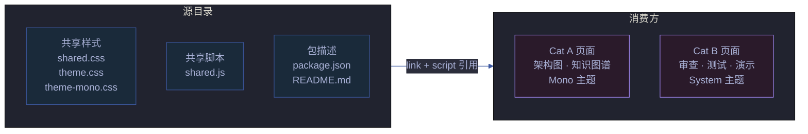

# 故事任务 — yry-cdn

> **版本**: 1.0.0
> **项目类型**: meta — 共享前端资源库
> **故事**: CDN 共享前端资源管理与演进

## 主要价值

| # | 价值 | 说明 |
|---|------|------|
| 🎨 | **视觉一致性** | 55+ 页面共享统一主题、组件、动画，避免样式碎片化 |
| ♻️ | **消除重复** | CSS Reset、面包屑、Toast 等通用样式不再在每个页面内联重复 |
| 🧩 | **组件复用** | 统计卡片、标签页、折叠套件、进度条等组件开箱即用 |
| ⚡ | **加载效率** | 浏览器缓存 CDN 资源，页面间导航无需重复下载 |
| 🛠️ | **集中维护** | 样式/脚本修改一次生效全局，降低维护成本 |
| 📦 | **npm 可分发** | package.json 定义包规范，具备独立发布能力 |

## §1 Story

### Story 1: CDN 资源加载与页面渲染

| 字段 | 内容 |
|------|------|
| 作为 | 页面浏览者 |
| 我想要 | 打开任何故事面板页面时获得一致的视觉体验 |
| 以便 | 可以流畅地在不同页面间导航，不被样式差异干扰 |
| 优先级 | P0 |
| 范围边界 | CDN CSS/JS 加载链稳定，页面渲染正常 |
| 依赖 | 页面正确引用 CDN 资源路径 |

##### 范围外

- 不涉及页面专属样式和业务逻辑

##### §1.1 User Operations

| # | 操作 | 触发条件 | 操作步骤 | 预期结果 |
|---|------|---------|---------|---------|
| 1 | 打开 Category B 页面 | 访问审查/测试/演示/计划页面 | HTML 加载 shared.css → theme.css → shared.js → 页面渲染 | 深紫黑底 + 系统字体主题，面包屑/导航/Toolbar 正常 |
| 2 | 打开 Category A 页面 | 访问架构图/知识图谱页面 | HTML 加载 Google Fonts → shared.css → theme-mono.css → shared.js → 页面渲染 | 深蓝黑底 + JetBrains Mono 等宽字体，图表容器/图例正常 |
| 3 | 页面内导航 | 点击面包屑链接或 cross-nav 链接 | 浏览器导航到目标页面 | 目标页面以相同主题渲染，动画过渡流畅 |

---

### Story 2: 主题系统 — 双主题视觉区分

| 字段 | 内容 |
|------|------|
| 作为 | 内容创作者 |
| 我想要 | 为不同类型页面选择匹配的视觉主题 |
| 以便 | 架构图表获得等宽字体的专业感，审查面板获得系统字体的舒适阅读感 |
| 优先级 | P0 |
| 范围边界 | 两套主题 CSS 完整覆盖各自页面类型的全部组件 |
| 依赖 | Story 1 资源加载链正常 |

##### 范围外

- 不涉及新增第三套主题
- 不涉及主题运行时切换（暗色/亮色）

##### §1.1 User Operations

| # | 操作 | 触发条件 | 操作步骤 | 预期结果 |
|---|------|---------|---------|---------|
| 1 | 主题自动匹配 | 页面加载时 | 按页面类型引入对应 theme CSS | 架构图/知识图谱 = Mono 主题；审查/测试/演示/计划 = System 主题 |
| 2 | 组件一致性 | 使用 yry-* 前缀 CSS 类 | 在页面 HTML 中应用对应类名 | 组件在所属主题下正确渲染 |

---

### Story 3: JS 工具 API — 交互增强

| 字段 | 内容 |
|------|------|
| 作为 | 页面开发者 |
| 我想要 | 在页面中使用统一的 JS 工具方法 |
| 以便 | 不需要在每个页面重复编写 Toast/复制/面板切换逻辑 |
| 优先级 | P0 |
| 范围边界 | 9 个 YrY.* API 方法全部可用，兼容主流浏览器 |
| 依赖 | shared.js 在 shared.css 之后成功加载 |

##### 范围外

- 不涉及新增 API 方法（属于后续演进）
- 不涉及框架集成（React/Vue wrapper）

##### §1.1 User Operations

| # | 操作 | 触发条件 | 操作步骤 | 预期结果 |
|---|------|---------|---------|---------|
| 1 | 显示 Toast 通知 | 调用 `YrY.toast('消息')` | JS 创建/复用 `.yry-toast` 元素 → 显示文本 → 1.8s 后自动隐藏 | 页面底部居中显示消息，自动消失 |
| 2 | 复制命令 | 点击复制按钮 | `YrY.copyCmd(btn, 'cmd')` → 剪贴板写入 → 按钮显示 ✅ → 1.5s 恢复 | 命令已复制，按钮视觉反馈 |
| 3 | 切换标签面板 | 点击标签页 | `YrY.switchPanel('tabName')` → 标签高亮 + 对应面板显示 | 目标面板内容可见，其他面板隐藏 |
| 4 | 展开/收起折叠套件 | 点击套件头部 | `YrY.initSuiteToggle()` 初始化 → 点击头部切换 `.open` | 套件体展开/收起，箭头旋转动画 |
| 5 | 一键展开/收起全部 | 调用 `YrY.expandAllSuites()` / `YrY.collapseAllSuites()` | 所有 `.yry-suite` 添加/移除 `.open` | 全部套件同步展开或收起 |

---

### Story 4: 组件库 — 可复用 UI 组件

| 字段 | 内容 |
|------|------|
| 作为 | 页面开发者 |
| 我想要 | 使用预置的 UI 组件快速搭建页面 |
| 以便 | 不重新发明轮子，页面结构统一，开发效率提升 |
| 优先级 | P1 |
| 范围边界 | 14 个组件（面包屑/导航/Toolbar/Toast/容器/头部/统计卡/健康条/标签页/折叠套件/进度条/按钮/链接卡/章节）样式完整，交互行为由 shared.js 驱动 |
| 依赖 | shared.css + 对应主题 CSS 加载完成 |

##### 范围外

- 不涉及新增组件
- 不涉及组件服务端渲染

##### §1.1 User Operations

| # | 操作 | 触发条件 | 操作步骤 | 预期结果 |
|---|------|---------|---------|---------|
| 1 | 使用统计卡片 | 页面需要展示统计数据 | HTML 添加 `.yry-stats` > `.yry-stat` 结构 | 卡片网格展示，悬停上浮效果 |
| 2 | 使用标签页 | 页面需要分区展示内容 | HTML 添加 `.yry-tabs` + `.yry-panel` 结构 | 点击标签切换面板 |
| 3 | 使用折叠套件 | 页面需要可折叠内容区 | HTML 添加 `.yry-suite` > `.yry-suite-head` + `.yry-suite-body` | 点击头部展开/收起 |
| 4 | 使用进度条 | 页面需要展示进度 | HTML 添加 `.yry-progress-wrap` > `.yry-progress-fill` | 进度条以品牌渐变色填充 |
| 5 | 使用链接卡 | 页面需要导航到关联页面 | HTML 添加 `.yry-link-grid` > `.yry-link-card` | 卡片网格，悬停上浮 + 金色边框 |

---

### Story 5: CDN 迁移 — 存量页面接入

| 字段 | 内容 |
|------|------|
| 作为 | 项目维护者 |
| 我想要 | 将存量页面的内联样式和脚本迁移到 CDN 引用 |
| 以便 | 减少重复代码，统一维护入口 |
| 优先级 | P2 |
| 范围边界 | 按迁移指南逐步替换，每次迁移后验证页面渲染一致性 |
| 依赖 | CDN 4 个资源文件稳定 |

##### 范围外

- 不涉及页面功能变更
- 不涉及修改页面专属样式（保留在页内 `<style>` 中）

##### §1.1 User Operations

| # | 操作 | 触发条件 | 操作步骤 | 预期结果 |
|---|------|---------|---------|---------|
| 1 | 识别可迁移样式 | 审查页面 `<style>` 内容 | 对比 CDN 覆盖清单，标记可删除的重复样式 | 列出可删除的 CSS 块清单 |
| 2 | 替换资源引用 | 确定页面类型（Cat A / Cat B） | 删除内联样式 → 添加 `<link>` 标签 → 添加 `<script>` 标签 | 页面视觉与迁移前一致 |
| 3 | 替换组件类名 | 页面使用旧类名 | 将旧类名替换为 `yry-*` 前缀版本 | 组件样式由 CDN 接管 |
| 4 | 替换 JS 调用 | 页面使用内联工具函数 | 将 `toast()` 替换为 `YrY.toast()` 等 | 交互行为由 shared.js 接管 |

---

## §2 Requirements

### 功能点

| FP# | 描述 | 输入 | 输出 | 错误行为 | 优先级 |
|-----|------|------|------|---------|--------|
| FP1 | 共享基础样式加载 — Reset + 动画 + 面包屑 + 导航 + Toolbar + Toast 在所有页面生效 | 页面引入 shared.css | 通用组件样式正确渲染 | shared.css 404 时页面丢失基础样式 | P0 |
| FP2 | 共享脚本加载 — YrY 全局对象在所有页面可用 | 页面引入 shared.js | `window.YrY` 含 9 个 API 方法 | shared.js 404 或加载失败时 YrY 未定义 | P0 |
| FP3 | System 主题加载 — 设计令牌 + 14 组件在 Category B 页面生效 | 页面引入 theme.css（在 shared.css 之后） | CSS 变量注入 :root，组件按深紫黑主题渲染 | theme.css 未加载时 Category B 页面仅有基础样式 | P0 |
| FP4 | Mono 主题加载 — JetBrains Mono 字体 + 图表容器在 Category A 页面生效 | 页面引入 Google Fonts + theme-mono.css | 等宽字体 + 深蓝黑底色 + 图表容器样式 | Google Fonts 不可达时回退系统等宽字体 | P1 |
| FP5 | Toast 通知 — 页面可显示自动消失的消息提示 | `YrY.toast(msg, duration?)` | 底部居中 Toast，默认 1.8s | 多次调用不叠加，新消息替换旧消息 | P0 |
| FP6 | 剪贴板复制 — 按钮点击复制文本到剪贴板 | `YrY.copyCmd(btn, cmd)` | 按钮图标变化 + 剪贴板写入 | 剪贴板 API 不可用时显示"复制失败" | P1 |
| FP7 | 标签面板切换 — 多面板页面切换显示 | `YrY.switchPanel(name)` | 目标标签高亮，对应面板显示 | 标签名不匹配时无变化 | P1 |
| FP8 | 折叠套件切换 — 可折叠内容区展开/收起 | `YrY.initSuiteToggle()` 初始化 + 点击头部 | 套件体展开/收起，箭头旋转 | 未初始化时点击无响应 | P1 |
| FP9 | 统计卡片渲染 — 数据指标卡片网格展示 | HTML 使用 `.yry-stats` > `.yry-stat` 结构 | 卡片网格，语义色值，悬停动效 | — | P1 |
| FP10 | 进度条渲染 — 进度百分比可视化 | HTML 使用 `.yry-progress-wrap` > `.yry-progress-fill` 结构 | 渐变色进度条，宽度过渡动画 | — | P2 |
| FP11 | 跨页面导航 — 面包屑 + cross-nav 链接导航 | HTML 使用 `.yry-breadcrumb` / `.yry-cross-nav` 结构 | 可点击链接，悬停高亮 | — | P1 |

### 业务规则

| R# | 描述 | 校验方式 | 证据级别 |
|----|------|---------|---------|
| R1 | 所有页面必须先加载 shared.css 再加载主题 CSS | 检查 HTML `<link>` 顺序 | A |
| R2 | shared.js 必须在 shared.css 之后加载（依赖 CSS 类名） | 检查 HTML 标签顺序 | A |
| R3 | Category A 页面必须额外引入 Google Fonts（JetBrains Mono） | 检查 HTML `<link>` 含 fonts.googleapis.com | A |
| R4 | Category B 页面不得引入 theme-mono.css | 检查 HTML 无 theme-mono.css 引用 | B |
| R5 | CSS 类名必须以 `yry-` 为前缀，避免与页面专属样式冲突 | Grep 类名前缀 | A |
| R6 | npm 包版本号遵循语义化版本 | 检查 package.json version 字段 | B |
| R7 | 迁移操作不得改变页面视觉和交互行为 | 迁移前后截图对比 | B |

### 数据约束

| 约束 | 类型 | 范围/格式 | 来源 |
|------|------|----------|------|
| CSS 文件加载顺序 | string[] | `["shared.css", "theme.css"|"theme-mono.css"]` | Category B / Category A 页面加载规范 |
| Google Fonts 引用 | URL | `https://fonts.googleapis.com/css2?family=JetBrains+Mono:...` | Category A 页面必需 |
| CDN 相对路径 | string | `../../../../cdn/<file>` | 页面在 `docs/故事任务面板/<name>/场景-N-<slug>/` 下 |
| YrY API 方法数 | number | 9 | shared.js 导出 |
| 主题数量 | number | 2 | Category A (Mono) + Category B (System) |
| 组件数量 | number | 14 | shared.css + theme.css + theme-mono.css 定义的 yry-* 类 |
| npm 版本 | semver | `MAJOR.MINOR.PATCH` | package.json |

---

## §3 成功标准

| SC# | 描述 | 度量方式 | 目标值 | 优先级 | 关联 FP# |
|-----|------|---------|--------|--------|---------|
| SC1 | 所有故事面板页面（55 个）正确加载 CDN 资源 | Grep `cdn/` 引用 + 页面打开检查 | 100% 页面无 404 | P0 | FP1–FP4 |
| SC2 | Category A/B 页面视觉主题正确 | 截图对比：架构图页面 vs 审查页面 | 明显视觉区分 | P0 | FP3, FP4 |
| SC3 | YrY.* API 9 个方法全部可用 | 浏览器 console 调用检查 | 9/9 方法无异常 | P0 | FP5–FP8 |
| SC4 | 迁移前后页面渲染一致 | 迁移页面截图对比 | 0 视觉差异 | P1 | — |
| SC5 | npm 包文件清单完整 | `npm publish --dry-run` | 无遗漏文件 | P1 | — |
| SC6 | CSS 无未使用选择器 | CSS 覆盖率分析 | 选择器使用率 ≥ 80% | P2 | FP9–FP10 |

---

## §4 范围边界

### 范围内

| # | 条目 | 关联 FP# | 边界说明 |
|---|------|---------|---------|
| 1 | 共享 CSS 样式（shared.css + theme.css + theme-mono.css） | FP1, FP3, FP4 | 全部故事面板页面的视觉基座 |
| 2 | 共享 JS 工具（shared.js） | FP2, FP5–FP8 | 9 个 API 方法的实现与维护 |
| 3 | 双主题系统维护 | FP3, FP4 | Category A (Mono) + Category B (System) 主题 |
| 4 | npm 包规范维护 | — | package.json 版本/文件清单/依赖描述 |
| 5 | 迁移指南执行 | — | 存量页面逐步接入 CDN |

### 范围外

| # | 条目 | 排除原因 | 替代方案 |
|---|------|---------|---------|
| 1 | 页面专属样式 | 每个页面的业务样式不属于 CDN | 保留在页面内 `<style>` 标签 |
| 2 | 新增第三套主题 | 当前双主题满足需求 | 需要时通过 `/rui update` 追加 |
| 3 | 运行时主题切换 | 页面加载时即确定主题，无动态切换需求 | — |
| 4 | CDN 服务端部署 | 当前通过本地相对路径引用，不涉及 CDN 服务端 | 需要时通过 `/rui update` 追加 |
| 5 | 框架级组件封装 | 项目无前端框架依赖，纯 HTML 页面 | — |

---

## §5 AC

| AC# | Given | When | Then | 门禁 |
|-----|-------|------|------|------|
| AC1 | 浏览器访问 Category B 页面 | 页面加载完成 | shared.css + theme.css CSS 变量注入，页面深紫黑底 + 系统字体 | Gate A |
| AC2 | 浏览器访问 Category A 页面 | 页面加载完成 | JetBrains Mono 字体 + theme-mono.css 生效，页面深蓝黑底 + 等宽字体 | Gate A |
| AC3 | 页面调用 `YrY.toast('复制成功')` | JS 执行 | 页面底部居中显示 Toast，1.8s 后自动消失 | Gate A |
| AC4 | 用户点击复制按钮 | `YrY.copyCmd(btn, 'git clone ...')` 执行 | 剪贴板含对应文本，按钮显示 ✅ 图标 | Gate A |
| AC5 | 页面存在折叠套件 | 用户点击套件头部 | 套件体展开，箭头旋转 90°，再次点击收起 | Gate A |
| AC6 | 存量页面上线 CDN 迁移 | 按迁移指南 6 步操作 | 页面渲染与迁移前一致，内联代码量减少 | Gate B |
| AC7 | npm 包发布 | `npm publish` | package.json files 清单中 5 个文件全部上传 | Gate B |

---

## §6 风险与假设

| # | 风险/假设 | 类型 | 可能性 | 影响 | 缓解/验证策略 | 关联 FP# |
|---|----------|------|--------|------|-------------|---------|
| 1 | Google Fonts CDN 不可达（国内网络）导致 Category A 页面字体回退 | 风险 | H | M | 系统已配置等宽字体回退（monospace），视觉可接受降级 | FP4 |
| 2 | shared.js 加载失败导致所有交互功能不可用 | 风险 | L | H | shared.js 通过本地相对路径加载，不依赖外部 CDN；添加 script error 事件处理 | FP2, FP5–FP8 |
| 3 | 迁移过程中误删页面专属样式导致视觉回归 | 风险 | M | M | 迁移指南明确"保留页面专属 CSS"；迁移前后截图对比 | — |
| 4 | CSS 类名冲突（yry-* 前缀与页面专属样式冲突） | 风险 | L | L | yry- 前缀命名空间隔离；冲突时页面专属样式优先级更高 | FP3, FP4 |
| 5 | CDN 文件变更影响 55 个消费者页面 | 风险 | M | M | 变更前影响分析 + 变更后全量页面回归 | FP1–FP4 |
| 6 | 双主题设计令牌不一致导致视觉割裂 | 风险 | L | M | 两套主题服务于不同类型页面，视觉差异是设计意图；基准截图留存 | FP3, FP4 |
| 7 | 新页面开发者不知道 CDN 存在而重复造轮子 | 风险 | H | L | README.md 迁移指南；rui init 时自动提示；code-review 检查 | — |
| 8 | npm 包与 git 仓库版本不同步 | 风险 | L | L | `/rui version --up` 同步更新 package.json | — |
| 9 | CDN 文件是静态资源能直接通过文件路径加载 | 假设 | — | — | 所有消费者使用相对路径 `../../../../cdn/` 引用 | FP1–FP4 |
| 10 | 55 个页面均遵循 Category A/B 分类 | 假设 | — | — | 按页面类型（架构图/知识图谱 = A，其他 = B）自动判定 | FP3, FP4 |

---

> **约束**: 分支隔离（`feat/yry-cdn`）· 只读源码 · 证据 Level A + 文件路径
> **产出**: 故事任务.md（本文件）· 场景-N-<slug>.md · 场景-N-<slug>.html · 知识图谱.json · 知识图谱.html
> **末端触发**: rui-import + rui-bot 手动触发

---

## 回溯链

| 角色 | 来源 | 证据 |
|------|------|------|
| 源码 | `/Users/yi/Yi/YrY/cdn/shared.css` | CSS Reset、动画、面包屑、cross-nav、Toolbar、Toast 定义 |
| 源码 | `/Users/yi/Yi/YrY/cdn/shared.js` | YrY IIFE 9 个公共 API |
| 源码 | `/Users/yi/Yi/YrY/cdn/theme.css` | :root 设计令牌、14 组件（Container/Header/Stats/Bar/Tabs/Panels/Cards/Suite/Progress/Button/Section/LinkCard） |
| 源码 | `/Users/yi/Yi/YrY/cdn/theme-mono.css` | JetBrains Mono 主题、图表容器、图例、脉冲点、卡片 |
| 源码 | `/Users/yi/Yi/YrY/cdn/package.json` | npm 包 `yry-cdn` v1.0.0 |
| 源码 | `/Users/yi/Yi/YrY/cdn/README.md` | 页面分类、组件速查表、JS API 参考、迁移指南 |

### 变更记录

| 日期 | 版本 | 变更 | 触发 |
|------|------|------|------|
| 2026-06-07 | 1.0.0 | 初始生成 — 从 CDN 源码反推故事文档基线 | `/rui doc --from-code cdn` |
