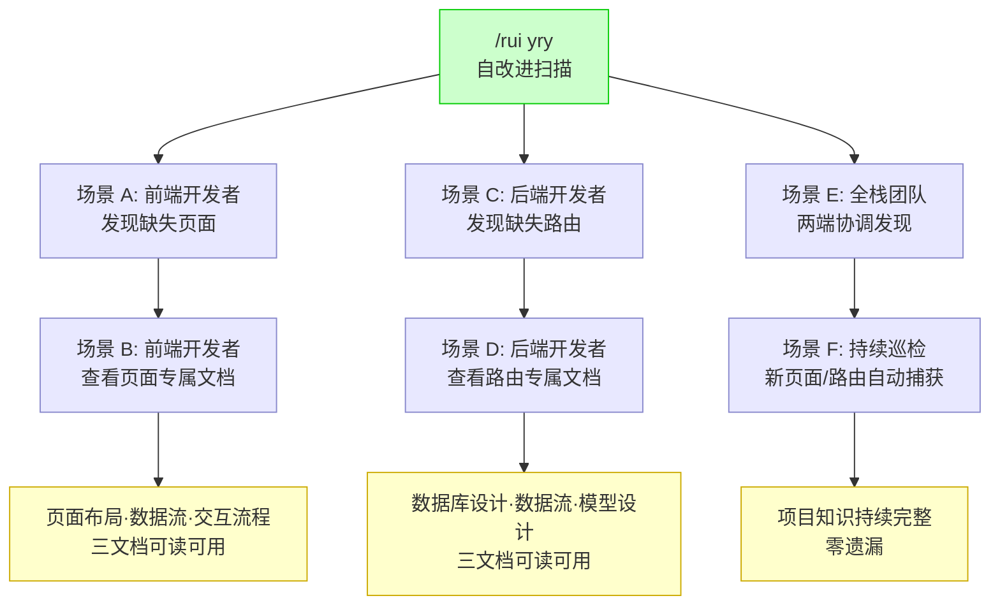
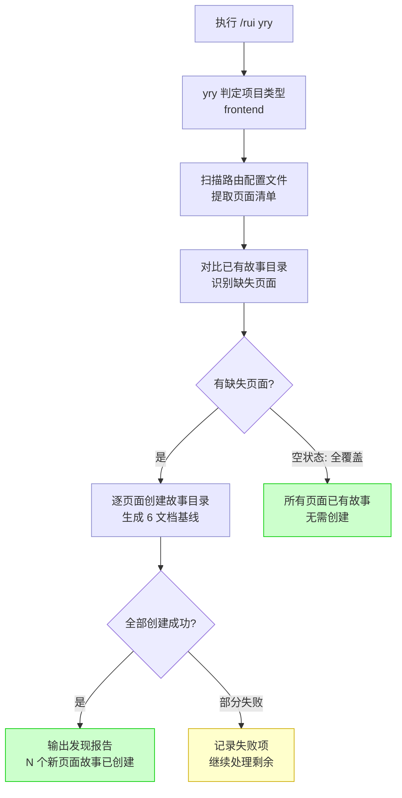
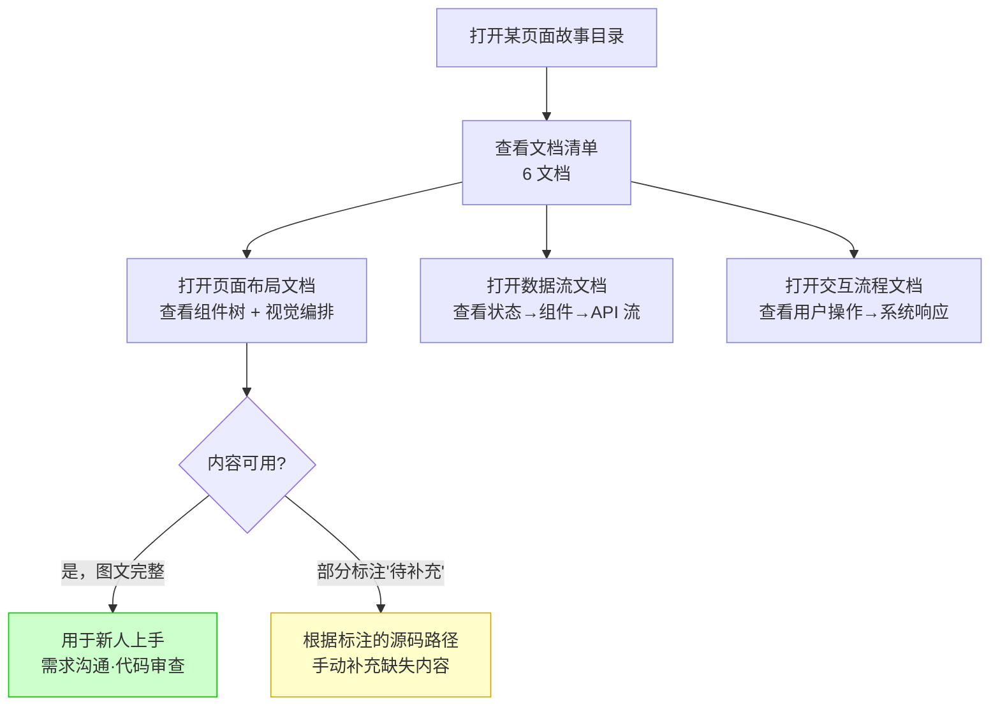
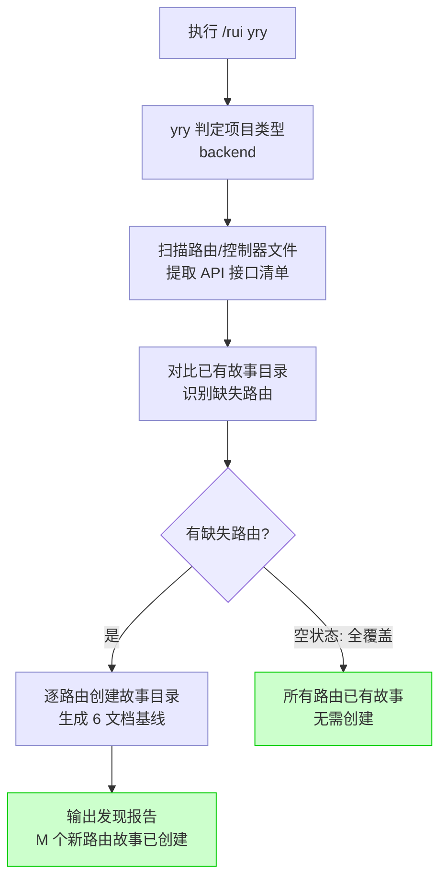
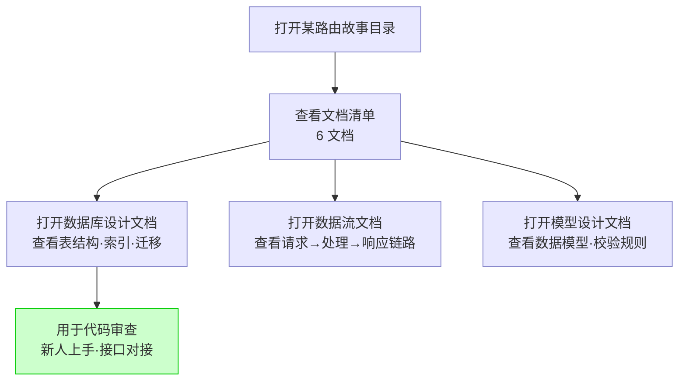
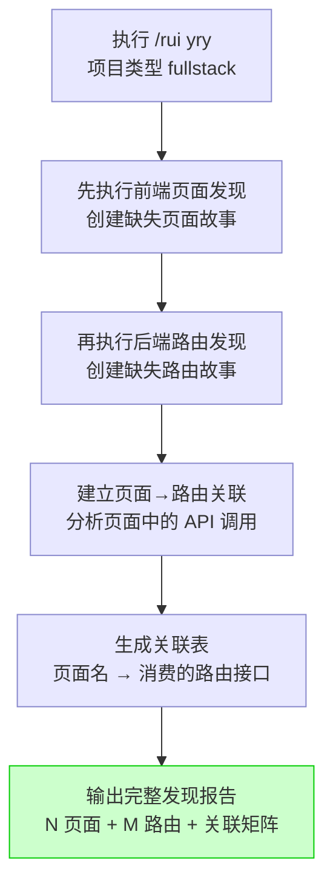

> | v1.0.0 | 2026-05-26 | deepseek-v4-pro | 🌿 feat/yry-discover | 📎 [CLAUDE.md](../../../CLAUDE.md) |

> **导航**: [← 故事任务](./故事任务.md) · [技术评审 →](./技术评审.md)

> **来源引用**: 由 yry-discover 故事基线建立触发，从 [故事任务](./故事任务.md) Story 1/2/3 的用户操作推导。证据 Level B + 故事任务 §1.1。

[§1 场景全景](#sec1-overview) · [§2 场景详述](#sec2-detail) · [§3 场景覆盖矩阵](#sec3-matrix) · [§4 评审清单](#sec4-checklist) · [§5 体验基线](#sec5-experience)

---

### 主要价值

- 🖥️ 前端项目一键补全 — 执行 yry 后每个页面自动拥有故事目录和页面布局/数据流/交互流程文档
- 🖧 后端项目一键补全 — 执行 yry 后每个路由接口自动拥有故事目录和数据库设计/数据流/模型设计文档
- 🔄 持续同步 — 新增页面或路由时 yry 自动检测并补全，项目知识永不落后
- 🔗 全栈关联 — 前端页面与其消费的后端路由建立显式关联，端到端可追溯

---

## §1 场景全景

---

## §2 场景详述

### 场景 A: 前端开发者 — 执行 yry 发现缺失页面

| 字段 | 内容 |
|------|------|
| 角色 | 前端项目开发者 |
| 触发条件 | 项目有多个页面但仅部分有故事文档，执行 `/rui yry` |
| 核心目标 | yry 自动扫描路由配置，为每个缺失页面创建故事目录和专属文档 |

| # | 步骤 | 输入 | 系统响应 | 异常分支 |
|---|------|------|---------|---------|
| 1 | 项目类型判定 | 项目目录结构 | 识别为 frontend，触发页面发现 | 类型判定为 unknown → 跳过页面发现，仅扫描已有故事 |
| 2 | 路由扫描 | 路由配置文件 | 提取全部页面路由路径和组件文件 | 路由文件格式不识别 → 报告"路由格式不支持"，列出支持格式 |
| 3 | 缺失检测 | 页面清单 + 已有故事目录列表 | 输出缺失页面列表，标注对应源文件 | 故事面板目录不存在 → 全部页面视为缺失 |
| 4 | 创建故事目录 | 缺失页面名 + 组件源码 | 逐页面创建故事目录，生成 6 文档 | 组件源码不可读 → 文档标 Level C，记录"源码不可读" |

---

### 场景 B: 前端开发者 — 查看自动生成的页面专属文档

| 字段 | 内容 |
|------|------|
| 角色 | 前端项目开发者 |
| 触发条件 | yry 已为缺失页面创建故事目录，需要查看某页面的专属文档 |
| 核心目标 | 在页面故事目录中找到页面布局、数据流、交互流程三份专属文档，内容完整可用 |

| # | 步骤 | 输入 | 系统响应 | 异常分支 |
|---|------|------|---------|---------|
| 1 | 查看页面布局文档 | 页面名 | 显示 mermaid 组件编排图 + 组件表（类型/文件/职责） | 文档中组件信息不完整 → 标注"待补充" + 源码路径 |
| 2 | 查看数据流文档 | 页面名 | 显示 mermaid 数据流图 + 数据源表（状态/API/Props） | 数据流推断不完整 → 仅显示已确认的数据流，其余标"待补充" |
| 3 | 查看交互流程文档 | 页面名 | 显示 mermaid 用户交互流程图 + 操作步骤表 | 交互逻辑无法从源码推断 → 标 Level C，提示手动补充 |

---

### 场景 C: 后端开发者 — 执行 yry 发现缺失路由

| 字段 | 内容 |
|------|------|
| 角色 | 后端项目开发者 |
| 触发条件 | 项目有多个 API 路由但仅部分有故事文档，执行 `/rui yry` |
| 核心目标 | yry 自动扫描控制器/路由文件，为每个缺失路由创建故事目录和专属文档 |

| # | 步骤 | 输入 | 系统响应 | 异常分支 |
|---|------|------|---------|---------|
| 1 | 项目类型判定 | 项目目录结构 | 识别为 backend，触发路由发现 | 类型判定为 unknown → 跳过路由发现 |
| 2 | 路由扫描 | 控制器/路由文件 | 提取全部 API 接口（METHOD + path + handler） | 路由文件不可读 → 报告"路由文件不可读" |
| 3 | 缺失检测 | 路由清单 + 已有故事目录列表 | 输出缺失路由列表 | 故事面板目录不存在 → 全部路由视为缺失 |
| 4 | 创建故事目录 | 缺失路由接口 + handler 源码 | 逐路由创建故事目录，生成 6 文档 | handler 源码不可读 → 文档标 Level C |

---

### 场景 D: 后端开发者 — 查看自动生成的路由专属文档

| 字段 | 内容 |
|------|------|
| 角色 | 后端项目开发者 |
| 触发条件 | yry 已为缺失路由创建故事目录，需要查看某路由的专属文档 |
| 核心目标 | 在路由故事目录中找到数据库设计、数据流、模型设计三份专属文档 |

| # | 步骤 | 输入 | 系统响应 | 异常分支 |
|---|------|------|---------|---------|
| 1 | 查看数据库设计文档 | 路由接口 | 显示涉及的表/集合结构 + 索引 + 迁移方案 | 数据模型无法从源码提取 → 标"待补充" + 源码路径 |
| 2 | 查看数据流文档 | 路由接口 | 显示 mermaid 请求链路图 + 数据变换步骤表 | 中间件/服务依赖不明确 → 仅显示已知链路 |
| 3 | 查看模型设计文档 | 路由接口 | 显示数据模型定义 + 字段校验规则 + 类型约束 | 校验规则无法从源码推断 → 标 Level C |

---

### 场景 E: 全栈团队 — 两端协调发现与关联

| 字段 | 内容 |
|------|------|
| 角色 | 全栈项目团队 |
| 触发条件 | fullstack 项目执行 `/rui yry`，需要两端都覆盖且建立关联 |
| 核心目标 | 前端页面和后端路由均生成故事目录，且页面标注其消费的路由接口 |

| # | 步骤 | 输入 | 系统响应 | 异常分支 |
|---|------|------|---------|---------|
| 1 | 前端页面发现 | 路由配置 + 页面组件目录 | 创建缺失页面故事目录 | 无路由配置文件 → 尝试从页面目录结构推断 |
| 2 | 后端路由发现 | 控制器/路由文件 | 创建缺失路由故事目录 | 同场景 C 异常分支 |
| 3 | 建立关联 | 页面中的 API 调用（fetch/axios） + 路由清单 | 分析页面源码中的 API 调用，匹配后端路由，生成关联表 | 关联不确定 → 标注"推测" + 待确认 |
| 4 | 输出报告 | 全部发现结果 | 汇总报告：发现 N 页面 + M 路由，关联矩阵 | 零发现 → 报告"项目故事覆盖完整，无缺失" |

---

## §3 场景覆盖矩阵

| 场景 | FP# | AC# | 实现文档(技术评审) | 测试文档(测试设计) | 覆盖状态 |
|------|-----|------|-----------------|-----------------|---------|
| A: 前端发现缺失页面 | FP1, FP2, FP4, FP5 | AC1, AC3, AC4 | §2 路由扫描 + §3 文档公式 | TC-N: 前端页面发现流程 | 待生成 |
| B: 查看页面专属文档 | FP5 | AC4 | §3.1 前端文档公式 | TC-N: 文档完整性校验 | 待生成 |
| C: 后端发现缺失路由 | FP1, FP3, FP4, FP6 | AC2, AC3, AC5 | §2 路由扫描 + §3 文档公式 | TC-N: 后端路由发现流程 | 待生成 |
| D: 查看路由专属文档 | FP6 | AC5 | §3.2 后端文档公式 | TC-N: 文档完整性校验 | 待生成 |
| E: 全栈协调发现 | FP7, FP8 | AC7 | §4 yry 集成设计 | TC-N: 全栈关联矩阵 | 待生成 |

---

## §4 评审清单

| # | 检查项 | 状态 |
|---|--------|:---:|
| 1 | 场景 ≥ 2 | ✅ 5 场景 |
| 2 | 每场景含 mermaid flowchart | ✅ |
| 3 | FP 全覆盖 (FP1–FP8) | ✅ |
| 4 | 每场景含空状态与错误恢复路径 | ✅ |
| 5 | 无技术术语污染（API 端点/组件名/文件路径等） | ✅ |
| 6 | 覆盖矩阵下游文档齐全 | ✅ |

---

## §5 体验基线

| 角色 | 核心旅程 | 情感目标 | 痛点解决 | 成功感知 | 关联场景 |
|------|---------|---------|---------|---------|---------|
| 前端开发者 | 执行 yry → 缺失页面自动生成故事目录 → 查看页面专属文档 | 感到项目知识完整可控，不再遗漏页面 | 不再手动为每个页面创建故事文档 | 执行完 yry 后每个页面有独立故事目录，布局/数据流/交互文档内容丰富 | A, B |
| 后端开发者 | 执行 yry → 缺失路由自动生成故事目录 → 查看路由专属文档 | 感到接口知识结构化，团队对接有据可依 | 不再靠口头或零散注释传递接口设计知识 | 执行完 yry 后每个路由有独立故事目录，数据库设计/数据流/模型文档可读 | C, D |
| 全栈团队 | 执行 yry → 两端同时补齐 → 看到页面和路由的关联全景 | 感到前后端知识打通，全局视角清晰 | 不再困惑"这个页面调了哪些接口" | 关联矩阵一目了然，每个页面的后端依赖清晰 | E |

---

> | 日期 | 变更 | 触发 | 证据 |
> |------|------|------|------|
> | 2026-05-26 | 初始生成 — 5 场景（前端发现/查看页面文档/后端发现/查看路由文档/全栈协调）| yry-discover 故事基线建立 | 故事任务.md §1.1 User Operations |
