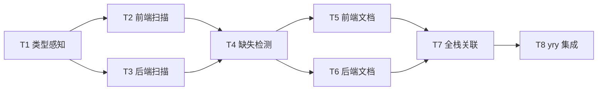
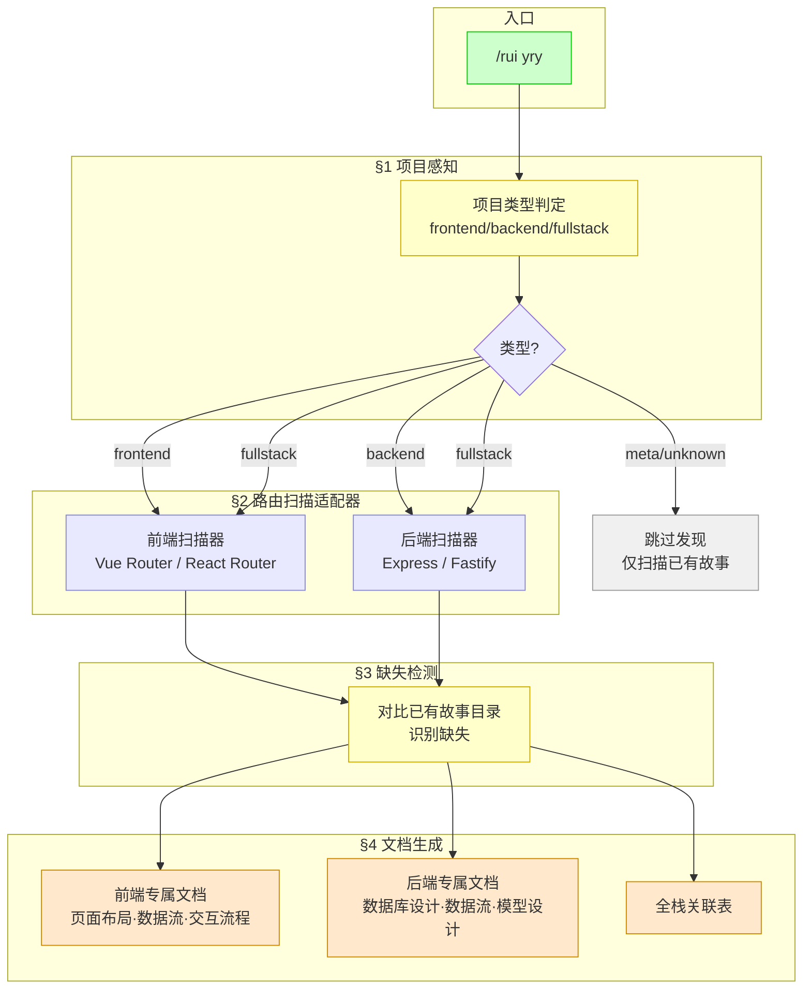
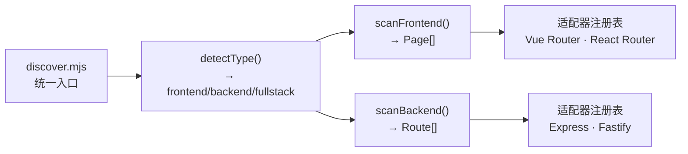
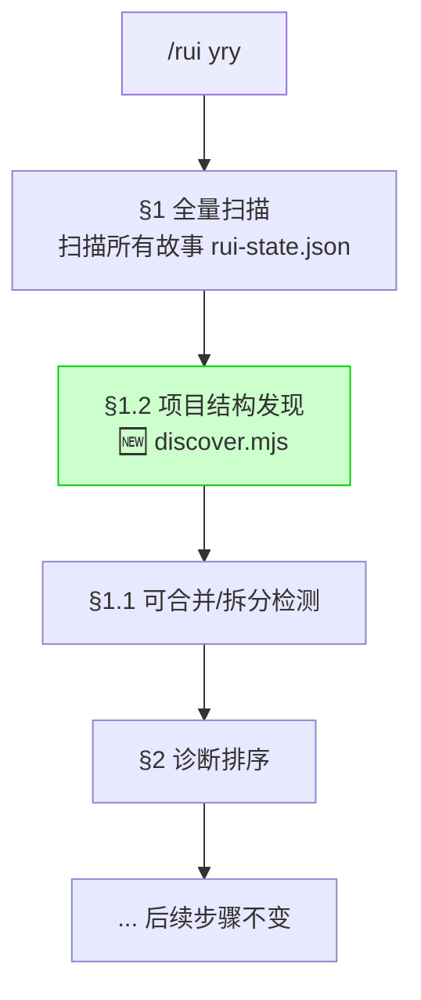
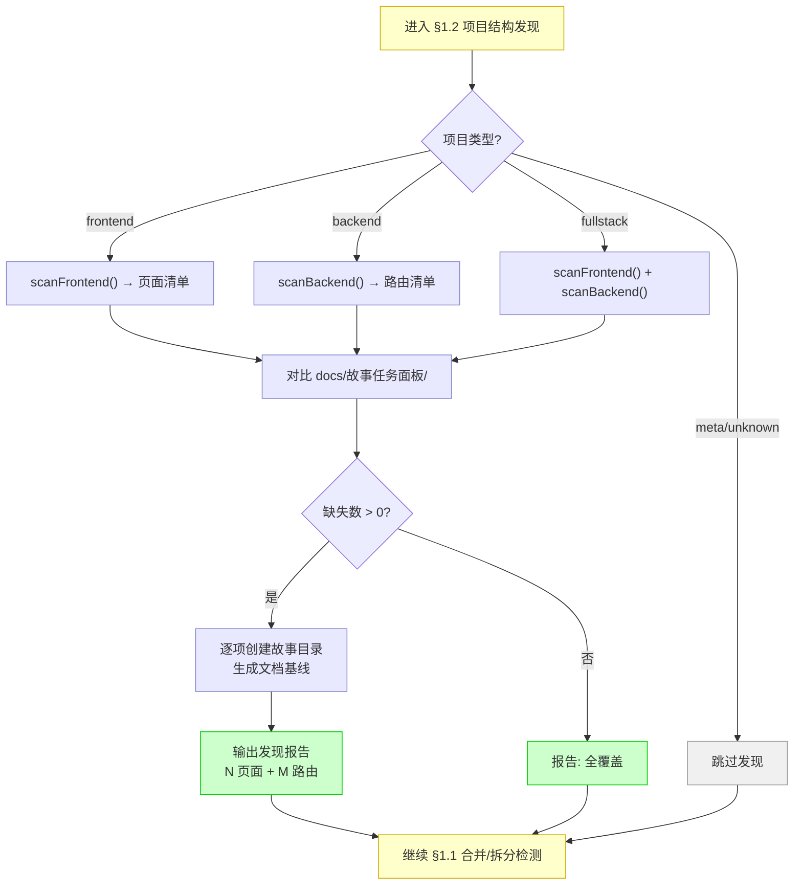

> | v1.0.0 | 2026-05-26 | deepseek-v4-pro | 🌿 feat/yry-discover | 📎 [CLAUDE.md](../../../CLAUDE.md) |

> **导航**: [← 使用场景](./使用场景.md) · [测试设计 →](./测试设计.md) · [安全审计 →](./安全审计.md)

> **来源引用**: 从 [故事任务](./故事任务.md) §2 FP1–FP8 + [使用场景](./使用场景.md) §2 场景推导技术方案。项目类型：meta（本故事为规约设计，实施针对 frontend/backend/fullstack 目标项目）。证据 Level B + 故事任务路径。

[§0 基线溯源](#sec0-trace) · [§1 系统架构](#sec1-arch) · [§2 路由扫描适配器](#sec2-scanner) · [§3 专属文档公式](#sec3-formulas) · [§4 yry 集成设计](#sec4-integration) · [§5 评审清单](#sec5-checklist)

---

### 主要价值

- 🔌 适配器模式 — 路由扫描按框架解耦，新增框架只需追加适配器
- 📐 专属文档公式 — 前端3文档（页面布局·数据流·交互流程）和后端3文档（数据库设计·数据流·模型设计）有规约化的结构和表头
- 🔗 yry 无缝集成 — 在 yry §1 全量扫描阶段插入发现步骤，不改变现有管线结构
- 🛡️ 冲突保护 — 已有故事目录不可覆盖，与 --from-code 同门禁

---

<a id="sec0-trace"></a>

## §0 基线溯源

| 本设计章节 | 实现 故事任务 | 服务 使用场景 | 覆盖状态 |
|-----------|-------------|------------|---------|
| §2 路由扫描适配器 | Story 1 FP2, Story 2 FP3 | 场景 A (前端发现) + 场景 C (后端发现) | 已对齐 |
| §3 专属文档公式 | Story 1 FP5, Story 2 FP6 | 场景 B (查看页面文档) + 场景 D (查看路由文档) | 已对齐 |
| §4 yry 集成设计 | Story 3 FP7, FP8 | 场景 E (全栈协调) | 已对齐 |

### §0.1 设计决策

| 决策领域 | 选定方案 | 选择理由 | 实现 FP# |
|---------|---------|---------|---------|
| 路由扫描架构 | 适配器模式 — 每框架一个适配器 | 框架间路由格式差异大，适配器隔离变化 | FP2, FP3 |
| 项目类型判定 | 复用 `init detect` 逻辑 | 避免重复实现，保持一致性 | FP1 |
| 专属文档存储 | 嵌入对应故事目录，作为补充文档 | 与现有 formulas.md 补充文档体系一致 | FP5, FP6 |
| yry 集成方式 | 在 yry §1 全量扫描后插入发现步骤 | 最小侵入，不改 yry 主体流程 | FP8 |
| 冲突保护 | 同 `--from-code` 规则 — 目标目录已存在则跳过 | 与现有管线行为一致 | R4 |

### §0.2 任务规划

| ID | 描述 | 工作量 | 依赖 | 交付物 | Agent | 实现 FP# |
|----|------|--------|------|--------|-------|---------|
| T1 | 项目类型感知模块 | S | 无 | 类型判定逻辑（复用 init detect） | coder | FP1 |
| T2 | 前端路由扫描适配器（Vue Router + React Router） | M | T1 | 扫描脚本 + 页面清单输出 | coder | FP2 |
| T3 | 后端路由扫描适配器（Express + Fastify） | M | T1 | 扫描脚本 + 路由清单输出 | coder | FP3 |
| T4 | 缺失检测 + 故事目录创建 | S | T2, T3 | 对比逻辑 + 目录创建 | coder | FP4 |
| T5 | 前端专属文档生成（3 文档公式） | M | T4 | 页面布局 + 数据流 + 交互流程 | coder | FP5 |
| T6 | 后端专属文档生成（3 文档公式） | M | T4 | 数据库设计 + 数据流 + 模型设计 | coder | FP6 |
| T7 | 全栈关联表生成 | S | T5, T6 | 页面→路由关联矩阵 | coder | FP7 |
| T8 | yry 扫描阶段集成 | S | T4–T7 | yry SKILL.md 更新 + 发现步骤插入 | coder | FP8 |



---

<a id="sec1-arch"></a>

## §1 系统架构

### 效果示意



### 1.1 模块清单

| 变更类型 | 模块/文件 | 职责 |
|---------|----------|------|
| 新增 | `skills/rui/discover.mjs` | 项目类型感知 + 路由扫描统一入口 |
| 新增 | `skills/rui/scanner-frontend.mjs` | 前端路由扫描适配器 |
| 新增 | `skills/rui/scanner-backend.mjs` | 后端路由扫描适配器 |
| 修改 | `skills/rui/SKILL.md` | yry §1 全量扫描阶段插入发现步骤 |
| 新增 | `skills/rui/formulas.md` (追加) | 前端专属文档公式 (F.supp.page-layout, F.supp.page-dataflow, F.supp.page-interaction) + 后端专属文档公式 (F.supp.route-database, F.supp.route-dataflow, F.supp.route-model) |

---

<a id="sec2-scanner"></a>

## §2 路由扫描适配器

### 2.1 适配器接口



| 适配器接口 | 输入 | 输出 | 错误模式 |
|-----------|------|------|---------|
| `detectType(root)` | 项目根目录 | `frontend` / `backend` / `fullstack` / `meta` / `unknown` | 无法判定返回 `unknown` |
| `scanFrontend(root, framework)` | 项目根 + 框架名 | `Page[]` — 页面清单（name, routePath, componentFile） | 路由文件不可读返回空数组 + 错误原因 |
| `scanBackend(root, framework)` | 项目根 + 框架名 | `Route[]` — 路由清单（method, path, handlerFile） | 路由文件不可读返回空数组 + 错误原因 |

### 2.2 前端路由扫描策略

| 框架 | 扫描目标 | 提取方式 | 优先支持 |
|------|---------|---------|:---:|
| Vue Router | `src/router/*.js`, `src/router/*.ts` | 解析 `routes` 数组，提取 `path` + `component` | ✅ |
| React Router | `src/App.jsx`, `src/routes.jsx` | 解析 `<Route path="" element={}>` JSX | ✅ |
| Next.js | `pages/`, `app/` 目录结构 | 文件系统路由约定 | 🔜 |
| Nuxt | `pages/` 目录结构 | 文件系统路由约定 | 🔜 |
| SvelteKit | `src/routes/` 目录结构 | 文件系统路由约定 | 🔜 |

**通用提取策略**：读路由文件 → 正则提取路由路径和组件引用 → 去重 → 输出 `Page[]`

### 2.3 后端路由扫描策略

| 框架 | 扫描目标 | 提取方式 | 优先支持 |
|------|---------|---------|:---:|
| Express | `routes/*.js`, `app.js` | 解析 `app.get/post/put/delete(path, handler)` | ✅ |
| Fastify | `routes/*.js` | 解析 `fastify.get/post/put/delete(path, handler)` | ✅ |
| Koa | `routes/*.js` | 解析 `router.get/post/put/delete(path, handler)` | 🔜 |
| NestJS | `*.controller.ts` | 解析 `@Controller/@Get/@Post` 装饰器 | 🔜 |
| Go (Gin/Echo) | `routes/*.go`, `main.go` | 正则匹配路由注册模式 | 🔜 |
| Python (Flask/FastAPI) | `routes/*.py`, `app.py` | 正则匹配 `@app.route/@router.get` | 🔜 |

**通用提取策略**：读路由文件 → 正则提取 HTTP 方法和路径 → 关联 handler 函数 → 去重 → 输出 `Route[]`

### 2.4 缺失检测流程

```
pageRoutes = scanFrontend()  // 或 scanBackend()
storyDirs  = listDir("docs/故事任务面板/")
storyNames = extractStoryNames(storyDirs)
missing    = pageRoutes.filter(p => !storyNames.includes(toKebabCase(p.name)))
for each m in missing:
    if !exists("docs/故事任务面板/" + m.kebabName):
        createStoryDir(m)
        generateDocs(m)
```

---

<a id="sec3-formulas"></a>

## §3 专属文档公式

> 6 份新补充文档公式，追加到 `skills/rui/formulas.md` 的补充文档公式部分。前端 3 份 + 后端 3 份，均沿用补充文档共同骨架（meta + nav + 触发与范围 + 主体 + 评审清单）。

### 3.1 前端专属文档 (3 份)

#### F.supp.page-layout — 页面布局

| 章节 | 表头/内容 | 约束 |
|------|----------|------|
| §0 基线溯源 | `布局元素 \| 来源(组件/路由) \| 覆盖故事任务 FP# \| 覆盖使用场景` | 必填，≥ 3 行 |
| §1 触发与范围 | 页面名 + 路由路径 + 关联组件文件 | 必填 |
| §2 布局结构 | **效果示意** mermaid flowchart（页面组件树 + 挂载关系）；2.1 组件编排 `组件 \| 类型(容器/展示/布局) \| 文件路径 \| 挂载点 \| Props`；2.2 布局层级 fenced 文本块（组件嵌套树） | 必填，每页面 ≥ 3 个组件 |
| §3 响应式与断点 | `断点 \| 宽度 \| 布局变化 \| 隐藏/显示规则` | 响应式页面必填，静态页面标注"不适用" |
| §4 评审清单 | 组件树完整 / 挂载点正确 / 响应式覆盖 / 与路由配置一致 |

#### F.supp.page-dataflow — 页面操作数据流

| 章节 | 表头/内容 | 约束 |
|------|----------|------|
| §0 基线溯源 | `数据流 \| 来源(组件/Store/API) \| 覆盖故事任务 FP# \| 覆盖使用场景` | 必填，≥ 3 行 |
| §1 触发与范围 | 页面名 + 涉及的状态管理方案（Vuex/Pinia/Redux/Context） | 必填 |
| §2 数据流全景 | **效果示意** mermaid flowchart（用户操作→状态变更→API 调用→响应更新）；2.1 状态定义 `状态字段 \| 类型 \| 默认值 \| 来源(Props/Local/Store/API) \| 消费者组件`；2.2 API 调用 `接口 \| 方法 \| 触发时机 \| 请求数据 \| 响应处理 \| 错误处理` | 必填 |
| §3 数据生命周期 | `阶段 \| 触发 \| 数据状态 \| 消费者` | 必填 |
| §4 评审清单 | 数据源全覆盖 / 状态流向清晰 / API 调用完整 / 错误处理标注 |

#### F.supp.page-interaction — 用户交互流程图

| 章节 | 表头/内容 | 约束 |
|------|----------|------|
| §0 基线溯源 | `交互流程 \| 来源(组件事件) \| 覆盖故事任务 AC# \| 覆盖使用场景` | 必填，≥ 3 行 |
| §1 触发与范围 | 页面名 + 涉及的用户操作类型（点击/输入/拖拽/手势等） | 必填 |
| §2 交互流程 | **效果示意** mermaid flowchart（用户操作→系统响应→UI 更新）；2.1 操作流 `# \| 触发元素 \| 用户操作 \| 系统响应 \| UI 变化 \| 异常分支`；2.2 视图状态矩阵 `视图区域 \| 正常 \| 加载 \| 空 \| 错误 \| 禁用` | 必填，覆盖正常态 + ≥3 状态变化 |
| §3 关键交互 | `交互 \| 触发 \| 反馈(即时/延迟) \| 撤销方式 \| 无障碍` | 关键路径必填 |
| §4 评审清单 | 交互流完整 / 状态矩阵全覆盖 / 异常分支明确 / 无障碍考量 |

### 3.2 后端专属文档 (3 份)

#### F.supp.route-database — 数据库设计

| 章节 | 表头/内容 | 约束 |
|------|----------|------|
| §0 基线溯源 | `数据库设计 \| 来源(路由 handler) \| 覆盖故事任务 FP# \| 覆盖使用场景` | 必填，≥ 3 行 |
| §1 触发与范围 | 路由接口（METHOD + path）+ handler 文件 + 涉及的存储系统 | 必填 |
| §2 数据存储结构 | 2.1 表/集合 `表/集合 \| 字段 \| 类型 \| 约束 \| 默认值 \| 说明`；2.2 索引 `索引名 \| 字段 \| 类型(唯一/普通/全文) \| 用途`；2.3 关联 `关联 \| 类型(1:1/1:N/N:M) \| 外键 \| 说明` | 必填，从源码和 ORM schema 提取 |
| §3 查询模式 | `查询 \| SQL/ORM 调用 \| 触发条件 \| 频率(高/中/低) \| 涉及索引` | 必填 |
| §4 迁移方案 | `版本 \| 变更 \| 迁移策略 \| 可回滚` | 有迁移需求时必填 |
| §5 评审清单 | 表结构完整 / 索引合理 / 关联正确 / 迁移可回滚 |

#### F.supp.route-dataflow — 数据流图

| 章节 | 表头/内容 | 约束 |
|------|----------|------|
| §0 基线溯源 | `数据流步骤 \| 来源(handler/中间件) \| 覆盖故事任务 FP# \| 覆盖使用场景` | 必填，≥ 3 行 |
| §1 触发与范围 | 路由接口 + handler 执行链路 + 涉及的中间件/服务 | 必填 |
| §2 请求链路 | **效果示意** mermaid sequenceDiagram（请求→中间件→handler→服务→数据库→响应）；2.1 中间件链 `序 \| 中间件 \| 职责 \| 输入 \| 输出 \| 失败行为`；2.2 处理步骤 `序 \| 步骤 \| 输入数据 \| 变换逻辑 \| 输出数据 \| 异常处理` | 必填 |
| §3 数据变换 | `字段 \| 请求值 \| 中间状态 \| 最终值 \| 变换规则` | 必填 |
| §4 评审清单 | 请求链路完整 / 中间件覆盖 / 变换可追溯 / 异常路径 |

#### F.supp.route-model — 模型设计

| 章节 | 表头/内容 | 约束 |
|------|----------|------|
| §0 基线溯源 | `模型 \| 来源(ORM/ODM) \| 覆盖故事任务 FP# \| 覆盖使用场景` | 必填，≥ 3 行 |
| §1 触发与范围 | 路由接口 + 使用的 ORM/ODM + 涉及的实体 | 必填 |
| §2 实体模型 | 2.1 模型定义 `模型 \| 字段 \| 类型 \| 必填 \| 校验规则 \| 默认值 \| 说明`；2.2 关联 `模型A \| 关系 \| 模型B \| 外键/引用 \| 级联规则`；2.3 生命周期钩子 `钩子 \| 触发时机 \| 操作 \| 副作用` | 必填 |
| §3 输入/输出 DTO | `DTO \| 字段 \| 类型 \| 必填 \| 校验 \| 来源(请求体/查询参数/路径) \| 对应模型字段` | 必填 |
| §4 校验规则 | `规则 \| 应用字段 \| 校验逻辑 \| 错误码 \| 错误消息` | 必填 |
| §5 评审清单 | 模型完整 / DTO 与模型一致 / 校验闭合 / 错误码覆盖 |

---

<a id="sec4-integration"></a>

## §4 yry 集成设计

### 4.1 在 yry 管线中的位置



> 在 yry §1 全量扫描之后、§1.1 合并拆分检测之前插入 §1.2 项目结构发现。发现结果不影响已有故事扫描结果，仅补充缺失。

### 4.2 发现步骤流程



### 4.3 与现有管线的兼容性

| 维度 | 影响 | 说明 |
|------|:---:|------|
| yry 主线流程 | 无影响 | 在 §1 扫描阶段插入，后续步骤不变 |
| 已有故事 | 无影响 | 已有故事不被覆盖或修改 |
| 分支隔离 | 兼容 | 发现生成的故事若触发 update 则走 `feat/<name>` 分支 |
| 版本管理 | 兼容 | 自动生成的故事版本记录在 rui-state.json 中 |
| 交付三步 | 兼容 | 新生成的故事文档触发逐文件导入 + 批量兜底 |

---

<a id="sec5-checklist"></a>

## §5 评审清单

| # | 检查项 | 状态 |
|---|--------|:---:|
| 1 | 适配器接口定义完整（detectType + scanFrontend + scanBackend） | ✅ |
| 2 | 前端 2 框架优先支持（Vue Router + React Router），扩展路径明确 | ✅ |
| 3 | 后端 2 框架优先支持（Express + Fastify），扩展路径明确 | ✅ |
| 4 | 前端 3 文档公式定义完整（页面布局·数据流·交互流程） | ✅ |
| 5 | 后端 3 文档公式定义完整（数据库设计·数据流·模型设计） | ✅ |
| 6 | yry 集成点明确（§1 扫描后插入），不影响现有流程 | ✅ |
| 7 | 冲突保护明确（已有目录跳过） | ✅ |
| 8 | 基线溯源表完整，覆盖故事任务全部 FP# | ✅ |
| 9 | 效果示意 mermaid 可渲染 | ✅ |

---

> | 日期 | 变更 | 触发 | 证据 |
> |------|------|------|------|
> | 2026-05-26 | 初始生成 — 适配器架构 + 6 文档公式 + yry 集成设计 | yry-discover 故事基线建立 | 故事任务.md + 使用场景.md |
