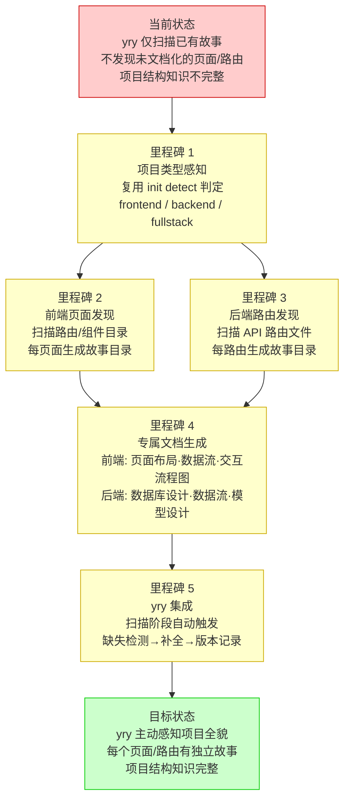
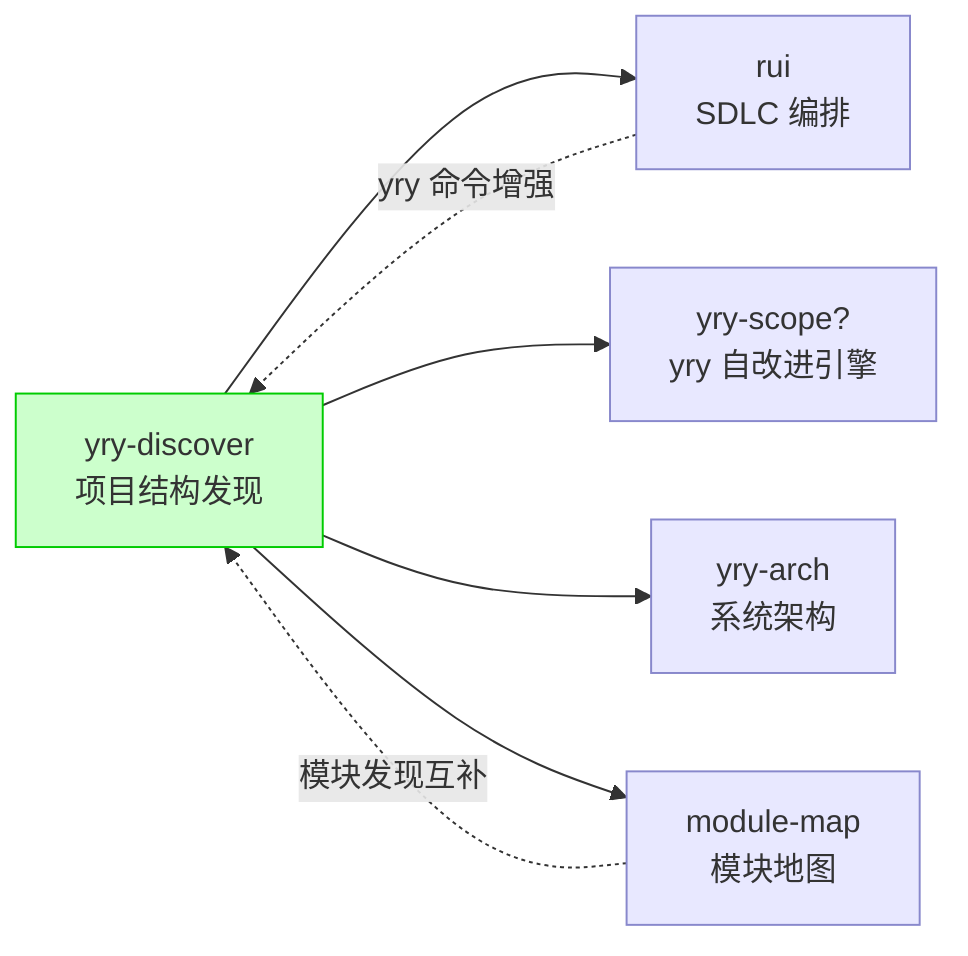

> | v1.0.0 | 2026-05-26 | deepseek-v4-pro | 🌿 feat/yry-discover | 📎 [CLAUDE.md](../../../CLAUDE.md) |

> **导航**: [使用场景 →](./使用场景.md)

> **来源引用**: 由 `/rui 添加模块地图的故事任务目录及内容` 会话中的用户需求触发："/rui yry 命令操作如果是前端项目则需要补齐每个页面作为项目故事任务目录并补齐全文档...如果是后端项目则需要自主将每一个路由接口作为故事任务目录"。从 `skills/rui/SKILL.md` §yry + §init detect 项目类型判定推导。证据 Level B + SKILL.md 路径。

[§1 Story](#sec1-story) · [§2 Requirements](#sec2-requirements) · [§3 成功标准](#sec3-success) · [§4 范围边界](#sec4-scope) · [§5 AC](#sec5-ac) · [§6 风险与假设](#sec6-risks) · [§7 跨文档索引](#sec7-index) · [§R 关联故事](#secr-related)

---

### 需求概述

当前 `/rui yry` 自改进闭环仅扫描已有故事目录进行诊断和优化，不会主动发现项目中尚未文档化的页面（前端）或路由接口（后端）。需要让 yry 在扫描阶段具备项目结构感知能力：前端项目自动发现每个页面并为其创建独立的故事目录及专属文档（页面布局、操作数据流、用户交互流程图）；后端项目自动发现每个路由接口并为其创建独立的故事目录及专属文档（数据库设计、数据流图、模型设计）。这使得 yry 从"仅改进已有故事"升级为"主动发现缺失故事并补齐"。

### 效果示意

### 主要价值

- 🔍 主动发现 — yry 不再被动等待故事创建，而是主动扫描项目结构发现缺失
- 🗂️ 页面级粒度 — 前端每个页面有独立故事目录，页面布局/数据流/交互流程结构化文档化
- 🗄️ 路由级粒度 — 后端每个路由接口有独立故事目录，数据库设计/数据流/模型设计结构化文档化
- 📊 项目知识完整 — 全部页面和路由纳入故事面板，项目全貌可查询可追溯
- 🔄 持续同步 — 页面/路由增删时 yry 自动检测漂移并触发更新

---

## §1 Story

### Story 1: 前端项目页面自动发现与故事生成

作为 yry 自改进引擎，我想要在扫描阶段识别前端项目中的每个页面路由，并为每个页面创建独立的故事目录及专属文档，以便每个页面有完整的页面布局、操作数据流和用户交互流程图文档基线。优先级 P0。范围边界：只读源码发现页面路由，按公式生成文档，不修改业务源码。依赖：项目类型为 frontend 或 fullstack，路由/页面组件目录可访问。

#### 范围外

- 不修改页面源码或重构路由结构
- 不自动修改已有页面故事目录（增量更新走 /rui update）

#### §1.1 User Operations

| # | 操作 | 触发条件 | 操作步骤 | 预期结果 |
|---|------|---------|---------|---------|
| 1 | yry 发现前端页面 | 执行 `/rui yry`，项目类型为 frontend/fullstack | yry 扫描路由配置或页面组件目录 → 提取页面清单 → 对比已有故事目录 → 为缺失页面创建故事目录 | 每个缺失页面生成独立故事目录，含页面专属文档 |
| 2 | 查看某页面的布局文档 | 需要了解页面视觉结构和组件编排 | 打开页面对应故事目录 → 查看页面布局文档 | 看到页面布局的 mermaid 图 + 组件编排表 |
| 3 | 查看某页面的数据流 | 需要了解页面数据从哪里来、到哪里去 | 打开页面对应故事目录 → 查看数据流文档 | 看到页面级操作数据流 mermaid 图 + 数据源表 |

---

### Story 2: 后端项目路由接口自动发现与故事生成

作为 yry 自改进引擎，我想要在扫描阶段识别后端项目中的每个 API 路由接口，并为每个路由创建独立的故事目录及专属文档，以便每个接口有完整的数据库设计、数据流图和模型设计文档基线。优先级 P0。范围边界：只读源码发现路由接口，按公式生成文档，不修改业务源码。依赖：项目类型为 backend 或 fullstack，路由/控制器目录可访问。

#### 范围外

- 不修改路由实现或数据库结构
- 不自动修改已有路由故事目录（增量更新走 /rui update）

#### §1.1 User Operations

| # | 操作 | 触发条件 | 操作步骤 | 预期结果 |
|---|------|---------|---------|---------|
| 1 | yry 发现后端路由 | 执行 `/rui yry`，项目类型为 backend/fullstack | yry 扫描路由/控制器文件 → 提取路由接口清单 → 对比已有故事目录 → 为缺失路由创建故事目录 | 每个缺失路由接口生成独立故事目录，含路由专属文档 |
| 2 | 查看某路由的数据库设计 | 需要了解该接口涉及的数据存储结构 | 打开路由对应故事目录 → 查看数据库设计文档 | 看到表结构/字段/索引/迁移方案 |
| 3 | 查看某路由的数据流 | 需要了解请求到响应的数据变换路径 | 打开路由对应故事目录 → 查看数据流文档 | 看到请求链路 mermaid 图 + 数据变换步骤 |

---

### Story 3: 全栈项目两端协调发现

作为 yry 自改进引擎，我想要在全栈项目中同时发现前端页面和后端路由，并建立页面与路由的关联关系，以便两端知识形成完整闭环。优先级 P1。范围边界：先前端发现后后端发现，建立页面→路由的消费关系映射。依赖：Story 1 和 Story 2 均已完成。

#### 范围外

- 不自动生成端到端集成测试
- 不校验前后端接口契约一致性（由安全审计补充检查）

#### §1.1 User Operations

| # | 操作 | 触发条件 | 操作步骤 | 预期结果 |
|---|------|---------|---------|---------|
| 1 | 全栈项目完整发现 | 执行 `/rui yry`，项目类型为 fullstack | 先执行前端页面发现 → 再执行后端路由发现 → 建立页面→路由关联表 | 前端页面和后端路由均有独立故事目录，含关联索引 |
| 2 | 查看页面消费的后端路由 | 需要了解某页面对应哪些 API | 打开页面对应故事目录 → 查看关联索引 | 看到该页面调用的全部路由接口列表 |

---

## §2 Requirements

### 功能点

| FP# | 描述 | 输入 | 输出 | 错误行为 | 优先级 |
|-----|------|------|------|---------|--------|
| FP1 | 项目类型感知 — 复用 init detect 的项目类型判定逻辑 | 项目目录结构 + package.json | frontend / backend / fullstack / meta / unknown | 类型无法判定时降级为 unknown，仅扫描已有故事 | P0 |
| FP2 | 前端路由扫描 — 从路由配置文件或页面组件目录提取页面清单 | 路由文件 (router/, pages/, app/ 等) | 页面清单（页面名、路由路径、组件文件） | 路由文件不可读或格式不识别时报告并跳过 | P0 |
| FP3 | 后端路由扫描 — 从控制器/路由文件提取 API 接口清单 | 路由文件 (routes/, controllers/, api/ 等) | 路由清单（方法、路径、处理器文件） | 路由文件不可读时报告并跳过 | P0 |
| FP4 | 缺失检测 — 对比发现的页面/路由清单与已有故事目录 | 发现清单 + `docs/故事任务面板/` 目录 | 缺失列表（页面/路由名 + 源文件路径） | 故事面板目录不可读时降级为仅报告 | P0 |
| FP5 | 前端页面故事生成 — 为每个缺失页面创建故事目录 + 专属文档 | 页面名 + 源码文件 | 故事目录含：故事任务.md + 使用场景.md + 技术评审.md + 页面布局.md + 数据流.md + 交互流程.md | 源码不可读时标 Level C 并标注"待补充" | P0 |
| FP6 | 后端路由故事生成 — 为每个缺失路由创建故事目录 + 专属文档 | 路由接口 + 源码文件 | 故事目录含：故事任务.md + 使用场景.md + 技术评审.md + 数据库设计.md + 数据流.md + 模型设计.md | 源码不可读时标 Level C 并标注"待补充" | P0 |
| FP7 | 全栈关联 — 建立前端页面与后端路由的消费关系 | 页面清单 + 路由清单 | 页面→路由关联表（页面名、路由接口、调用方式） | 关联不确定时标注"推测" | P1 |
| FP8 | yry 集成 — 在 yry 扫描阶段自动触发发现 | `/rui yry` 命令 | 发现报告（发现了 N 个缺失页面/M 个缺失路由）→ 自动创建故事目录 | 创建失败时记录错误继续下一项 | P0 |

### 业务规则

| R# | 描述 | 校验方式 | 证据级别 |
|----|------|---------|---------|
| R1 | 项目类型判定必须复用 init detect 逻辑，不可独立实现 | 对比 detect 输出与 yry discover 判定 | B |
| R2 | meta 和 unknown 类型项目不触发页面/路由发现 | 检查项目类型判定分支 | B |
| R3 | 发现的页面/路由故事名称使用 kebab-case，基于路由路径派生 | 校验故事名格式 `^[a-z0-9]+(-[a-z0-9]+)*$` | B |
| R4 | 已有故事目录不被覆盖（同 --from-code 的冲突保护） | 检查目标目录是否已存在 | B |
| R5 | 前端专属文档 3 份（页面布局·数据流·交互流程），后端专属文档 3 份（数据库设计·数据流·模型设计） | 逐故事目录检查文件存在 | B |

### 数据约束

| 约束 | 类型 | 范围/格式 | 来源 |
|------|------|----------|------|
| 项目类型 | enum | `frontend` / `backend` / `fullstack` / `meta` / `unknown` | init detect 阶段判定 |
| 页面名 | string | kebab-case，由路由路径派生（如 `/user/login` → `user-login`） | 路由配置文件 |
| 路由接口标识 | string | `{METHOD} {path}` 格式（如 `POST /api/users`） | 路由/控制器文件 |
| 故事目录名 | string | kebab-case，页面用路由路径，后端用 `{method}-{path}` | 发现结果 |

---

## §3 成功标准

| SC# | 描述 | 度量方式 | 目标值 | 优先级 | 关联 FP# |
|-----|------|---------|--------|--------|---------|
| SC1 | 前端项目执行 yry 后，每个页面路由有独立故事目录 | `ls docs/故事任务面板/ \| wc -l` 对比路由数 | 故事目录数 ≥ 页面路由数 | P0 | FP2, FP4, FP5 |
| SC2 | 后端项目执行 yry 后，每个 API 路由有独立故事目录 | `ls docs/故事任务面板/ \| wc -l` 对比路由数 | 故事目录数 ≥ 路由接口数 | P0 | FP3, FP4, FP6 |
| SC3 | 每页面故事含 3 份专属文档（页面布局·数据流·交互流程） | `ls docs/故事任务面板/<page>/` 计数 | 基础 3 文档 + 3 专属文档 = 6 文档 | P0 | FP5 |
| SC4 | 每路由故事含 3 份专属文档（数据库设计·数据流·模型设计） | `ls docs/故事任务面板/<route>/` 计数 | 基础 3 文档 + 3 专属文档 = 6 文档 | P0 | FP6 |
| SC5 | 已有故事目录在发现过程中不被覆盖或修改 | git diff 检查已有目录 | 0 修改 | P0 | R4 |
| SC6 | 全栈项目建立页面→路由关联表 | 关联表条目数统计 | 每页面至少关联 1 个路由 | P1 | FP7 |

---

## §4 范围边界

### 范围内

| # | 条目 | 关联 FP# | 边界说明 |
|---|------|---------|---------|
| 1 | 项目类型感知与路由扫描 | FP1–FP3 | 复用 init detect，仅 frontend/backend/fullstack 触发 |
| 2 | 缺失检测与故事目录创建 | FP4 | 对比已有故事面板目录，仅补充缺失 |
| 3 | 前端页面专属文档生成 | FP5 | 每页面：页面布局 + 数据流 + 交互流程 |
| 4 | 后端路由专属文档生成 | FP6 | 每路由：数据库设计 + 数据流 + 模型设计 |
| 5 | yry 扫描阶段集成 | FP8 | 在 yry §1 全量扫描阶段自动触发 |

### 范围外

| # | 条目 | 排除原因 | 替代方案 |
|---|------|---------|---------|
| 1 | 页面/路由的代码实现 | 源码变更是 code 阶段的职责 | 使用 `/rui code <name>` |
| 2 | UI 截图和可操作验证 | 属于实施报告产出 | 使用 `/rui code <name>` 生成实施报告 |
| 3 | 已有页面/路由故事的增量更新 | 属于 update 阶段 | 使用 `/rui update <name>` |
| 4 | meta 项目的模块发现 | meta 项目无页面/路由概念 | 使用 module-map 故事或手动创建 |
| 5 | 第三方框架路由的自动适配 | 框架差异大，需逐一适配 | 先支持主流框架（Vue Router/React Router/Express/Fastify），其余扩展 |

---

## §5 AC

| AC# | Given | When | Then | 门禁 |
|-----|-------|------|------|------|
| AC1 | 项目类型为 frontend，存在路由配置文件 | yry 扫描阶段执行 | 提取全部页面路由清单，每个路由路径 + 组件文件路径 | Gate A |
| AC2 | 项目类型为 backend，存在路由/控制器文件 | yry 扫描阶段执行 | 提取全部 API 接口清单，每个接口 METHOD + path + handler | Gate A |
| AC3 | 页面/路由清单与已有故事目录对比 | 缺失检测执行 | 输出缺失列表，不包含已有故事 | Gate A |
| AC4 | 存在缺失的前端页面 | 为缺失页面创建故事目录 | 每页面生成 故事任务 + 使用场景 + 技术评审 + 页面布局 + 数据流 + 交互流程，共 6 文档 | Gate A |
| AC5 | 存在缺失的后端路由 | 为缺失路由创建故事目录 | 每路由生成 故事任务 + 使用场景 + 技术评审 + 数据库设计 + 数据流 + 模型设计，共 6 文档 | Gate A |
| AC6 | 项目类型为 meta 或 unknown | yry 扫描阶段执行 | 跳过页面/路由发现，仅扫描已有故事 | Gate A |
| AC7 | 全栈项目两端均发现 | 页面和路由均已创建 | 生成页面→路由关联表，每页面标注其消费的路由接口 | Gate A |
| AC8 | 发现的页面/路由源码不可读 | 尝试读取时失败 | 文档标注 Level C + "待补充"，不阻断管线 | Gate B |

---

## §6 风险与假设

| # | 风险/假设 | 类型 | 可能性 | 影响 | 缓解/验证策略 | 关联 FP# |
|---|----------|------|--------|------|-------------|---------|
| 1 | 不同前端框架路由配置格式差异大，扫描遗漏页面 | 风险 | H | M | 先支持主流框架（Vue/React），定义可扩展的路由扫描适配器接口 | FP2 |
| 2 | 自动生成的页面/路由故事因源码不足导致内容空洞 | 风险 | M | M | 不确定项标 Level C + "待补充"；故事文档注明"由 yry discover 自动生成" | FP5, FP6 |
| 3 | 后端项目路由接口数量很大（50+），全量生成耗时长 | 风险 | M | L | 首批仅生成未文档化的路由；支持增量模式 | FP3, FP6 |
| 4 | 全栈项目页面→路由关联可能不准确（如通过 BFF 层间接调用） | 风险 | M | L | 关联不确定时标注"推测"并提供验证命令 | FP7 |
| 5 | 主流前端框架的路由配置可被通用方式解析 | 假设 | — | — | Vue Router 和 React Router 分别实现解析器 | FP2 |
| 6 | 后端路由文件遵循 MVC 或类似约定，可从目录结构推断 | 假设 | — | — | 通过目录约定 + 代码模式匹配提取路由 | FP3 |

---

## §7 跨文档索引

| 本文档章节 | 基线内容 | 下游文档编号 | 预期覆盖 | 状态 |
|-----------|---------|------------|---------|------|
| §1 Story 1 | 前端页面自动发现 | 使用场景 §2 场景 A/B | 前端开发者执行 yry→页面故事生成 | 待生成 |
| §1 Story 2 | 后端路由自动发现 | 使用场景 §2 场景 C/D | 后端开发者执行 yry→路由故事生成 | 待生成 |
| §2 FP2–FP3 | 路由扫描策略 | 技术评审 §2 扫描适配器 | 框架适配器设计 + 扫描流程 | 待生成 |
| §2 FP5–FP6 | 专属文档公式 | 技术评审 §3 文档公式 | 前端 3 文档公式 + 后端 3 文档公式 | 待生成 |
| §2 FP8 | yry 集成点 | 技术评审 §4 集成设计 | yry 扫描阶段的触发位置 + 数据流 | 待生成 |
| §5 AC1–AC8 | 验收标准 | 测试设计 §0 §2 | 测试用例逐一覆盖 | 待生成 |
| §6 风险 | 路由扫描遗漏风险 | 安全审计 §2 威胁建模 | 信息泄露（路由结构暴露）+ 注入风险 | 待生成 |

---

## §R 关联故事

| 关联故事 | 关系类型 | 说明 |
|---------|---------|------|
| rui | 消费者/被增强 | yry-discover 是 rui yry 命令的子功能增强 |
| module-map | 互补 | module-map 关注已有模块的映射，yry-discover 关注未文档化页面/路由的发现和补齐 |
| yry-arch | 数据消费 | yry-arch 的模块地图可为 discover 提供项目类型和目录结构基线 |

---

> | 日期 | 变更 | 触发 | 证据 |
> |------|------|------|------|
> | 2026-05-26 | 初始生成 — 3 Story（前端发现/后端发现/全栈协调），8 FP，6 SC，8 AC | /rui go ahead | 用户需求 + skills/rui/SKILL.md §yry |
