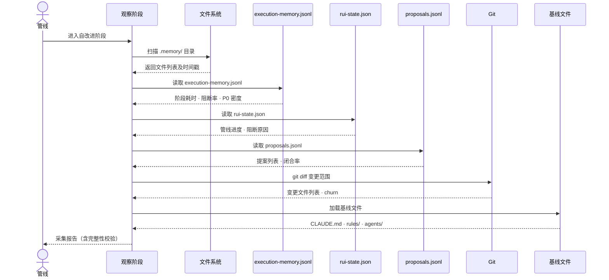

# 场景 1: 数据采集与观察

> | v5.1.0 | 2026-06-10 | deepseek-v4-pro | 🌿 feat/yry-self-improve | 📎 [CLAUDE.md](../../../../CLAUDE.md) |
> **导航**: [← 故事任务](../故事任务.md) · [场景-2 →](../场景-2-诊断引擎/index.md)

[§0 技术评审](#sec0) · [§1 测试设计](#sec1) · [§2 实施报告](#sec2) · [§3 测试报告](#sec3) · [§4 自改进](#sec4)

## 概述

**角色**: 系统自改进循环 · **目标**: 在每次故事管线完成后自动采集五类数据源（执行记忆、rui-state、proposals.jsonl、Git diff、基线文件），校验数据完整性，不完整时优雅降级而不阻断主流程 · **优先级**: P0

### 主要价值

- 📊 **数据采集自动化** — 管线完成后无需人工干预，自动拉取全部数据源
- ✅ **完整性校验** — 每类数据源有明确的必填字段和校验规则，缺失可定位
- ⚠️ **优雅降级** — 数据源不可达时标注降级而非崩溃，不阻断交付
- 🔗 **契约可追溯** — 每个数据字段都可追溯到下游消费者（诊断引擎 · 提案生成 · 效果评估）

### 图谱定位

| 图层 | 本场景节点 | 上游 | 下游 |
|------|-----------|------|------|
| 领域层 | scene: data-collection | story: yry-self-improve (contains) | maps_to → flow: observe-pipeline |
| 结构层 | flow: observe-pipeline | — | flow_step → flow: diagnose-pipeline |
| 内容层 | step: observe:load-sources | — | — |

---

## §0 技术评审

> 文档生成阶段填充（pm+coder）。本场景为数据采集管线，无前端 UI，输出为数据校验报告和采集状态。

### 效果示意

### 情感目标

系统运维者感到**数据完整可控**——每次管线完成后自动获得数据采集报告，缺失项清晰标注，不因数据缺失而产生错误的后续诊断。

### 成功感知

采集完成当：五类数据源的状态全部标记为 `ok` 或 `degraded`，采集报告包含每类数据源的字段完整性检查结果和最近写入时间，缺失项有明确的降级原因。

### 数据流全景

### 涉及模块

| 模块 | 职责 | 本场景角色 |
|------|------|-----------|
| 执行记忆文件 | 存储每次管线执行的阶段耗时、阻断率、P0 密度 | 核心数据源——提供 D1/D2 诊断的原始数据 |
| rui-state.json | 记录当前管线状态、进度和阻断原因 | 状态数据源——提供 D0/D1 诊断的上下文 |
| proposals.jsonl | append-only 提案历史，含提案状态和闭合记录 | 历史数据源——提供效果评估的参照基线 |
| Git diff | 变更范围、文件热度、churn 率 | 结构数据源——提供 D3/D5 诊断的代码变更信号 |
| 基线文件 | CLAUDE.md / rules/ / agents/ 规约 | 判定基准——提供诊断对比的预期基线 |

### 基线溯源

| 本场景内容 | 基线来源 | 覆盖方式 | 状态 |
|-----------|---------|---------|------|
| 五类数据源编目 | Story 1 FP1 — 数据采集与观察 | 逐类定义采集契约（字段 · 时机 · 校验 · 降级） | ✅ 已覆盖 |
| 采集时机定义 | Story 1 §1.1 — 管线完成后自动触发 | 观察阶段为自改进第一步 | ✅ 已覆盖 |
| 降级策略 | Story 1 R5 — no-metrics 降级不阻断 | 数据源不可达时标注降级，写空白 §4 占位 | ✅ 已覆盖 |
| 数据校验规则 | Story 1 R1 — 每条提案需 snapshot 证据 | 校验规则确保下游诊断有数据可用 | ✅ 已覆盖 |

### 设计评审清单

| # | 检查项 | 状态 |
|---|--------|:--:|
| 1 | 五类数据源全部编目，每类有字段定义和采集时机 | |
| 2 | 每类数据源有完整性校验规则 | |
| 3 | 降级策略覆盖全部数据源不可达场景 | |
| 4 | 采集报告格式包含字段完整性、最近写入时间、降级标注 | |
| 5 | 数据传递至诊断引擎的契约明确（字段映射） | |

---

### 安全考量

| 威胁 | 风险等级 | 缓解措施 |
|------|---------|---------|
| 执行记忆泄露敏感信息 | Medium | execution-memory.jsonl 不记录用户输入原文，仅记录统计指标和阻断标识 |
| proposals.jsonl 被外部进程修改 | Low | append-only 校验检测非追加写入，异常时告警 |
| Git diff 暴露未提交的敏感变更 | Low | Git diff 仅扫描已跟踪文件的变更统计，不记录 diff 内容原文 |

---

## §1 测试设计

> 文档生成阶段填充（tester）。本场景为数据采集管线，测试聚焦数据源的可用性、完整性校验和降级行为。

### 正常路径用例

| TC# | Given | When | Then | 覆盖 FP# | 优先级 |
|-----|-------|------|------|---------|--------|
| TC-N1.1 | 故事管线刚完成，五类数据源全部可读 | 系统进入观察阶段 | 采集报告标记五类数据源为 ok，字段完整性校验全部通过，采集耗时在合理响应时间内 | FP1 | P0 |
| TC-N1.2 | execution-memory.jsonl 包含最近一个故事的记录 | 系统读取执行记忆 | 提取阶段耗时、阻断率、P0 密度字段，字段值在合法范围内 | FP1 | P0 |
| TC-N1.3 | rui-state.json 包含当前管线状态 | 系统读取 rui-state | 提取管线进度、阻断原因、当前阶段字段，字段非空 | FP1 | P0 |
| TC-N1.4 | proposals.jsonl 包含历史提案记录 | 系统读取提案历史 | 提取提案 ID、类型、状态字段，计算闭合率 | FP1 | P0 |
| TC-N1.5 | Git 工作区有变更 | 系统执行 git diff | 提取变更文件列表和 churn 统计，统计值在合理范围内 | FP1 | P1 |

### 边界/异常用例

| TC# | Given | When | Then | 覆盖 FP# | 优先级 |
|-----|-------|------|------|---------|--------|
| TC-B1.1 | execution-memory.jsonl 文件不存在 | 系统尝试读取 | 标注 memory 数据源为 degraded，降级原因记录为 no-memory-file，继续采集其他源 | FP1 | P0 |
| TC-B1.2 | execution-memory.jsonl 存在但最近一条记录字段不完整 | 系统校验字段完整性 | 标注字段缺失项，记录缺失字段列表，数据源标记为 degraded_partial | FP1 | P0 |
| TC-B1.3 | proposals.jsonl 为空（无历史提案） | 系统读取提案历史 | 闭合率标记为 N/A，不影响采集状态 | FP1 | P1 |
| TC-B1.4 | 基线文件（CLAUDE.md）不存在 | 系统加载基线 | 标注基线数据源为 degraded，降级原因记录为 no-baseline，诊断阶段将跳过基线引用的诊断项 | FP1 | P0 |
| TC-B1.5 | `.memory/` 目录完全不可读（权限错误） | 系统扫描目录 | 全部 memory 数据源标记为 degraded，采集报告降级为 no-metrics，不阻断主流程 | FP1 | P0 |

### Gate A 交接

| 项目 | 状态 |
|------|:--:|
| 数据源编目完整性（5/5） | |
| 校验规则覆盖率 | |
| 降级策略覆盖率 | |
| 采集报告格式 | |

---

## §2 实施报告

> 实现阶段填充（coder）。

---

## §3 测试报告

> 验证阶段填充（tester）。

---

## §4 自改进

> 自改进阶段填充（self-improve）。

---

> **导航**: [← 故事任务](../故事任务.md) · [场景-2 →](../场景-2-诊断引擎/index.md)
> 上游基线：[故事任务.md](../故事任务.md) · 本文档覆盖 FP1 数据采集与观察
> 生成模型：deepseek-v4-pro | 生成日期：2026-06-10
