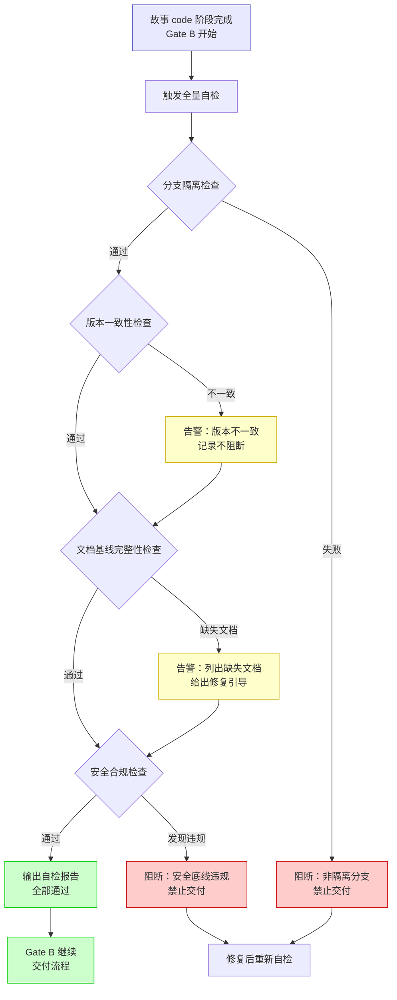
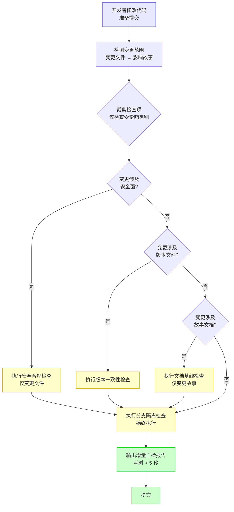
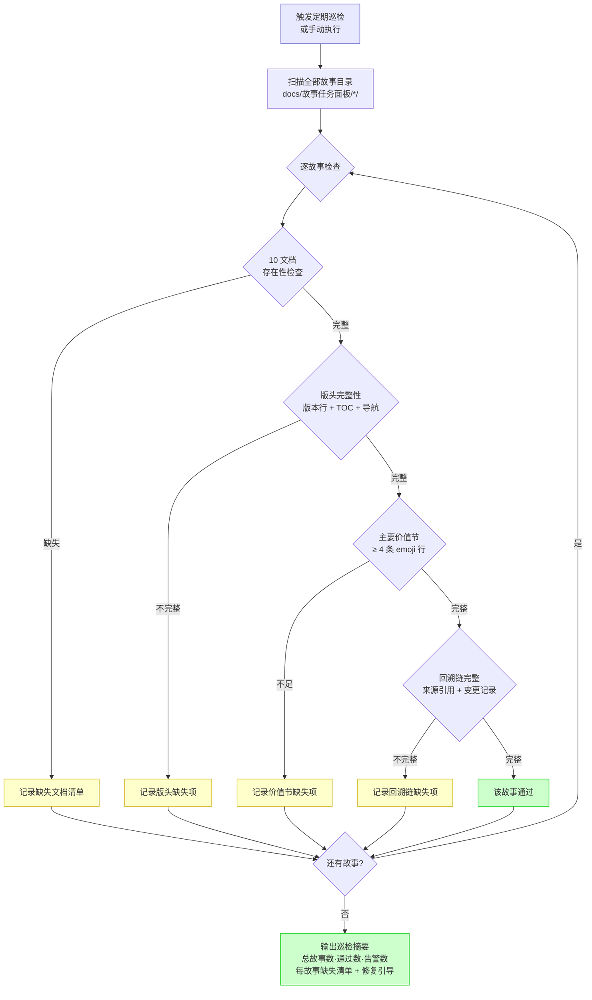
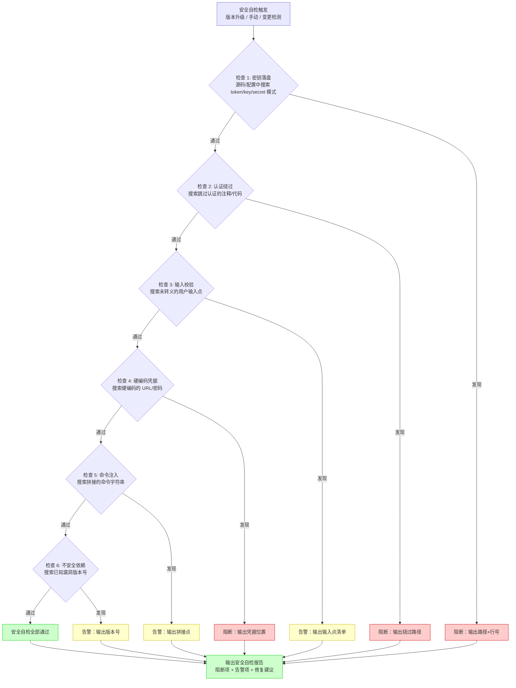
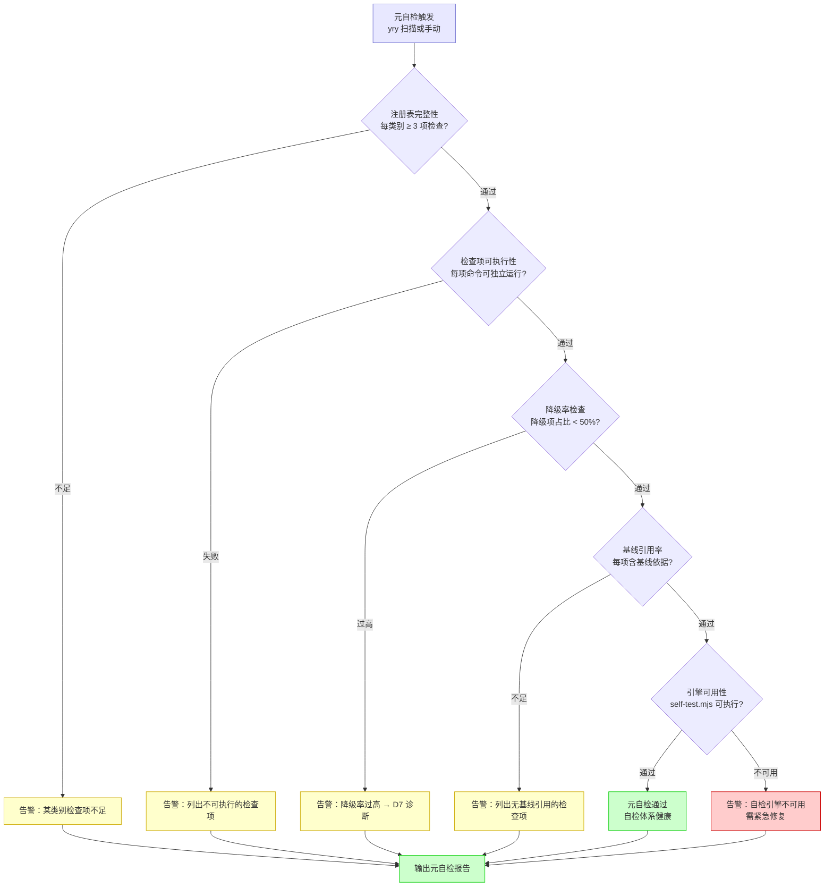

# yry-self-test · 使用场景

> | v1.0.0 | 2026-05-26 | deepseek-v4-pro | 🌿 feat/yry-self-test | 📎 [故事任务](./故事任务.md) |

> **导航**: [← 故事任务](./故事任务.md) · [技术评审 →](./技术评审.md)

> **来源引用**: 由 pm 基于故事任务 FP# 和 AC# 反推用户旅程。从 `rules/delivery-gate.md` §自主测试 + `skills/rui/SKILL.md` §init §4b 自检场景描述推导。证据 Level A + 文档路径。

[§1 场景清单](#sec1-scenarios) · [§2 场景覆盖矩阵](#sec2-matrix) · [§3 边界与异常路径](#sec3-edge) · [§4 角色定义](#sec4-roles)

---

### 主要价值

- 🎯 覆盖自检体系全生命周期 — 全量/增量/巡检/安全回归/元自检五大场景
- 🔒 每场景含正常路径 + 空状态 + 错误恢复，mermaid flowchart 可执行验证
- ⚡ 场景覆盖矩阵对齐故事任务 FP# 和 AC#，确保用户空间基线完整
- 📊 角色定义清晰 — 管线执行者/开发者/维护者/安全审查者/自改进 Agent

---

## §1 场景清单

### 场景 1: 故事交付后全量自检

**角色**: 管线执行者
**目标**: 在故事代码实现完成、Gate B 验证前，自动执行全量自检确保交付质量
**前置条件**: 故事已通过 Gate A，代码已实现，当前在 `feat/<name>` 分支

**操作步骤**:
1. 管线触发自检
2. 按序执行四类检查：分支 → 版本 → 文档 → 安全
3. 有 P0 失败时阻断交付，输出修复引导
4. 全部通过或仅 P1 告警时，自检报告注入 Gate B 结果

**预期结果**: 自检报告包含通过/失败/告警计数 + 每项详情 + 修复建议

---

### 场景 2: 每次提交前增量自检

**角色**: 开发者
**目标**: 修改代码后快速验证变更影响范围内的自检项，不跑全量
**前置条件**: 有未提交变更，当前在 `feat/<name>` 分支

**操作步骤**:
1. 检测变更文件列表
2. 按变更类别裁剪检查项：安全文件变更 → 安全自检，版本文件变更 → 版本自检
3. 分支隔离检查始终执行（无论变更范围）
4. 输出增量报告

**预期结果**: 仅执行相关检查项，耗时远小于全量自检

---

### 场景 3: 文档基线完整性定期巡检

**角色**: 项目维护者
**目标**: 定期扫描所有故事目录，发现文档缺失或结构异常，生成修复建议
**前置条件**: 项目故事目录存在，文档为 markdown 格式

**操作步骤**:
1. 扫描 `docs/故事任务面板/` 下全部故事目录
2. 逐故事检查：10 文档存在性 → 版头 → 主要价值 → 回溯链
3. 汇总缺失清单
4. 每项缺失给出修复引导（如"使用 `/rui doc --from-local <name>` 补全"）

**预期结果**: 巡检摘要报告，每故事通过/告警状态，缺失项修复引导

---

### 场景 4: 安全底线回归自检

**角色**: 安全审查者
**目标**: 在版本升级或安全相关变更后，强制执行 6 项安全底线检查
**前置条件**: 有安全相关文件变更或手动触发

**操作步骤**:
1. 执行 6 项安全底线正则扫描
2. 区分阻断（密钥落盘、认证绕过）和告警（输入点、不安全依赖）
3. 每项命中输出文件路径 + 行号
4. P0 命中阻断交付

**预期结果**: 安全自检报告，阻断项和告警项分开列出

---

### 场景 5: 自检体系自身健康检查（元自检）

**角色**: 自改进 Agent
**目标**: 检查自检体系本身是否健康——检查项是否可执行、注册表是否覆盖全面、降级率是否正常
**前置条件**: 自检引擎和注册表已部署

**操作步骤**:
1. 检查注册表覆盖度（每类别至少 3 项）
2. 逐项验证检查命令可独立执行
3. 计算降级率，超过 50% 触发 D7 诊断
4. 验证引擎自身可执行

**预期结果**: 元自检报告，健康声明或修复建议

---

## §2 场景覆盖矩阵

| 场景 | 正常路径 | 空状态 | 错误恢复 | 关联 FP# | 关联 AC# |
|------|---------|--------|---------|---------|---------|
| 场景 1: 全量自检 | 四类检查全部通过 → 交付继续 | 无检查项注册时跳过（不应该发生） | P0 失败阻断 → 修复 → 重新自检 | FP2, FP3, FP4, FP5, FP6, FP7, FP8 | AC1, AC7, AC8 |
| 场景 2: 增量自检 | 仅变更相关检查项执行 | 无变更时提示无需自检 | 变更检测失败 → 降级为全量自检 | FP2, FP10 | AC9 |
| 场景 3: 文档巡检 | 全故事扫描 → 输出缺失清单 | 无故事目录时跳过 | 单故事扫描失败 → 跳过继续下一个 | FP5 | AC5 |
| 场景 4: 安全回归 | 6 项全部通过 | 无可扫描文件时跳过 | 误报支持白名单排除 | FP6 | AC6 |
| 场景 5: 元自检 | 注册表健康 + 引擎可用 | 注册表为空时告警 | 单项不可执行时跳过该检查 | FP1, FP2 | AC1 |

---

## §3 边界与异常路径

### 空状态处理

| 状态 | 场景 | 处理 |
|------|------|------|
| 无故事目录 | 文档巡检 | 输出"无故事目录，跳过文档检查"，不阻断 |
| 注册表为空 | 全量/增量自检 | 告警"检查项注册表为空"，记录 `no-self-test-registry` |
| 无 feat 分支 | 分支隔离检查 | 非 main 时告警，main 上阻断写操作 |
| 非 git 仓库 | 全量自检 | 跳过 git 相关检查，标记 `no-git-repo` |

### 错误恢复路径

| 错误 | 恢复方式 |
|------|---------|
| 单项检查超时 | 标记 `degraded`，记录超时项，继续下一项 |
| 变更检测失败 | 自动降级为全量自检模式 |
| 脚本依赖缺失 | 标记 `skipped`，输出缺失依赖清单 |
| 报告写入失败 | 告警，自检结果仍输出到终端 |

---

## §4 角色定义

| 角色 | 职责 | 使用场景 |
|------|------|---------|
| 管线执行者 | 在 Gate B 阶段触发全量自检，根据结果决定是否继续交付 | 场景 1 |
| 开发者 | 提交前触发增量自检，快速验证变更安全 | 场景 2 |
| 项目维护者 | 定期触发文档巡检，发现知识退化 | 场景 3 |
| 安全审查者 | 版本升级或安全变更后触发安全回归自检 | 场景 4 |
| 自改进 Agent | 通过元自检评估自检体系健康度，提出改进提案 | 场景 5 |
