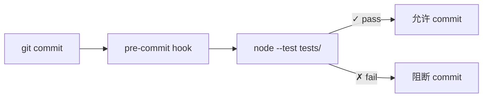

# 场景-1-automated-test-suite

> | v1.0.0 | 2026-05-30 | coder + tester | 🌿 main | 📎 [故事任务](./故事任务.md) |
> **导航**: [§0 技术评审](#s0-技术评审) · [§1 测试设计](#s1-测试设计)

---

## §0 技术评审

### 效果示意


### 测试架构

#### 框架选型

| 方案 | 优势 | 劣势 | 结论 |
|------|------|------|------|
| Node.js 内置 `node:test` | 零依赖，Node 18+ 内置 | 功能精简，无 mock 内置 | **选用** |
| vitest | 功能丰富，mock 内置 | 需要安装依赖 | 备选（如需 mock） |
| jest | 生态成熟 | 重，配置复杂 | 不选 |

> YrY 是 meta 项目，脚本以文件 I/O 和 CLI 为主，`node:test` 内置断言 + `child_process` 可满足全部测试需求。

#### 目录结构

```
YrY/
├── tests/
│   ├── scripts.test.mjs        # 核心脚本逻辑测试
│   ├── structure.test.mjs      # 规约结构验证
│   └── config.test.mjs         # 配置合法性验证
├── skills/
├── agents/
├── rules/
└── ...
```

#### Mock 策略

| 场景 | 策略 | 实现 |
|------|------|------|
| git 命令 | 检测 git 环境，缺失则跳过 | `child_process.execSync('git rev-parse --git-dir')` 失败 → skip |
| 文件系统 | 使用实际文件系统 | 读取项目文件，无需 mock |
| 远端 API | 不涉及 | 单元测试不调用外部 API |
| 环境变量 | 测试中设置 `process.env` | 每个 test case setup 中设置 |

#### CI 集成点



#### 覆盖率阈值

| 指标 | 目标 | 说明 |
|------|------|------|
| 脚本覆盖 | 100% | 每个 .mjs 至少 1 条冒烟测试 |
| 规约覆盖 | 100% | 每个 Agent/Rule 文件结构验证 |
| 配置覆盖 | 100% | plugin.json 全字段 schema |

---

## §1 测试设计

### 测试用例

#### TC1: branch-check.mjs — 分支验证逻辑

```javascript
// tests/scripts.test.mjs
import { describe, it } from 'node:test';
import assert from 'node:assert';
import { execSync } from 'node:child_process';

describe('branch-check.mjs', () => {
  it('在 git 仓库中运行应返回退出码', { skip: !inGitRepo() }, () => {
    const result = runScript('skills/rui/branch-check.mjs', ['--story=test', '--mode=write']);
    assert.ok(result.status === 0 || result.status === 1, '退出码应为 0 或 1');
  });

  it('缺少必要参数应报错', () => {
    const result = runScript('skills/rui/branch-check.mjs', []);
    assert.notStrictEqual(result.status, 0, '缺少参数应非零退出');
  });
});
```

#### TC2: recommend.mjs — 数据采集输出格式

```javascript
describe('recommend.mjs', () => {
  it('应输出有效 JSON', () => {
    const result = runScript('skills/rui/recommend.mjs', ['--root=.', '--type=meta', '--format=json']);
    const parsed = JSON.parse(result.stdout);
    assert.ok(Array.isArray(parsed), '输出应为数组');
  });

  it('应包含预期字段', () => {
    const result = runScript('skills/rui/recommend.mjs', ['--root=.', '--type=meta', '--format=json']);
    const parsed = JSON.parse(result.stdout);
    if (parsed.length > 0) {
      const item = parsed[0];
      assert.ok('storyName' in item, '应含 storyName');
      assert.ok('priority' in item, '应含 priority');
    }
  });
});
```

#### TC3: help.mjs — 帮助输出格式

```javascript
describe('help.mjs', () => {
  const helpFiles = ['skills/rui/help.mjs', 'skills/rui-story/help.mjs',
    'skills/rui-claude/help.mjs', 'skills/rui-import/help.mjs',
    'skills/rui-bot/help.mjs', 'skills/rui-trends/help.mjs'];

  for (const helpFile of helpFiles) {
    it(`${helpFile} 应成功执行`, { skip: !fileExists(helpFile) }, () => {
      const result = runScript(helpFile, []);
      assert.strictEqual(result.status, 0, `${helpFile} 退出码应为 0`);
    });
  }
});
```

#### TC4: Agent 文件必填节验证

```javascript
// tests/structure.test.mjs
import { describe, it } from 'node:test';
import assert from 'node:assert';
import { readFileSync, existsSync } from 'node:fs';

describe('Agent 文件结构', () => {
  const agentFiles = ['AGENT', 'pm', 'coder', 'tester', 'reporter', 'self-improve'];
  const requiredSections = [/铁律/, /职责边界|责任边界/, /触发/];

  for (const name of agentFiles) {
    const filePath = `agents/${name}.md`;

    it(`${filePath} 存在`, () => {
      assert.ok(existsSync(filePath), `${filePath} 缺失`);
    });

    it(`${filePath} 含必填节`, { skip: !existsSync(filePath) }, () => {
      const content = readFileSync(filePath, 'utf-8');
      for (const pattern of requiredSections) {
        assert.ok(pattern.test(content), `${filePath} 缺节: ${pattern}`);
      }
    });
  }
});
```

#### TC5: Rule 文件 frontmatter 验证

```javascript
describe('Rule 文件结构', () => {
  const ruleFiles = ['code-pipeline', 'delivery-gate', 'doc-generation', 'rui-claude', 'self-improve'];

  for (const name of ruleFiles) {
    const filePath = `rules/${name}.md`;

    it(`${filePath} 存在`, () => {
      assert.ok(existsSync(filePath), `${filePath} 缺失`);
    });

    it(`${filePath} 含 frontmatter paths`, { skip: !existsSync(filePath) }, () => {
      const content = readFileSync(filePath, 'utf-8');
      assert.ok(content.startsWith('---'), `${filePath} 缺 frontmatter 起始`);
      assert.ok(/paths:/.test(content), `${filePath} 缺 paths 字段`);
    });
  }
});
```

#### TC6: plugin.json 配置 schema 验证

```javascript
// tests/config.test.mjs
import { describe, it } from 'node:test';
import assert from 'node:assert';
import { readFileSync } from 'node:fs';

describe('plugin.json', () => {
  const config = JSON.parse(readFileSync('.claude-plugin/plugin.json', 'utf-8'));

  it('必填字段齐全', () => {
    assert.ok('name' in config, '缺 name');
    assert.ok('version' in config, '缺 version');
    assert.ok('description' in config, '缺 description');
  });

  it('version 符合 semver', () => {
    assert.ok(/^\d+\.\d+\.\d+$/.test(config.version), `版本格式错误: ${config.version}`);
  });

  it('name 非空', () => {
    assert.ok(config.name.length > 0, 'name 为空');
  });
});
```

#### TC7: SKILL.md 存在性检查

```javascript
describe('SKILL.md 存在性', () => {
  const skillDirs = ['rui', 'rui-story', 'rui-claude', 'rui-import', 'rui-bot', 'rui-trends'];

  for (const dir of skillDirs) {
    it(`skills/${dir}/SKILL.md 存在`, () => {
      assert.ok(existsSync(`skills/${dir}/SKILL.md`), `skills/${dir}/SKILL.md 缺失`);
    });
  }
});
```

### AC

| AC# | Given | When | Then | 门禁 |
|-----|-------|------|------|------|
| AC1 | 测试文件就绪 | 执行 `node --test tests/scripts.test.mjs` | 核心脚本测试全部通过 | Gate A |
| AC2 | 规约文件存在 | 执行 `node --test tests/structure.test.mjs` | 结构验证全部通过 | Gate A |
| AC3 | plugin.json 存在 | 执行 `node --test tests/config.test.mjs` | 配置验证全部通过 | Gate A |
| AC4 | 全部测试就绪 | 执行 `node --test tests/` | 0 失败 | Gate B |

### 辅助函数

```javascript
// 共享辅助（各测试文件引用）
function inGitRepo() {
  try { execSync('git rev-parse --git-dir', { stdio: 'ignore' }); return true; }
  catch { return false; }
}

function fileExists(path) {
  return existsSync(path);
}

function runScript(scriptPath, args = []) {
  try {
    const stdout = execSync(`node ${scriptPath} ${args.join(' ')}`, {
      encoding: 'utf-8', timeout: 10000
    });
    return { status: 0, stdout };
  } catch (err) {
    return { status: err.status || 1, stdout: err.stdout || '', stderr: err.stderr || '' };
  }
}
```

---

> **回溯链**：[故事任务](./故事任务.md) · [CLAUDE.md](../../../CLAUDE.md) · [AGENT.md](../../../agents/AGENT.md)

### 变更记录

| 日期 | 版本 | 变更内容 |
|------|------|---------|
| 2026-05-30 | 1.0.0 | init 初始化，测试基线 |
