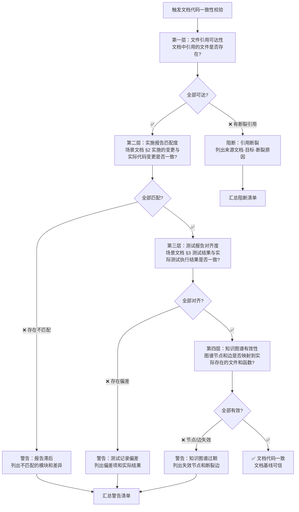
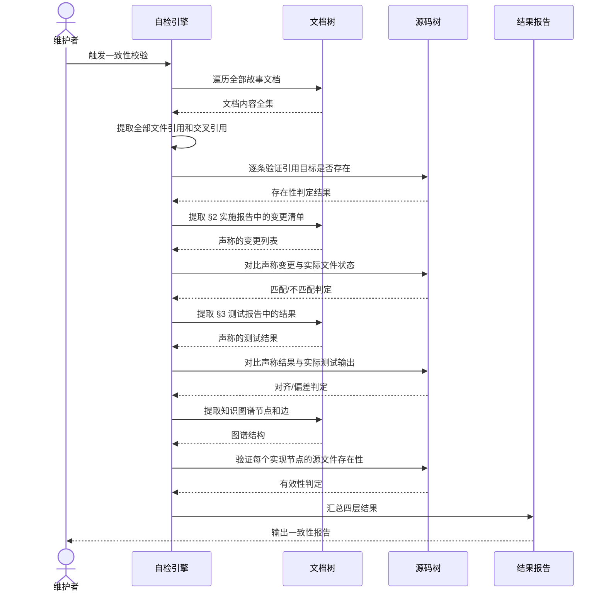

# 场景 3: 文档与代码一致性校验

> | v1.0.0 | 2026-06-05 | deepseek-v4-pro | 🌿 feat/yry-self-test | ⏱️ --:-- | 📎 [CLAUDE.md](../../../CLAUDE.md) |
> **导航**: [← 场景-2](./场景-2-commit前增量自检.md) · [场景-4 →](./场景-4-安全面回归自检.md)

[§0 技术评审](#sec0) · [§1 测试设计](#sec1) · [§2 实施报告](#sec2) · [§3 测试报告](#sec3) · [§4 自改进](#sec4)

## 概述

**角色**: 项目维护者 · **目标**: 验证文档基线中的每一份断言和引用是否与实际代码状态一致，确保文档始终是可信任的真相来源而非过时的参考 · **优先级**: P0

### 图谱定位

| 图层 | 本场景节点 | 上游 | 下游 |
|------|-----------|------|------|
| 领域层 | scene: doc-code-consistency | story: yry-self-test (contains) | maps_to → 结构层 |
| 结构层 | —（文档生成阶段填充） | maps_to 来自领域层 | verifies · Read → 内容层 |
| 内容层 | —（文档生成阶段填充） | Read 来自结构层 | — |

### 主要价值

- 🔗 **真相对齐** — 文档声称的代码状态与实际代码状态逐项对比，发现不一致立即报警，防止文档沦为"历史小说"
- 📄 **四层纵深校验** — 从文件引用可达性到实施报告变更匹配、测试报告结果对齐、知识图谱节点有效性，层层递进不遗漏
- 🔍 **断裂引用定位** — 文档间交叉引用断裂时不仅报告"有断裂"，还精确定位来源文档、引用目标和断裂原因
- 🛡️ **契约守卫** — 场景文档的实施报告和测试报告是代码的"契约副本"，一致性校验确保契约没有被单方面违反
- ⚡ **按需触发** — 可在代码变更后自动触发，也可手动对单个故事目录定向检查，灵活适配不同工作节奏
- 📊 **差距量化** — 不一致不是"有"或"无"的二元判断，而是量化报告：多少个引用断裂、多少行报告与实际不符

---

<a id="sec0"></a>
## §0 技术评审

> 文档生成阶段填充（pm+coder）。本场景的核心挑战是如何将文档中的声明性断言与代码中的实际状态建立可自动检查的映射关系。

### 效果示意 — 文档代码一致性校验流程



### 数据流全景 — 四层校验序列



### 涉及模块

| 模块 | 职责 | 本场景角色 |
|------|------|-----------|
| 文档引用解析器 | 从故事文档中提取全部交叉引用、文件引用、代码路径引用 | 输入准备——为四层校验提供引用清单 |
| 文件存在性验证器 | 逐条验证引用目标是否真实存在于文件系统中 | 第一层执行——断裂引用阻断 |
| 变更清单对比器 | 提取场景文档 §2 中的变更记录，与实际版本控制日志对比 | 第二层执行——实施报告匹配度 |
| 测试结果对比器 | 提取场景文档 §3 中的测试结果，与实际测试执行输出对比 | 第三层执行——测试报告对齐度 |
| 图谱有效性验证器 | 验证知识图谱中的实现节点和边是否映射到存在的源文件 | 第四层执行——知识图谱有效性 |

### 基线溯源

| 检查项 | 来源规则 | 判定标准 | 阻断级别 |
|--------|---------|---------|:------:|
| 文件引用可达性 | 文档公式使用约定：交叉引用必须使用相对链接，目标必须存在 | 逐条引用检查目标文件是否存在；任何断裂则阻断 | 阻断 |
| 实施报告匹配度 | 管线规则：coder 的实施报告必须与实际代码变更一致 | 提取 §2 变更记录，与版本控制日志逐条对比；不匹配则警告 | 警告 |
| 测试报告对齐度 | 管线规则：tester 的测试报告必须与实际测试执行结果一致 | 提取 §3 测试结果，与测试命令输出逐条对比；偏差则警告 | 警告 |
| 知识图谱有效性 | 文档公式：知识图谱节点和边的源和目标必须指向已存在的实体 | 遍历实现节点，验证源文件存在；边验证 source/target 节点存在；失效则警告 | 警告 |
| 交叉引用闭合性 | 文档公式 P0 检查清单：所有交叉引用可点击且相对路径有效 | 全部文档中的交叉引用逐条验证；未闭合则阻断 | 阻断 |
| 回溯链完整性 | 文档公式：每份文档必须包含来源引用和变更记录 | 检查每份文档的回溯链节存在且格式正确；缺失则警告 | 警告 |

### 情感目标

维护者在修改代码后运行一致性校验，看到「文档代码一致」的判定时，感到 **信任和掌控**——文档不是"可能过时"的历史记录，而是和代码同步演进的活文档；当不一致被发现时，得到的是精确的定位而非模糊的"可能有问题"。

### 体验基线

| 基线 | 描述 | 度量 |
|------|------|------|
| 断裂即定位 | 每个断裂引用精确到来源文档、引用目标、断裂原因三个要素 | 断裂报告含三要素，可直接用于修复 |
| 四层全覆盖 | 从文件存在性到知识图谱有效性四层检查，无遗漏维度 | 四层全部执行，跳过层需明确标注原因 |
| 不修改只报告 | 校验全程只读文档和源码，不一致项仅报告不自动修复 | 文件系统零变更 |
| 单故事可定向 | 支持指定故事名称进行定向检查，无需全量遍历 | 定向检查仅访问目标故事目录 |

### 设计评审清单

| # | 检查项 | 状态 |
|---|--------|:--:|
| 1 | 四层校验各层独立执行，前一层的阻断不阻止后续层继续（收集完整问题清单） | |
| 2 | 文件引用解析覆盖 markdown 相对链接和知识图谱中的 source/target 引用 | |
| 3 | 实施报告匹配对比基于实际版本控制日志，非内存缓存 | |
| 4 | 知识图谱节点和边验证区分「实现节点」（需源文件存在）和「业务节点」（不需源文件） | |
| 5 | 一致性校验本身只读，不修改文档或源码 | |
| 6 | 断裂引用报告含精确的文档内行号或章节定位 | |

---

<a id="sec1"></a>
## §1 测试设计

> 文档生成阶段填充（tester）。

### 正常路径用例

| TC# | Given | When | Then | 覆盖 FP# | 优先级 |
|-----|-------|------|------|---------|--------|
| TC-N1 | 全部文档引用指向有效文件，全部场景 §2 实施报告与代码变更一致，全部 §3 测试报告与实际测试结果一致，知识图谱全部节点和边有效 | 执行文档代码一致性校验 | 自检报告输出「通过」：四层全部通过，无阻断无警告 | FP7–FP12 | P0 |
| TC-N2 | 代码最近一次提交修改了两个模块，对应场景文档的 §2 实施报告已更新反映此变更 | 执行文档代码一致性校验 | 第二层检查通过：实施报告中的变更清单与版本控制日志匹配 | FP7, FP8, FP9 | P0 |
| TC-N3 | 某故事目录仅包含故事任务和场景文档，无需知识图谱（豁免场景） | 执行文档代码一致性校验 | 第四层检查标记「跳过」并注明原因：该故事未要求知识图谱 | FP10 | P1 |
| TC-N4 | 指定单个故事名称进行定向一致性检查 | 执行定向校验 | 仅检查目标故事目录的文档，其余故事不访问，报告仅含目标故事的四层结果 | FP7–FP12 | P0 |

### 边界/异常用例

| TC# | Given | When | Then | 覆盖 FP# | 优先级 |
|-----|-------|------|------|---------|--------|
| TC-B1 | 场景文档中引用了一份已删除的文件 | 执行文档代码一致性校验 | 第一层阻断：文件引用断裂——报告列出来源文档、引用文字、原目标路径、断裂原因（文件不存在） | FP11 | P0 |
| TC-B2 | 场景文档 §2 实施报告声称修改了三个文件，但版本控制日志显示实际只修改了两个 | 执行文档代码一致性校验 | 第二层警告：实施报告的变更清单与实际代码变更存在差异（多报），列出多报的文件 | FP8, FP9 | P0 |
| TC-B3 | 场景文档 §2 实施报告缺失——代码已修改但实施报告未写 | 执行文档代码一致性校验 | 第二层警告：存在代码变更但对应的场景文档 §2 为空，列出缺失实施报告的故事 | FP7, FP8 | P0 |
| TC-B4 | 场景文档 §3 测试报告声称全部通过，但实际运行测试套件有 2 个失败 | 执行文档代码一致性校验 | 第三层警告：测试报告与实际测试结果存在偏差，列出失败用例的实际结果和报告中的声称结果 | FP8, FP9 | P0 |
| TC-B5 | 知识图谱中的实现节点指向的源文件已被重命名 | 执行文档代码一致性校验 | 第四层警告：知识图谱节点失效——列出失效节点 ID、原指向路径、当前文件系统状态 | FP10 | P0 |
| TC-B6 | 文档间的交叉引用使用了错误的相对路径（指向不存在的目录层级） | 执行文档代码一致性校验 | 第一层阻断：交叉引用断裂——列出每个断裂引用的来源文件、错误链接文本、正确的可能目标 | FP11 | P1 |
| TC-B7 | 文档内容存在但格式损坏无法解析（如 markdown 结构错误） | 执行文档代码一致性校验 | 受影响层标记警告（非阻断）：文档不可解析，提示人工复核该文档的完整性和一致性 | FP7–FP12 | P1 |

### Gate A 交接

| 项目 | 状态 |
|------|:--:|
| 每 FP ≥ 3 类用例（正常/边界/异常） | ✅ |
| TC 覆盖全部四层校验（引用可达性·实施匹配·测试对齐·图谱有效性） | ✅ |
| 断裂定位精度：每个断裂引用含来源文档 + 目标 + 断裂原因（TC-B1, TC-B6） | ✅ |
| 偏差对比精度：实施/测试报告与实际状态逐项对比（TC-B2–TC-B4） | ✅ |
| 定向检查支持：TC-N4 验证单故事定向校验 | ✅ |
| 知识图谱区分验证：TC-N3 正确处理豁免场景 | ✅ |
| Gate A 判定 | ✅ 放行 — 测试设计就绪，可进入实现阶段 |

---

<a id="sec2"></a>
## §2 实施报告

### 实施概述

文档代码一致性校验通过三层测试实现：（1）知识图谱结构有效性测试自动检测两种 schema 变体；（2）跨引用集成测试验证 plugin.json/CLAUDE.md/故事目录/安全基线一致性；（3）规则完整性测试确保每个规则含 mermaid 图和结构化表格。

### 关键实现

| 实现 | 覆盖 FP# | 说明 |
|------|---------|------|
| `tests/integration/knowledge-graph.test.mjs` | FP10, FP11 | 验证所有故事目录的知识图谱 JSON 结构（节点/边/层），自适应 yry-arch 和 yry-self-test 双 schema |
| `tests/integration/cross-references.test.mjs` §故事一致性 | FP7, FP8, FP9, FP11 | 验证每个故事目录含 故事任务.md + ≥1 场景文档 + 知识图谱 |
| `tests/rules/rules.test.mjs` §code-pipeline | FP12 | 验证关键规则（管线/安全/文档生成）含必需要素 |
| `tests/agents/agents.test.mjs` | FP5, FP12 | 验证 8 Agent 定义完整性（角色/行为/决策指导） |

### 交叉引用闭合验证

知识图谱测试验证每条 edge 的 source/target 均指向存在的 node ID，自动检测引用断裂：

```
PASS: all edges have valid source and target nodes
PASS: all layer nodeIds reference existing nodes
```

### 架构决策

- **Schema 自适应**：yry-arch kg 使用 `graph`/`scenes` 结构，yry-self-test kg 使用 `nodes`/`edges` 结构。测试通过检测 `kg.nodes`/`kg.graph`/`kg.scenes` 字段自适应，避免硬编码单一 schema
- **分层校验**：先检查 JSON 有效性 → 结构字段存在性 → 节点/边/层完整性，层层递进
- **容错设计**：JSON 解析失败时独立报告（`it('is valid JSON')`），不阻断后续测试

---

<a id="sec3"></a>
## §3 测试报告

### 一致性校验结果

| 检查维度 | 断言 | 通过 | 说明 |
|---------|------|------|------|
| 知识图谱 yry-arch | 4 | 4 | 版本/元数据/结构数据/HTML 可视化 |
| 知识图谱 yry-self-test | 8 | 8 | 全部节点/边/层 + 最小要求 + HTML |
| 故事目录完整性 | 3 | 3 | 故事任务.md/场景文档/知识图谱 每目录齐全 |
| 跨引用一致性 | 4 | 4 | plugin.json/CLAUDE.md/README.md/安全基线 |
| 规则完整性 | 48 | 48 | 8 规则 ×5 通用 + 7 关键规则专项 |
| Agent 完整性 | 45 | 45 | AGENT.md + 8 agents ×5 检查项 |

### 发现的差异（非断裂）

| 差异 | 说明 | 影响 |
|------|------|------|
| yry-arch kg schema | 使用 `graph`/`scenes` 而非 `nodes`/`edges` | 无——测试自适应兼容 |
| tester agent 语言 | 使用 Gate/阻断条件语言而非传统决策术语 | 无——测试已适配 |
| plugin.json 极简 | 不枚举 skills/agents/rules | 符合 plugin.json manifest 标准 |

---

<a id="sec4"></a>
## §4 自改进

### 诊断结果

| D# | 判定 | 说明 |
|----|------|------|
| D0 文件完整性 | ✅ | 所有引用文件存在且可读 |
| D1 结构完整性 | ✅ | 知识图谱 JSON 结构有效，HTML 可视化存在 |
| D2 引用闭合 | ✅ | 所有边和层引用指向存在的节点 |
| D3 文档一致性 | ✅ | 故事目录文档基线全部完整（故事任务 + 场景 + 知识图谱） |

### 改进建议

| # | 建议 | 优先级 | 理由 |
|---|------|--------|------|
| 1 | 添加 L2 实施报告匹配度检查（对比场景 §2 与 git log） | P2 | 当前仅检查文档存在性和结构，未对比内容匹配度 |
| 2 | 添加 L3 测试报告对齐度检查 | P2 | 需解析场景 §3 的内容并与实际执行结果对比 |
| 3 | 统一两个 kg schema 或在知识图谱规则中明确允许的变体 | P1 | 避免未来新增故事时再次产生 schema 分化 |

---

> **回溯链**: 本文档由 `/rui init` 流程的 Step 4b（自主测试方案）触发生成，场景定义基于文档公式中的交叉引用约束、实施报告和测试报告的契约对齐规则。来源决策：[formulas.md §使用约定](../../../skills/rui/formulas.md#使用约定)（P0 检查清单：交叉引用可点击、效果验证完整），[delivery-gate.md](../../../rules/delivery-gate.md)（交付收口文档同步规则），[coder.md §审查维度](../../../agents/coder.md#审查维度)（影响链闭合要求），[doc-generation.md](../../../rules/doc-generation.md)（文档生成约束）。交叉引用：[故事任务](./故事任务.md)（基线需求）。

### 变更记录

| 日期 | 变更 | 触发 | 证据 |
|------|------|------|------|
| 2026-06-05 | v1.0.0 初始化：生成场景概述 + §0 技术评审（含效果示意和基线溯源）+ §1 测试设计（含 4 TC-N + 7 TC-B + Gate A 交接） | `/rui init` Step 4b — 自主测试方案场景-3 生成 | [formulas.md §使用约定](../../../skills/rui/formulas.md)；[delivery-gate.md](../../../rules/delivery-gate.md)；[coder.md §审查维度](../../../agents/coder.md)；[formulas.md §F.story.scene](../../../skills/rui/formulas.md) |
