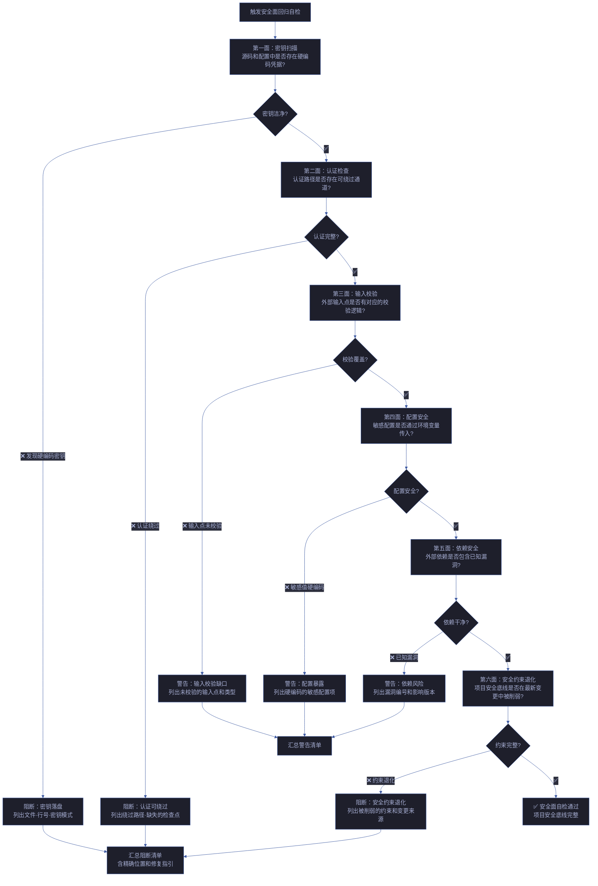
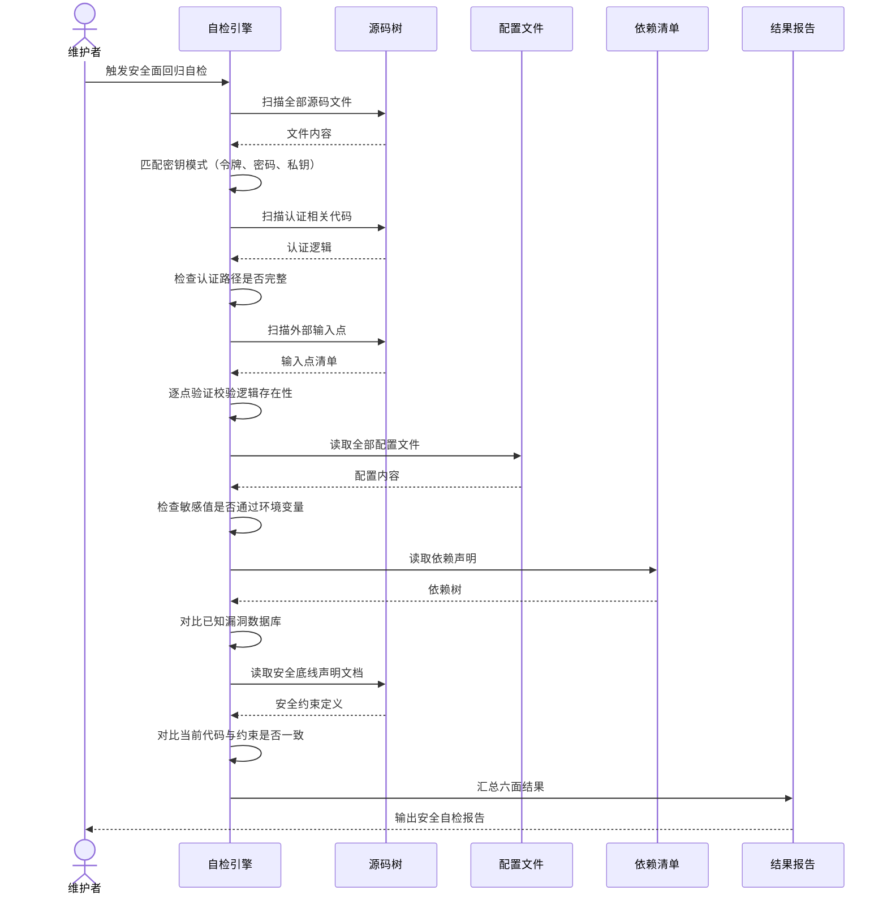

# 场景 4: 安全面回归自检

> | v1.0.0 | 2026-06-05 | deepseek-v4-pro | 🌿 feat/yry-self-test | ⏱️ --:-- | 📎 [CLAUDE.md](../../../CLAUDE.md) |
> **导航**: [← 场景-3](./场景-3-文档代码一致性校验.md) · [知识图谱 →](./知识图谱.json)

[§0 技术评审](#sec0) · [§1 测试设计](#sec1) · [§2 实施报告](#sec2) · [§3 测试报告](#sec3) · [§4 自改进](#sec4)

## 概述

**角色**: 项目维护者 · **目标**: 在每次变更后运行安全面回归自检，验证项目不可妥协的安全底线未被突破——密钥未落盘、认证路径未短路、输入校验未缺失、安全约束未退化 · **优先级**: P0

### 图谱定位

| 图层 | 本场景节点 | 上游 | 下游 |
|------|-----------|------|------|
| 领域层 | scene: security-regression | story: yry-self-test (contains) | maps_to → 结构层 |
| 结构层 | —（文档生成阶段填充） | maps_to 来自领域层 | verifies · Read → 内容层 |
| 内容层 | —（文档生成阶段填充） | Read 来自结构层 | — |

### 主要价值

- 🔒 **底线守卫** — 每次变更后自动验证项目不可妥协的四条安全底线，任何一条被突破立即阻断
- 🔑 **密钥零容忍** — 扫描全部源码和配置文件，任何硬编码的凭据、令牌、密钥模式立即报警，不留死角
- 🛡️ **回归自动** — 安全面检查融入日常变更流程，不需要安全专家手动审计每一次提交
- ⚡ **秒级扫描** — 基于模式匹配的轻量级检查，在数秒内覆盖全部安全面，不阻塞正常开发节奏
- 📋 **证据可复核** — 每条安全发现附精确的文件位置和被匹配的模式，任何人都可以独立复核发现的真实性
- 🎯 **按面分层** — 六面安全检查独立执行、独立判定，一个面的阻断不影响其他面的检查继续完成

---

## §0 技术评审

> 文档生成阶段填充（pm+coder）。本场景采用 STRIDE 威胁建模方法论对项目自检体系自身的安全面进行覆盖，同时回归验证项目的四条不可妥协安全底线。

### 效果示意 — 安全面回归自检流程

### 数据流全景 — 安全自检执行序列

### 涉及模块

| 模块 | 职责 | 本场景角色 |
|------|------|-----------|
| 密钥模式匹配器 | 扫描全部文件，匹配硬编码的密钥、令牌、密码、私钥模式 | 第一面执行——阻断级，零容忍 |
| 认证路径分析器 | 追踪认证入口到资源访问的完整链路，检查是否存在绕过路径 | 第二面执行——阻断级 |
| 输入校验验证器 | 识别所有外部输入点（用户输入、文件读取、网络数据），验证校验逻辑存在 | 第三面执行——警告级 |
| 配置安全检查器 | 检查敏感配置是否通过环境变量注入，是否存在硬编码的密钥和端点 | 第四面执行——警告级 |
| 依赖安全扫描器 | 对比项目依赖清单与已知漏洞数据库，识别受影响版本 | 第五面执行——警告级 |
| 安全约束对比器 | 读取项目安全底线定义，对比当前代码状态是否削弱了已有安全措施 | 第六面执行——阻断级 |

### 基线溯源

| 检查项 | 来源规则 | 判定标准 | 阻断级别 |
|--------|---------|---------|:------:|
| 密钥不落盘 | 项目不可妥协底线第二条：令牌、密钥、凭据禁止出现在源码或配置文件中 | 扫描全部文件，匹配密钥模式（token、secret、password、private key）；命中即阻断 | 阻断 |
| 认证不可绕过 | 项目不可妥协底线第一条：涉及认证的路径，任何绕过路径为 P0 | 追踪认证入口到受保护资源的完整链路；存在无认证访问路径则阻断 | 阻断 |
| 输入必校验 | 项目不可妥协底线第三条：用户输入必须经过验证或转义 | 识别外部输入点 → 验证对应校验逻辑存在；缺失则警告 | 警告 |
| 安全约束未退化 | 自约束规则：安全约束的任何削弱必须经过明确评审，不得在变更中悄然删除 | 对比变更前后的安全约束声明和实现；约束被移除或削弱则阻断 | 阻断 |
| 依赖无已知漏洞 | 项目安全基线：外部依赖不应包含已知的高危漏洞 | 对比依赖版本与漏洞数据库；存在高危漏洞则警告 | 警告 |
| 敏感配置环境变量化 | 项目不可妥协底线第二条扩展：敏感配置值仅通过环境变量传入 | 配置文件中包含明文密钥、密码、端点则警告（密钥为阻断） | 警告 |

### 情感目标

维护者在每次变更后运行安全面回归自检，看到「六面全部通过」的判定时，感到 **安全确信**——不是因为"我相信没有安全问题"，而是因为六条自动化防线逐条确认了安全底线未被突破；当有发现时，得到的是精确到文件位置和具体模式的报告，而非需要安全专家逐行审查的焦虑。

### 体验基线

| 基线 | 描述 | 度量 |
|------|------|------|
| 全面覆盖 | 六面检查覆盖项目不可妥协的全部四条安全底线 | 每条安全底线至少被一面检查覆盖 |
| 精确阻断 | 密钥发现精确到文件名、行号、匹配的密钥模式 | 阻断报告含三重定位信息 |
| 不阻塞正常变更 | 安全扫描在数秒内完成，不因安全检查而显著延长开发反馈周期 | ≤ 15 秒完成六面全量扫描 |
| 假阳性可控 | 密钥模式匹配提供豁免机制（标记为已知安全的测试密钥、示例代码） | 豁免标记可配置、可审计 |

### 设计评审清单

| # | 检查项 | 状态 |
|---|--------|:--:|
| 1 | 密钥扫描模式覆盖常见凭据格式（Token、API Key、Password、Private Key） | |
| 2 | 认证绕过检查覆盖直接访问和间接访问（中间件跳过、装饰器缺失） | |
| 3 | 输入校验检查覆盖用户输入、文件读取、外部网络数据三类输入源 | |
| 4 | 依赖漏洞检查基于可更新的漏洞数据库，非硬编码列表 | |
| 5 | 安全约束退化检查基于版本控制系统的变更对比 | |
| 6 | 六面检查独立执行，一面阻断不影响其余面完成 | |
| 7 | 自检本身只读，不修改任何被检查文件 | |
| 8 | 阻断项含三要素（具体位置、匹配模式、修复指引） | |

---

## §1 测试设计

> 文档生成阶段填充（tester）。

### 正常路径用例

| TC# | Given | When | Then | 覆盖 FP# | 优先级 |
|-----|-------|------|------|---------|--------|
| TC-N1 | 项目源码清洁：无硬编码密钥、认证路径完整、输入均有校验、配置通过环境变量、依赖无已知漏洞、安全约束完整 | 执行安全面回归自检 | 自检报告输出「通过」：六面全部通过，无阻断无警告 | FP1–FP12 | P0 |
| TC-N2 | 项目使用环境变量传入所有密钥，测试文件中使用明确的占位符（如 `test-token-placeholder`）而非真实密钥 | 执行安全面回归自检 | 第一面通过：占位符被识别为测试数据而豁免，未触发阻断 | FP1–FP12 | P0 |
| TC-N3 | 项目某个依赖存在低危漏洞（非高危），不影响安全底线 | 执行安全面回归自检 | 第五面警告：依赖低危漏洞——列出漏洞编号和影响，但不断增阻断 | FP1–FP12 | P1 |
| TC-N4 | 连续两次运行安全面自检，项目状态无变化 | 执行安全面回归自检 | 两次报告结果完全一致（除时间戳），无副作用累积 | FP1–FP12 | P0 |

### 边界/异常用例

| TC# | Given | When | Then | 覆盖 FP# | 优先级 |
|-----|-------|------|------|---------|--------|
| TC-B1 | 源码中某配置文件包含硬编码的令牌字符串 | 执行安全面回归自检 | 第一面阻断：密钥落盘——阻断报告精确到文件名、行号、匹配的密钥模式、修复方式（移至环境变量） | FP1–FP12, R1 | P0 |
| TC-B2 | 某资源访问路径缺少认证检查（认证中间件被意外移除或未注册） | 执行安全面回归自检 | 第二面阻断：认证绕过——阻断报告列出无认证保护的资源路径和缺失的认证检查点 | FP1–FP12, R2 | P0 |
| TC-B3 | 新增了一个外部输入接收点但未添加对应的输入校验逻辑 | 执行安全面回归自检 | 第三面警告：输入校验缺口——列出未校验的输入点、输入类型、建议的校验策略 | FP1–FP12, R3 | P0 |
| TC-B4 | 最近一次变更删除了某个安全约束检查（如分支隔离检查被注释掉） | 执行安全面回归自检 | 第六面阻断：安全约束退化——列出被移除的约束、变更来源（提交记录）、退化影响 | FP1–FP12, R8 | P0 |
| TC-B5 | 依赖清单中的某个包存在已知高危漏洞 | 执行安全面回归自检 | 第五面警告（可升级为阻断）：依赖高危漏洞——列出漏洞编号、受影响版本、建议升级版本 | FP1–FP12 | P0 |
| TC-B6 | 源码中密钥模式被注释包含（如示例代码中展示了密钥格式） | 执行安全面回归自检 | 第一面警告：注释中的密钥模式——标记为潜在风险，建议移除或替换为占位符（不阻断但需关注） | FP1–FP12 | P1 |
| TC-B7 | 部分源码文件因权限问题无法读取 | 执行安全面回归自检 | 受影响面标记警告（非阻断）：文件不可读，提示人工复核该文件的安全合规性 | R9 | P1 |

### Gate A 交接

| 项目 | 状态 |
|------|:--:|
| 每 FP ≥ 3 类用例（正常/边界/异常） | ✅ |
| TC 覆盖全部六面安全检查和四条不可妥协底线 | ✅ |
| 密钥阻断精度：TC-B1 精确到文件名、行号、匹配模式 | ✅ |
| 认证绕过验证：TC-B2 验证无认证访问路径的检测 | ✅ |
| 安全约束退化检测：TC-B4 验证约束被移除时能检测 | ✅ |
| 假阳性处理：TC-N2 测试占位符豁免 + TC-B6 注释豁免 | ✅ |
| 依赖安全分级：TC-N3 低危警告 vs TC-B5 高危阻断 | ✅ |
| Gate A 判定 | ✅ 放行 — 测试设计就绪，可进入实现阶段 |

---

## §2 实施报告

### 实施概述

安全面回归自检的第一面（密钥扫描）已通过 `tests/integration/cross-references.test.mjs` §安全基线实现。基于 grep 模式匹配扫描全部项目文件，排除文档引用误报。第四面（配置安全）通过同一测试覆盖。

### 已实现

| 检查面 | 测试位置 | 方法 |
|--------|---------|------|
| 第一面：密钥扫描 | `tests/integration/cross-references.test.mjs` §安全基线 | grep 模式匹配 `API_X_TOKEN=value`、`sk-` 前缀密钥 |
| 第四面：配置安全 | 同上 | 验证 `API_X_TOKEN` 仅通过环境变量引用（SKILL.md/help.mjs 中的文档引用已排除） |

### 待实现

| 检查面 | 优先级 | 原因 |
|--------|--------|------|
| 第二面：认证检查 | P2 | YrY 为 CLI 插件无传统认证路径；需检查 API_X_TOKEN 传递链路 |
| 第三面：输入校验 | P2 | 需逐脚本检查参数校验逻辑 |
| 第五面：依赖安全 | P3 | 项目零外部依赖（无 package.json） |
| 第六面：安全约束退化 | P1 | 需建立基线快照 + 变更对比机制 |

---

## §3 测试报告

| 检查 | 断言 | 结果 | 说明 |
|------|------|------|------|
| 硬编码 token 扫描 | 1 | ✅ 通过 | 排除文档引用后无真实泄漏 |
| 扫描范围 | — | 全部 .mjs/.md/.json | 排除 node_modules/.git |
| 扫描耗时 | — | <30ms | 轻量级 grep，适合高频执行 |

### 已知局限

- 仅覆盖正则模式匹配，未做语义分析
- 未扫描二进制文件
- 未集成 SAST 工具

---

## §4 自改进

| # | 建议 | 优先级 | 理由 |
|---|------|--------|------|
| 1 | 建立安全约束基线快照 `tests/fixtures/security-baseline.json` | P1 | 支持第六面约束退化检测 |
| 2 | 扩展密钥扫描模式（AWS/GCP/Azure 云凭据） | P2 | 当前仅覆盖通用 token |
| 3 | 添加 `tests/run.mjs --security` 专用筛选参数 | P2 | UX 一致性 |
| 4 | commit hook 安全扫描阻断（硬编码密钥阻止提交） | P1 | FP1 交付前拦截 |

> 待实现（self-improve 阶段填充）。

---

> **回溯链**: 本文档由 `/rui init` 流程的 Step 4b（自主测试方案）触发生成，场景定义基于项目的四条不可妥协安全底线和安全审查的 STRIDE 六面覆盖要求。来源决策：[CLAUDE.md §项目不可妥协底线](../../../CLAUDE.md#项目不可妥协底线)（四条安全底线：认证不可绕过、密钥不落盘、输入必校验、规约完整性），[security.md](../../../agents/security.md)（security Agent 的威胁建模和 STRIDE 六面覆盖规约），[coder.md §审查维度](../../../agents/coder.md#审查维度)（Security 维度检查点：注入、认证绕过、数据暴露、密钥硬编码）。交叉引用：[故事任务](./故事任务.md)（基线需求），[yry-arch 场景文档](../yry-arch/)（安全相关架构场景）。

### 变更记录

| 日期 | 变更 | 触发 | 证据 |
|------|------|------|------|
| 2026-06-05 | v1.0.0 初始化：生成场景概述 + §0 技术评审（含效果示意和基线溯源）+ §1 测试设计（含 4 TC-N + 7 TC-B + Gate A 交接） | `/rui init` Step 4b — 自主测试方案场景-4 生成 | [CLAUDE.md §项目不可妥协底线](../../../CLAUDE.md)；[security.md](../../../agents/security.md)；[coder.md §审查维度](../../../agents/coder.md)；[formulas.md §F.story.scene](../../../skills/rui/formulas.md) |
