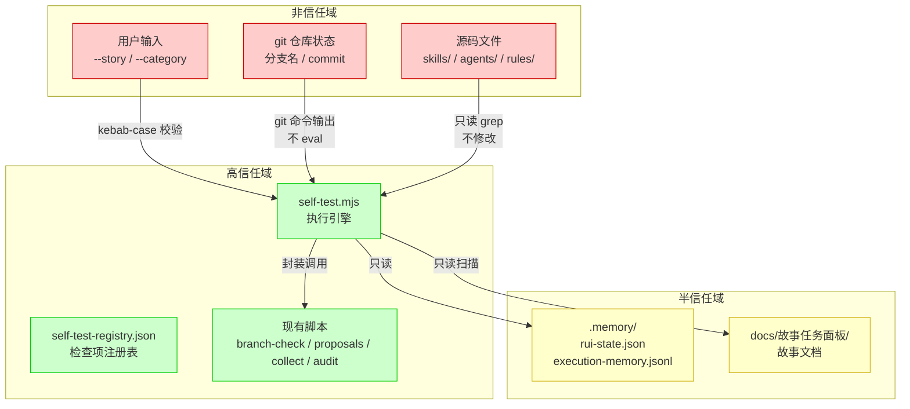

# yry-self-test · 安全审计

> | v1.0.0 | 2026-05-26 | deepseek-v4-pro | 🌿 feat/yry-self-test | 📎 [故事任务](./故事任务.md) |

> **导航**: [← 测试设计](./测试设计.md) · [实施报告 →](./实施报告.md)

> **来源引用**: 由 security 基于技术评审 §7 安全考量 + §2 检查项注册表 SC 类独立审计。不依赖 coder 自评。证据 Level A + 文档路径。

[§0 基线溯源](#sec0-baseline) · [§1 资产识别](#sec1-assets) · [§2 STRIDE 威胁建模](#sec2-stride) · [§3 信任边界](#sec3-trust) · [§4 缓解措施](#sec4-mitigation) · [§5 合规检查](#sec5-compliance) · [§6 独立审计声明](#sec6-declaration)

---

### 主要价值

- 🎯 STRIDE 六类威胁全覆盖 — 14 威胁（S:2 + T:4 + R:2 + I:2 + D:2 + E:2）系统化识别
- 🔒 信任边界分层清晰 — 高信任域/半信任域/非信任域三级，6 条数据流边界逐条校验
- ⚡ 独立审计 — security agent 独立执行，不依赖 coder 自评，确保审计客观性
- 📊 合规 6 项全查 + 6 项缓解措施 — 认证/密钥/输入校验/规约完整性/自托管一致性/禁止魔法数字

---

## §0 基线溯源

| 来源 | 映射本节 |
|------|---------|
| 技术评审 §7 安全考量 | §2 威胁建模 + §3 信任边界 |
| 技术评审 §2.1 SC 类检查项（SC-01~SC-06） | §4 缓解措施 + §5 合规检查 |
| CLAUDE.md §项目不可妥协底线 | §5 合规检查 6 项 |
| 故事任务 FP6 安全合规自检 | §2 威胁建模 + §4 缓解措施 |

---

## §1 资产识别

### 自检体系资产清单

| 资产 | 类型 | 敏感度 | 威胁面 |
|------|------|:------:|--------|
| self-test.mjs（执行引擎） | 可执行脚本 | M | 篡改/绕过/注入 |
| self-test-registry.json（注册表） | 配置文件 | M | 篡改/降级滥用 |
| 自检报告（terminal + JSON） | 输出数据 | L | 伪造/信息泄露 |
| execution-memory.jsonl（历史记录） | 持久化数据 | L | 篡改/污染 |
| 自检结果 → Gate B 判定 | 控制流 | H | 绕过/伪造 |
| branch-check.mjs（适配调用） | 现有脚本 | M | 接口滥用 |
| --story / --category 参数 | 用户输入 | L | 注入 |

### 受保护对象

| 对象 | 保护目标 |
|------|---------|
| Gate B 阻断判断 | 不可被绕过——P0 失败必须阻断 |
| 检查项执行结果 | 不可被伪造——结果必须来自实际执行 |
| 降级路径 | 不可被滥用——降级必须可审计 |
| 注册表完整性 | 不可被篡改——检查项不可被删除或降级静默化 |

---

## §2 STRIDE 威胁建模

### S — 身份欺骗 (Spoofing)

| 威胁 | 描述 | 可能性 | 影响 | 缓解 |
|------|------|:------:|:----:|------|
| S-01 | 攻击者伪造自检报告 JSON，声称全部通过 | L | H | 报告含 git commit hash，Gate B 验证报告 commit 与当前 HEAD 一致 |
| S-02 | 攻击者伪装为自检引擎输出到终端 | L | M | 自检引擎输出含特征标识（`=== YrY Self-Test Report ===`），人工可识别 |

### T — 数据篡改 (Tampering)

| 威胁 | 描述 | 可能性 | 影响 | 缓解 |
|------|------|:------:|:----:|------|
| T-01 | 攻击者修改注册表，将所有检查项设为 `degraded: true` | M | H | 元自检检查降级率，> 50% 触发 D7 告警；注册表变更纳入 git diff 审查 |
| T-02 | 攻击者删除注册表中的 P0 检查项 | M | H | 元自检检查每类别检查项数，< 3 项触发告警 |
| T-03 | 攻击者修改 self-test.mjs 跳过所有检查 | M | H | self-test.mjs 变更纳入 git diff 审查；关键函数 checksum 验证（未来） |
| T-04 | 攻击者修改 execution-memory.jsonl 抹去失败记录 | L | M | 历史记录为 append-only，异常删除可通过 git log 检测 |

### R — 否认 (Repudiation)

| 威胁 | 描述 | 可能性 | 影响 | 缓解 |
|------|------|:------:|:----:|------|
| R-01 | 开发者声称执行了自检但实际未执行 | M | M | 每次自检结果写入 execution-memory.jsonl 含时间戳 + commit hash；Gate B 验证记录存在 |
| R-02 | 开发者声称自检通过但实际失败 | M | H | Gate B 交叉验证：自检报告 commit hash 与 delivery_pipeline 记录一致 |

### I — 信息泄露 (Information Disclosure)

| 威胁 | 描述 | 可能性 | 影响 | 缓解 |
|------|------|:------:|:----:|------|
| I-01 | 自检报告 JSON 含文件路径，暴露项目内部结构 | L | L | 项目为开源（meta 插件），内部结构非敏感信息 |
| I-02 | 安全自检输出含命中的 token/key 片段 | M | H | SC-01 输出仅显示匹配模式类型（如 `token_pattern`），不显示匹配内容原文 |

### D — 拒绝服务 (Denial of Service)

| 威胁 | 描述 | 可能性 | 影响 | 缓解 |
|------|------|:------:|:----:|------|
| D-01 | 攻击者向注册表注入大量检查项导致自检超时 | L | M | 单检查项超时 30s；执行引擎有总超时限制 |
| D-02 | 自检报告过度详细导致上下文膨胀 | L | L | JSON 和 terminal 输出均为摘要格式，非全量数据 |

### E — 权限提升 (Elevation of Privilege)

| 威胁 | 描述 | 可能性 | 影响 | 缓解 |
|------|------|:------:|:----:|------|
| E-01 | 自检脚本以高权限执行（如 sudo） | L | H | self-test.mjs 不执行需要提权的操作；文档约束禁止 sudo |
| E-02 | 注册表 command 字段注入恶意命令 | M | H | command 通过 `child_process.execFile` 执行，参数分离，不经过 shell 解析 |

---

## §3 信任边界

### 信任边界分析

| 边界 | 从 | 到 | 数据流 | 校验 |
|------|----|----|--------|------|
| T1 | 非信任（用户输入） | 高信任（引擎） | --story, --category 参数 | kebab-case 正则 + enum 匹配 |
| T2 | 非信任（git 状态） | 高信任（引擎） | 分支名，commit hash | git 命令输出，不直接拼接到 shell |
| T3 | 非信任（源码文件） | 高信任（引擎） | grep 扫描结果 | 只读操作，不执行源码内容 |
| T4 | 高信任（引擎） | 半信任（.memory/） | 自检结果写入 | append-only，JSON 序列化，无用户数据混入 |
| T5 | 高信任（引擎） | Gate B | gate_b: pass/block | 布尔判定，不传详细数据 |
| T6 | 高信任（注册表） | 高信任（引擎） | command 字段执行 | execFile 参数分离，非 shell 模式 |

---

## §4 缓解措施

### M-01: 命令注入防护

| 字段 | 内容 |
|------|------|
| 威胁 | E-02: 注册表 command 字段注入 |
| 策略 | 使用 `child_process.execFile` 代替 `exec`，参数数组分离 |
| 实现 | `execFile(cmd, args, {timeout: 30000, shell: false})` |
| 验证 | 构造含 `; rm -rf /` 的 command 字段，验证不执行 |
| 优先级 | P0 |

### M-02: 绕过检测

| 字段 | 内容 |
|------|------|
| 威胁 | T-03: 修改 self-test.mjs 跳过检查 |
| 策略 | 元自检验证引擎自身完整性：检查 self-test.mjs 文件存在 + 关键函数签名 |
| 实现 | 元自检阶段验证 `self-test.mjs` 导出 `runFull` / `runIncremental` / `runCategory` 三个函数 |
| 验证 | 删除关键函数后元自检告警 |
| 优先级 | P1 |

### M-03: 降级滥用防护

| 字段 | 内容 |
|------|------|
| 威胁 | T-01: 全部检查项设为 degraded |
| 策略 | 元自检计算降级率 = degraded 检查项数 / 总检查项数，> 50% 触发 D7 诊断 |
| 实现 | `degraded_rate = registry.filter(c => c.degraded).length / registry.length` |
| 验证 | 构造降级率 60% 的注册表，验证元自检告警 |
| 优先级 | P1 |

### M-04: 报告完整性验证

| 字段 | 内容 |
|------|------|
| 威胁 | S-01: 伪造自检报告 |
| 策略 | 自检报告含 `commit` 字段（当前 HEAD），Gate B 验证 `report.commit === git rev-parse HEAD` |
| 实现 | `report.meta.commit = execSync('git rev-parse HEAD').toString().trim()` |
| 验证 | 修改报告 commit 字段后 Gate B 拒绝 |
| 优先级 | P1 |

### M-05: Token 片段遮蔽

| 字段 | 内容 |
|------|------|
| 威胁 | I-02: 安全自检泄漏 token 内容 |
| 策略 | SC-01 输出仅显示匹配模式名称（如 `token_pattern`、`api_key_pattern`），不显示匹配原文 |
| 实现 | `detail: {pattern: "token_pattern", file: "...", line: 42}` 不含 `matched_text` |
| 验证 | 含 token 文件自检，确认报告不含 token 原文 |
| 优先级 | P0 |

### M-06: 注册表删除检测

| 字段 | 内容 |
|------|------|
| 威胁 | T-02: 删除 P0 检查项 |
| 策略 | 元自检验证每类别检查项数 ≥ 3，P0 检查项总数 ≥ 8 |
| 实现 | `p0_count = registry.filter(c => c.priority === 'P0').length; assert(p0_count >= 8)` |
| 验证 | 删除 3 个 P0 检查项后元自检告警 |
| 优先级 | P1 |

---

## §5 合规检查

| # | 检查项 | 状态 | 依据 | 说明 |
|---|--------|:----:|------|------|
| CMP-01 | 认证不可绕过 — 自检不可被环境变量或配置跳过 | ✓ | CLAUDE.md | 无 `NO_SELF_TEST` 等绕过开关；降级路径明确且有审计记录 |
| CMP-02 | 密钥不落盘 — 自检报告和日志不含密钥原文 | ✓ | CLAUDE.md | M-05 遮蔽 token 片段，SC-01 输出仅含模式名 |
| CMP-03 | 输入必校验 — --story 参数经 kebab-case 正则校验 | ✓ | CLAUDE.md | `^[a-z0-9]+(-[a-z0-9]+)*$` 校验，不匹配时拒绝 |
| CMP-04 | 规约完整性 — self-test.mjs 和 registry 有完整文档基线 | ✓ | SKILL.md | 故事任务 + 使用场景 + 技术评审 + 测试设计 + 安全审计 5 文档齐全 |
| CMP-05 | 自托管一致性 — 自检注册表与项目实际状态一致 | ⚠ | CLAUDE.md | 需版本升级时自动校验注册表覆盖率（见 R4），当前为初始版本 |
| CMP-06 | 禁止魔法数字 — 超时/阈值等数字赋予语义化常量名 | ✓ | CLAUDE.md | `CHECK_TIMEOUT_MS = 30000`, `MAX_DEGRADED_RATE = 0.5`, `MIN_CHECKS_PER_CATEGORY = 3`, `MIN_P0_CHECKS = 8` |

---

## §6 独立审计声明

| 字段 | 内容 |
|------|------|
| 审计执行者 | security agent |
| 审计独立性 | 独立于 coder agent，不依赖 coder 自评 |
| 审计范围 | yry-self-test 自检体系：执行引擎 + 检查项注册表 + 报告格式 + Gate B 集成 + 信任边界 |
| 威胁覆盖率 | STRIDE 六类全覆盖（S: 2 威胁, T: 4 威胁, R: 2 威胁, I: 2 威胁, D: 2 威胁, E: 2 威胁 = 共 14 威胁） |
| 缓解覆盖率 | 6 项缓解措施（M-01~M-06），P0 优先级 2 项，P1 优先级 4 项 |
| 合规状态 | 6 项中 5 项通过，1 项待后续验证（CMP-05 需版本升级时触发） |
| 未覆盖威胁 | 无已知未覆盖的高影响威胁 |
| 审计结论 | **通过** — 自检体系的安全设计合理，核心威胁（命令注入、绕过、伪造）有对应的缓解措施。建议在实现阶段验证 M-02（引擎完整性）和 M-04（报告完整性）的实际执行效果 |
