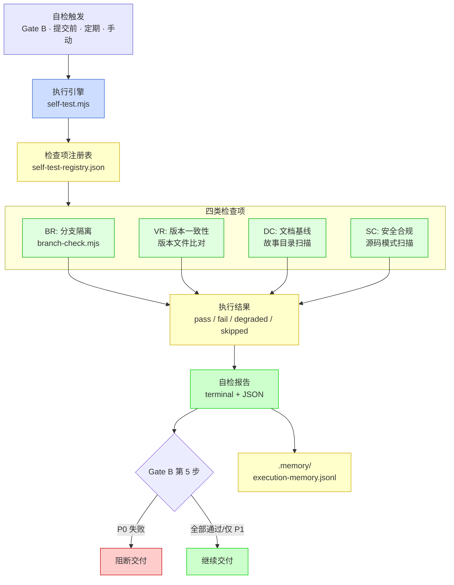
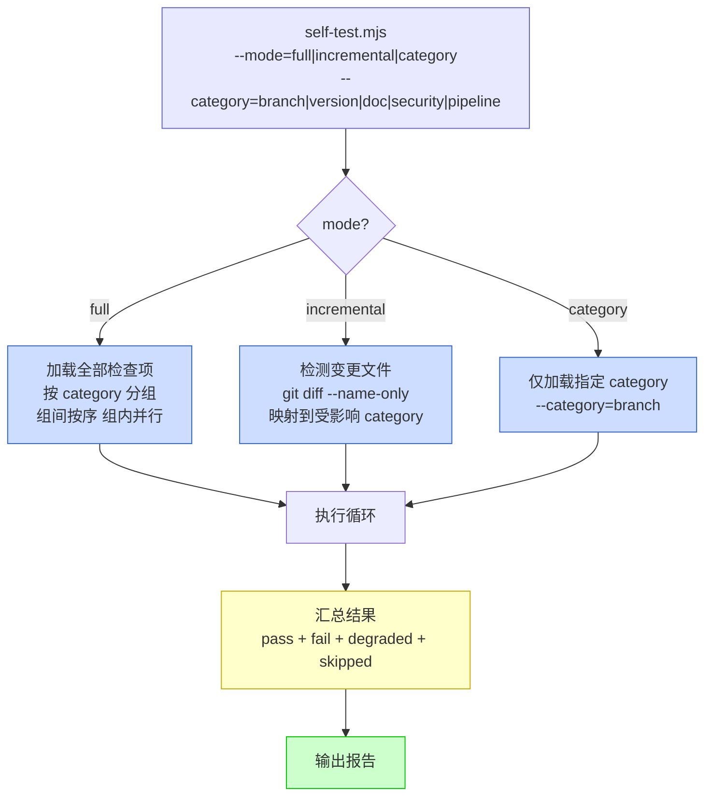
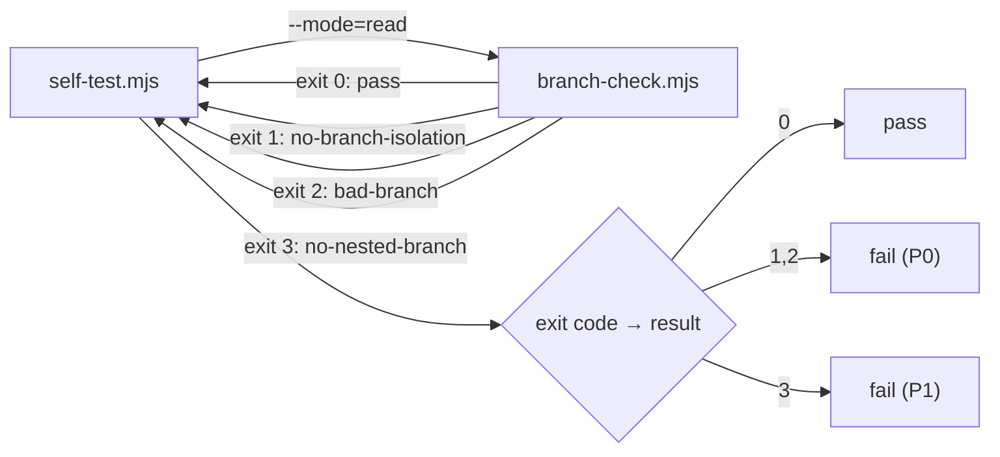
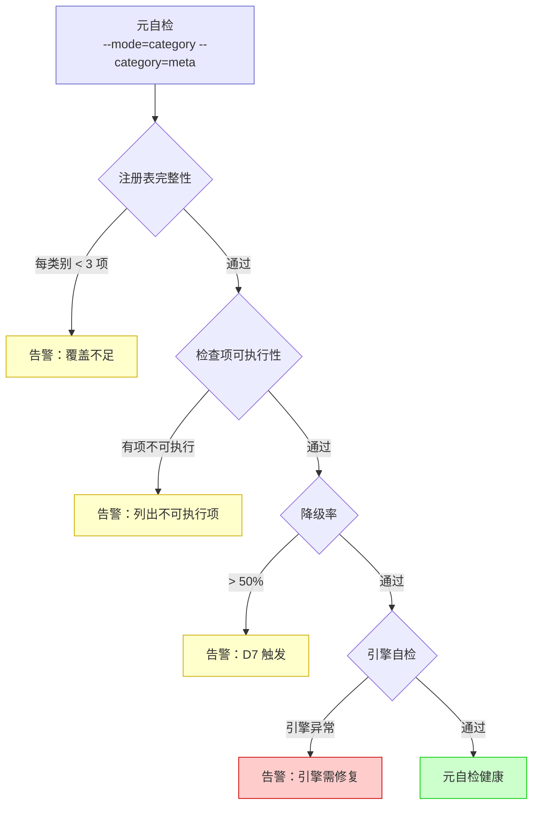
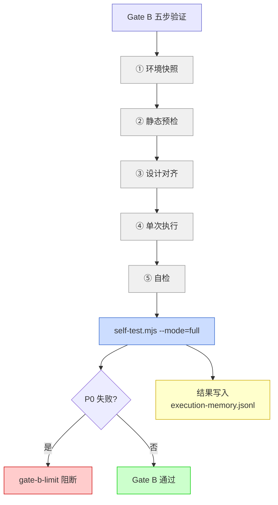
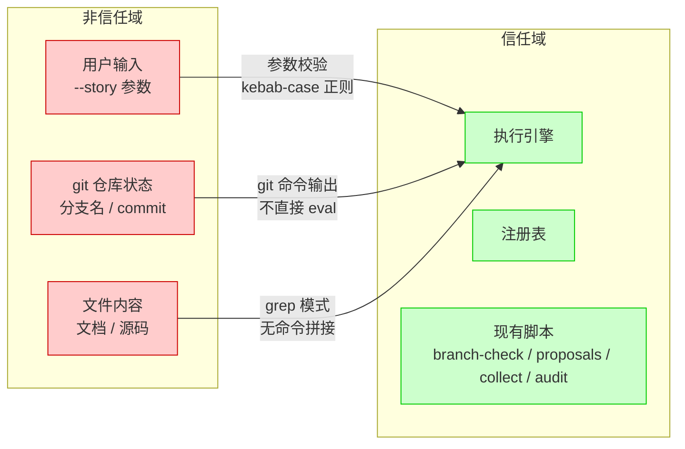

# yry-self-test · 技术评审

> | v1.0.0 | 2026-05-26 | deepseek-v4-pro | 🌿 feat/yry-self-test | 📎 [故事任务](./故事任务.md) |

> **导航**: [← 使用场景](./使用场景.md) · [测试设计 →](./测试设计.md)

> **来源引用**: 由 coder 基于故事任务 FP# + 使用场景 + 现有自检脚本源码反推架构设计。从 `skills/rui/branch-check.mjs` + `skills/rui/proposals.mjs` + `skills/rui-story/collect.mjs` + `skills/rui/audit.mjs` + `rules/delivery-gate.md` + `rules/code-pipeline.md` 提取现有接口和集成点。证据 Level A + 源码路径。

[§0 基线溯源](#sec0-baseline) · [§1 架构总览](#sec1-arch) · [§2 检查项注册表](#sec2-registry) · [§3 执行引擎](#sec3-engine) · [§4 报告格式](#sec4-report) · [§5 Gate 集成](#sec5-gate) · [§7 安全考量](#sec7-security) · [§8 依赖矩阵](#sec8-deps) · [§9 ADR](#sec9-adr)

---

## §0 基线溯源

| 来源 | 类型 | 映射本节 |
|------|------|---------|
| 故事任务 FP1 | 检查项注册 | §2 检查项注册表 |
| 故事任务 FP2 | 执行引擎 | §3 执行引擎 |
| 故事任务 FP3 | 分支隔离 | §3.2 分支检查适配 |
| 故事任务 FP4 | 版本一致性 | §2.1 BR 类检查项 |
| 故事任务 FP5 | 文档基线 | §2.1 DC 类检查项 |
| 故事任务 FP6 | 安全合规 | §2.1 SC 类检查项 + §7 |
| 故事任务 FP7 | 报告输出 | §4 报告格式 |
| 故事任务 FP8 | Gate B 集成 | §5 Gate 集成 |
| 使用场景 场景 1 | 全量自检 | §3.1 full 模式 |
| 使用场景 场景 2 | 增量自检 | §3.1 incremental 模式 |
| 使用场景 场景 3 | 文档巡检 | §2.1 DC 类检查项 |
| 使用场景 场景 4 | 安全回归 | §2.1 SC 类检查项 + §7 |
| 使用场景 场景 5 | 元自检 | §3.3 元自检 |

---

## §1 架构总览

### 效果示意



### 四层架构

```mermaid
flowchart LR
    subgraph L1["接口层"]
        CLI["CLI 入口<br/>self-test.mjs"]:::iface
        GATE["Gate 集成<br/>delivery-gate.md"]:::iface
    end
    subgraph L2["引擎层"]
        DISPATCH["调度器<br/>mode dispatch"]:::engine
        RUNNER["执行器<br/>sequential / parallel"]:::engine
    end
    subgraph L3["注册层"]
        REG["检查项注册表<br/>self-test-registry.json"]:::data
        ADAPT["适配器<br/>per-check wrapper"]:::engine
    end
    subgraph L4["工具层"]
        BC["branch-check.mjs"]:::tool
        PROP["proposals.mjs"]:::tool
        COLL["collect.mjs"]:::tool
        AUDIT["audit.mjs"]:::tool
        GREP["grep 扫描"]:::tool
    end

    L1 --> L2 --> L3 --> L4

    classDef iface fill:#e8e8ff,stroke:#6666cc
    classDef engine fill:#ccddff,stroke:#3366cc
    classDef data fill:#ffffcc,stroke:#ccaa00
    classDef tool fill:#e0ffe0,stroke:#00aa00
```



| 层 | 职责 | 组件 | 证据 |
|----|------|------|------|
| 接口层 | 对外暴露自检入口 | CLI + Gate 集成点 | delivery-gate.md:52 |
| 引擎层 | 调度 + 执行 + 降级 | 模式分发 + 按序/并行执行器 | 新设计 |
| 注册层 | 检查项定义 + 适配 | JSON 注册表 + per-check wrapper | 新设计 |
| 工具层 | 实际检查逻辑 | 复用现有 4 脚本 + grep | branch-check.mjs / proposals.mjs / collect.mjs / audit.mjs |

---

## §2 检查项注册表

### 数据结构

```json
{
  "id": "BR-01",
  "category": "branch",
  "priority": "P0",
  "label": "当前分支为 feat/<name>",
  "command": "node skills/rui/branch-check.mjs --mode=read --story=<name>",
  "expected": "exit code 0",
  "degraded": false,
  "degrade_reason": null,
  "baseline_ref": "rules/code-pipeline.md §分支隔离",
  "fix_guide": "git checkout -b feat/<name> main",
  "modes": ["full", "incremental"]
}
```

| 字段 | 类型 | 必填 | 说明 |
|------|------|:---:|------|
| `id` | string | ✓ | 唯一标识，格式 `CC-NN`（CC=类别码, NN=序号） |
| `category` | enum | ✓ | `branch` / `version` / `doc` / `security` / `pipeline` |
| `priority` | enum | ✓ | P0（阻断）/ P1（告警）/ P2（建议） |
| `label` | string | ✓ | 人类可读的检查项名称 |
| `command` | string | ✓ | 可独立执行的 bash 命令 |
| `expected` | string | ✓ | 预期结果（exit code 0 / stdout 含某模式 / stderr 为空） |
| `degraded` | bool | ✓ | 是否为降级检查（失败不阻断） |
| `degrade_reason` | string | 条件 | 降级原因（degraded=true 时必填） |
| `baseline_ref` | string | ✓ | 基线依据（CLAUDE.md / rules/ / agents/ 中的出处） |
| `fix_guide` | string | ✓ | 失败时的修复引导命令或路径 |
| `modes` | array | ✓ | 适用的执行模式，至少含一个 |

### 检查项清单

#### BR: 分支隔离 (branch)

| ID | 优先级 | 检查内容 | 降级 | 基线依据 |
|----|:------:|---------|:----:|---------|
| BR-01 | P0 | 当前分支为 `feat/<name>` | 否 | code-pipeline.md §分支隔离 |
| BR-02 | P0 | 分支从 main 拉出（merge-base 与 main HEAD 祖先关系） | 否 | code-pipeline.md §bad-branch |
| BR-03 | P1 | 无嵌套 feat 分支（禁止在 feat 上再拉 feat） | 否 | code-pipeline.md §no-nested-branch |
| BR-04 | P1 | 未在 main 上执行写操作 | 否 | SKILL.md §核心约束 #2 |
| BR-05 | P2 | feat 分支未自动合并到 main | 是（远程操作不可控） | code-pipeline.md §auto-merge |

> **证据**: BR-01~04 已有实现 `skills/rui/branch-check.mjs:38-39` 定义了 `no-branch-isolation` / `bad-branch` / `no-nested-branch` 标识。

#### VR: 版本一致性 (version)

| ID | 优先级 | 检查内容 | 降级 | 基线依据 |
|----|:------:|---------|:----:|---------|
| VR-01 | P1 | plugin.json version = CLAUDE.md version = README.md version | 否 | SKILL.md §version --up §约束 |
| VR-02 | P1 | rui-state.json 存在且 stories 计数与故事目录数一致 | 否 | SKILL.md §yry §版本管理 |
| VR-03 | P2 | 版本号严格递增（当前 > 前一 commit） | 否 | SKILL.md §version --up §约束 |
| VR-04 | P2 | git tag vX.Y.Z 与 plugin.json version 一致 | 是（tag 创建有延迟） | SKILL.md §version --up §执行流程 |

#### DC: 文档基线 (doc)

| ID | 优先级 | 检查内容 | 降级 | 基线依据 |
|----|:------:|---------|:----:|---------|
| DC-01 | P0 | 每故事目录含 故事任务.md | 否 | SKILL.md §故事文档 |
| DC-02 | P0 | 每故事目录含 使用场景.md + 技术评审.md + 测试设计.md + 安全审计.md | 否 | SKILL.md §故事文档 |
| DC-03 | P1 | 每文档含版本行（`> \| vX.Y.Z \|` 模式） | 否 | doc-generation.md §版头齐 |
| DC-04 | P1 | 每文档含 `### 主要价值` 且 ≥ 4 条 emoji 前缀行 | 否 | doc-generation.md §P0 检查 #1 |
| DC-05 | P1 | 每文档含回溯链（来源引用 + 变更记录） | 否 | doc-generation.md §P0 检查 #3 |
| DC-06 | P2 | 每文档含 mermaid 图（表达优先检查） | 否 | SKILL.md §表达优先 |
| DC-07 | P2 | 故事任务 + 使用场景无技术术语污染 | 否 | SKILL.md §doc §R2, R3 |

#### SC: 安全合规 (security)

| ID | 优先级 | 检查内容 | 降级 | 基线依据 |
|----|:------:|---------|:----:|---------|
| SC-01 | P0 | 源码/配置中无硬编码 token/key/secret | 否 | CLAUDE.md §密钥不落盘 |
| SC-02 | P0 | 无认证绕过代码（如 `skip_auth=true`） | 否 | CLAUDE.md §认证不可绕过 |
| SC-03 | P1 | 用户输入点有校验/转义（防 XSS/注入） | 否 | CLAUDE.md §输入必校验 |
| SC-04 | P1 | 无硬编码凭据 URL（如 `password=xxx` 在 URL 中） | 否 | CLAUDE.md §密钥不落盘 |
| SC-05 | P1 | 命令拼接使用参数化而非字符串拼接 | 否 | 安全最佳实践 |
| SC-06 | P2 | `.env` / `.env.local` 在 .gitignore 中 | 是（本地文件可能未跟踪） | 安全最佳实践 |

#### PL: 管线健康 (pipeline)

| ID | 优先级 | 检查内容 | 降级 | 基线依据 |
|----|:------:|---------|:----:|---------|
| PL-01 | P1 | `.memory/rui-state.json` 存在且 JSON 合法 | 否 | SKILL.md §yry §版本管理 |
| PL-02 | P1 | `.improvement/proposals.jsonl` 存在且每行 JSON 合法 | 否 | self-improve.md §数据要求 |
| PL-03 | P2 | `docs/故事任务面板/yry-self-test/` 自身故事存在 | 否 | SKILL.md §init §verify #6 |
| PL-04 | P2 | proposals 闭合率 ≥ 50%（D7 触发阈值） | 是（新项目提案多为 open） | self-improve.md §D7 |
| PL-05 | P2 | `.claude/skills/rui-bot/config.json` 存在 | 是（no-token 场景可缺失） | SKILL.md §init §verify #7 |

---

## §3 执行引擎

### 模式分发



### 执行策略

| 策略 | 适用 | 说明 |
|------|------|------|
| 按序 | 不同 category 间 | branch → version → doc → security → pipeline，前置失败后置仍执行 |
| 并行 | 同一 category 内 | 同 category 内检查项无依赖，可并行 |
| 降级 | 标记 degraded=true 的项 | 失败不阻断，标记 `degraded` |
| 超时 | 所有检查项 | 单检查项超时 30s，标记 `degraded` + `timeout` |

### 分支检查适配



> **证据**: `skills/rui/branch-check.mjs:38-39` 定义了三种阻断标识的语义。自检引擎通过 `--mode=read` 调用，解析 exit code 和 stdout 将结果映射到 BR-01~BR-03。

### 元自检



---

## §4 报告格式

### 终端输出（默认）

```
=== YrY Self-Test Report ===
Mode: full | Time: 2026-05-26T12:00:00Z | Branch: feat/yry-self-test

Category: branch (3/3 passed)
  ✓ BR-01: 当前分支为 feat/<name>
  ✓ BR-02: 分支从 main 拉出
  ✓ BR-03: 无嵌套 feat 分支

Category: version (2/3 passed, 1 skipped)
  ✓ VR-01: 版本号一致 (1.26.2)
  ⊘ VR-03: 版本号严格递增 — skipped (首次提交无前一版本)
  ✗ VR-02: rui-state.json stories 计数不一致
     Expected: 10 | Actual: 9
     Fix: 检查 docs/故事任务面板/ 目录，确认所有故事已注册

Category: doc (4/5 passed, 1 failed)
  ✗ DC-02: yry-discover 缺失 测试设计.md
     Fix: /rui doc --from-local yry-discover

Category: security (5/6 passed, 1 degraded)
  ⊘ SC-06: .env 不在 .gitignore — degraded (无 .env 文件，不影响安全)

Summary: 14/17 passed | 2 failed (0 P0) | 1 degraded | 1 skipped
Gate B: PASS (no P0 failures)
```

### JSON 输出（`--format=json`）

```json
{
  "meta": {"mode": "full", "time": "2026-05-26T12:00:00Z", "branch": "feat/yry-self-test"},
  "summary": {"total": 17, "pass": 14, "fail": 2, "degraded": 1, "skipped": 1, "p0_fail": 0},
  "gate_b": "pass",
  "results": [
    {"id": "BR-01", "category": "branch", "priority": "P0", "status": "pass", "duration_ms": 120},
    {"id": "DC-02", "category": "doc", "priority": "P0", "status": "fail", "detail": "yry-discover 缺失 测试设计.md", "fix": "/rui doc --from-local yry-discover"}
  ]
}
```

---

## §5 Gate 集成

### Gate B 第 5 步集成



> **证据**: `rules/delivery-gate.md:52` 定义了交付第 4 步为自主测试。`rules/code-pipeline.md:156-176` 定义了 Gate B 五步验证。自检作为第 5 步注入，结果参与 Gate B 阻断判断。

### 降级路径

| 条件 | 行为 | 标记 |
|------|------|------|
| self-test.mjs 不可执行 | 跳过自检，Gate B 继续 | `no-self-test` |
| 注册表为空 | 跳过自检，Gate B 继续 | `no-self-test-registry` |
| 单项检查超时 | 标记 degraded，继续 | `degraded: timeout` |
| P0 失败 | Gate B 阻断 | `gate-b-limit`（>2 轮时） |

---

## §7 安全考量

### 自检面安全

| 威胁 | 风险 | 缓解 |
|------|------|------|
| 自检被绕过 | 攻击者设置环境变量跳过自检 | SC-01 检查密钥时同时检查 `NO_SELF_TEST` 等绕过变量 |
| 注册表被篡改 | 攻击者将所有检查项设为降级 | 元自检检查降级率，> 50% 触发告警 |
| 报告伪造 | 攻击者修改自检结果 JSON | 报告含 git commit hash，可验证报告与代码版本一致性 |
| 命令注入 | 注册表中 command 字段被注入恶意命令 | command 字段通过 `execFile`（非 `exec`）执行，参数分离 |

### 信任边界



---

## §8 依赖矩阵

| 组件 | 依赖 | 类型 | 证据 |
|------|------|------|------|
| self-test.mjs | branch-check.mjs | 运行时调用 | `skills/rui/branch-check.mjs` |
| self-test.mjs | proposals.mjs | 数据查询（D0-D7 结果） | `skills/rui/proposals.mjs` |
| self-test.mjs | collect.mjs | 数据查询（指标采集） | `skills/rui-story/collect.mjs` |
| self-test.mjs | audit.mjs | 数据查询（工具调用审计） | `skills/rui/audit.mjs` |
| self-test.mjs | self-test-registry.json | 配置数据 | 新文件 |
| self-test.mjs | rui-state.json | 版本信息查询 | `.memory/rui-state.json` |
| delivery-gate.md | self-test.mjs | 流程集成 | `rules/delivery-gate.md:52` |
| code-pipeline.md | self-test.mjs | Gate B 第 5 步 | `rules/code-pipeline.md` |

---

## §9 ADR

### ADR-001: 选择复用现有脚本而非重写

**状态**: 已采纳
**背景**: 自检需要分支检查、诊断、指标采集、审计功能，这些已分别在 branch-check.mjs、proposals.mjs、collect.mjs、audit.mjs 中实现。
**决策**: 自检引擎通过封装层调用现有脚本，解析其输出为统一格式，而非在自检引擎中重写这些逻辑。
**理由**:
- 避免逻辑重复和双源头漂移
- 现有脚本已经过验证，接口稳定
- 封装层隔离接口变更影响
**后果**: 自检引擎依赖现有脚本的 exit code 和输出格式约定。若现有脚本变更输出格式，封装层需同步更新。

### ADR-002: 选择 JSON 注册表而非代码内注册

**状态**: 已采纳
**背景**: 检查项需要可注册、可扩展、可审计。代码内注册（如 JS 数组）灵活但不利于非开发者审查；外部配置文件利于审计但需额外解析。
**决策**: 使用 JSON 文件（`self-test-registry.json`）作为检查项注册表。
**理由**:
- JSON 可被任何工具读取，不依赖 Node.js 运行时
- 结构化字段强制每个检查项提供完整的基线引用和修复引导
- 新增检查项无需改引擎代码，仅需追加 JSON 条目
**后果**: 注册表缺少编程语言的灵活性（无法定义复杂判断逻辑），复杂检查通过调用现有脚本的 command 字段弥补。

### ADR-003: 降级而非静默跳过

**状态**: 已采纳
**背景**: 部分检查项（如 git tag 一致性、proposals 闭合率）可能因合法原因失败（新项目无 tag、新项目提案多为 open），不应阻断交付。
**决策**: 检查项标记 `degraded: true` 时失败不阻断，但必须在报告中明确列出降级项和降级原因。
**理由**:
- 保持自检的"不静默"原则——所有结果可见
- 避免新项目或边缘场景被不合理阻断
- 降级率是元自检的监控指标
**后果**: 需持续监控降级率，防止降级被滥用（D7 诊断保护）。
