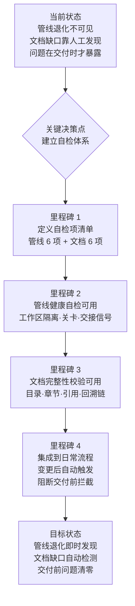
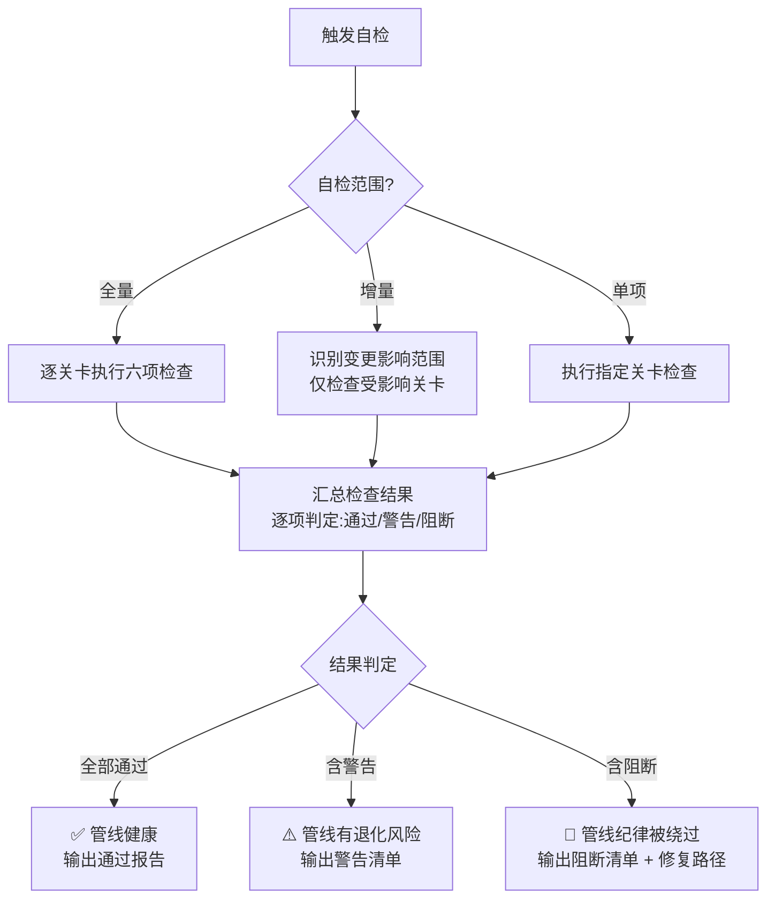
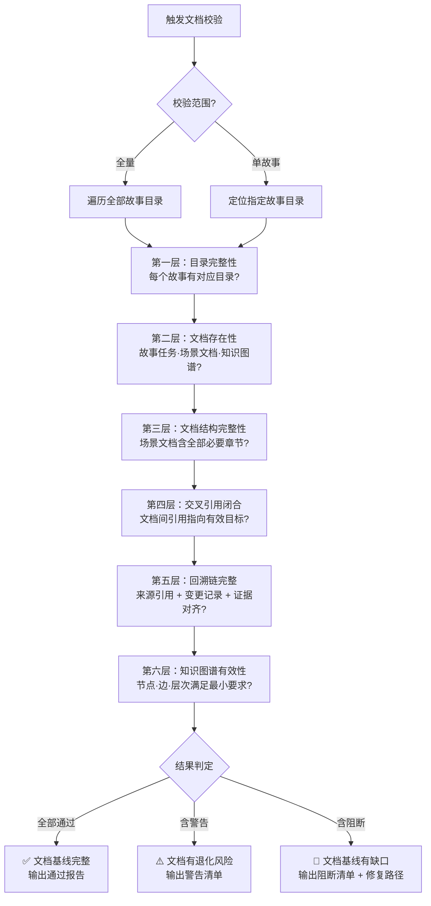

# 故事任务

> | v1.1.0 | 2026-06-05 | deepseek-v4-pro | 🌿 feat/yry-self-test | ⏱️ --:-- | 📎 [CLAUDE.md](../../../CLAUDE.md) |
> **导航**: [场景-1 →](./场景-1-init后全量自检.md)

[概述](#概述) · [§1 Story](#s-1-story) · [§2 Requirements](#s-2-requirements) · [§3 成功标准](#s-3-成功标准) · [§4 范围边界](#s-4-范围边界) · [§5 AC](#s-5-ac) · [§6 风险与假设](#s-6-风险与假设) · [§7 跨文档索引](#s-7-跨文档索引)

## 概述

### 需求概述

YrY 是用自身管线管理自身演进的编排系统。管线定义了从需求到交付的完整纪律链条：工作区隔离、测试先行、逐环节验证、问题清零、Agent 交接信号。但这些纪律在实际运行中可能被绕过或退化——某次变更可能直接发生在主分支上，测试方案可能被跳过，Agent 的交接信号可能格式不全。文档基线同样面临退化风险：经过多次增量更新后，故事文档章节缺失、知识图谱节点不完整、文档间的交叉引用指向失效目标。

本故事定义项目自检体系的两大维度，作为 YrY 的免疫系统：**管线健康自检**验证纪律关卡是否有效执行，**文档基线完整性校验**验证文档是否始终是可信任的真相来源。自检在问题影响交付前发出警报——而非在交付失败后才追溯根因。

### 效果示意

### 主要价值

- 🔍 **可发现性** — 管线退化和文档缺口不再是隐形问题，每次自检生成明确的状态报告
- 🛡️ **预防性** — 在问题影响交付前拦截，而非在故事交付失败后才追溯根因
- ⚡ **自动化** — 自检融入日常流程，无需额外人工操作，变更后自动触发
- 📋 **可追溯** — 每次自检结果有明确标识（通过/警告/阻断），阻断项给出具体修复路径
- 🎯 **零盲区** — 覆盖管线和文档两大维度，不遗漏任何可能退化的纪律点
- 🔗 **可扩展** — 管线规则变更时，自检项可同步追加，不依赖全局重构

---

## §1 Story

### Story 1: 管线健康自检

作为项目维护者，我想要定期检查开发管线的各项关卡是否正常运作，以便在管线退化影响交付前发现并定位被绕过或失效的关卡。优先级 P0。范围边界：仅检查管线运作状态（只读检查），不修改管线规则也不修复发现的问题。依赖：项目管线纪律规则（工作区隔离、测试先行关卡、验证闭环关卡、问题清零纪律、Agent 交接信号规约）已有明确定义。

#### 范围外

- 不修改管线规则本身（规则变更由对应故事负责）
- 不修复发现的问题（问题记录后由对应故事修复）
- 不阻断当前工作进行（自检只读，不强制中断）
- 不覆盖安全面深度检查（安全面由场景-4 独立覆盖）

#### §1.1 User Operations

| 操作 | 触发条件 | 操作步骤 | 预期结果 |
|------|---------|---------|---------|
| 全量管线自检 | 项目初始化完成后首次验证 | 触发自检 → 依次执行六项管线检查 → 汇总结果 | 输出自检报告：列出每项检查的状态（通过/警告/阻断）和具体发现 |
| 变更后增量自检 | 每次故事文档或代码变更完成后 | 触发自检 → 仅检查受变更影响的关卡 → 对比变更前后状态 | 仅报告本次变更影响到的关卡变化 |
| 单关卡定向检查 | 怀疑特定关卡被绕过时 | 选择目标关卡 → 触发单项检查 → 查看详细结果 | 输出该关卡的详细自检结果，含被绕过证据 |
| 交付前阻断检查 | 故事进入交付阶段前 | 触发自检 → 重点检查工作区隔离和验证闭环 → 若有阻断项则阻止交付 | 阻断项存在时阻止交付，通过时放行 |
| 查看自检历史 | 需要对比不同时间点的管线健康状态 | 打开自检记录 → 按时间或故事筛选 → 对比历史结果 | 清晰展示管线健康状态的变化趋势 |

---

### Story 2: 文档基线完整性校验

作为项目维护者，我想要检查所有故事文档是否齐全、结构完整、相互一致，以便文档基线始终是可信任的真相来源而非过时或矛盾的参考。优先级 P0。范围边界：仅检查文档存在性、结构完整性和交叉引用一致性（只读检查），不修改文档内容也不生成缺失文档。依赖：文档基线规约（故事任务、场景文档、知识图谱的格式和结构要求）已有明确定义。

#### 范围外

- 不自动补全缺失文档（补全由文档生成流程负责）
- 不修改已有文档的内容错误（修正由对应故事负责）
- 不检查文档内容的语义正确性（语义审查由对应 Agent 负责）
- 不检查安全相关文档内容（安全面由场景-4 独立覆盖）

#### §1.1 User Operations

| 操作 | 触发条件 | 操作步骤 | 预期结果 |
|------|---------|---------|---------|
| 全量文档基线校验 | 项目初始化完成后或怀疑文档有缺口时 | 触发校验 → 逐故事目录检查 → 逐文档检查结构 → 交叉引用闭合检查 → 汇总 | 输出校验报告：列出每个故事目录的文档完整性状态和引用矛盾点 |
| 单故事文档检查 | 某个故事经过多次增量更新后 | 指定故事名称 → 触发校验 → 仅检查该故事的文档基线 | 输出该故事的文档完整性详情：缺哪些文档、缺哪些章节、哪些引用断裂 |
| 跨文档引用校验 | 新增或修改了文档间交叉引用后 | 触发校验 → 遍历所有交叉引用 → 逐条验证目标存在 → 检查目标章节完整性 | 列出所有断裂的交叉引用：来源文档、引用目标、断裂原因 |
| 知识图谱有效性检查 | 知识图谱被创建或修改后 | 触发校验 → 检查节点类型和数量 → 检查边的源和目标 → 检查层次结构 | 验证知识图谱是否满足最小要求（至少一个领域、一个流程、三个步骤） |
| 回溯链完整性检查 | 文档被增量修改后 | 触发校验 → 检查每份文档的来源引用 → 检查变更记录表 → 检查断言与证据的对齐 | 列出缺失回溯链或证据不足的文档 |

---

## §2 Requirements

### 功能点

| FP# | 描述 | 输入 | 输出 | 错误行为 | 优先级 |
|-----|------|------|------|---------|--------|
| FP1 | 工作区隔离自检 — 验证当前变更是否发生在独立工作区而非主分支，防止未经验证的变更混入基线 | 当前工作区状态 | 通过（已在独立工作区）/ 阻断（仍在主分支） | 无法判定工作区状态时标记为警告，附原因 | P0 |
| FP2 | 测试先行关卡自检 — 验证每个故事在编码前是否完成了测试方案，防止未经测试设计的代码进入实现阶段 | 故事文档目录 | 每个故事是否通过测试先行关卡的判定 | 文档不可读或格式异常时标记为警告 | P0 |
| FP3 | 验证闭环关卡自检 — 验证每个故事的交付前是否通过了全部验证步骤且修复不超过两轮，防止验证未完成就交付 | 故事验证记录 | 每个故事是否通过验证闭环关卡的判定 | 验证记录缺失时标记为警告 | P0 |
| FP4 | 问题清零纪律自检 — 验证是否存在未清零的阻塞问题，确保每次进入下一环节前当前环节的问题已全部清零 | 问题追踪记录 | 未清零阻塞问题清单 | 问题记录不可读时标记为警告 | P0 |
| FP5 | Agent 交接信号自检 — 验证各环节的 Agent 交接信号是否完整且可被下游验证，防止空头交接导致下游执行偏差 | Agent 交接记录 | 每个交接点的信号有效性判定 | 交接记录缺失或格式异常时标记为警告 | P0 |
| FP6 | 阻断标识自检 — 验证是否存在未处理或挂起的管线阻断标识，防止阻断被忽略导致管线纪律虚设 | 阻断标识记录 | 未清零阻断标识清单及详情 | 阻断标识状态不明时标记为警告 | P1 |
| FP7 | 故事目录完整性自检 — 验证每个已注册的故事是否有对应的文档目录，防止故事登记与文档目录脱节 | 故事登记表 + 文档目录清单 | 有登记无目录的故事清单、有目录无登记的故事清单 | 登记表不可读时标记为警告 | P0 |
| FP8 | 核心文档存在性自检 — 验证每个故事目录是否包含必需的核心文档（故事任务、场景文档、知识图谱），防止关键文档缺失 | 故事目录内容清单 | 每个故事目录的文档缺失清单 | 目录不可访问时标记为警告 | P0 |
| FP9 | 场景文档章节完整性自检 — 验证每个场景文档是否包含全部必需章节（从问题概述到自改进），防止场景文档退化 | 场景文档内容 | 每个场景的章节缺失清单 | 文档无法解析时标记为警告 | P0 |
| FP10 | 知识图谱有效性自检 — 验证知识图谱是否满足最小结构要求（至少一个领域、一个流程、三个步骤），防止知识图谱退化 | 知识图谱数据 | 结构缺陷清单（缺节点类型、边断裂、层次不完整） | 图谱文件不存在或格式错误时标记为阻断 | P0 |
| FP11 | 跨文档引用闭合性自检 — 验证文档间的所有交叉引用是否指向有效且存在的目标文档或章节，防止引用断裂 | 全部文档中的交叉引用 | 断裂引用清单（来源文档、引用目标、断裂原因） | 引用格式异常无法解析时标记为警告 | P1 |
| FP12 | 回溯链与交接信号完整性自检 — 验证每份文档的来源引用和变更记录表是否完整，Agent 交接信号在文档中是否存在且可被下游验证 | 全部文档的元信息 | 缺失回溯链或交接信号的文档清单 | 文档元信息不可读时标记为警告 | P1 |

### 业务规则

| R# | 描述 | 校验方式 | 证据级别 |
|----|------|---------|---------|
| R1 | 自检全程只读，不得修改任何项目文件（源码、文档、配置） | 自检执行后检查文件系统是否有变更 | B |
| R2 | 自检结果分为三种状态：通过（全部关卡正常）、警告（存在退化风险但不阻断交付）、阻断（存在被绕过的关卡，必须修复） | 检查自检结果报告的状态字段 | B |
| R3 | 阻断状态的自检结果必须包含三个要素：具体被绕过的关卡名称、被绕过证据（可复核）、修复路径建议 | 逐条阻断结果检查三要素是否存在 | B |
| R4 | 自检可在任何时间点独立触发，不依赖特定阶段或前置条件 | 在多个不同时间点分别触发自检 | B |
| R5 | 同一故事目录下的文档存在性检查若发现缺失，不得自动生成——仅报告缺失，补全由对应操作流程完成 | 自检后检查是否有新文件生成 | B |
| R6 | 自检项清单与管线规则和文档规约保持同步：管线规则新增关卡时自检项同步追加，文档规约变更时校验项同步更新 | 对比自检项清单与规则/规约的最新版本 | B |
| R7 | 自检结果需持久化记录，支持按时间线和故事维度回溯历史健康状态 | 检查自检历史记录的存在性和可查询性 | B |
| R8 | 阻断项从发现到清零有时间窗口约束：阻断项必须在下一个故事开始前清零 | 检查下一个故事启动时前一故事的阻断项状态 | B |
| R9 | 安全相关检查（STRIDE 六面全覆盖）由独立的安全审查场景负责，不在本文档的两个核心自检维度中重复 | 确认安全自检在场景-4 中独立覆盖 | B |

### 数据约束

| 约束 | 类型 | 范围/格式 | 来源 |
|------|------|----------|------|
| 自检结果状态 | 枚举 | `pass` / `warn` / `block` | 自检结果分类规则 |
| 故事名称 | 字符串 | `^[a-z0-9]+(-[a-z0-9]+)*$`（kebab-case 格式） | 项目命名规范 |
| 关卡标识 | 字符串 | kebab-case 格式，与管线规则中的关卡名称一致 | 管线规则文档 |
| 阻断标识 | 枚举 | 见管线阻断标识汇总（`bad-branch` / `no-checkout` / `auto-merge` / `no-branch-isolation` / `no-doc-isolation` / `chain-broken` / `no-metrics` 等） | 管线规则 §阻断标识汇总 |
| 章节标识 | 枚举 | `§0` / `§1` / `§2` / `§3` / `§4`（场景文档五大章节） | 文档规约 |
| 知识图谱节点类型 | 枚举 | `domain` / `flow` / `step`（三种节点类型） | 知识图谱规约 |
| 知识图谱边类型 | 枚举 | `contains_flow` / `flow_step` / `cross_domain`（三种边类型） | 知识图谱规约 |
| 知识图谱最小要求 | 结构约束 | 领域节点 ≥ 1、流程节点 ≥ 1、步骤节点 ≥ 3 | 知识图谱验证规则 |
| Agent 交接信号要素 | 结构约束 | 包含：交接方、接收方、信号内容、下游验证方式 | Agent 交接规约 |
| 文档交叉引用格式 | 正则 | Markdown 相对链接格式 `[文本](./路径)` | 文档写作规范 |

---

## §3 成功标准

| SC# | 描述 | 度量方式 | 目标值 | 优先级 | 关联 FP# |
|-----|------|---------|--------|--------|---------|
| SC1 | 项目维护者可在一次操作中完成管线健康自检和文档基线完整性校验 | 自检命令从触发到输出完整报告的时间 | 60 秒内完成全部 12 项检查（FP1-FP12） | P0 | FP1–FP12 |
| SC2 | 任何被绕过的管线关卡可被准确识别并生成包含三要素的阻断报告（被绕过关卡名、可复核证据、修复路径） | 模拟关卡绕过场景后触发自检，检查阻断报告的完整性 | 100% 阻断项的阻断报告三要素齐备 | P0 | FP1–FP6 |
| SC3 | 任何文档缺漏（目录缺失、核心文档缺失、章节不完整、知识图谱退化）可被准确识别 | 构造文档缺漏场景后触发自检，检查是否全部命中 | 100% 缺漏被检测，0 误报 | P0 | FP7–FP10 |
| SC4 | 任何文档间的交叉引用断裂可被准确识别并定位到具体的来源文档和断裂目标 | 构造引用断裂场景后触发自检，检查断裂引用的检测完整性 | 100% 断裂引用被检测，0 漏报 | P1 | FP11 |
| SC5 | 自检结果通过时，项目维护者可确信管线运作正常且文档基线完整——无退化、无缺口、无矛盾 | 在已知健康状态下触发自检，检查通过率 | 健康状态下 100% 通过，无异味 | P0 | FP1–FP12 |
| SC6 | 自检历史记录支持按时间线和故事维度回溯，可查看任意历史时间点的管线健康状态 | 在不同时间点分别触发自检后，查询历史记录对比一致性 | 所有历史记录可查询，时间戳和结果一致 | P1 | R7 |

---

## §4 范围边界

### 范围内（做什么）

| 条目 | 关联 FP# | 产品决策依据 |
|------|---------|-------------|
| 管线运作状态检查：工作区隔离、测试先行关卡、验证闭环关卡、问题清零纪律、交接信号有效性、阻断标识状态 | FP1–FP6 | 管线是 YrY 的工程纪律底线，每项关卡被绕过都可能导致交付质量问题 |
| 文档存在性检查：故事目录、核心文档、场景文档章节 | FP7–FP9 | 文档基线的物理完整是信息可信的前提，缺文档 = 缺真相 |
| 知识图谱结构有效性检查：节点类型、边关系、层次完整性 | FP10 | 知识图谱是结构化的知识层，结构退化会导致下游无法消费 |
| 交叉引用闭合性检查：文档间引用的目标可达性 | FP11 | 引用断裂 = 信息孤岛，用户无法从一处定位到相关文档 |
| 回溯链和交接信号完整性检查：来源引用、变更记录、Agent 交接信号 | FP12 | 无回溯链的断言不可溯源，无交接信号的委托不可验证 |
| 自检结果持久化记录，支持历史回溯 | R7 | 健康趋势需要历史对比，单次快照不足以判断退化方向 |
| 只读执行保证：自检不修改任何文件 | R1 | 检查与修复职责分离，自检只发现问题，不越权修复 |

### 范围外（不做什么）

| 条目 | 排除原因 | 替代方案 |
|------|---------|---------|
| **自动修复发现的问题** | 修复职责属于对应故事或操作流程，自检只诊断不治疗 | 阻断报告中给出修复路径，由项目维护者或对应 Agent 执行修复 |
| **自动生成缺失文档** | 文档生成有完整管线流程（反推、增量更新等），自检绕过此流程直接生成会导致内容不可溯源 | 使用项目文档生成流程补全缺失文档 |
| **修改管线规则** | 管线规则变更是独立的决策过程，自检只能依据当前规则检查，不能自动更新规则 | 通过决策评审流程修改管线规则，修改后同步更新自检项清单 |
| **文档内容的语义正确性审查** | 语义审查需要领域知识判断，自检是结构性和一致性检查，不具备语义判断能力 | 由对应的 Agent（coder 审查设计正确性、reporter 审查引用一致性）负责 |
| **安全面深度检查（STRIDE 六面）** | 安全审计需要威胁建模和独立审计流程，不属于管线健康或文档结构的自检范畴 | 由场景-4 安全面回归自检独立覆盖，security Agent 执行 |
| **自检触发时阻断当前工作进行** | 自检是辅助诊断工具，不应成为工作流的强制阻断点（交付前阻断除外） | 自检结果作为参考，交付前阻断项由对应关卡强制执行 |
| **自检逻辑的自我验证** | 自检查自检 = 无限递归，没有止损点 | 自检逻辑的正确性由代码审查和自检场景文档的测试设计覆盖 |

### 灰色区域（待定事项）

| 条目 | 触发条件 | 决策人 |
|------|---------|--------|
| 自检结果阻断时是否自动阻止后续操作（如禁止提交、禁止切换工作区） | 阻断项数 ≥ 1 且阻断级别为「阻断」 | 项目维护者根据团队纪律要求决定 |
| 自检频率是固定周期（如每日）还是事件驱动（如每次变更后） | 初始化完成后首次决定自检策略 | 项目维护者根据项目活跃度决定 |
| 自检项清单是否需要覆盖第三方工具或服务的可达性 | 管线依赖外部服务（如通知推送、文档同步）且服务不可达影响管线完整性 | 项目维护者根据对外部服务的依赖程度决定 |

---

## §5 AC

| AC# | Given | When | Then | 门禁 |
|-----|-------|------|------|------|
| AC1 | 管线运作正常（工作区隔离生效、两个关卡通过、问题清零、交接信号完整） | 执行全量管线自检 | 自检报告输出「通过」状态，六项检查（FP1-FP6）全部通过，无警告无阻断 | Gate B |
| AC2 | 当前工作区在主分支上（工作区隔离被绕过） | 执行全量管线自检 | 自检报告输出「阻断」状态，FP1 标记为阻断，阻断报告含：被绕过关卡名称、主分支证据、切换到独立工作区的操作路径 | Gate B |
| AC3 | 某故事在未完成测试方案时已进入编码阶段（测试先行关卡被绕过） | 执行全量管线自检 | 自检报告输出「阻断」状态，FP2 标记为阻断，阻断报告含：被绕过关卡名称、该故事测试方案缺失证据 | Gate B |
| AC4 | 文档基线完整：全部故事目录存在、核心文档齐全、场景文档章节完整、知识图谱有效、交叉引用闭合、回溯链完整 | 执行全量文档基线校验 | 自检报告输出「通过」状态，六项检查（FP7-FP12）全部通过 | Gate B |
| AC5 | 某故事目录缺失场景文档，且知识图谱的三个步骤中有两个缺失 | 执行全量文档基线校验 | 自检报告输出「阻断」状态：FP8 缺失场景文档标记为阻断，FP10 步骤缺失标记为阻断，分别给出缺失文档和缺失步骤的具体清单 | Gate B |
| AC6 | 文档间存在交叉引用指向不存在的目标（比如场景文档引用了已删除的章节） | 执行跨文档引用校验 | 自检报告输出断裂引用清单：每条断裂引用标注来源文档、引用目标、断裂原因（目标不存在） | Gate B |
| AC7 | 全部阻断项已在后续操作中修复 | 重新执行相同范围的自检 | 自检报告输出「通过」状态，此前标记为阻断的检查项全部转为通过 | Gate B |
| AC8 | 自检执行前后的文件系统状态一致 | 自检完成后比对文件状态 | 无任何文件被修改、新增或删除（只读验证通过） | Gate A |

---

## §6 风险与假设

| # | 风险/假设 | 类型 | 可能性 | 影响 | 缓解/验证策略 | 关联 FP# |
|---|----------|------|--------|------|-------------|---------|
| 1 | 管线规则发生变更但自检项清单未同步更新，导致自检仍报告通过但实际规则已变 | 风险 | M | H | 自检项清单与管线规则文档建立版本关联，规则变更时强制触发自检项评审（R6） | FP1–FP6 |
| 2 | 自检结果为阻断但项目成员忽略阻断继续工作，自检沦为形式 | 风险 | M | H | 交付前强制触发自检（FP1-FP6 全量），阻断存在时阻止交付流程（AC1-AC8 关联 Gate B） | FP1–FP6 |
| 3 | 自检脚本本身存在缺陷（误报或漏报），导致虚假的安全感或虚假的阻断 | 风险 | M | M | 自检逻辑由场景文档的测试设计覆盖（场景-1 到场景-4 的 §1 测试设计），构造已知问题场景验证自检准确性 | FP1–FP12 |
| 4 | 知识图谱格式未来发生版本升级，自检的校验逻辑与新版本不兼容 | 风险 | L | M | 知识图谱版本号与自检项清单版本号关联，格式升级时同步更新校验项 | FP10 |
| 5 | 项目故事数量增长后，全量自检耗时超过可接受范围 | 风险 | M | L | 支持增量自检（仅检查变更影响范围），全量自检按需触发而非每次强制全量 | FP1–FP12 |
| 6 | 项目维护者不清楚如何响应自检结果（不知如何修复阻断项） | 风险 | M | M | 每项阻断结果必须包含修复路径建议（R3）；场景文档提供常见阻断的修复操作指引 | FP1–FP12 |
| 7 | 管线纪律规则（工作区隔离、测试先行、验证闭环等）已在项目中明确定义并可被自检引用 | 假设 | — | — | 自检逻辑基于管线规则和 Agent 规约中的生效标志和交接信号定义 | FP1–FP6 |
| 8 | 文档基线格式（故事任务、场景文档章节、知识图谱结构）保持稳定，不会在自检发布后立即发生破坏性变更 | 假设 | — | — | 文档格式变更通过版本管理控制，变更前发布兼容过渡期 | FP7–FP12 |
| 9 | 项目维护者有权限读取所有需要自检的文档和记录 | 假设 | — | — | 自检前验证读取权限，不可访问的文件标记为警告而非阻断 | FP1–FP12 |
| 10 | Agent 交接信号记录完整且格式符合规约，可以被自动化解析 | 假设 | — | — | 交接信号格式异常时标记为警告而非阻断，提示人工复核 | FP5, FP12 |

---

## §7 跨文档索引

| 本文档章节 | 基线内容 | 下游文档编号 | 预期覆盖 | 状态 |
|-----------|---------|-------------|---------|------|
| §1 Story 1: 管线健康自检 | FP1-FP6 功能点定义 + R1-R8 业务规则 | 场景-1-全量自检.md | 管线健康自检的全量检查流程、逐关卡检查逻辑、结果判定规则 | 待生成 |
| §1 Story 1: 管线健康自检 | FP1-FP6 功能点定义 | 场景-2-增量自检.md | 变更影响范围识别、增量关卡检查、对比逻辑 | 待生成 |
| §1 Story 2: 文档基线完整性校验 | FP7-FP12 功能点定义 + R1-R8 业务规则 | 场景-1-全量自检.md §文档部分 | 文档基线全量校验的六层检查流程（目录→文档→章节→引用→回溯链→知识图谱） | 待生成 |
| §1 Story 2: 文档基线完整性校验 | FP7-FP12 功能点定义 | 场景-3-文档代码一致性校验.md | 文档与代码之间的契约一致性验证 | 待生成 |
| §1 Story 1 + Story 2 安全相关 | FP1-FP12 中涉及安全面的交叉检查 | 场景-4-安全面回归自检.md | STRIDE 六面安全审计、安全状态回归检查 | 待生成 |
| §2 Requirements 功能点 | FP1-FP12 全量 | 知识图谱.json | 自检项作为 domain 节点，检查流程作为 flow 节点，单步检查作为 step 节点 | 待生成 |
| §2 Requirements 业务规则 | R1-R9 | 场景-1-全量自检.md §0 技术评审 | 业务规则的实现约束和设计决策 | 待生成 |
| §3 成功标准 | SC1-SC6 | 场景-1-全量自检.md §3 测试报告 | 每条 SC 的验证执行结果 | 待生成 |
| §5 AC 验收标准 | AC1-AC8 | 场景-2-增量自检.md §1 测试设计 | 增量自检场景的测试用例覆盖 | 待生成 |
| §6 风险与假设 | 风险项 1-6 + 假设项 7-10 | 场景-4-安全面回归自检.md §0 技术评审 | 安全相关风险的威胁建模覆盖 | 待生成 |

---

> **回溯链**: 本文档由 `/rui init` 流程的架构阶段（Step 4b）触发生成，作为 YrY 项目自主测试方案的基线文档。来源决策：[SKILL.md §init > 4. arch > 4b. 自主测试方案](../../../skills/rui/SKILL.md#4-arch--补齐技术架构故事--自主测试方案)，[CLAUDE.md 基础信念 §验现实](../../../CLAUDE.md#基础信念)。交叉引用：[yry-arch 故事任务](../yry-arch/故事任务.md)（技术架构基线）。

### 变更记录

| 日期 | 变更 | 触发 | 证据 |
|------|------|------|------|
| 2026-06-05 | v1.0.0 初始化：生成自检体系两大 Story（管线健康自检 + 文档基线完整性校验），含 12 功能点、6 成功标准、8 验收标准、10 风险/假设 | `/rui init` Step 4b — 自主测试方案生成 | [SKILL.md §init > 4. arch > 4b](../../../skills/rui/SKILL.md) |
| 2026-06-05 | v1.1.0 实现：搭建 `tests/` 测试框架（10 套件 171 断言），覆盖 6 skills + 8 agents + 8 rules + 2 集成测试；场景 §2-§4 填充实施/测试/自改进报告 | `/rui update yry-self-test` — 测试框架搭建 | `tests/run.mjs` 全部通过；[场景-1 §2](./场景-1-init后全量自检.md#sec2)；[场景-3 §2](./场景-3-文档代码一致性校验.md#sec2) |
