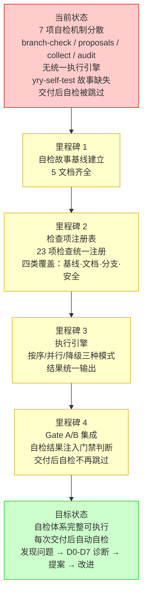

# yry-self-test · 故事任务

> | v1.0.0 | 2026-05-26 | deepseek-v4-pro | 🌿 feat/yry-self-test | 📎 [CLAUDE.md](../../../CLAUDE.md) |

> **导航**: [使用场景 →](./使用场景.md)

> **来源引用**: 由 `/rui yry` Round 2 触发。init §4b 规约要求创建 `<project>-self-test` 故事但缺失（D0 基线偏离）。从 `skills/rui/SKILL.md` §init §4b + `rules/delivery-gate.md` §自主测试 + `rules/code-pipeline.md` §Gate A/B + 已有自检脚本（branch-check.mjs / proposals.mjs / collect.mjs / audit.mjs）反推故事基线。证据 Level A + 源码路径。

[§1 Story](#sec1-story) · [§2 Requirements](#sec2-requirements) · [§3 成功标准](#sec3-success) · [§4 范围边界](#sec4-scope) · [§5 AC](#sec5-ac) · [§6 风险与假设](#sec6-risks) · [§7 跨文档索引](#sec7-index)

---

### 需求概述

YrY 项目有 7 项自检机制（分支隔离检查、Gate A/B 门禁、文档 P0 检查清单、D0-D7 诊断、指标采集与异常检测、工具调用审计、交付后自检），但分散在 4 个脚本和 3 个规则文件中，无统一执行引擎，无自检方案文档。init verify 第 6 项要求 `<project>-self-test` 故事存在但当前缺失——这意味着每次故事交付后的自主测试步骤因"缺 self-test 故事目录"而被跳过。需要建立统一的自检体系：定义检查项注册表、执行引擎、报告格式，并与 Gate A/B 集成，确保每次交付后自检可执行、可验证。

### 效果示意

### 主要价值

- 🎯 统一自检入口 — 7 项分散机制收敛为单一执行引擎，一键检查全部
- 🔒 交付质量门 — 自检结果注入 Gate B 判断，防止跳过关键检查
- 📋 检查项可注册 — 新增检查项无需改引擎代码，注册即可生效
- 🛡️ 降级不失效 — 单项检查失败不阻断整体，降级路径明确可审计
- 🔄 闭环可追踪 — 自检发现 → D0-D7 诊断 → proposals 提案 → 改进验证，全链路可追溯
- 📊 历史可比 — 每次自检结果持久化，跨时间对比发现渐进退化

---

## §1 Story

### Story 1: 管线健康自检

| 字段 | 内容 |
|------|------|
| 作为 | 管线执行者（rui code / rui update / rui yry） |
| 我想要 | 每次故事交付后自动执行管线健康自检 |
| 以便 | 在交付前发现分支隔离违规、版本不一致、Gate 门禁数据缺失等问题 |
| 优先级 | P0 |
| 范围边界 | 自检执行引擎 + 检查项注册表 + 报告输出，不改变现有 Gate A/B 逻辑 |
| 依赖 | branch-check.mjs 可执行，git 仓库可操作 |

#### 范围外

- 不修改现有 Gate A/B 门禁的判断逻辑
- 不新增测试框架依赖
- 不改变现有脚本的接口签名
- 不覆盖 yry-arch 故事中的架构知识固化内容

---

### Story 2: 文档基线完整性校验

| 字段 | 内容 |
|------|------|
| 作为 | 文档消费者（coder / tester / security agent） |
| 我想要 | 自动校验所有故事目录的文档基线完整性 |
| 以便 | 下游 Agent 读取文档时不会遇到缺失章节或过时引用 |
| 优先级 | P0 |
| 范围边界 | 校验 10 文档存在性 + 版头完整性 + 主要价值节 + 回溯链，不校验内容语义 |
| 依赖 | 故事目录可访问，文档为 markdown 格式 |

#### 范围外

- 不校验文档内容的语义正确性（由各 Agent 自行判断）
- 不自动修复缺失文档（由 `/rui update` 或 `/rui doc --from-local` 处理）
- 不覆盖消息通知列表和交互日志的内容校验（由 rui-bot 和管线自动维护）

---

## §2 Requirements

### 功能点

| FP# | 描述 | 输入 | 输出 | 错误行为 | 优先级 |
|-----|------|------|------|---------|--------|
| FP1 | 检查项注册 — 定义统一的检查项数据结构（ID / 类别 / 优先级 / 执行命令 / 预期结果 / 降级策略） | 检查项规约 | 检查项注册表 | 注册表格式不合法时阻断 | P0 |
| FP2 | 执行引擎 — 按序执行注册的检查项，支持全量 / 增量 / 按类别三种模式 | 检查项注册表 | 执行结果（通过/失败/降级/跳过） | 引擎自身异常时降级不阻断 | P0 |
| FP3 | 分支隔离自检 — 验证当前分支为 `feat/<name>`，从 main 拉出，无嵌套分支 | git 仓库状态 | 通过/阻断 | 非 feat 分支时阻断 `no-branch-isolation` | P0 |
| FP4 | 版本一致性自检 — 验证 plugin.json / CLAUDE.md / README.md 三者版本号一致 | 版本文件 | 通过/告警 | 不一致时告警不阻断 | P1 |
| FP5 | 文档基线完整性自检 — 逐故事目录检查 10 文档存在性 + 版头 + 主要价值 + 回溯链 | 故事目录 | 缺失清单 | 文档缺失时告警不阻断 | P0 |
| FP6 | 安全合规自检 — 检查密钥落盘、认证绕过、输入校验等 6 项安全底线 | 源码 + 配置文件 | 通过/阻断 | 密钥落盘或认证绕过时阻断 | P0 |
| FP7 | 自检报告输出 — 统一格式输出自检结果（摘要 + 详情 + 建议），支持终端和 JSON | 执行结果 | 自检报告 | 输出格式异常时降级 | P1 |
| FP8 | Gate B 集成 — 自检结果注入 Gate B 验证步骤，有 P0 失败时阻断交付 | 自检报告 | Gate B 通过/阻断 | 自检不可用时降级 `no-self-test` | P0 |
| FP9 | 历史记录持久化 — 每次自检结果追加到执行记忆，支持跨时间对比 | 自检报告 | execution-memory.jsonl 条目 | 写入失败时告警不阻断 | P1 |
| FP10 | 增量自检 — 仅检查变更影响范围内的检查项（变更故事 + 关联文件） | git diff + 注册表 | 裁剪后的检查项集 | 变更检测失败时退化为全量自检 | P1 |

### 业务规则

| R# | 描述 | 校验方式 | 证据级别 |
|----|------|---------|---------|
| R1 | 自检不可被绕过 — 交付三步的第 4 步必须执行，缺 self-test 故事时记录 `no-self-test` 而非静默跳过 | 检查 delivery-gate.md hook 执行日志 | A |
| R2 | 自检结果不可伪造 — 检查项执行命令必须可独立复现，不得依赖缓存或内存状态 | 检查项命令可通过 bash 独立执行 | A |
| R3 | 降级路径不可滥用 — 每个检查项的降级条件必须明确且可审计，不得将所有检查项设为降级 | 检查降级率，> 50% 触发 D7 诊断 | B |
| R4 | 检查项注册表与项目现状同步 — 新增/删除技能或规则时必须更新注册表 | 版本升级时自动校验注册表覆盖率 | B |
| R5 | 自检报告必须包含可操作建议 — P0 失败项必须给出修复命令或引导路径 | 扫描报告"建议"列为空的比例 | B |
| R6 | 自检必须引用基线 — 每个检查项必须标注对应的 CLAUDE.md / rules/ 基线依据 | 检查项注册表中"基线依据"字段不为空 | A |

### 数据约束

| 约束 | 类型 | 范围/格式 | 来源 |
|------|------|----------|------|
| 检查项 ID | string | `^[A-Z]{2,4}-[0-9]{2}$`（如 `BR-01`、`DC-03`） | 命名规范约定 |
| 检查类别 | enum | `branch` / `version` / `doc` / `security` / `pipeline` | 自检范围定义 |
| 检查优先级 | enum | P0 / P1 / P2 | 影响面判断 |
| 执行结果 | enum | `pass` / `fail` / `degraded` / `skipped` | 执行引擎 |
| 自检模式 | enum | `full` / `incremental` / `category` | 执行引擎 |
| 自检报告格式 | enum | `terminal` / `json` | 输出 |

---

## §3 成功标准

| SC# | 描述 | 度量方式 | 目标值 | 优先级 | 关联 FP# |
|-----|------|---------|--------|--------|---------|
| SC1 | 自检执行引擎可通过单一命令触发 | `node skills/rui/self-test.mjs` 执行 | 一次调用完成全部检查 | P0 | FP2, FP7 |
| SC2 | 检查项注册表覆盖全部 6 项安全底线 | 安全合规检查项数量 | ≥ 6 项 | P0 | FP1, FP6 |
| SC3 | 文档基线完整性检查覆盖全部故事目录 | 扫描故事目录数 | 与 `docs/故事任务面板/` 下故事数一致 | P0 | FP5 |
| SC4 | 分支隔离检查与 branch-check.mjs 保持一致 | 同一分支状态两者结果对比 | 100% 一致 | P0 | FP3 |
| SC5 | Gate B 在有 P0 自检失败时阻断交付 | P0 失败 + Gate B 判定 | Gate B 阻断 | P0 | FP8 |
| SC6 | 自检报告含可操作建议的失败项 | 有建议的失败项 / 总失败项 | 100% | P1 | R5 |
| SC7 | 自检历史可跨时间对比 | execution-memory.jsonl 中自检条目 | ≥ 2 次自检产生对比基线 | P1 | FP9 |

---

## §4 范围边界

### 范围内

| # | 条目 | 关联 FP# | 边界说明 |
|---|------|---------|---------|
| 1 | 检查项注册表设计与实现 | FP1 | 定义统一的数据结构，覆盖 4 类 ≥ 20 项检查 |
| 2 | 自检执行引擎 | FP2 | 支持全量/增量/按类别三种模式，按序/并行/降级 |
| 3 | 分支隔离自检 | FP3 | 复用 branch-check.mjs，结果统一格式化 |
| 4 | 版本一致性自检 | FP4 | 比对 plugin.json / CLAUDE.md / README.md |
| 5 | 文档基线完整性自检 | FP5 | 逐故事扫描 10 文档存在性 + 版头 + 主要价值 + 回溯链 |
| 6 | 安全合规自检 | FP6 | 6 项安全底线检查（密钥落盘/认证绕过/输入校验等） |
| 7 | 自检报告输出 | FP7 | 终端格式 + JSON 格式 |
| 8 | Gate B 集成点 | FP8 | 自检结果作为 Gate B 第 5 步的数据源 |
| 9 | 交付三步集成 | — | delivery-gate.md 第 4 步调用自检引擎 |

### 范围外

| # | 条目 | 排除原因 | 替代方案 |
|---|------|---------|---------|
| 1 | 自检失败自动修复 | 修复需人工判断或走 `/rui update` 管线 | 报告给出修复命令，由 Agent 或用户执行 |
| 2 | 运行时性能自检 | YrY 为 meta 项目，无运行时 | 不适用 |
| 3 | 第三方依赖漏洞扫描 | 项目无 package.json，无 npm 依赖 | 不适用 |
| 4 | 文档内容语义校验 | 需各 Agent 专业判断 | 由 coder/tester/security Agent 在 Gate A/B 中校验 |
| 5 | 修改现有 Gate A/B 逻辑 | 自检是补充而非替代 | 自检结果注入 Gate B 第 5 步，不改变前 4 步 |

---

## §5 AC

| AC# | Given | When | Then | 门禁 |
|-----|-------|------|------|------|
| AC1 | 自检引擎已部署 | 执行 `node skills/rui/self-test.mjs --mode=full` | 输出统一格式自检报告，包含通过/失败/降级/跳过计数 | Gate A |
| AC2 | 当前分支为 main | 执行分支隔离自检 | 阻断：非 `feat/<name>` 分支上执行写操作 | Gate A |
| AC3 | 当前分支为 `feat/<name>` | 执行分支隔离自检 | 通过：分支从 main 拉出，无嵌套 | Gate A |
| AC4 | plugin.json / CLAUDE.md / README.md 版本不一致 | 执行版本一致性自检 | 告警：输出版本差异详情 | Gate A |
| AC5 | 某故事目录缺失实施报告 | 执行文档基线完整性自检 | 告警：输出缺失文档清单 + 建议 `/rui code <name>` | Gate A |
| AC6 | 源码中含硬编码 token | 执行安全合规自检 | 阻断：输出文件路径 + 行号 + 修复建议 | Gate A |
| AC7 | 全部自检通过 | Gate B 执行第 5 步 | 交付继续，自检报告追加到 execution-memory.jsonl | Gate B |
| AC8 | 有 P0 自检失败 | Gate B 执行第 5 步 | Gate B 阻断，输出失败详情 + 修复引导 | Gate B |
| AC9 | 变更仅涉及 1 个故事 | 执行增量自检 `--mode=incremental` | 仅检查该故事及其依赖模块的检查项 | Gate A |

---

## §6 风险与假设

| # | 风险/假设 | 类型 | 可能性 | 影响 | 缓解/验证策略 | 关联 FP# |
|---|----------|------|--------|------|-------------|---------|
| 1 | 检查项注册表随项目演进膨胀导致自检耗时过长 | 风险 | M | M | 增量模式 + 按类别执行 + 超时机制 | FP2, FP10 |
| 2 | 自检脚本自身 bug 导致误报或漏报 | 风险 | M | H | 自检脚本本身也纳入检查项注册表（元自检）；每次自检结果含脚本版本号 | FP2 |
| 3 | Gate B 集成点不明确导致自检结果被忽略 | 风险 | M | H | delivery-gate.md 显式引用自检步骤；缺 self-test 故事时记录 `no-self-test` | FP8 |
| 4 | 安全合规自检的正则匹配产生误报 | 风险 | M | M | 检查项支持 exclude 白名单；误报可通过注册表配置排除 | FP6 |
| 5 | 增量自检的变更检测不准确导致漏检 | 风险 | M | M | 变更检测失败时自动退化为全量自检 | FP10 |
| 6 | 自检执行引擎可被环境变量绕过 | 风险 | L | H | 绕过检测本身作为安全合规检查项（元自检） | FP6 |
| 7 | 项目为 meta 类型，自检方案中的性能/依赖检查不适用 | 假设 | — | — | 按项目类型裁剪检查项，meta 类型跳过性能/依赖检查 | FP1 |
| 8 | branch-check.mjs / proposals.mjs / collect.mjs / audit.mjs 保持现有接口稳定 | 假设 | — | — | 自检引擎通过封装层调用，接口变更时仅更新封装层 | FP3 |

**约束**：只读检查不修改源码 · 自检不可绕过 · 降级路径可审计 · 检查项必须引用基线

**产出**：检查项注册表 · 自检执行引擎 · 自检报告 · Gate B 集成点 · 历史记录
