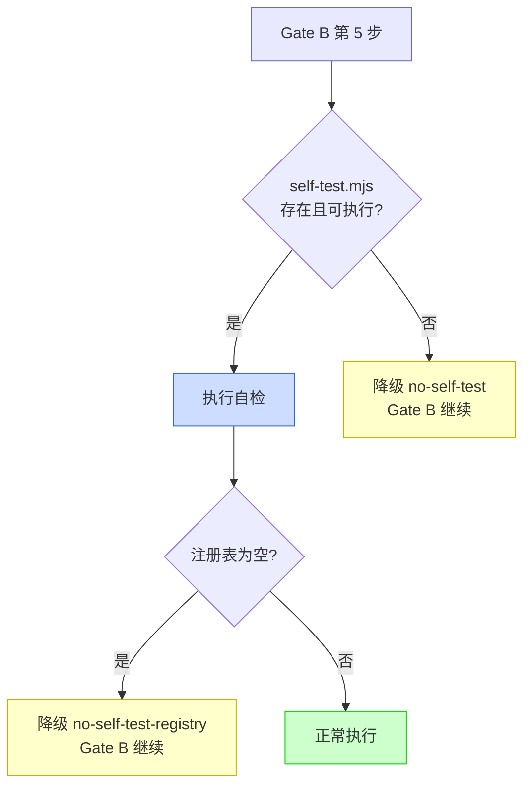

# yry-self-test · 测试设计

> | v1.0.0 | 2026-05-26 | deepseek-v4-pro | 🌿 feat/yry-self-test | 📎 [故事任务](./故事任务.md) |

> **导航**: [← 技术评审](./技术评审.md) · [安全审计 →](./安全审计.md)

> **来源引用**: 由 tester 基于故事任务 AC# + 使用场景 + 技术评审检查项注册表生成。证据 Level A + 文档路径。

[§0 基线溯源](#sec0-baseline) · [§1 测试范围](#sec1-scope) · [§2 正常路径用例](#sec2-normal) · [§3 边界用例](#sec3-edge) · [§4 异常用例](#sec4-error) · [§5 回归用例](#sec5-regression) · [§6 Gate A 交接](#sec6-gate-a)

---

### 主要价值

- 🎯 测试用例全覆盖 — 28 用例按四类（正常/边界/异常/回归）+ 六类别（BR/VR/DC/SC/PL/引擎）分层
- 🔒 Gate A 交接信号完整 — 5 个 P0 用例 + 验证命令 + 自检降级流程图
- ⚡ 基线溯源明确 — 每用例映射 AC# 或使用场景，确保测试依据可追溯
- 📊 引擎层设计内聚 — 执行模式/超时/降级/报告格式均有对应用例覆盖

---

## §0 基线溯源

| 来源 | 覆盖内容 | 映射本节 |
|------|---------|---------|
| 故事任务 AC1 | 全量自检可执行 | §2 TC-N01 |
| 故事任务 AC2 | main 分支阻断写操作 | §2 TC-N02 |
| 故事任务 AC3 | feat 分支通过检查 | §2 TC-N03 |
| 故事任务 AC4 | 版本不一致告警 | §2 TC-N04 |
| 故事任务 AC5 | 文档缺失告警 | §2 TC-N05 |
| 故事任务 AC6 | 安全违规阻断 | §2 TC-N06 |
| 故事任务 AC7 | 全部通过 → Gate B 继续 | §2 TC-N07 |
| 故事任务 AC8 | P0 失败 → Gate B 阻断 | §4 TC-E02 |
| 故事任务 AC9 | 增量自检裁剪 | §2 TC-N08 |
| 使用场景 场景 1 | 全量自检流程 | §2 TC-N01 |
| 使用场景 场景 2 | 增量自检流程 | §2 TC-N08 |
| 使用场景 场景 3 | 文档巡检 | §2 TC-N05 |
| 使用场景 场景 4 | 安全回归 | §2 TC-N06 |
| 使用场景 场景 5 | 元自检 | §2 TC-N09 |

---

## §1 测试范围

### 测试对象

| 组件 | 类型 | 说明 |
|------|------|------|
| self-test.mjs | 新建 | 自检执行引擎 |
| self-test-registry.json | 新建 | 检查项注册表 |
| branch-check.mjs 适配 | 现有 + 封装 | BR 类检查项 |
| 文档扫描逻辑 | 新建 | DC 类检查项 |
| 安全扫描逻辑 | 新建 | SC 类检查项 |

### 四类测试用例分布

| 类别 | 正常路径 | 边界 | 异常 | 回归 | 合计 |
|------|:------:|:----:|:----:|:----:|:----:|
| BR 分支隔离 | 2 | 1 | 1 | 1 | 5 |
| VR 版本一致性 | 1 | 2 | 1 | 1 | 5 |
| DC 文档基线 | 2 | 2 | 1 | 1 | 6 |
| SC 安全合规 | 2 | 1 | 1 | 1 | 5 |
| PL 管线健康 | 1 | 1 | 1 | 0 | 3 |
| 引擎层 | 2 | 1 | 1 | 0 | 4 |
| **合计** | **10** | **8** | **6** | **4** | **28** |

---

## §2 正常路径用例

### TC-N01: 全量自检全部通过

| 字段 | 内容 |
|------|------|
| Given | 当前在 `feat/yry-self-test` 分支，所有检查项符合预期 |
| When | 执行 `node skills/rui/self-test.mjs --mode=full` |
| Then | 输出自检报告，summary 中 `fail` = 0，`p0_fail` = 0，Gate B 判定 `pass` |

### TC-N02: main 分支上写操作被阻断

| 字段 | 内容 |
|------|------|
| Given | 当前分支为 main |
| When | 执行 `node skills/rui/self-test.mjs --mode=full` |
| Then | BR-01 返回 `fail`（P0），Gate B 判定 `block`，输出修复引导 `git checkout -b feat/<name> main` |

### TC-N03: feat 分支检查通过

| 字段 | 内容 |
|------|------|
| Given | 当前在 `feat/yry-self-test` 分支，分支从 main 最新 commit 拉出，无嵌套 |
| When | 执行 BR-01, BR-02, BR-03 |
| Then | 全部 `pass`，BR 类 summary 为 3/3 passed |

### TC-N04: 版本不一致告警

| 字段 | 内容 |
|------|------|
| Given | plugin.json version = "1.26.2"，CLAUDE.md version = "1.26.1"（不一致） |
| When | 执行 VR-01 |
| Then | 返回 `fail`（P1），报告列出两个版本值，给出修复命令 |

### TC-N05: 文档缺失告警

| 字段 | 内容 |
|------|------|
| Given | `docs/故事任务面板/yry-self-test/` 缺失 实施报告.md |
| When | 执行 DC-02 |
| Then | 返回 `fail`（P0），报告列出缺失文档路径，修复引导 `/rui code yry-self-test` |

### TC-N06: 安全违规阻断

| 字段 | 内容 |
|------|------|
| Given | 某 `.mjs` 文件包含 `const API_TOKEN = "sk-abc123"` |
| When | 执行 SC-01 |
| Then | 返回 `fail`（P0），报告列出文件路径 + 行号 + 匹配模式 |

### TC-N07: 全部通过后 Gate B 继续

| 字段 | 内容 |
|------|------|
| Given | 全量自检全部 pass（无 fail，无 P0 fail） |
| When | Gate B 判定 |
| Then | `gate_b: pass`，交付继续，自检结果写入 execution-memory.jsonl |

### TC-N08: 增量自检仅执行相关检查

| 字段 | 内容 |
|------|------|
| Given | git diff 仅涉及 `docs/故事任务面板/yry-self-test/使用场景.md` |
| When | 执行 `node skills/rui/self-test.mjs --mode=incremental` |
| Then | DC 类检查项执行（文档变更），BR 类始终执行（分支检查），VR/SC/PL 类跳过（未涉及版本/安全/管线文件） |

### TC-N09: 元自检通过

| 字段 | 内容 |
|------|------|
| Given | 注册表完整（每类别 ≥ 3 项），所有检查项可执行，降级率 < 50% |
| When | 执行元自检 |
| Then | 输出健康声明，全部通过 |

### TC-N10: category 模式按类别过滤

| 字段 | 内容 |
|------|------|
| Given | 注册表有 5 个类别 |
| When | 执行 `node skills/rui/self-test.mjs --mode=category --category=security` |
| Then | 仅执行 SC 类检查项（SC-01~SC-06），其他类别跳过 |

---

## §3 边界用例

### TC-E01: 无故事目录时的文档检查

| 字段 | 内容 |
|------|------|
| Given | `docs/故事任务面板/` 为空（无任何故事目录） |
| When | 执行 DC 类检查项 |
| Then | DC-01 返回 `fail`（预期至少含 yry-self-test 自身），报告列出"无故事目录" |

### TC-E02: 注册表为空

| 字段 | 内容 |
|------|------|
| Given | `self-test-registry.json` 为空数组 `[]` |
| When | 执行 `self-test.mjs --mode=full` |
| Then | 输出告警 "检查项注册表为空"，标记 `no-self-test-registry`，不阻断 |

### TC-E03: 降级检查失败不阻断

| 字段 | 内容 |
|------|------|
| Given | SC-06（degraded=true）失败（.gitignore 不含 .env） |
| When | Gate B 判定 |
| Then | 该项标记 `degraded`，不计入 P0 fail，Gate B 判定 `pass`（仅此一项失败时） |

### TC-E04: 单检查项超时

| 字段 | 内容 |
|------|------|
| Given | 某检查项执行超过 30 秒 |
| When | 执行引擎检测到超时 |
| Then | 该项标记 `degraded` + `timeout`，继续下一项，不阻断整体 |

### TC-E05: 文档内容含技术术语（语言污染）

| 字段 | 内容 |
|------|------|
| Given | 某故事任务.md 含 `/src/components/Button.tsx` 路径 |
| When | 执行 DC-07 |
| Then | 返回 `fail`（P2），报告列出命中文件 + 行号 + 匹配模式 |

### TC-E06: feat 分支从非 main 的祖先拉出

| 字段 | 内容 |
|------|------|
| Given | feat/x 的 merge-base 与 main HEAD 无祖先关系（从其他 feat 分支拉出） |
| When | 执行 BR-02 |
| Then | 返回 `fail`（P0），标记 `bad-branch` |

### TC-E07: rui-state.json 不存在时的版本检查

| 字段 | 内容 |
|------|------|
| Given | `.memory/rui-state.json` 不存在 |
| When | 执行 VR-02 和 PL-01 |
| Then | VR-02 返回 `fail`（P1），PL-01 返回 `fail`（P1），报告给出修复引导 |

### TC-E08: 多故事中仅部分缺失文档

| 字段 | 内容 |
|------|------|
| Given | 10 个故事目录，其中 2 个缺失 测试设计.md |
| When | 执行 DC-02 |
| Then | 返回 `fail`（P0），报告列出 2 个缺失故事名，修复引导 `/rui doc --from-local <name>` |

---

## §4 异常用例

### TC-EX01: git 仓库不可用

| 字段 | 内容 |
|------|------|
| Given | `.git` 目录不存在或 git 命令不可用 |
| When | 执行 BR 类检查项 |
| Then | 返回 `degraded`，标记 `no-git-repo`，跳过所有 git 相关检查 |

### TC-EX02: self-test.mjs 自身崩溃

| 字段 | 内容 |
|------|------|
| Given | self-test.mjs 有语法错误 |
| When | Gate B 第 5 步尝试执行 |
| Then | 降级 `no-self-test`，Gate B 继续（自检不可用时不阻断交付） |

### TC-EX03: 变更检测失败时降级为全量

| 字段 | 内容 |
|------|------|
| Given | `git diff --name-only` 失败（如无 git 历史） |
| When | 执行 `--mode=incremental` |
| Then | 引擎自动降级为 `full` 模式，输出提示 "变更检测失败，降级为全量自检" |

### TC-EX04: JSON 输出写入失败

| 字段 | 内容 |
|------|------|
| Given | `--format=json --output=/readonly/report.json` 写入失败 |
| When | 引擎尝试写入 JSON 报告 |
| Then | 终端仍输出自检摘要，告警 "JSON 报告写入失败"，不阻断 |

### TC-EX05: 安全扫描匹配到误报

| 字段 | 内容 |
|------|------|
| Given | 源码含注释 `// API key is stored in env variable (not here)` |
| When | 执行 SC-01（token/key/secret 模式扫描） |
| Then | 可能误报。支持 exclude 白名单：注册表中配置 `exclude_patterns: ["// API key is stored"]` |

### TC-EX06: 注册表中 command 字段不可执行

| 字段 | 内容 |
|------|------|
| Given | 注册表某检查项 command 指向不存在的脚本 |
| When | 引擎尝试执行 |
| Then | 标记 `degraded` + `command_not_found`，继续下一项 |

---

## §5 回归用例

### TC-R01: 分支隔离检查与 branch-check.mjs 独立调用一致

| 字段 | 内容 |
|------|------|
| Given | 同一分支状态 |
| When | 分别通过 self-test.mjs（BR-01~BR-03）和 `node skills/rui/branch-check.mjs --mode=read` 执行 |
| Then | 两者结果 100% 一致 |

### TC-R02: 版本升级后版本一致性检查通过

| 字段 | 内容 |
|------|------|
| Given | 执行 `/rui version --up` 后 plugin.json / CLAUDE.md / README.md 三者版本同步 |
| When | 执行 VR-01 |
| Then | `pass` |

### TC-R03: 文档补全后文档基线检查通过

| 字段 | 内容 |
|------|------|
| Given | 执行 `/rui doc --from-local <name>` 补全缺失文档后 |
| When | 执行 DC-01~DC-02 |
| Then | 该故事 DC 类全部 `pass` |

### TC-R04: 修复安全违规后安全自检通过

| 字段 | 内容 |
|------|------|
| Given | 从源码中移除硬编码 token 后 |
| When | 执行 SC-01 |
| Then | `pass`，之前失败的 SC-01 现在通过 |

---

## §6 Gate A 交接

### P0 用例清单

| 用例 ID | 验证命令 | 预期 | 阻断条件 |
|---------|---------|------|---------|
| TC-N01 | `node skills/rui/self-test.mjs --mode=full` | 全量自检可执行，报告格式合法 | 引擎不可执行 |
| TC-N02 | 在 main 分支上执行自检 | BR-01 fail，Gate B block | main 上写操作未被阻断 |
| TC-N06 | 含硬编码 token 时执行自检 | SC-01 fail，Gate B block | 密钥落盘未被检出 |
| TC-N05 | 含缺失文档时执行自检 | DC-02 fail，列出缺失 | 文档缺失未被检出 |
| TC-N07 | 全部通过后检查 Gate B 判定 | gate_b: pass | 误阻断交付 |

### 交接信号

| 信号 | 含义 | 接收方 |
|------|------|--------|
| `self-test.mjs` 存在且可执行 | 自检引擎就绪 | Gate B |
| `self-test-registry.json` 存在且合法 | 检查项注册表就绪 | 执行引擎 |
| 注册表每类别 ≥ 3 项 | 覆盖度达标 | 元自检 |
| 注册表每项含 `baseline_ref` | 基线引用完整 | 审计 |

### 自检不可用时的降级

