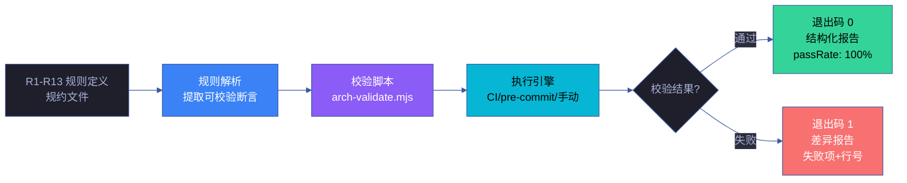
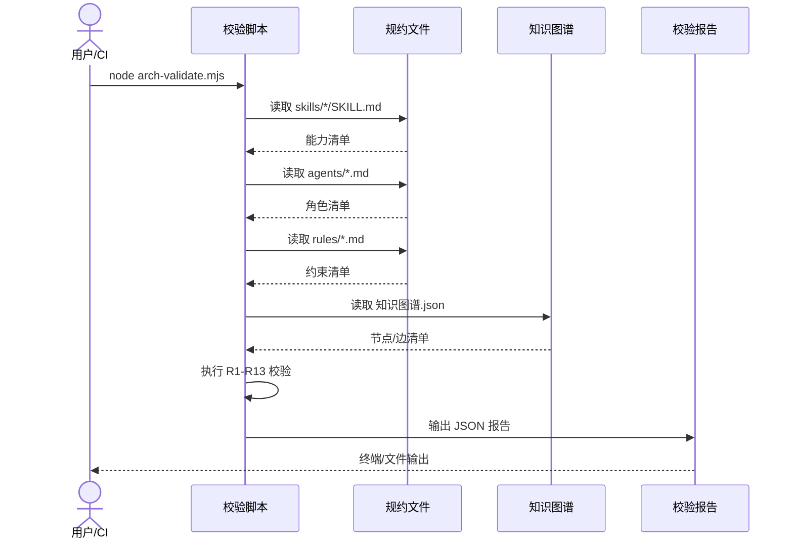

# 场景 6: 架构断言脚本化校验

> | v1.0.0 | 2026-06-12 | qwen3.7-plus | 🌿 master | 📎 [CLAUDE.md](../../../../CLAUDE.md) |
> **导航**: [← 场景-5-信任边界与安全面](../场景-5-信任边界与安全面/index.md) · [场景-7 →](../场景-7-架构漂移持续监测/index.md)

[§0 技术评审](#sec0) · [§1 测试设计](#sec1) · [§2 实施报告](#sec2) · [§3 测试报告](#sec3) · [§4 自改进](#sec4)

## 概述

**角色**: 系统演进者（架构师、CI 工程师、自改进循环） · **目标**: 将 R1–R13 架构规则转化为可执行校验脚本，嵌入 CI/pre-commit 管线，实现架构约束的自动验证 · **优先级**: P0

### 主要价值

- ⚙️ **架构约束可机验** — R1–R13 规则从人读文本变为机器可执行脚本，校验结果不依赖人工判断
- 🔁 **校验嵌入管线** — 每次提交自动触发校验，架构违规在合入前被拦截，而非事后发现
- 📊 **报告结构化** — 校验输出为 JSON 格式，可被下游工具消费（仪表板、通知、趋势追踪）
- 🎯 **差异精准定位** — 失败项附带行号或节点 ID，修复时不必全局搜索
- 📋 **规则可追溯** — 每条校验结果可追溯到对应的 R# 规则定义，审计有据可查
- ⚡ **执行快速** — 全量校验 5 秒内完成，不成为 CI 瓶颈

### 图谱定位

| 图层 | 本场景节点 | 上游 | 下游 |
|------|-----------|------|------|
| 领域层 | scene: engineering | story: yry-arch (contains) | maps_to → 结构层 |
| 结构层 | flow: engineering | maps_to 来自领域层 | implements → scene-6 |
| 内容层 | step: validate-script/run/report | Read 来自结构层 | feeds → 场景-8 |

---

<a id="sec0"></a>
## §0 技术评审

### 效果示意



### 数据流序列图



### 涉及模块

| 模块 | 角色 | 路径 |
|------|------|------|
| 校验脚本 | 核心实现 | `scripts/arch-validate.mjs` |
| 规则配置 | 输入定义 | `config/arch-rules.json` |
| 规约文件 | 数据源 | `skills/*/SKILL.md`, `agents/*.md`, `rules/*.md` |
| 知识图谱 | 数据源 | `docs/故事任务面板/架构/知识图谱.json` |

### API 端点

```bash
# 手动运行校验
node scripts/arch-validate.mjs

# 指定规则过滤
node scripts/arch-validate.mjs --rule R1,R7

# 输出为 JSON 文件
node scripts/arch-validate.mjs --output report.json
```

---

<a id="sec1"></a>
## §1 测试设计

### 正常路径用例 (TC-N)

| TC# | 场景 | 输入 | 预期输出 |
|-----|------|------|---------|
| TC-N1 | 全量校验通过 | 规约文件完整且符合 R1-R13 | 退出码 0，报告 passRate: 100% |
| TC-N2 | 规则过滤 | `--rule R1,R7` | 仅执行 R1 和 R7 校验，其他标记为 skipped |
| TC-N3 | JSON 输出 | `--output report.json` | 生成 report.json，格式符合 schema |

### 边界/异常用例 (TC-B)

| TC# | 场景 | 输入 | 预期输出 |
|-----|------|------|---------|
| TC-B1 | 能力数量不符 | 规约文件缺少一项能力 | 退出码 1，R1 失败，报告含差异详情 |
| TC-B2 | 循环依赖 | 知识图谱含 A→B→A 边 | 退出码 1，R7 失败，报告含循环路径 |
| TC-B3 | 规约文件缺失 | skills/ 目录为空 | 退出码 1，报告含文件不可达错误 |
| TC-B4 | 超时 | 校验执行超过 5 秒 | 终止并报告超时 |

### Gate A 交接

| 项 | 状态 |
|----|------|
| 正常路径用例 ≥ 3 | ✅ TC-N1~N3 |
| 边界/异常用例 ≥ 3 | ✅ TC-B1~B4 |
| API 端点 curl 可执行 | ✅ 见 §0 |
| 涉及模块清单完整 | ✅ 4 项 |

---

<a id="sec2"></a>
## §2 实施报告

> 待实施阶段填充

---

<a id="sec3"></a>
## §3 测试报告

> 待测试阶段填充

---

<a id="sec4"></a>
## §4 自改进

> 待自改进阶段填充

---

> **回溯链**
>
> - 来源：本场景由 Story 3 项目工程化建设（FP12 架构校验脚本化）触发
> - 上游依赖：[故事任务](../故事任务.md) · [场景-5-信任边界与安全面](../场景-5-信任边界与安全面/index.md)
> - 下游消费者：[场景-8-架构健康度量仪表板](../场景-8-架构健康度量仪表板/index.md)
>
> **证据标注说明**：本场景文档的断言基于故事任务 Story 3 的功能点定义（证据级别 B），规则 R1-R13 来源于故事任务 §2 业务规则表。

### 变更记录

| 日期 | 版本 | 变更内容 | 触发 | 证据 |
|------|------|---------|------|------|
| 2026-06-12 | 1.0.0 | 初始化场景文档：技术评审 + 测试设计 | Story 3 FP12 需求 | 故事任务 Story 3 §2 |
