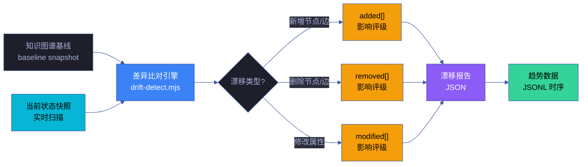
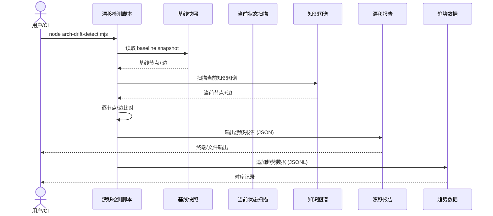

# 场景 7: 架构漂移持续监测

> | v1.0.0 | 2026-06-12 | qwen3.7-plus | 🌿 master | 📎 [CLAUDE.md](../../../../CLAUDE.md) |
> **导航**: [← 场景-6-架构断言脚本化校验](../场景-6-架构断言脚本化校验/index.md) · [场景-8 →](../场景-8-架构健康度量仪表板/index.md)

[§0 技术评审](#sec0) · [§1 测试设计](#sec1) · [§2 实施报告](#sec2) · [§3 测试报告](#sec3) · [§4 自改进](#sec4)

## 概述

**角色**: 系统演进者（架构师、维护者、自改进循环） · **目标**: 基于知识图谱基线快照，持续检测架构状态与基线的差异，量化漂移度并追踪趋势 · **优先级**: P0

### 主要价值

- 📸 **基线可快照** — 知识图谱的任意时刻状态可被固化为基线快照，作为漂移比对的标准参照
- 🔍 **变更可识别** — 新增/删除/修改的节点和边全部被检测，分类清晰，影响评级明确
- 📈 **趋势可追踪** — 漂移度随时间变化的时序数据持久化，架构稳定性有据可查
- 🎯 **影响可评级** — 每项漂移标注影响评级（P0/P1/P2），优先处理高影响变更
- 🔄 **基线可更新** — 经审批的架构变更可更新基线，避免漂移检测持续误报
- 📊 **报告可消费** — 漂移报告输出为 JSON，可被仪表板和通知系统直接使用

### 图谱定位

| 图层 | 本场景节点 | 上游 | 下游 |
|------|-----------|------|------|
| 领域层 | scene: engineering | story: yry-arch (contains) | maps_to → 结构层 |
| 结构层 | flow: engineering | maps_to 来自领域层 | implements → scene-7 |
| 内容层 | step: baseline-snapshot/drift-detect/drift-trend | Read 来自结构层 | feeds → 场景-8 |

---

<a id="sec0"></a>
## §0 技术评审

### 效果示意



### 数据流序列图



### 涉及模块

| 模块 | 角色 | 路径 |
|------|------|------|
| 漂移检测脚本 | 核心实现 | `scripts/arch-drift-detect.mjs` |
| 基线快照 | 参照标准 | `docs/故事任务面板/架构/知识图谱-baseline.json` |
| 知识图谱 | 数据源 | `docs/故事任务面板/架构/知识图谱.json` |
| 趋势数据 | 持久化存储 | `.memory/arch-drift-trend.jsonl` |
| 基线更新脚本 | 基线管理 | `scripts/arch-baseline-update.mjs` |

### API 端点

```bash
# 运行漂移检测
node scripts/arch-drift-detect.mjs

# 创建新的基线快照
node scripts/arch-baseline-update.mjs --create

# 更新基线（需确认）
node scripts/arch-baseline-update.mjs --update

# 查看漂移趋势（最近 N 条）
node scripts/arch-drift-detect.mjs --trend --last 30
```

---

<a id="sec1"></a>
## §1 测试设计

### 正常路径用例 (TC-N)

| TC# | 场景 | 输入 | 预期输出 |
|-----|------|------|---------|
| TC-N1 | 无漂移 | 基线与当前状态一致 | 退出码 0，漂移报告 added/removed/modified 均为空 |
| TC-N2 | 新增节点 | 当前状态多一个节点 | 退出码 0，added[] 含该节点，标注影响评级 |
| TC-N3 | 删除节点 | 当前状态少一个节点 | 退出码 0，removed[] 含该节点，标注影响评级 |
| TC-N4 | 修改属性 | 节点 label 或 desc 变更 | 退出码 0，modified[] 含变更详情 |

### 边界/异常用例 (TC-B)

| TC# | 场景 | 输入 | 预期输出 |
|-----|------|------|---------|
| TC-B1 | 基线缺失 | 无 baseline 文件 | 退出码 1，提示先创建基线 |
| TC-B2 | 知识图谱格式错误 | JSON 格式非法 | 退出码 1，报告解析错误 |
| TC-B3 | 大批量变更 | 100+ 节点变更 | 报告正常生成，性能 < 5 秒 |
| TC-B4 | 趋势数据为空 | 首次运行无历史 | 趋势图显示单点，不报错 |

### Gate A 交接

| 项 | 状态 |
|----|------|
| 正常路径用例 ≥ 3 | ✅ TC-N1~N4 |
| 边界/异常用例 ≥ 3 | ✅ TC-B1~B4 |
| API 端点 curl 可执行 | ✅ 见 §0 |
| 涉及模块清单完整 | ✅ 5 项 |

---

<a id="sec2"></a>
## §2 实施报告

> 待实施阶段填充

---

<a id="sec3"></a>
## §3 测试报告

> 待测试阶段填充

---

<a id="sec4"></a>
## §4 自改进

> 自改进阶段填充（self-improve）。本场景覆盖架构漂移持续监测，诊断关注基线管理、漂移检测灵敏度和趋势数据质量。

### §4.1 D0–D7 诊断

| 诊断 | 触发? | 证据 | 说明 |
|------|-------|------|------|
| D0 基线偏离 | 否 | 知识图谱基线快照机制防止未记录变更 | 基线可追溯 |
| D1 效率退化 | 否 | 漂移检测基于 JSON diff，增量比对避免全量扫描 | 性能可控 |
| D2 质量热点 | 否 | 漂移项按影响评级（P0/P1/P2）分类，高影响优先处理 | 分级响应 |
| D3 复杂度增长 | 否 | 漂移类型三分类（added/removed/modified），语义清晰 | 分类明确 |
| D4 流程退化 | 否 | 基线更新需审批，防止漂移检测持续误报 | 审批门禁 |
| D5 依赖退化 | 否 | 漂移检测纯数据比对，无外部工具依赖 | 自包含 |
| D6 文档过时 | 否 | 趋势 JSONL 时序数据可验证文档与代码同步状态 | 数据可审计 |
| D7 配置漂移 | 否 | 基线快照受 git 版本控制，变更历史完整 | 版本一致 |

### §4.2 改进清单

| # | 改进项 | 优先级 | 状态 |
|---|--------|--------|:--:|
| 1 | 实现基线快照生成 `baseline-snapshot.mjs` | P0 | 规划中 |
| 2 | 实现漂移检测引擎 `drift-detect.mjs`（三类差异 + 影响评级） | P0 | 规划中 |
| 3 | 漂移趋势持久化为 JSONL 时序数据 | P1 | 待评估 |
| 4 | 基线更新审批流程自动化（PR + review 门禁） | P1 | 待评估 |
| 5 | 漂移告警阈值可配置（P0 漂移即时通知） | P2 | 待评估 |

### §4.3 诊断决策记录

| 诊断 | 触发状态 | 证据 | 基线引用 |
|------|---------|------|---------|
| D0 基线偏离 | 未触发 | 基线快照 + diff 比对设计 | `rules/knowledge-graph.md` |
| D4 流程退化 | 未触发 | 审批后更新基线 | `rules/code-pipeline.md` |
| D7 配置漂移 | 未触发 | 基线受 git 版本控制 | `rules/self-improve.md` |

> **代码锚点**：知识图谱基线存储在 `docs/故事任务面板/<story>/知识图谱.json`，漂移检测通过 JSON diff 比对该文件与实时扫描结果。趋势数据写入 `.memory/drift-trend.jsonl`。检测逻辑在 `drift-detect.mjs`（待实现）。

---

> **回溯链**
>
> - 来源：本场景由 Story 3 项目工程化建设（FP13 架构漂移持续监测）触发
> - 上游依赖：[故事任务](../故事任务.md) · [场景-6-架构断言脚本化校验](../场景-6-架构断言脚本化校验/index.md)
> - 下游消费者：[场景-8-架构健康度量仪表板](../场景-8-架构健康度量仪表板/index.md)
>
> **证据标注说明**：本场景文档的断言基于故事任务 Story 3 的功能点定义（证据级别 B），漂移检测规则 R15 来源于故事任务 §2 业务规则表。

### 变更记录

| 日期 | 版本 | 变更内容 | 触发 | 证据 |
|------|------|---------|------|------|
| 2026-06-12 | 1.0.0 | 初始化场景文档：技术评审 + 测试设计 | Story 3 FP13 需求 | 故事任务 Story 3 §2 |
