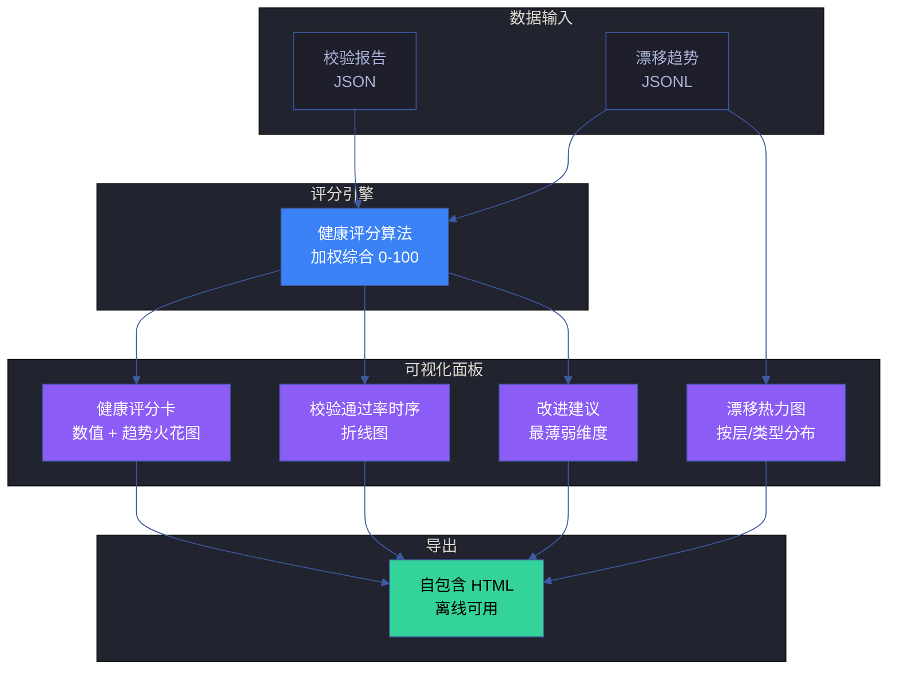
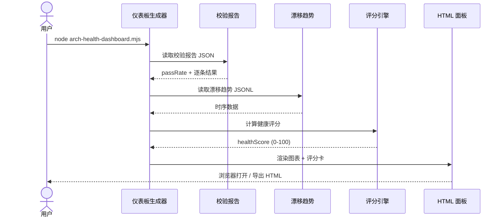

# 场景 8: 架构健康度量仪表板

> | v1.0.0 | 2026-06-12 | qwen3.7-plus | 🌿 master | 📎 [CLAUDE.md](../../../../CLAUDE.md) |
> **导航**: [← 场景-7-架构漂移持续监测](../场景-7-架构漂移持续监测/index.md) · [知识图谱 →](../知识图谱.json)

[§0 技术评审](#sec0) · [§1 测试设计](#sec1) · [§2 实施报告](#sec2) · [§3 测试报告](#sec3) · [§4 自改进](#sec4)

## 概述

**角色**: 系统演进者（架构师、团队负责人、自改进循环） · **目标**: 汇聚校验结果和漂移数据，生成可视化健康仪表板，为团队决策和自改进循环提供数据支撑 · **优先级**: P0

### 主要价值

- 📊 **健康可量化** — 架构健康从模糊印象变为 0-100 的客观评分，团队讨论有共同语言
- 📈 **趋势可对比** — 校验通过率、漂移度随时间变化的趋势图，架构演进方向有据可依
- 🎯 **改进可聚焦** — 仪表板自动识别最薄弱的维度，改进建议直接关联具体场景
- 📋 **报告可导出** — 自包含 HTML 文件，离线可用，团队回顾和汇报可直接使用
- 🔍 **细节可下钻** — 从总览评分到单条校验失败，从趋势曲线到具体漂移事件，逐层深入
- ⚙️ **权重可配置** — 评分算法的权重参数可调整，适应不同项目阶段的关注重点

### 图谱定位

| 图层 | 本场景节点 | 上游 | 下游 |
|------|-----------|------|------|
| 领域层 | scene: engineering | story: yry-arch (contains) | maps_to → 结构层 |
| 结构层 | flow: engineering | maps_to 来自领域层 | implements → scene-8 |
| 内容层 | step: health-score/dashboard/export | Read 来自结构层 | — |

---

<a id="sec0"></a>
## §0 技术评审

### 效果示意



### 数据流序列图



### 涉及模块

| 模块 | 角色 | 路径 |
|------|------|------|
| 仪表板生成器 | 核心实现 | `scripts/arch-health-dashboard.mjs` |
| 评分引擎 | 算法核心 | `lib/health-score.mjs` |
| 校验报告 | 数据源 | 场景-6 输出的 JSON 报告 |
| 漂移趋势 | 数据源 | `.memory/arch-drift-trend.jsonl` |
| HTML 模板 | 渲染模板 | `templates/dashboard/arch-health.html` |

### API 端点

```bash
# 生成并打开仪表板
node scripts/arch-health-dashboard.mjs --open

# 导出为 HTML 文件
node scripts/arch-health-dashboard.mjs --output health-report.html

# 自定义评分权重
node scripts/arch-health-dashboard.mjs --weights 0.4,0.3,0.3

# 仅输出评分（CI 用）
node scripts/arch-health-dashboard.mjs --score-only
```

### 健康评分算法

```
healthScore = passRate × W1 + (1 - driftScore) × W2 + coverageScore × W3

其中：
- passRate: 校验通过率 (0-1)，来自场景-6
- driftScore: 归一化漂移度 (0-1)，来自场景-7
- coverageScore: 知识覆盖度 (0-1)，图谱节点/边覆盖率
- W1 = 0.4, W2 = 0.3, W3 = 0.3（默认权重，可配置）

分值范围: 0-100
评级:
  ≥ 90: A (优秀)
  ≥ 75: B (良好)
  ≥ 60: C (需关注)
  < 60: D (需改进)
```

---

<a id="sec1"></a>
## §1 测试设计

### 正常路径用例 (TC-N)

| TC# | 场景 | 输入 | 预期输出 |
|-----|------|------|---------|
| TC-N1 | 全部通过 | passRate=1.0, drift=0, coverage=1.0 | healthScore=100, 评级 A |
| TC-N2 | 部分失败 | passRate=0.8, drift=0.1, coverage=0.9 | healthScore 计算正确，评级对应 |
| TC-N3 | 导出 HTML | `--output report.html` | 生成自包含 HTML，离线可正常渲染 |
| TC-N4 | 自定义权重 | `--weights 0.5,0.3,0.2` | 评分按新权重计算，结果变化 |

### 边界/异常用例 (TC-B)

| TC# | 场景 | 输入 | 预期输出 |
|-----|------|------|---------|
| TC-B1 | 数据缺失 | 无校验报告文件 | 降级显示 N/A，不崩溃 |
| TC-B2 | 趋势数据为空 | 首次运行无历史 | 趋势图显示单点或占位提示 |
| TC-B3 | 评分边界 | 全部为 0 | healthScore=0, 评级 D，显示改进建议 |
| TC-B4 | 大文件渲染 | 趋势数据 1000+ 条 | 渲染 < 3 秒，分页或采样 |

### Gate A 交接

| 项 | 状态 |
|----|------|
| 正常路径用例 ≥ 3 | ✅ TC-N1~N4 |
| 边界/异常用例 ≥ 3 | ✅ TC-B1~B4 |
| API 端点 curl 可执行 | ✅ 见 §0 |
| 涉及模块清单完整 | ✅ 5 项 |

---

<a id="sec2"></a>
## §2 实施报告

> 待实施阶段填充

---

<a id="sec3"></a>
## §3 测试报告

> 待测试阶段填充

---

<a id="sec4"></a>
## §4 自改进

> 待自改进阶段填充

---

> **回溯链**
>
> - 来源：本场景由 Story 3 项目工程化建设（FP14 架构健康度量仪表板）触发
> - 上游依赖：[故事任务](../故事任务.md) · [场景-6](../场景-6-架构断言脚本化校验/index.md) · [场景-7](../场景-7-架构漂移持续监测/index.md)
> - 下游消费者：自改进循环 · 团队回顾
>
> **证据标注说明**：本场景文档的断言基于故事任务 Story 3 的功能点定义（证据级别 B），评分规则 R16 来源于故事任务 §2 业务规则表。

### 变更记录

| 日期 | 版本 | 变更内容 | 触发 | 证据 |
|------|------|---------|------|------|
| 2026-06-12 | 1.0.0 | 初始化场景文档：技术评审 + 测试设计 | Story 3 FP14 需求 | 故事任务 Story 3 §2 |
