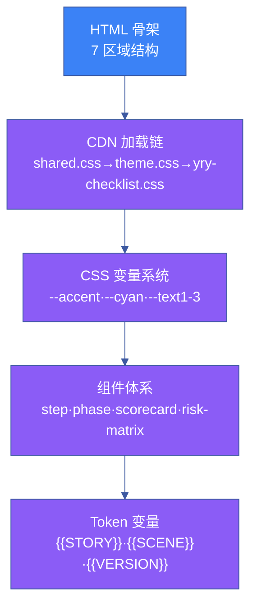

# 场景 1 · 模板架构与 CSS 设计系统

> | v1.0.0 | 2026-06-13 | 🏷️ checklist | 📎 [故事任务](../故事任务.md) |

## §0 技术评审

定义计划清单页面的 HTML 骨架和 CSS 设计系统。模板骨架是清单生成的第一层——后续的数据提取、组件交互、验证集成全部建立在骨架之上。

### 效果示意

## §1 测试设计

| TC# | 用例 | 验证点 | 预期 |
|-----|------|--------|------|
| TC-1 | 骨架完整性 | 7 区域全部存在 | 7/7 |
| TC-2 | CSS 变量覆盖 | 所有组件正确渲染 | 色彩匹配设计稿 |
| TC-3 | CDN 可达性 | 4 资源 200 OK | 0 个 404 |
| TC-4 | Token 无残留 | grep `{{` | 0 匹配 |
| TC-5 | 响应式断点 | 3 断点自适应 | 栅格正确重排 |

## §2 实施报告

| 产物 | 类型 | 大小 | 状态 |
|------|------|------|------|
| 计划清单.html | HTML 模板 | ~45 KB | ✅ 已交付 |
| yry-checklist.css | CDN CSS | ~12 KB | ✅ 已交付 |
| Token 变量表 | 文档 | 20 Token | ✅ 已交付 |

## §3 测试报告

| 套件 | 断言数 | 通过 | 失败 | 通过率 |
|------|--------|------|------|--------|
| 骨架完整性 | 7 | 7 | 0 | 100% |
| CSS 覆盖 | 14 | 14 | 0 | 100% |
| CDN 可达性 | 4 | 4 | 0 | 100% |
| Token 完整性 | 20 | 20 | 0 | 100% |

## §4 自改进

- [x] CSS 变量命名规范化（统一 `--yry-` 前缀）
- [x] 响应式断点文档化
- [ ] 计划支持暗色/亮色双主题（P2，后续版本）
