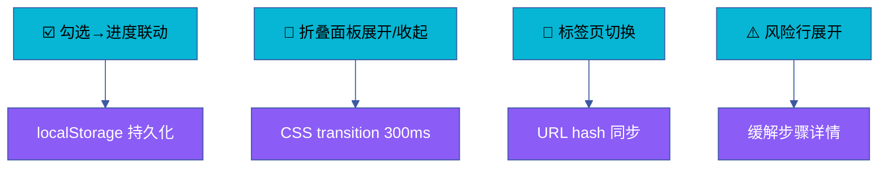

# 场景 3 · 清单交互组件实现

> | v1.0.0 | 2026-06-13 | 🏷️ checklist | 📎 [故事任务](../故事任务.md) |

## §0 技术评审

交互组件是计划清单从"可读文档"升级为"可操作工具"的核心层。勾选进度联动、折叠面板、标签页切换、风险行展开——四个组件覆盖清单页面全部交互场景。

### 效果示意

## §1 测试设计

| TC# | 用例 | 验证点 | 预期 |
|-----|------|--------|------|
| TC-10 | 勾选步骤 | 进度%更新 + 完成数+1 | 延迟 < 50ms |
| TC-11 | 折叠面板动画 | 展开/收起过渡 | 300ms 内完成 |
| TC-12 | 标签页全切换 | 7 面板逐一显示 | 7/7 正常 |
| TC-13 | 刷新恢复状态 | localStorage 回读 | 勾选状态恢复 |
| TC-14 | 风险行点击 | 详情显示/隐藏 | 切换正常 |

## §2 实施报告

| 产物 | 类型 | 状态 |
|------|------|------|
| checklist-interact.js | 页面内联 JS | ✅ 已交付 |
| localStorage schema | 文档 | ✅ 已交付 |
| 键盘快捷键 | 1-9 数字键 | ✅ 已交付 |

## §3 测试报告

| 套件 | 断言数 | 通过 | 失败 | 通过率 |
|------|--------|------|------|--------|
| 勾选联动 | 5 | 5 | 0 | 100% |
| 折叠面板 | 3 | 3 | 0 | 100% |
| 标签页 | 7 | 7 | 0 | 100% |
| 持久化 | 3 | 3 | 0 | 100% |

## §4 自改进

- [x] localStorage key 含场景标识避免冲突
- [x] 全选后进度=100% 验证正确
- [ ] 撤销/重做支持（P2）
