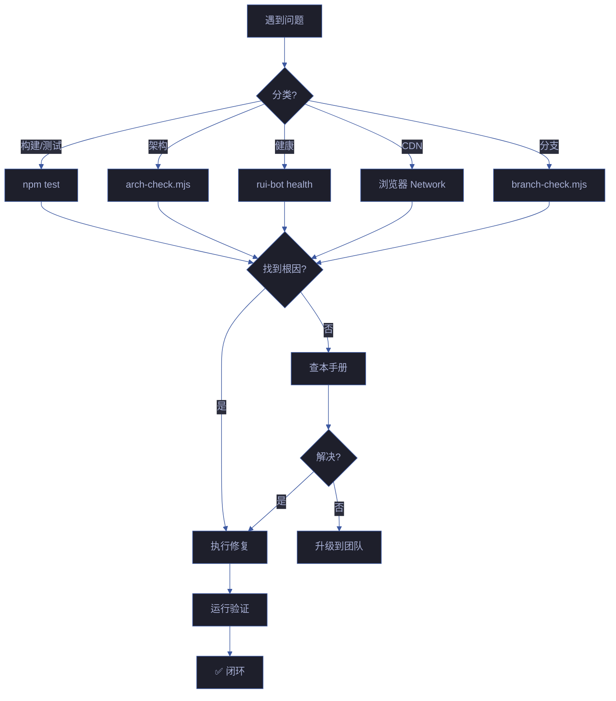

# 故障排查手册

> 常见问题与解决方案。按管线阶段分类，每个问题含**症状 · 根因 · 解决**三步法。
> 对应 CLAUDE.md [退化对策](../CLAUDE.md#退化对策) 中的 L3 防线（铁律 + Red Flags + 验证门禁五步法）。

## 使用方式

1. **定位症状** — 在下方目录中找到匹配的错误信息或现象
2. **理解根因** — 阅读"根因"段，理解问题本质而非仅消除症状
3. **执行解决** — 按"解决"段命令逐步执行；命令均可在项目根目录直接运行
4. **验证修复** — 修复后运行对应验证命令（见每条目末尾或"快速诊断命令"）
5. **记录经验** — 若为新型问题，写入本手册并同步到 `.memory/` 执行记忆

## 目录

| # | 阶段 | 症状数 | 典型阻断信号 |
|---|------|--------|-------------|
| 1 | [分支隔离](#分支隔离) | 2 | `no-branch-isolation` · `bad-branch` |
| 2 | [Gate A/B](#gate-ab) | 2 | `skip-gate-a` · `gate-b-limit` |
| 3 | [文档生成](#文档生成) | 2 | `doc-p0` · `chain-broken` |
| 4 | [API/网络](#apinetwork) | 2 | `no-token` · 远端不可达 |
| 5 | [健康检查](#健康检查) | 2 | 评分持续下降 · Git 维度低 |
| 6 | [架构合规](#架构合规) | 1 | `arch-check` 不通过 |
| 7 | [CDN/组件](#cdn组件) | 3 | Vue 不渲染 · 数据加载失败 · CE 样式丢失 |
| 8 | [自循环报告](#自循环报告) | 2 | 报告未生成 · 企微未送达 |
| — | [快速诊断命令](#快速诊断命令) | 6 条 | 分支 · 架构 · 健康 · 文档 · 依赖 · Token |

**总计**：8 个阶段 · 16 个症状 · 6 条快速诊断命令

## 严重度约定

| 标记 | 含义 | 响应 |
|------|------|------|
| 🚫 P0 | 阻断管线，不可进入下一模块 | 立即修复 |
| ⚠️ P1 | 降级运行，功能受限但可继续 | 本轮内修复 |
| ℹ️ P2 | 提示性，无功能影响 | 可延后处理 |

## 分支隔离

### 症状：`no-branch-isolation` 阻断

```
🚫 no-branch-isolation: 当前分支为 main，禁止 Edit/Write
```

**根因**：在 main 分支上执行了写入操作。

**解决**：
```bash
git checkout -b feat/<story-name>
node lib/branch-check.mjs --story=<story-name> --mode=write
```

### 症状：`bad-branch` 阻断

```
🚫 bad-branch: 分支未从 main 创建或混入非本故事代码
```

**根因**：分支创建时基线不是 main。

**解决**：
```bash
git checkout main
git pull origin main
git checkout -b feat/<story-name>
```

## Gate A/B

### 症状：`skip-gate-a` 阻断

```
🚫 skip-gate-a: 场景 §1 测试设计不存在
```

**根因**：场景文档缺少测试设计章节。

**解决**：补充场景文档 §1 测试设计，含 TC-N（正常）/ TC-E（异常）/ TC-B（边界）用例。

### 症状：`gate-b-limit` 阻断

```
🚫 gate-b-limit: 修复超过 2 轮
```

**根因**：同一问题反复修复超过 2 轮，暗示架构设计问题。

**解决**：
1. 停止修复，质疑架构设计
2. 退回设计阶段重新评估
3. 考虑拆分故事或简化实现

## 文档生成

### 症状：`doc-p0` 阻断

```
🚫 doc-p0: 文档 P0 不通过，无法自修复
```

**根因**：文档基线存在无法自动修复的 P0 问题。

**解决**：
1. 检查 P0 检查清单：F.meta 完整、§0 含 mermaid、每场景 ≥2 AC、风险 ≥3 项
2. 手动修复无法自动修复的项
3. 重新运行 `/rui doc`

### 症状：`chain-broken` 阻断

```
🚫 chain-broken: 影响链未闭合
```

**根因**：变更后未完成二级传递搜索。

**解决**：
```bash
# 1. 列出变更点
git diff --name-only

# 2. 全项目搜索引用
grep -rn "functionName\|ClassName" --include="*.{js,ts,mjs}"

# 3. 二级传递
grep -rn "referencedFunction" --include="*.{js,ts,mjs}"

# 4. 标注处置
```

## API/网络

### 症状：`no-token` 降级

```
⚠️ no-token: API_X_TOKEN 环境变量缺失
```

**根因**：未配置远端 API 认证令牌。

**解决**：
```bash
export API_X_TOKEN="your-token-here"
```

### 症状：远端 API 不可达

```
❌ 远端 API 不可达: api.effiy.cn 连接超时
```

**根因**：网络限制或 API 服务异常。

**解决**：
1. 检查网络连接：`curl -I https://api.effiy.cn`
2. 检查 VPN/代理设置
3. 等待服务恢复后重试

## 健康检查

### 症状：综合评分持续下降

**根因**：多个维度出现退化。

**排查步骤**：
1. 查看健康报告定位低分维度
2. 检查 `.memory/health-trend.jsonl` 历史趋势
3. 运行 `node lib/arch-check.mjs` 检查架构合规
4. 按诊断优先级修复：D8 > D5 > D7 > D1 > D3 > D4 > D0 > D2 > D6

### 症状：Git 维度评分低

**根因**：存在未提交文件或分支状态异常。

**解决**：
```bash
git status
git add <files>
git commit -m "fix: 提交未提交变更"
```

## 架构合规

### 症状：arch-check 不通过

```
❌ arch-check: 10 维度检查未通过
```

**排查步骤**：
```bash
# 查看详细报告
node lib/arch-check.mjs --verbose

# 常见问题修复
# 范式违规: class → 函数, export default → 具名导出
# 空 catch: catch {} → catch (err) { console.error(err); }
# 跨 Skill 导入: 移到 lib/ 或通过编排器路由
```

## CDN/组件

### 症状：Vue 组件不渲染

**根因**：Custom element 未注册或 Vue 3 未加载。

**排查步骤**：
1. 检查控制台：`[Vue warn]` 或 `[YryDocsBinding]` 开头的错误
2. 确认 Vue 3 CDN 可达：`curl -I https://unpkg.com/vue@3/dist/vue.global.prod.js`
3. 确认组件 JS 加载顺序：`shared/index.js` → Vue 3 → 组件 JS
4. 检查 Network 标签页：所有 CDN 组件返回 200

### 症状：评分数据加载失败（显示离线默认值）

**根因**：数据源不可达（score-report.json / summary.json / cdn-summary/index.json）。

**解决**：
```bash
# 1. 重新生成评分报告
node lib/score-report-generator.mjs

# 2. 执行健康检查
node skills/rui-bot/send.mjs health

# 3. 确认文件存在
ls docs/评分报告/score-report.json
ls docs/自我改进/summary.json
ls cdn/cdn-summary/index.json

# 4. 如使用本地预览，启动 HTTP 服务器
npx serve docs
```

### 症状：Custom Element 样式丢失

**根因**：CSS 文件加载顺序错误或 CDN 资源 404。

**排查**：
1. Network 标签页过滤 `.css`，确认全部返回 200
2. 确认加载顺序：theme → shared → 组件 CSS（yry-home.css 在组件 CSS 之前）
3. 检查浏览器控制台 CORS 错误

## 自循环报告

### 症状：自循环报告未生成

**根因**：Cron 定时任务未触发或 `loop-report.mjs` 执行失败。

**排查**：
```bash
# 手动触发巡检
node skills/rui-bot/lib/loop-report.mjs

# 检查 Cron 配置
cat .claude/scheduled_tasks.json 2>/dev/null

# 检查最近报告
ls -lt docs/自循环报告/*.html | head -5
```

### 症状：企微通知未送达

**根因**：Webhook 配置缺失或 API 不可达。

**排查**：
```bash
# 测试通知发送
node skills/rui-bot/send.mjs health --notify --dry-run

# 检查失败队列
node skills/rui-bot/send.mjs flush --dry-run

# 确认环境变量
[ -n "$API_X_TOKEN" ] && echo "✅ Token 已配置" || echo "❌ Token 缺失"
```

## 快速诊断命令

| 问题 | 诊断命令 |
|------|---------|
| 分支状态 | `git branch --show-current && git status --short` |
| 架构合规 | `node lib/arch-check.mjs --short` |
| 健康评分 | `node skills/rui-bot/send.mjs health --short` |
| 文档新鲜度 | `find docs/故事任务面板 -name "*.md" -mtime +7` |
| 依赖安全 | `npm audit --json \| grep -c critical` |

## 诊断命令详解

| 命令 | 输出格式 | 阈值 | 阻断条件 |
|------|------|------|------|
| `git branch --show-current` | 分支名 | `feat/<name>` | 非 feat/ 分支 |
| `git status --short` | 文件列表 | 空 | 有未提交变更 |
| `node lib/arch-check.mjs` | A/B/C/D | A 级 | 非 A |
| `node skills/rui-bot/send.mjs health` | 评分 + 维度 | ≥ 0.85 | < 0.70 |
| `npm test` | 通过/失败 | 100% | < 100% |
| `npm audit` | 漏洞列表 | 0 high+ | 有 critical |

## 故障分类与升级路径

| 严重度 | 分类 | 响应时效 | 升级条件 |
|:---:|------|:---:|------|
| P0 | 阻断交付 | 1h | 主流程不可用 |
| P1 | 影响质量 | 4h | 部分功能退化 |
| P2 | 待优化 | 1d | 次要问题 |
| P3 | 记录 | 1w | 理论问题 |

## 常见误区与纠正

| 误区 | 纠正 | 工具 |
|------|------|------|
| "应该没问题" | 运行验证命令 | 铁律 Red Flag |
| "上次通过了" | 每次都验证 | 验证门禁 |
| "先试一个修复看看" | 找根因再修 | 溯先于修 |
| "P0 太难修，标 P1" | P0 必清零 | 清先于进 |
| "文档用文字描述即可" | 图→表→文字 | 表达优先 |

## 自助排查流程



## SLA 与响应矩阵

| 故障类型 | 响应 | 修复 | 验证 | 通知 |
|---------|:---:|:---:|:---:|:---:|
| P0 阻断 | 1h | 4h | 1h | 企微 |
| P1 影响 | 4h | 1d | 4h | 日报 |
| P2 优化 | 1d | 7d | 1d | 周报 |
| P3 记录 | 1w | 30d | — | 月报 |

## 预防性检查清单

| # | 检查项 | 频率 | 命令 | 阻断 |
|---|--------|:---:|------|:---:|
| 1 | 分支隔离 | 每次提交 | `branch-check.mjs` | ✅ |
| 2 | 架构合规 | 每次提交 | `arch-check.mjs` | ✅ |
| 3 | 测试通过 | 每次提交 | `npm test` | ✅ |
| 4 | 安全扫描 | 每日 | `security-scan.mjs` | ⚠️ |
| 5 | 健康评分 | 每日 | `rui-bot health` | ⚠️ |
| 6 | 文档新鲜度 | 每周 | `find -mtime +7` | — |
| 7 | 依赖更新 | 每月 | `npm outdated` | — |
| 8 | 磁盘空间 | 每月 | `df -h` | — |

## 紧急联系与升级

| 场景 | 联系方式 | 响应时效 |
|------|------|:---:|
| 生产故障 | 企微 #oncall 群 | 15min |
| 安全事件 | 安全负责人 + 邮件 | 1h |
| 供应链攻击 | npm unpublish + 公告 | 立即 |
| 数据丢失 | git revert + 备份恢复 | 立即 |
| Token 配置 | `[ -n "$API_X_TOKEN" ] && echo "✅ 已配置" \|\| echo "❌ 未配置"` | 立即 |