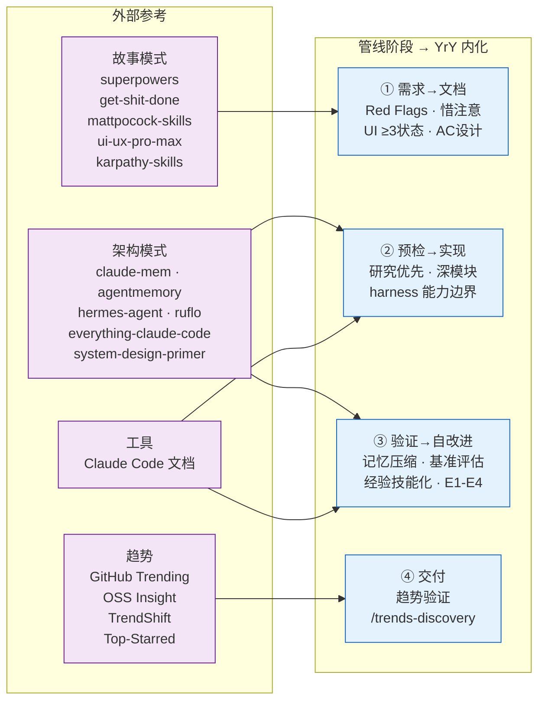

# 外部参考

> pm/coder/security 在各管线阶段查阅。外链失效时规约仍可独立执行。

| 阶段 | 文件 | 汲取 |
|------|------|------|
| ① 需求→文档 | [story-patterns.md](./story-patterns.md) | 故事拆分 · AC 设计 · UI ≥3 状态 |
| ② 预检→实现 | [architecture-patterns.md](./architecture-patterns.md) + [tools.md](./tools.md) | 研究优先 · 深模块 · harness 边界 |
| ③ 验证→自改进 | [architecture-patterns.md](./architecture-patterns.md) | 记忆注入 · 基准 · 经验技能化 |
| ④ 交付 | [trends.md](./trends.md) | 趋势验证 · 社区参照 |

## 本地副本

> commit 哈希见 `_sources.json`。趋势为动态数据，`/trends-discovery` 查询。

| 来源 | 本地 |
|------|------|
| obra/superpowers | [repos/superpowers/](./repos/superpowers/) |
| gsd-build/get-shit-done | [repos/get-shit-done/](./repos/get-shit-done/) |
| mattpocock/skills | [repos/mattpocock-skills/](./repos/mattpocock-skills/) |
| nextlevelbuilder/ui-ux-pro-max-skill | [repos/ui-ux-pro-max-skill/](./repos/ui-ux-pro-max-skill/) |
| multica-ai/andrej-karpathy-skills | [repos/andrej-karpathy-skills/](./repos/andrej-karpathy-skills/) |
| thedotmack/claude-mem | [repos/claude-mem/](./repos/claude-mem/) |
| affaan-m/everything-claude-code ⚠已迁移 | [repos/everything-claude-code/](./repos/everything-claude-code/) |
| rohitg00/agentmemory | [repos/agentmemory/](./repos/agentmemory/) |
| NousResearch/hermes-agent | [repos/hermes-agent/](./repos/hermes-agent/) |
| ruvnet/ruflo | [repos/ruflo/](./repos/ruflo/) |
| donnemartin/system-design-primer | [repos/system-design-primer/](./repos/system-design-primer/) |
| Claude Code 文档 | [docs/claude-code/](./docs/claude-code/) |
