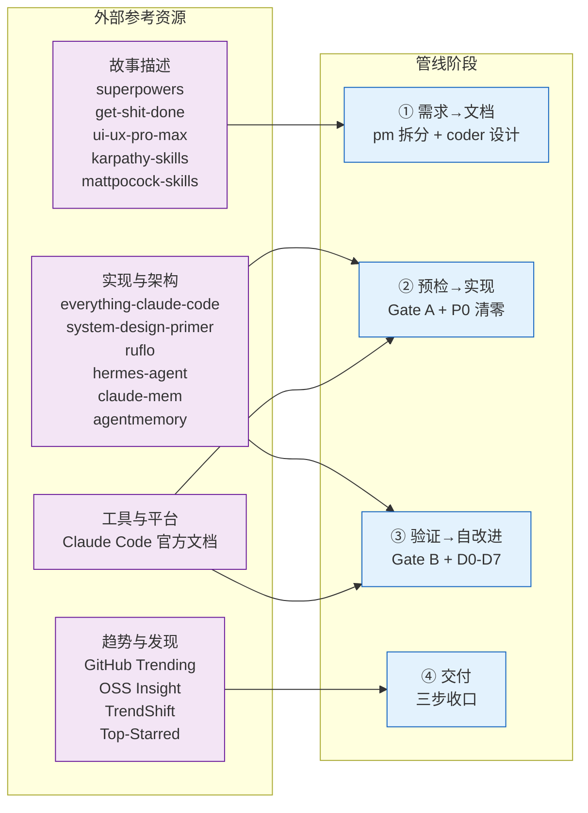
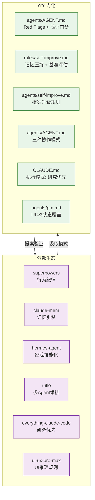

# 外部参考 — 知识库

> pm 拆故事、架构设计、自改进时，应主动查阅以下资源汲取模式与理念。
>
> **融合原则**：从不凭感觉执行——每阶段有对应参考，每参考有明确应用场景。外链失效时，技能规约仍独立可执行（自包含原则）。

## 外部参考 → 管线阶段 映射

| 管线阶段 | 查阅的外部参考 | 汲取什么 |
|---------|--------------|---------|
| 需求→文档 | superpowers · get-shit-done · ui-ux-pro-max · karpathy-skills · mattpocock-skills | 故事拆分模式 · AC 设计方法 · UI 交互状态覆盖 · LLM 编码陷阱规避 · 真实工程纪律 |
| 预检→实现 | everything-claude-code · system-design-primer · ruflo · Claude Code 文档 | 上下文质量优先 · 深模块设计 · 多 Agent 协作模式 · harness 能力边界 |
| 验证→自改进 | claude-mem · agentmemory · hermes-agent · superpowers | 记忆压缩注入 · 基准评估 · 经验技能化 · 验证门禁 |
| 交付 | GitHub Trending · OSS Insight · TrendShift · Top-Starred | 技术趋势验证 · 架构健康度 · 新兴工具 · 社区验证参照 |

## 目录

| 分类 | 文件 |
|------|------|
| 故事描述 — 模式与方法论 | [story-patterns.md](./story-patterns.md) |
| 实现与架构 — 执行模式 | [architecture-patterns.md](./architecture-patterns.md) |
| 工具与平台 | [tools.md](./tools.md) |
| 趋势与发现 | [trends.md](./trends.md) |
| 自改进生态系统 | [ecosystem.md](./ecosystem.md) |

## 自改进生态系统

> YrY 从外部参考汲取模式，通过自改进管线沉淀为自身规则。

