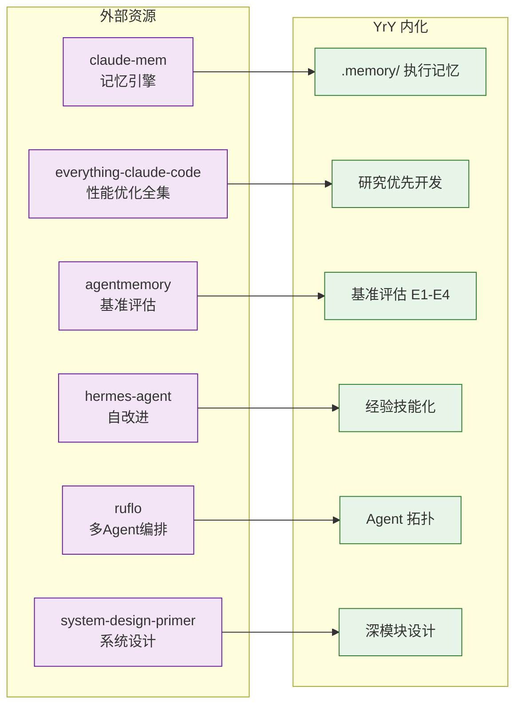

# 架构模式

> 预检→实现 + 验证→自改进阶段核心参考。coder/tester/security 执行时查阅。

| 来源 | 汲取 | 本地副本 |
|------|------|---------|
| [thedotmack/claude-mem](https://github.com/thedotmack/claude-mem) | 跨会话记忆引擎 · AI 压缩 + 相似检索注入 | [repos/claude-mem/](./repos/claude-mem/) |
| [affaan-m/everything-claude-code](https://github.com/affaan-m/everything-claude-code) | Agent harness 性能优化全集 ⚠ 已迁移 | [repos/everything-claude-code/](./repos/everything-claude-code/) |
| [rohitg00/agentmemory](https://github.com/rohitg00/agentmemory) | 真实世界基准 · 记忆压缩策略 | [repos/agentmemory/](./repos/agentmemory/) |
| [NousResearch/hermes-agent](https://github.com/NousResearch/hermes-agent) | 自改进 AI Agent：从经验创建 skill | [repos/hermes-agent/](./repos/hermes-agent/) |
| [ruvnet/ruflo](https://github.com/ruvnet/ruflo) | 多 Agent 编排平台 · 分布式集群智能 | [repos/ruflo/](./repos/ruflo/) |
| [donnemartin/system-design-primer](https://github.com/donnemartin/system-design-primer) | 大规模系统设计 · 伸缩性考量 | [repos/system-design-primer/](./repos/system-design-primer/) |
