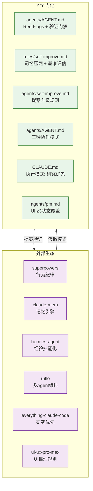

# 自改进生态系统

> YrY 从外部参考汲取模式，通过自改进管线沉淀为自身规则。生态系统闭环如下：

## 映射关系

| 外部资源 | 汲取的模式 | YrY 内化位置 |
|---------|-----------|------------|
| superpowers | 行为纪律 | agents/AGENT.md — Red Flags + 验证门禁 |
| claude-mem | 记忆引擎 | rules/self-improve.md — 记忆压缩 + 基准评估 |
| hermes-agent | 经验技能化 | agents/self-improve.md — 提案升级规则 |
| ruflo | 多 Agent 编排 | agents/AGENT.md — 三种协作模式 |
| everything-claude-code | 研究优先 | CLAUDE.md — 执行模式: 研究优先开发 |
| ui-ux-pro-max | UI 推理规则 | agents/pm.md — UI ≥3 状态覆盖 |
