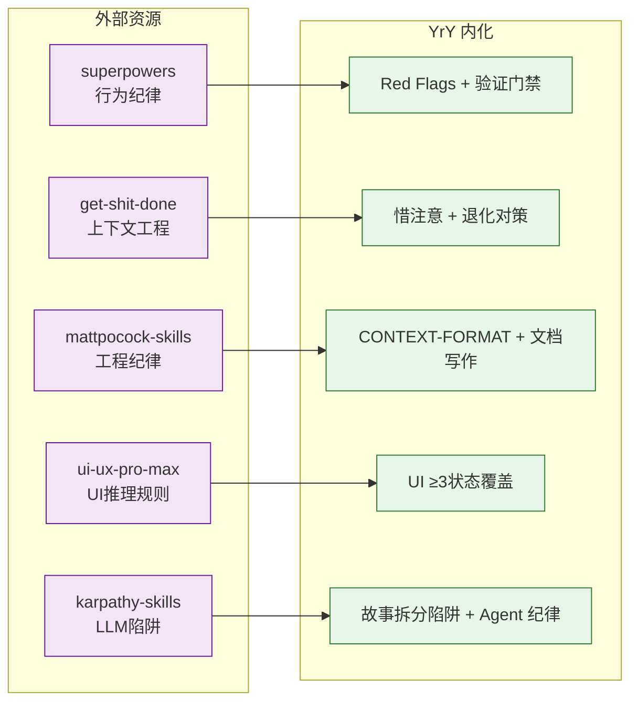

# 故事模式

> 需求→文档阶段核心参考。pm 拆分故事、coder 架构设计时查阅。

| 来源 | 汲取 | 本地副本 |
|------|------|---------|
| [obra/superpowers](https://github.com/obra/superpowers) | Red Flags · 验证门禁五步法 | [repos/superpowers/](./repos/superpowers/) |
| [gsd-build/get-shit-done](https://github.com/gsd-build/get-shit-done) | 惜注意原则 · 退化三因对策 · 上下文工程四原则 | [repos/get-shit-done/](./repos/get-shit-done/) |
| [mattpocock/skills](https://github.com/mattpocock/skills) | CONTEXT-FORMAT 参照 · 工程纪律 | [repos/mattpocock-skills/](./repos/mattpocock-skills/) |
| [nextlevelbuilder/ui-ux-pro-max-skill](https://github.com/nextlevelbuilder/ui-ux-pro-max-skill) | UI ≥3 交互状态覆盖 · pm 前端约束 | [repos/ui-ux-pro-max-skill/](./repos/ui-ux-pro-max-skill/) |
| [multica-ai/andrej-karpathy-skills](https://github.com/multica-ai/andrej-karpathy-skills) | 故事拆分陷阱规避 · Agent 纪律参考 | [repos/andrej-karpathy-skills/](./repos/andrej-karpathy-skills/) |
