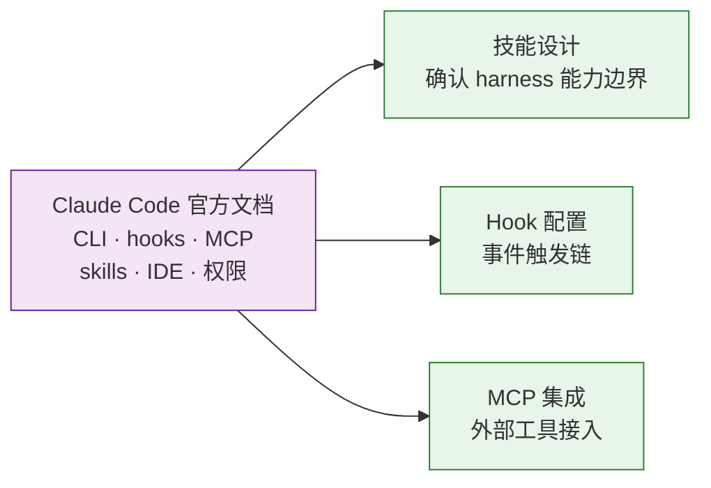

# 工具与平台

> 预检→实现 + 验证→自改进阶段参考。技能设计、hook 配置时查阅。

| 来源 | 汲取 | 本地副本 |
|------|------|---------|
| [Claude Code 官方文档](https://code.claude.com/docs/en/overview) | CLI 功能参考：hooks、MCP、skills、IDE 集成、权限系统 | [docs/claude-code/](./docs/claude-code/) |
