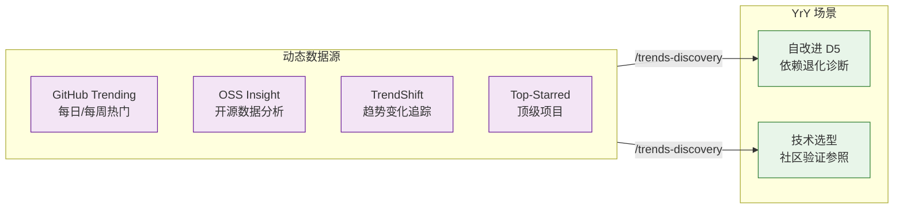

# 趋势与发现

> 交付阶段核心参考。自改进复盘、技术选型时通过 `/trends-discovery` 按需查询动态数据。

| 资源 | 用途 | 查询方式 |
|------|------|---------|
| [GitHub Trending](https://github.com/trending) | 每日/每周热门仓库，感知社区关注方向 | `/trends-discovery github-trending` |
| [OSS Insight](https://ossinsight.io/) | 开源数据分析平台，仓库排名、开发者画像 | `/trends-discovery oss-insight` |
| [TrendShift](https://trendshift.io/github-trending-repositories?trending-range=7) | GitHub 趋势变化追踪，按时间窗口比较 star 增长 | `/trends-discovery trendshift` |
| [GitHub Top-Starred](https://github.com/search?q=stars%3A%3E100000&type=repositories&s=stars&o=desc) | 十万星以上顶级项目列表 | `/trends-discovery top-starred` |
