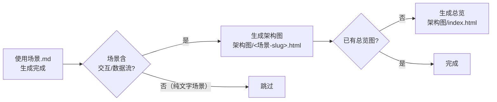

---
paths:
  - "docs/故事任务面板/**/架构图/*.html"
---

# architecture-diagram

> 每个使用场景对应一个自包含的深色主题 HTML+SVG 架构图。图表优先于文字——表达优先。
>
> **Iron Law — 违反字母即是违反精神：**
> - 表达优先：图 → 结构化文本 → 表。无架构图的场景视为未完成。
> - 设计系统一致性：色板/排版/间距不得偏离本文规范。

[设计系统](#设计系统) · [组件模式](#组件模式) · [连接线](#连接线) · [边界区域](#边界区域) · [图例布局](#图例布局) · [导出工具栏](#导出工具栏) · [生成时机](#生成时机) · [生效标志](#生效标志)

## 设计系统

### 色板

> 语义色——组件类型决定颜色。禁止混用。

| 组件类型 | Fill (rgba) | Stroke | 对应 YrY 概念 |
|---------|-------------|--------|-------------|
| 前端/UI | `rgba(8, 51, 68, 0.4)` | `#22d3ee` (cyan-400) | 用户界面、页面组件、客户端 |
| 后端/服务 | `rgba(6, 78, 59, 0.4)` | `#34d399` (emerald-400) | API 服务、业务逻辑、中间件 |
| 数据库/存储 | `rgba(76, 29, 149, 0.4)` | `#a78bfa` (violet-400) | DB、缓存、文件存储 |
| 云/基础设施 | `rgba(120, 53, 15, 0.3)` | `#fbbf24` (amber-400) | CDN、网关、消息队列 |
| 安全 | `rgba(136, 19, 55, 0.4)` | `#fb7185` (rose-400) | 认证、授权、加密 |
| 消息总线 | `rgba(251, 146, 60, 0.3)` | `#fb923c` (orange-400) | Kafka/RabbitMQ/EventBus |
| 外部/通用 | `rgba(30, 41, 59, 0.5)` | `#94a3b8` (slate-400) | 第三方 API、用户浏览器 |

### 排版

使用 JetBrains Mono（等宽，技术美学）：

```html
<link href="https://fonts.googleapis.com/css2?family=JetBrains+Mono:wght@400;500;600;700&display=swap" rel="stylesheet">
```

| 元素 | 字号 | 字重 | 颜色 |
|------|------|------|------|
| 组件名 | 11-12px | 600 | `white` |
| 副标签 | 9px | 400 | `#94a3b8` |
| 注释/标注 | 7-8px | 400 | 对应 stroke 色 |
| 图例标签 | 8px | 400 | `#94a3b8` |
| 标题 | 1.5rem | 700 | `white` |

### 视觉元素

**背景：** `#020617` (slate-950)，叠加网格图案：

```svg
<pattern id="grid" width="40" height="40" patternUnits="userSpaceOnUse">
  <path d="M 40 0 L 0 0 0 40" fill="none" stroke="#1e293b" stroke-width="0.5"/>
</pattern>
```

**组件盒：** 圆角矩形 `rx="6"`，1.5px stroke，半透明 fill：

```svg
<rect x="X" y="Y" width="W" height="H" rx="6" fill="FILL_COLOR" stroke="STROKE_COLOR" stroke-width="1.5"/>
<text x="CENTER_X" y="Y+20" fill="white" font-size="11" font-weight="600" text-anchor="middle">LABEL</text>
<text x="CENTER_X" y="Y+36" fill="#94a3b8" font-size="9" text-anchor="middle">sublabel</text>
```

**箭头遮罩：** 半透明 fill 会让背后箭头透出。在画半透明 rect 前先画一个不透明背景 rect：

```svg
<!-- Opaque background to mask arrows -->
<rect x="X" y="Y" width="W" height="H" rx="6" fill="#0f172a"/>
<!-- Styled component on top -->
<rect x="X" y="Y" width="W" height="H" rx="6" fill="rgba(76, 29, 149, 0.4)" stroke="#a78bfa" stroke-width="1.5"/>
```

**箭头 z-order：** 连接线在 SVG 中先于组件盒绘制——箭头在背景网格之后、组件盒之前。

### 间距规则

- 标准组件高度：60px（服务）、80-120px（大组件）
- 最小垂直间距：40px
- 内联连接器（消息总线）放在间距中间，不重叠组件

```
Component A: y=70,  height=60  → ends at y=130
Gap:         y=130 to y=170   → 40px gap, place bus at y=140 (20px tall)
Component B: y=170, height=60  → ends at y=230
```

## 组件模式

### 标准组件盒

```svg
<rect x="X" y="Y" width="W" height="H" rx="6" fill="FILL" stroke="STROKE" stroke-width="1.5"/>
<text x="CENTER_X" y="Y+20" fill="white" font-size="11" font-weight="600" text-anchor="middle">NAME</text>
<text x="CENTER_X" y="Y+36" fill="#94a3b8" font-size="9" text-anchor="middle">subtype</text>
```

### 多行组件（列表型）

```svg
<rect x="X" y="Y" width="W" height="H" rx="6" fill="FILL" stroke="STROKE" stroke-width="1.5"/>
<text x="CENTER" y="Y+20" fill="white" font-size="11" font-weight="600" text-anchor="middle">Title</text>
<text x="CENTER" y="Y+36" fill="#94a3b8" font-size="8" text-anchor="middle">• item-1</text>
<text x="CENTER" y="Y+48" fill="#94a3b8" font-size="8" text-anchor="middle">• item-2</text>
<text x="CENTER" y="Y+60" fill="#94a3b8" font-size="8" text-anchor="middle">• item-3</text>
<text x="CENTER" y="Y+H-8" fill="STROKE" font-size="7" text-anchor="middle">domain.example.com</text>
```

## 连接线

### 箭头定义

```svg
<marker id="arrowhead" markerWidth="10" markerHeight="7" refX="9" refY="3.5" orient="auto">
  <polygon points="0 0, 10 3.5, 0 7" fill="#64748b" />
</marker>
```

### 箭头类型

| 类型 | 代码 | 用途 |
|------|------|------|
| 标准箭头 | `<line ... stroke="COLOR" stroke-width="1.5" marker-end="url(#arrowhead)"/>` | 数据流/调用 |
| 带标签箭头 | 标准箭头 + `<text>` 标签 | 协议/方法标注 |
| 垂直箭头 | 标准箭头，x1=x2 | 层间数据流 |
| 虚线箭头（安全流） | `stroke-dasharray="5,5" stroke="#fb7185"` | 认证/授权流 |
| 曲线路径 | `<path d="..." fill="none" stroke="COLOR" stroke-width="1.5"/>` | 跨区域路由 |

### 箭头标签格式

```svg
<line x1="130" y1="305" x2="198" y2="305" stroke="#22d3ee" stroke-width="1.5" marker-end="url(#arrowhead)"/>
<text x="164" y="299" fill="#94a3b8" font-size="9" text-anchor="middle">HTTPS</text>
```

## 边界区域

### 安全组（Security Group）

虚线，rose 色，透明 fill：

```svg
<rect x="X" y="Y" width="W" height="H" rx="8" fill="transparent" stroke="#fb7185" stroke-width="1" stroke-dasharray="4,4"/>
<text x="X+8" y="Y+14" fill="#fb7185" font-size="8">sg-name :port</text>
```

### 区域边界（Region/Cluster）

大虚线，amber 色，半透明 fill：

```svg
<rect x="X" y="Y" width="W" height="H" rx="12" fill="rgba(251, 191, 36, 0.05)" stroke="#fbbf24" stroke-width="1" stroke-dasharray="8,4"/>
<text x="X+12" y="Y+18" fill="#fbbf24" font-size="10" font-weight="600">Region: us-west-2</text>
```

## 图例布局

**CRITICAL：** 图例必须放在所有边界区域外部。

- 计算所有边界结束位置（y + height）
- 图例至少低于最低边界 20px
- 必要时扩展 SVG viewBox 高度

```
Kubernetes Cluster: y=30, height=460 → ends at y=490
Legend should start at: y=510 or below
SVG viewBox height: at least 560 to fit legend
```

### 图例条目模式

```svg
<text x="X" y="Y" fill="white" font-size="10" font-weight="600">Legend</text>

<rect x="X" y="Y+12" width="16" height="10" rx="2" fill="FILL" stroke="STROKE" stroke-width="1"/>
<text x="X+22" y="Y+20" fill="#94a3b8" font-size="8">Label</text>
```

## 导出工具栏

> 每张架构图内置导出工具栏：📋 Copy（高 DPI PNG 到剪贴板）、🖼️ PNG（下载）、📄 PDF（通过 jsPDF）。使用 `⋯` 切换按钮，默认折叠。

**依赖（CDN + SRI，保持不动）：**

```html
<script src="https://cdn.jsdelivr.net/npm/html2canvas@1.4.1/dist/html2canvas.min.js" integrity="sha384-ZZ1pncU3bQe8y31yfZdMFdSpttDoPmOZg2wguVK9almUodir1PghgT0eY7Mrty8H" crossorigin="anonymous"></script>
<script src="https://cdn.jsdelivr.net/npm/jspdf@2.5.2/dist/jspdf.umd.min.js" integrity="sha384-en/ztfPSRkGfME4KIm05joYXynqzUgbsG5nMrj/xEFAHXkeZfO3yMK8QQ+mP7p1/" crossorigin="anonymous"></script>
```

**结构保持不动：**
- `id="report-container"` 在外层 `.container` div
- `.toolbar` + `.toolbar-actions`（默认折叠）+ `.toolbar-toggle`（`⋯` 按钮）
- `.toolbar` CSS + `@media print { .toolbar { display: none !important; } }`
- `copyAsImage()`、`downloadPNG()`、`downloadPDF()` 三个 JS 函数

## 生成时机



| 场景 | 生成条件 | 文件名 |
|------|---------|--------|
| 故事总览 | 首个场景生成时自动创建 | `架构图/index.html` |
| 场景架构图 | 场景含交互/数据流/组件关系 | `架构图/<场景-slug>.html` |
| 纯描述场景 | 无交互/数据流 | 不生成 |

## 生效标志

| 标志 | 验证方式 |
|------|---------|
| 色板一致 | SVG 组件盒的 fill/stroke 与本文色板表一致 |
| 间距合规 | 组件间最小垂直间距 ≥ 40px，无重叠 |
| 导出工具栏完整 | `⋯` 按钮可切换，📋 Copy / 🖼️ PNG / 📄 PDF 三个按钮存在 |
| 图例在边界外 | 图例位置 y > 所有边界区域结束位置 + 20px |
| 箭头 z-order | 箭头在 SVG 中先于组件盒绘制，被组件盒的不透明背景遮盖 |
| 浏览器可渲染 | 文件在 Chrome/Firefox/Safari 中打开，深色主题正确显示 |

## Red Flags — 暂停并回到设计系统

- "这个组件的颜色用别的也行" ← 色板是强制规范，不可随意偏离
- "图例放区域里面省空间" ← 图例必须在所有边界外
- "间距小一点能塞下" ← 最小 40px 垂直间距不可压缩
- "箭头画在组件后面太麻烦" ← z-order 规则不可违反，否则箭头穿透半透明 fill
- "导出工具栏太长，简化下" ← 工具栏代码不可修改（CDN + SRI 保持不动）
- "这个架构太简单不需要图" ← 表达优先。无架构图的场景 = 未完成

**以上任何一个 = 停止。设计系统一致性 > 便利性。**
