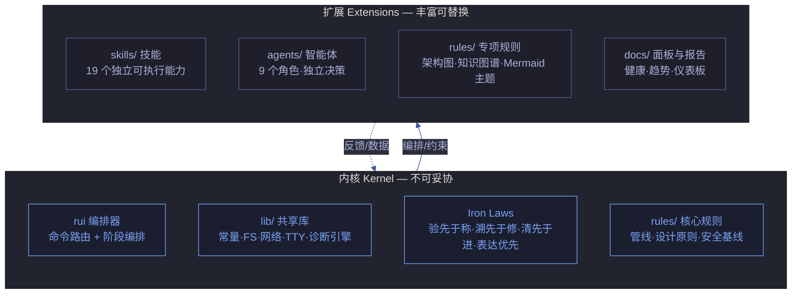
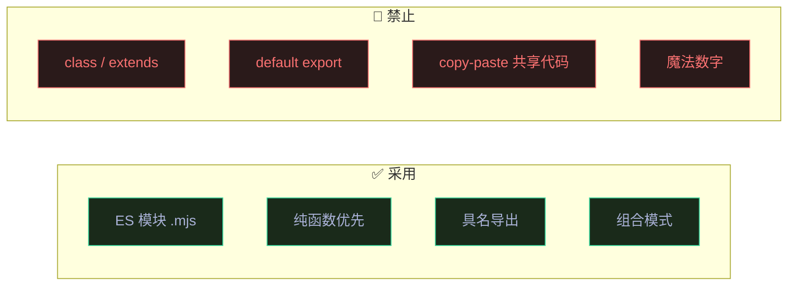
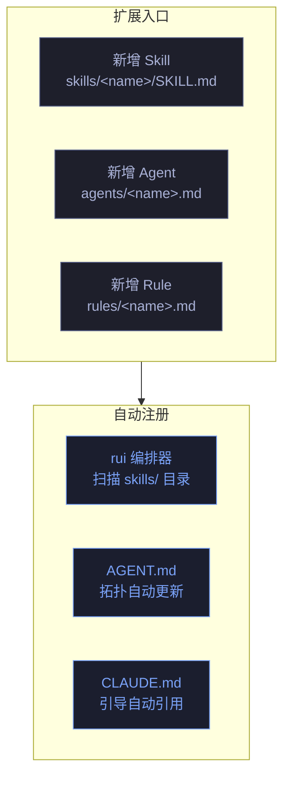

---
paths:
  - "skills/**/SKILL.md"
  - "agents/*.md"
  - "rules/*.md"
  - "lib/**/*.mjs"
  - "plugin.json"
  - "package.json"
---

# architecture-principles — 架构原则

> YrY 的架构宪法。定义内核与扩展的边界、配置 API 规范、代码范式约束、以及可健康检测的架构基线。
>
> 本文件与 [design-principles.md](./design-principles.md) 互补：design-principles 定义模块级原则（怎么写一个 Skill/Agent/Rule），architecture-principles 定义系统级原则（怎么组织这些模块成系统）。

[内核与扩展](#内核与扩展) · [配置 API 规范](#配置-api-规范) · [代码范式约束](#代码范式约束) · [扩展机制](#扩展机制) · [健康检测集成](#健康检测集成) · [自循环改进架构](#自循环改进架构) · [架构审查清单](#架构审查清单)

---

## 内核与扩展

> **内核轻量，扩展丰富** — 内核只放不可妥协的底线和编排逻辑，一切能力以扩展形式添加。



| 层级 | 包含 | 修改门槛 | 验证标准 |
|------|------|---------|---------|
| **内核** | rui 编排器 · lib/ · Iron Laws · 管线规则 · 安全基线 | 需 ADR + 全量回归 | 内核任一文件修改 → 所有 skill 的 init 验证通过 |
| **扩展** | skills/ · agents/ · rules/专项 · docs/面板 | 走 rui 管线即可 | 新增/删除扩展不修改内核任一文件 |

### 内核准入标准

新功能进入内核前，必须通过以下三问：

| # | 问题 | 通过条件 |
|---|------|---------|
| K1 | 是否不可妥协？（去掉它系统不再成立） | 是 — Iron Law / 安全基线 / 编排路由 |
| K2 | 是否有 ≥3 个扩展依赖它？ | 是 — 至少 3 个 skill 或 agent 导入/引用 |
| K3 | 是否不能以扩展形式存在？ | 是 — 技术上无法作为独立 skill/agent/rule 存在 |

**不满足任一条件 → 以扩展形式实现，不进内核。**

### 内核体积约束

| 指标 | 上限 | 当前测量方式 |
|------|------|------------|
| lib/ 文件数 | ≤ 20 | `ls lib/*.mjs | wc -l` |
| 内核规则文件数 | ≤ 8 | `ls rules/{code-pipeline,design-principles,architecture-principles,security-guardrails,delivery-gate,doc-generation,self-improve,agent-handoff}.md | wc -l` |
| rui 编排器文件行数 | ≤ 500 | `wc -l skills/rui/SKILL.md` |

---

## 配置 API 规范

> YrY 的每个模块通过声明式配置注册自身。配置即接口，接口即可验证。

### Skill 配置 API

每个 Skill 通过 `SKILL.md` 的 **YAML frontmatter** 声明其配置：

```yaml
# skills/<name>/SKILL.md 的 frontmatter 规范
---
name: <skill-name>           # 必填 — 全局唯一标识，kebab-case
description: <one-liner>     # 必填 — 一句话能力描述
user_invocable: true|false   # 必填 — 用户是否可直接调用 (/<name>)
lifecycle: <lifecycle>       # 必填 — default-pipeline | standalone | background
agents:                      # 可选 — 委托的 agent 列表
  required: [agent1, agent2]
  optional: [agent3]
version: <semver>            # 可选 — 技能版本，默认 1.0.0
depends_on:                  # 可选 — 依赖的其他 skill
  - <skill-name>
---
```

| 字段 | 类型 | 必填 | 验证规则 |
|------|------|------|---------|
| `name` | `string` | ✅ | `^[a-z][a-z0-9-]*$`，全局唯一，与目录名一致 |
| `description` | `string` | ✅ | ≤ 120 字符，不含"和/与/也"（SRP） |
| `user_invocable` | `boolean` | ✅ | `true` = 用户可 `/name` 调用 |
| `lifecycle` | `enum` | ✅ | `default-pipeline` \| `standalone` \| `background` |
| `agents.required` | `string[]` | 否 | 每个值必须是 `agents/` 目录下存在的 agent 名 |
| `agents.optional` | `string[]` | 否 | 同上 |
| `version` | `string` | 否 | semver 格式 |
| `depends_on` | `string[]` | 否 | 每个值必须是已注册的 skill name |

**目录结构约束**：

```
skills/<name>/
├── SKILL.md          # 必填 — 含上述 frontmatter + 规约正文
├── lib/              # 可选 — skill 私有辅助脚本
│   └── *.mjs
└── tests/            # 可选 — skill 级测试
    └── *.test.mjs
```

### Agent 配置 API

每个 Agent 通过 `agents/<name>.md` 的 **YAML frontmatter** 声明其配置：

```yaml
# agents/<name>.md 的 frontmatter 规范
---
name: <agent-name>           # 必填 — 全局唯一标识，kebab-case
description: <one-liner>     # 必填 — 一句话角色描述
tools:                       # 必填 — 允许的工具集（最小化原则）
  - Read
  - Grep
  - Glob
  - Edit       # 仅 coder
  - Write      # 仅 coder
  - Bash       # 按需
triggers:                    # 必填 — 触发条件
  - <trigger-condition>
outputs:                     # 必填 — 产出物类型
  - <output-type>
contract: <agent-md-path>   # 必填 — 交接契约所在文件
---
```

| 字段 | 类型 | 必填 | 验证规则 |
|------|------|------|---------|
| `name` | `string` | ✅ | 与文件名一致，全局唯一 |
| `description` | `string` | ✅ | ≤ 120 字符，描述决策视角（非执行动作） |
| `tools` | `string[]` | ✅ | 最小集原则 — 只列该 agent 职责必需的工具 |
| `triggers` | `string[]` | ✅ | 触发条件可被下游验证 |
| `outputs` | `string[]` | ✅ | 产出物类型可被下游检查 |
| `contract` | `string` | ✅ | 指向 agents/ 下的交接契约文件 |

### Rule 配置 API

每个 Rule 通过 `rules/<name>.md` 的 **YAML frontmatter** 声明其适用范围：

```yaml
# rules/<name>.md 的 frontmatter 规范
---
paths:                       # 必填 — 适用范围（glob 模式）
  - "skills/**"
  - "lib/**"
---
```

| 字段 | 类型 | 必填 | 验证规则 |
|------|------|------|---------|
| `paths` | `string[]` | ✅ | 至少一个 glob 模式，覆盖本规则约束的文件范围 |

### Lib 模块 API

每个 `lib/<name>.mjs` 是纯 ES 模块，通过 `export` 声明公共 API：

```javascript
// lib/<name>.mjs 的导出规范
// 1. 所有公共函数/常量通过 named export 导出
// 2. 禁止 default export（不利于 tree-shaking 和 Grep 可发现性）
// 3. 每个 export 必须有 JSDoc 注释
// 4. 私有函数以 _ 前缀标记（不导出或约定不外部使用）
```

| 约定 | 规则 | 验证方式 |
|------|------|---------|
| 导出方式 | `export const/function` 具名导出 | `grep -r "export default" lib/` 返回空 |
| 文档 | 每个 export 有 JSDoc | `grep -c "@param\|@returns" lib/<name>.mjs` ≥ export 数 |
| 私有标记 | 内部函数 `_` 前缀 | 代码审查 |
| 单一抽象层 | 文件内所有函数服务于同一抽象层 | 能用一句话描述文件职责 |

---

## 代码范式约束

> YrY 采用函数式 + 模块化范式。以下约束是所有源码的编程基线。

### 范式选择



### 具体约束

| # | 约束 | 适用范围 | 验证命令 / 方式 |
|---|------|---------|---------------|
| C1 | **ES 模块** — `.mjs` 扩展名，`import`/`export` 语法 | 所有 JS 文件 | `find . -name "*.js" -not -path "./node_modules/*"` 返回空 |
| C2 | **禁止 class/extends** — 组合优于继承 | 所有 JS 文件 | `grep -r "class \|extends " lib/ skills/ --include="*.mjs"` 返回空 |
| C3 | **具名导出** — `export const/function`，禁止 `export default` | lib/ | `grep -r "export default" lib/` 返回空 |
| C4 | **禁止魔法数字** — 数字字面量必须赋予语义化常量 | 所有 JS 文件 | `grep -rE "\b(async\|await\|then\|catch)"` 对数字敏感 → 代码审查 |
| C5 | **纯函数优先** — 无副作用，相同输入 = 相同输出 | lib/ | 代码审查 — 函数体不含 `process.exit`/`console.log`/文件 I/O（除非函数名明确含 write/save/send） |
| C6 | **显式错误处理** — 禁止空 catch 块 | 所有 JS 文件 | `grep -r "catch\s*{\s*}" lib/ skills/` 返回空 |
| C7 | **禁止 copy-paste** — 共享代码放 lib/，各脚本 import | 跨 skill | `grep -r "相同的 5+ 行代码块"` → 代码审查 |
| C8 | **常量统一管理** — 项目级常量在 `lib/constants.mjs`，skill 级常量在 skill 内的 `lib/` | 所有 JS 文件 | 代码审查 — 同一定义出现 ≥2 次触发 DRY |

### 导入规范

```
导入优先级（由上到下，空行分隔）：
1. Node.js 内置模块    import { join } from "node:path";
2. 项目 lib/ 共享库    import { HEALTH_DIM_WEIGHTS } from "../../lib/constants.mjs";
3. 本 skill 内部模块   import { formatMsg } from "./lib/format.mjs";
4. 第三方依赖（罕见）  import { something } from "external-pkg";
```

### 函数规范

| 维度 | 约束 | 原因 |
|------|------|------|
| 行数上限 | 单个函数 ≤ 60 行 | 超过 → 拆分为更小函数 |
| 参数上限 | ≤ 4 个参数 | 超过 → 用对象参数 `{a, b, c}` |
| 嵌套深度 | ≤ 3 层 | 超过 → 提取中间函数 |
| 纯函数比例 | lib/ 中 ≥ 80% 函数为纯函数 | I/O 函数集中在 fs.mjs / network.mjs |

---

## 扩展机制

> 新增能力不得修改内核。三类扩展各有独立注册路径。



### 新增 Skill

| 步骤 | 动作 | 验证 |
|------|------|------|
| 1 | 创建 `skills/<name>/SKILL.md` — 含完整 frontmatter | frontmatter 字段齐全，`name` 全局唯一 |
| 2 | 实现核心脚本（需要时放 `skills/<name>/lib/`） | 导入路径使用项目 lib/ 共享库 |
| 3 | 编写测试（需要时） | `npm test` 通过 |
| 4 | 在 CLAUDE.md 引导节添加条目 | 新 skill 可被发现 |
| 5 | 运行 `/rui init` 验证集成 | init 无阻断 |

### 新增 Agent

| 步骤 | 动作 | 验证 |
|------|------|------|
| 1 | 创建 `agents/<name>.md` — 含完整 frontmatter | `tools` 最小集，`contract` 指向存在的文件 |
| 2 | 更新 `agents/AGENT.md` 角色拓扑图 + 表格 | 新 agent 出现在拓扑图中 |
| 3 | 更新 `agents/AGENT.md` 管线参与表 | 新 agent 的参与阶段已标注 |
| 4 | 运行 `/rui init` 验证 | init 无阻断 |

### 新增 Rule

| 步骤 | 动作 | 验证 |
|------|------|------|
| 1 | 创建 `rules/<name>.md` — 含 `paths` frontmatter | paths 覆盖目标文件范围 |
| 2 | 更新 CLAUDE.md 引导节 | 新 rule 可被发现 |
| 3 | 如涉及安全/管线铁律 → 更新相关 Agent 文件 | 约束注入到相关 Agent |

### 扩展隔离保证

- 新增 Skill 不修改 `skills/rui/SKILL.md`（编排器）
- 新增 Agent 不修改其他 Agent 的 `.md`（仅更新 AGENT.md 拓扑）
- 新增 Rule 不修改已有 Rule 文件
- 新增 lib 模块不修改已有 lib 模块的导出签名

---

## 健康检测集成

> 架构原则不是"写在纸上的建议"，而是可通过自动化检测验证的基线。

### 架构健康维度

在现有 9 核心 + 7 工程成熟度维度的基础上，新增架构合规维度：

| 维度 ID | 名称 | 检测内容 | 数据源 |
|---------|------|---------|--------|
| `arch_kernel` | 内核体积 | lib/ 文件数 ≤ 20，内核规则 ≤ 8，编排器 ≤ 500 行 | `ls` + `wc -l` |
| `arch_srp` | SRP 合规 | 每个 skill description 不含"和/与/也" | `grep` frontmatter |
| `arch_imports` | 导入规范 | lib/ 无 `export default`，skill 无 copy-paste | `grep` + 相似度检测 |
| `arch_extensions` | 扩展隔离 | 最近 3 次新增扩展是否修改了内核文件 | git log |

### 设计原则可验证矩阵

> 九条设计原则（design-principles.md）每条都有对应的自动化验证手段。

| 原则 | 验证命令 / 方法 | 违反阈值 |
|------|---------------|---------|
| **SRP** | `grep -c "和\|与\|也" skills/*/SKILL.md` description 字段 | > 0 |
| **高内聚** | 检查同一 story 的改动是否集中在 ≤ 1 个 skill 目录 + ≤ 1 个 lib 文件 | 改动分散在 3+ skill |
| **低耦合** | `grep -r "import.*from.*skills/" skills/` — skill 间不应直接 import | > 0 |
| **DIP** | `grep -r "import.*from.*skills/" agents/` — agent 不应 import skill 内部 | > 0 |
| **OCP** | 过去 10 次新增 skill，`skills/rui/SKILL.md` 的修改次数 | > 0 |
| **ISP** | agent tools 字段长度 vs 职责必需数 | tools > 1.5× 必需数 |
| **DRY** | 相同常量/函数签名在 ≥ 2 个文件中重复定义 | ≥ 2 |
| **YAGNI** | lib/ 中只有 1 个调用方的 export | > 0 |
| **组合优于继承** | `grep -r "class \|extends " lib/ skills/` | > 0 |

---

## 自循环改进架构

> 架构本身是自改进循环的产物和输入。D0-D7 诊断覆盖架构退化，E1-E4 评估架构改进效果。


### 架构级诊断映射

| 诊断 | 架构触发条件 | 改进方向 | 涉及文件 |
|------|------------|---------|---------|
| D3 复杂度增长 | lib/ 文件数 > 20 或某文件 > 500 行 | 拆分为更小模块或提升为独立 skill | lib/ · skills/ |
| D5 依赖退化 | skill 间出现直接 import 或 agent 直接 import skill | 重构为通过 rui 编排器路由 | skills/ · agents/ |
| D7 配置漂移 | frontmatter 字段缺失或与文件内容不一致 | 更新 frontmatter 或拆分 skill | SKILL.md · agent .md |

### 架构提案路由

| 提案类型 | 目标文件 | 示例 |
|---------|---------|------|
| 内核膨胀 | 拆分 lib/ 模块或提升为 skill | "lib/proposals.mjs 已 500+ 行，建议拆分为 proposals-core.mjs + proposals-eval.mjs" |
| 耦合违规 | 重构 import 路径 | "skill A 直接 import skill B 的内部脚本，应通过 rui 编排器路由" |
| 范式退化 | 重构为合规范式 | "新增文件使用了 class，应改为函数 + 组合模式" |
| 配置缺失 | 补全 frontmatter | "skill X 的 SKILL.md 缺少 agents.required 字段" |

---

## 架构审查清单

> 每次架构变更或新增扩展时对照此清单。

| # | 检查项 | 通过条件 | 违反时 |
|---|--------|---------|--------|
| A1 | 内核不变 | 新增/修改只涉及 skills/ agents/ docs/，未改 lib/ 或编排器 | 启动 ADR |
| A2 | 配置完整 | Skill/Agent/Rule 的 frontmatter 字段齐全且符合规范 | 补全 frontmatter |
| A3 | 范式合规 | 无 class/extends、无 default export、无魔法数字 | 重构 |
| A4 | 导入合规 | import 路径符合优先级规范，无跨 skill 直接 import | 重构导入 |
| A5 | SRP 合规 | 新增模块可用一句话描述，不含"和/与/也" | 拆分模块 |
| A6 | 扩展隔离 | 新增 Skill 未修改 rui 编排器，新增 Agent 未修改其他 Agent | 重新设计扩展方式 |
| A7 | 内核体积 | lib/ 文件数 ≤ 20，内核规则 ≤ 8 | 拆分或提升为扩展 |
| A8 | 健康可检 | 新增的原则/约束有对应的 grep 命令或检测脚本 | 补充检测手段 |

---

## 生效标志

| 标志 | 验证方式 |
|------|---------|
| 内核文件数在约束内 | `ls lib/*.mjs | wc -l` ≤ 20 |
| 扩展不修改内核 | 过去 N 次 skill 新增，`git diff --stat skills/rui/` 为空 |
| 配置 frontmatter 完整 | 每个 SKILL.md 和 agent .md 的 frontmatter 含全部必填字段 |
| 范式合规 | `grep -r "class \|extends \|export default" lib/ skills/` 返回空 |
| 原则可验证 | 九条设计原则 + 八条架构原则各有对应验证命令 |

---

> 本文件是 YrY 架构的**可执行规范** — 每条原则都有对应的验证手段，不作为无法落地的"最佳实践建议"存在。
> 与本文件的偏差 = D0 诊断触发条件（基线偏离）。
