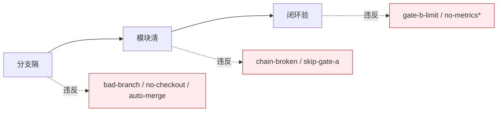

---
paths:
  - "**/*.js"
  - "**/*.ts"
  - "**/*.vue"
  - "**/*.jsx"
  - "**/*.tsx"
---

# Code Pipeline Rules

> **口诀：分支隔、模块清、闭环验。** 分支独立不旁路，每模块 P0 清零，三报告交叉闭环。

## 分支隔（源码改动唯一入口）

1. 功能分支必须从 main/master 创建，分支独立禁止派生（`bad-branch`）
2. 改动源代码前必须已切到 `feat/<project>-<name>`（`no-checkout`）
3. 禁止把功能分支自动合并到 main（`auto-merge`）
4. 源码修改唯一入口是 `/rui code` 管线

## 模块清（实现侧）

5. Gate A 未通过不得编码（`skip-gate-a`），单行 CSS 变更可跳过
6. 逐模块编码：每模块完成后审查 P0 必修 / P1 建议 / P2 可选；P0 不清零不进下一模块
7. 影响链未闭合不声称闭合（`chain-broken`）
8. 不创建设计文档外的文件
9. fix 模式：预检仅查目标文件存在，实现聚焦修改点，验证仅冒烟

## 闭环验（验证侧）

10. Gate B：环境快照 → 静态预检 → 对齐 → 单次执行 → 三报告。修复 ≤ 2 轮（`gate-b-limit`）
11. 三报告（05/06/07）交叉引用闭合，评审清单全 ✅ 方过
12. 自改进必须产出 08，`no-metrics` 降级不阻断交付

## 产出收口

13. 产出目录命名见 [doc-generation.md](./doc-generation.md)，关键产出限定在故事目录或对应参考文档目录
